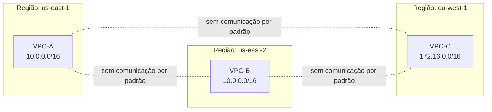
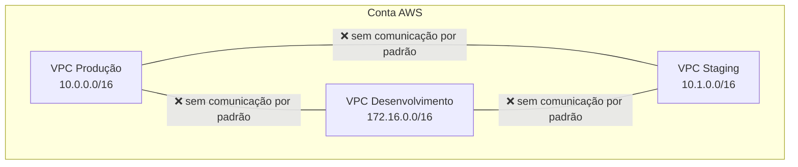
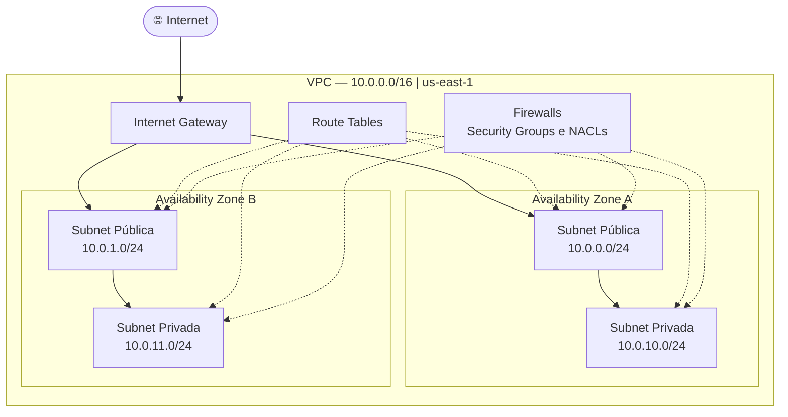
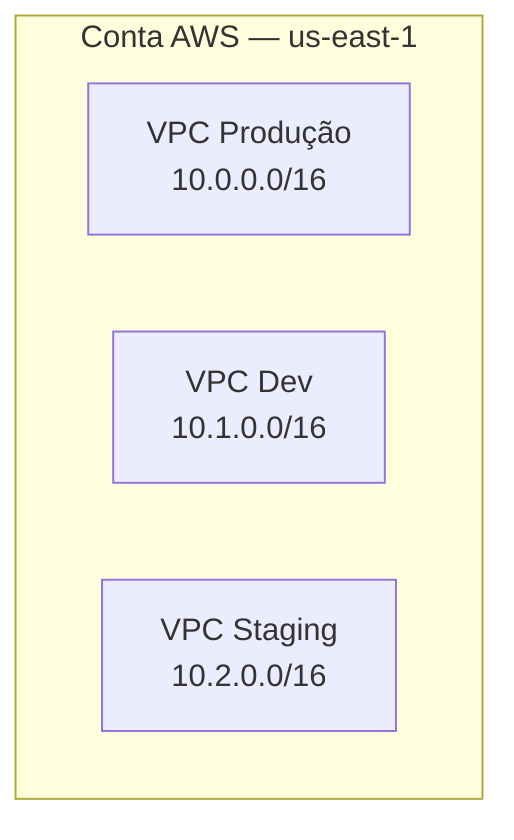

# 01 - VPC (Virtual Private Cloud)

## 1. Explicação Técnica

Pensa assim: a AWS é um prédio corporativo gigante com centenas de empresas dividindo o mesmo espaço físico. A **VPC é a sala privativa** que a AWS aluga pra você. Você tem sua própria chave, suas próprias paredes, suas próprias regras de entrada e ninguém de fora entra sem sua permissão. Os outros inquilinos do prédio (outros clientes AWS) nem sabem que você existe lá dentro.

Tecnicamente, uma VPC é um **segmento de rede lógico, seguro e isolado dentro da AWS**. Ela cria uma fronteira de isolamento entre clientes diferentes que compartilham a mesma infraestrutura física. E dentro dela, você tem controle total sobre a rede.

### O que você pode configurar dentro de uma VPC

Quando a AWS te entrega uma VPC, ela te entrega o controle de quatro pilares fundamentais:

- **Subnets** - você define os segmentos de rede, tanto públicos quanto privados (próximo tópico da nossa jornada)
- **Route Tables** - você configura para onde o tráfego vai em cada subnet
- **Firewalls** - Security Groups e NACLs para controlar o que entra e sai
- **Gateways** - você personaliza como o tráfego entra e sai da VPC

Cada um desses pilares vai ser estudado em detalhe ao longo da jornada. Por enquanto, o importante é entender que a VPC é o container de tudo isso.

### Escopo Regional

E aqui tem um ponto que cai muito na prova: **VPC é um recurso regional**. Uma VPC criada em `us-east-1` não tem nenhuma relação com uma VPC criada em `us-east-2`. São redes completamente separadas, em regiões separadas.

Repara que `VPC-A` e `VPC-B` têm o mesmo CIDR (`10.0.0.0/16`) e tudo bem, porque elas estão em regiões diferentes e são totalmente isoladas entre si.

---

## 2. Isolamento é o Default

Por padrão, **VPCs não se comunicam entre si**. Elas são ilhas. Cada uma existe no seu próprio mundo, completamente isolada das outras. Isso é uma feature, não um bug.

Imagina o caos se por padrão todos os seus ambientes (dev, staging, prod) se comunicassem livremente. Ou pior: se a VPC de um cliente pudesse enxergar a VPC de outro cliente.

Para estabelecer comunicação entre VPCs você precisa de uma decisão explícita e configuração específica. Vamos estudar as opções de conectividade mais à frente na jornada.

---

## 3. CIDR - O Espaço de Endereçamento da VPC

Quando você cria uma VPC, você define um bloco **CIDR** (Classless Inter-Domain Routing). Pensa nisso como o código postal do bairro inteiro: todos os endereços dentro da VPC precisam estar dentro desse range.

A AWS aceita blocos entre `/16` (65.536 IPs) e `/28` (16 IPs). Para ambientes enterprise, o padrão é `/16`.

| Bloco CIDR | Total de IPs | Uso recomendado |
|------------|-------------|-----------------|
| `/16` | 65.536 | Produção, ambientes grandes |
| `/20` | 4.096 | Ambientes médios |
| `/24` | 256 | Pequenos projetos |
| `/28` | 16 | Mínimo aceito pela AWS |

Fica ligado nesse ponto: você pode adicionar blocos CIDR secundários a uma VPC existente, mas **não pode modificar ou remover o bloco primário**. Planejamento de endereçamento IP é uma das decisões mais difíceis de reverter em AWS. Faça isso com calma no início do projeto.

---

## 4. VPC Default vs VPC Customizada

A AWS cria uma **VPC Default** automaticamente em cada região da sua conta. Ela vem pré-configurada e pronta para uso imediato. É conveniente para testes rápidos, mas tem uma armadilha séria:

| Característica | VPC Default | VPC Customizada |
|----------------|-------------|-----------------|
| CIDR | `172.31.0.0/16` (fixo) | Você define |
| Subnets | 1 pública por AZ (automático) | Você cria do zero |
| Acesso à internet | Já configurado | Você decide quando habilitar |
| IP público automático | **Habilitado por padrão** | Desabilitado por padrão |
| Indicada para produção? | **Não** | Sim |

O detalhe que mais preocupa na VPC Default é o IP público automático habilitado: **qualquer instância que você subir nela recebe um IP público sem você pedir**. Em produção, isso é um problema de segurança sério.

> Você pode deletar a VPC Default, e em ambientes enterprise isso é recomendado como parte do processo inicial de segurança da conta. E se precisar recriar, é possível via console ou CLI.

---

## 5. Anatomia de uma VPC

Uma VPC bem estruturada tem vários componentes trabalhando juntos. Não se preocupa em entender cada um agora, pois cada um vai ter sua própria nota na jornada. O importante aqui é ter uma visão do todo:

Cada peça tem seu papel e vamos destrinchar cada uma delas ao longo da jornada.

---

## 6. Cenário Real

Uma empresa com três ambientes separados (produção, desenvolvimento e staging) decide usar uma VPC por ambiente dentro da mesma conta AWS:

Cada VPC tem seu próprio CIDR planejado sem sobreposição. Os ambientes são isolados por padrão, e qualquer comunicação entre eles vai exigir configuração explícita. Isso evita que um bug em desenvolvimento afete produção na rede.

---

## 7. Quando Usar / Quando NÃO Usar

**Crie uma VPC customizada** para qualquer workload que vai para produção, que tem requisitos de compliance ou que precisa de isolamento controlado.

**Nunca use a VPC Default** para ambientes produtivos. Use ela só para testes rápidos e jogar fora.

**Não economize no CIDR inicial.** Trocar o CIDR primário de uma VPC depois é impossível. Você teria que recriar tudo do zero. Se você acha que vai precisar de 500 IPs, planeje para 5.000.

**Não crie VPCs com CIDRs que se sobreponham** se há qualquer chance de precisar conectá-las no futuro. CIDR sobrepostos impedem conectividade entre VPCs, e refatorar isso em produção é um pesadelo que ninguém quer viver.

---

## 8. Trade-offs

| Decisão | Vantagem | Desvantagem |
|---------|----------|-------------|
| VPC por ambiente (prod/dev/staging) | Isolamento forte, blast radius controlado | Mais VPCs para gerenciar |
| VPC por time/BU | Autonomia dos times, governança distribuída | Risco de CIDR sobrepostos, conectividade complexa |
| VPC única para tudo | Simplicidade operacional | Risco de contaminação entre ambientes |
| CIDR `/16` | Headroom generoso para crescimento | Endereços "desperdiçados" em ambientes pequenos |
| CIDR `/24` | Enxuto e direto | Estoura rápido ao escalar |

---

## 9. Pegadinhas Comuns da Prova

> **[PEGADINHA #1]** - *"Uma VPC abrange múltiplas regiões?"*
> Não. VPC é sempre scoped a uma única região. Para multi-região, você precisa de VPCs separadas.

> **[PEGADINHA #2]** - *"Por default, VPCs diferentes se comunicam?"*
> Não. VPCs são totalmente isoladas por padrão.

> **[PEGADINHA #3]** - *"Posso modificar o CIDR primário de uma VPC existente?"*
> Não. O bloco primário é imutável. Você pode adicionar blocos secundários, mas não trocar o primário.

> **[PEGADINHA #4]** - *"A VPC Default pode ser deletada?"*
> Sim. E pode ser recriada. Em produção, deletar a Default é recomendado como hardening da conta.

> **[PEGADINHA #5]** - *"Uma VPC pode existir em múltiplas AZs?"*
> Sim. A VPC abrange todas as AZs da região. São as subnets que ficam restritas a uma AZ específica.

> **[PEGADINHA #6]** - *"Posso ter duas VPCs com o mesmo CIDR na mesma conta?"*
> Sim, desde que estejam em regiões diferentes ou que você nunca precise conectá-las. Se quiser conectar VPCs com CIDRs sobrepostos, não vai funcionar.

---

## 10. Resumo Final

A VPC é a sua sala privativa dentro do prédio compartilhado que é a AWS. Ela é regional, isolada por padrão e te dá controle total sobre subnets, roteamento, firewalls e gateways. O que você não configura, você não tem. E o que você não bloqueia, pode ficar aberto.

Nunca use a VPC Default para produção. Sempre planeje o CIDR com folga, porque você não vai conseguir mudar o primário depois. E lembra: VPCs são ilhas. Para conectá-las, você vai precisar de uma ponte explícita, e isso a gente estuda mais à frente.

A VPC é o alicerce de tudo em networking na AWS. Se você não entender VPC, o resto não vai fazer sentido.

---

## 11. Flashcards Rápidos

**Q: O que é uma VPC?**
A: Um segmento de rede lógico, seguro e isolado dentro da AWS, scoped a uma única região.

**Q: VPCs se comunicam por padrão?**
A: Não. São totalmente isoladas. Comunicação requer configuração explícita.

**Q: VPC abrange múltiplas regiões?**
A: Não. Uma VPC = uma região. As subnets dentro dela ficam nas AZs dessa região.

**Q: Posso modificar o CIDR primário de uma VPC?**
A: Não. É imutável. Você pode adicionar CIDRs secundários.

**Q: O que é a VPC Default?**
A: Uma VPC criada automaticamente pela AWS em cada região, com subnets e acesso à internet já configurados. Não use em produção.

**Q: Uma VPC abrange todas as AZs da região?**
A: Sim. A VPC é regional. As subnets é que ficam confinadas a uma AZ.

**Q: Qual o range de CIDR aceito para uma VPC?**
A: De `/16` (65.536 IPs) até `/28` (16 IPs).

**Q: Posso ter duas VPCs com o mesmo CIDR?**
A: Sim, se estiverem em regiões diferentes ou se você nunca precisar conectá-las.
