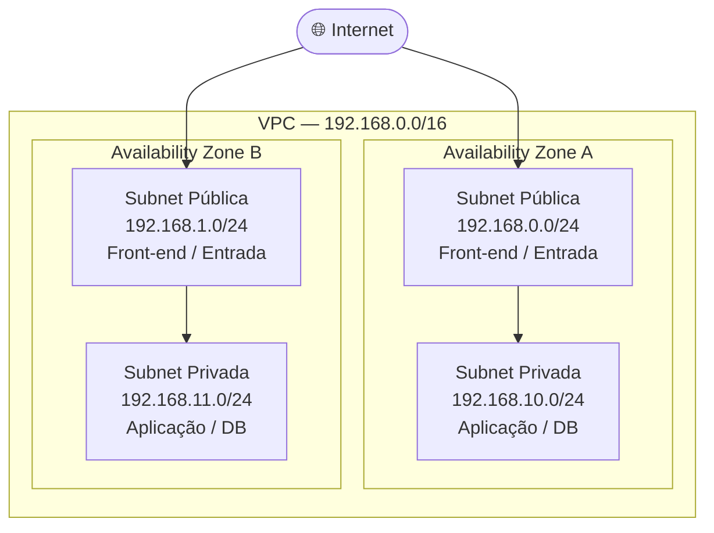
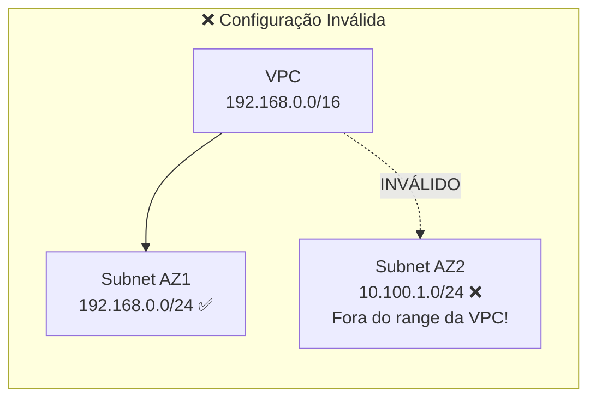
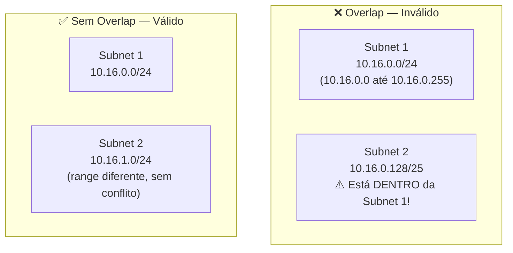
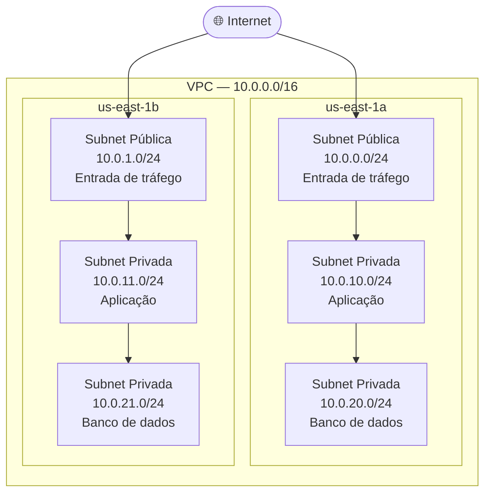

# 02 - Subnets

## 1. Explicação Técnica

Se a **VPC** é uma cidade inteira, a **subnet** é um bairro dentro dessa cidade. Você não mora na cidade em si, você mora em um bairro específico. E cada bairro tem seu próprio CEP (o bloco CIDR), suas próprias ruas e suas próprias regras de acesso.

Tecnicamente, uma subnet é um **grupo de endereços IP dentro da sua VPC**. Simples assim. Mas o detalhe que muda tudo: ela **reside dentro de uma única Availability Zone (AZ)**. Isso não é detalhe, isso é arquitetura. É exatamente aí que você controla a resiliência dos seus recursos a nível de zona de disponibilidade.

Quer que sua aplicação sobreviva à queda de uma AZ inteira? Então você precisa de subnets em AZs diferentes. É a distribuição geográfica dos seus bairros.

### Tipos de Subnet

E não é todo bairro que tem acesso à avenida principal, né? É assim que funciona o conceito de subnet pública e privada. O que define se uma subnet é pública ou privada é a forma como o tráfego é roteado. Vamos estudar roteamento em detalhes mais à frente, mas por ora fica com a ideia:

- **Subnet Pública** - tem acesso direto à internet. Recursos aqui podem ser alcançados de fora.
- **Subnet Privada** - não tem acesso direto à internet. Recursos aqui ficam protegidos do mundo externo.

Um exemplo clássico que você vai ver na prova e na vida real: o **banco de dados não faz sentido em subnet pública**. Ele vai para uma rede privada. Já o front-end que o cliente acessa? Esse vai para uma subnet pública. Parece óbvio quando você escreve assim, mas a prova adora colocar cenários que tentam te confundir.

---

## 2. CIDR - O CEP da Subnet

Toda subnet precisa ter um bloco CIDR, e esse bloco **tem que estar dentro do intervalo de CIDR da VPC mãe**. Sem exceção.

Pensa no CEP: se a sua cidade tem CEP `192.168.0.0/16`, os bairros dela precisam ter CEPs dentro desse range. Você não pode ter um bairro com CEP `10.100.1.0/24` dentro dessa cidade. Isso não faz sentido geograficamente, e a AWS vai rejeitar também.

O exemplo abaixo mostra exatamente o que não fazer:

A subnet da AZ2 (`10.100.1.0/24`) não tem nada a ver com o CIDR da VPC (`192.168.0.0/16`). Isso seria como ter um bairro com CEP de outra cidade. A AWS simplesmente não vai aceitar.

---

## 3. IPs Reservados - Aqueles 5 que você nunca vai usar

Aqui tem uma pegadinha clássica de prova: a AWS **reserva 5 endereços IP** em cada subnet. Não 4. São 5. Grava isso.

Usando a rede `192.168.10.0/24` como exemplo:

| Endereço | Reservado para |
|----------|---------------|
| `192.168.10.0` | Network Address (endereço da rede) |
| `192.168.10.1` | VPC Router |
| `192.168.10.2` | DNS da AWS |
| `192.168.10.3` | Uso futuro (AWS reserva pra si) |
| `192.168.10.255` | Broadcast, não existe em VPC mas é reservado mesmo assim |

> **Atenção:** o último IP reservado varia de acordo com o tamanho do seu bloco. O `192.168.10.255` só é o último porque o bloco é `/24`. Se fosse `/25`, o último seria `192.168.10.127`. Sempre é o último IP do seu bloco, seja lá qual for.

Então, numa subnet `/24` você tem 256 endereços totais, menos 5 reservados = **251 IPs utilizáveis**. Na prova vão tentar te fazer responder 256 (total bruto) ou 252 (4 reservados). Não cai.

---

## 4. Overlap - Subnets não podem se sobrepor

Aqui tem um conceito que o nome em inglês já diz tudo: **overlap**.

A regra é simples: **duas subnets dentro da mesma VPC jamais podem se sobrepor**. Dois bairros não podem ocupar o mesmo quarteirão. Se alguém já tem o quarteirão, é dele.

Exemplo prático: se você criou uma subnet `10.16.0.0/24`, ela ocupa os endereços de `10.16.0.0` até `10.16.0.255`. Agora você quer criar outra subnet `10.16.0.128/25`, mas esses endereços já estão dentro da primeira subnet. Isso é overlap, e a AWS vai barrar.

---

## 5. IPv4, IPv6 e Dual-Stack

Você tem três opções para configurar o endereçamento de uma subnet:

- **IPv4 only** - o padrão mais comum
- **Dual-stack (IPv4 + IPv6)** - a subnet suporta os dois protocolos simultaneamente
- **IPv6 only** - sim, é possível criar uma subnet puramente IPv6

Para a prova SAP, o dual-stack fica no radar. É cada vez mais cobrado em cenários de modernização onde redes legadas precisam coexistir com infraestrutura nova.

---

## 6. Comunicação entre Subnets - O Default que surpreende

Esse é um ponto que a galera esquece: **por default, todas as subnets dentro da mesma VPC conseguem se comunicar entre si**. Sem configuração adicional, sem regra especial.

Mas fica ligado: isso não significa que está seguro. A AWS trabalha com um modelo de **responsabilidade compartilhada**, e a camada de VPC para dentro é **100% responsabilidade sua**. A AWS garante a infraestrutura física, mas quem define as regras de comunicação e segurança é você.

Vamos estudar os mecanismos de controle (Security Groups e NACLs) mais à frente. Por ora, o ponto importante é: por default, o tráfego entre subnets da mesma VPC flui livremente.

---

## 7. IP Público Automático na Subnet

Você pode habilitar a opção `MapPublicIpOnLaunch = true` em uma subnet. O que isso faz? Qualquer recurso criado nessa subnet **recebe automaticamente um IP público**.

Mas, e aqui tem uma pegadinha que cai na prova, **ter um IP público não garante conectividade com a internet**. Para que isso funcione, você ainda precisa de um Internet Gateway configurado e de uma rota apontando para ele. Vamos estudar isso em detalhes nas próximas notas.

O IP público sozinho é como ter um número de telefone mas sem linha contratada. Ele existe, mas não funciona.

---

## 8. Cenário Real

Uma empresa de e-commerce precisa separar seus recursos em camadas de acesso diferentes dentro de uma VPC em `us-east-1`:

Cada tier tem sua própria subnet. O banco de dados jamais fica exposto à internet diretamente. A distribuição em duas AZs garante que se uma zona cair, a outra continua operando.

---

## 9. Quando Usar / Quando NÃO Usar

**Use subnet pública** quando o recurso precisa ser alcançado diretamente da internet ou precisa ter saída para a internet.

**Use subnet privada** quando o recurso não pode ser alcançado de fora. Banco de dados, servidores de aplicação, qualquer coisa que o usuário final não deve acessar diretamente.

**Não faça:**
- RDS em subnet pública. Exposição desnecessária que viola qualquer padrão de compliance.
- Uma única subnet por AZ. Sem redundância, a queda de uma AZ derruba tudo.
- CIDR pequeno demais. Quando a aplicação escalar, você fica sem IPs e não tem como aumentar o CIDR depois.

---

## 10. Trade-offs

| Decisão | Vantagem | Desvantagem |
|---------|----------|-------------|
| Subnets menores (`/27`, `/28`) | Blast radius reduzido, segmentação precisa | Risco de esgotar IPs, difícil de escalar |
| Subnets maiores (`/20`, `/21`) | Flexibilidade, espaço para crescimento | Menos granularidade de segmentação |
| 1 subnet por AZ | Simplicidade operacional | Sem redundância, ponto único de falha |
| Múltiplas subnets por AZ | Segurança em camadas, separação de tiers | Maior complexidade operacional |

---

## 11. Pegadinhas Comuns da Prova

> **[PEGADINHA #1]** - *"Quantos IPs disponíveis tem uma subnet `/24`?"*
> 251. São 256 total, menos 5 reservados pela AWS. Não é 252 (4 reservados) e não é 256 (total bruto).

> **[PEGADINHA #2]** - *"Posso modificar o CIDR de uma subnet depois de criada?"*
> Não. CIDR de subnet é imutável. Você cria uma nova e migra os recursos.

> **[PEGADINHA #3]** - *"Uma subnet pode existir em múltiplas AZs?"*
> Não. Uma subnet = uma AZ. Para multi-AZ, você cria múltiplas subnets.

> **[PEGADINHA #4]** - *"Por default, subnets dentro da mesma VPC se comunicam?"*
> Sim. O comportamento padrão permite comunicação livre entre subnets da mesma VPC.

> **[PEGADINHA #5]** - *"Posso criar uma subnet com CIDR fora do range da VPC?"*
> Não. O CIDR da subnet deve ser um subconjunto do CIDR da VPC.

> **[PEGADINHA #6]** - *"Posso criar duas subnets com ranges que se sobrepõem na mesma VPC?"*
> Não. Overlap é bloqueado pela AWS.

> **[PEGADINHA #7]** - *"`MapPublicIpOnLaunch = true` garante acesso à internet?"*
> Não sozinho. Precisa também de roteamento correto configurado, o que vamos estudar nas próximas notas.

---

## 12. Resumo Final

A subnet é o bairro dentro da sua VPC. Ela mora em uma única AZ, tem um CIDR imutável e o que a torna pública ou privada é como o tráfego é roteado, não uma propriedade intrínseca dela. Vamos entender roteamento em detalhes mais à frente.

Por default, subnets na mesma VPC se falam. A segurança é responsabilidade sua. E sempre lembra: a AWS reserva 5 IPs de você em cada subnet, sempre.

---

## 13. Flashcards Rápidos

**Q: Quantos IPs uma `/24` subnet tem disponíveis?**
A: 251 (256 total menos 5 reservados pela AWS)

**Q: Uma subnet pode existir em múltiplas AZs?**
A: Não. Sempre confinada a 1 AZ.

**Q: Por default, subnets na mesma VPC se comunicam?**
A: Sim. O comportamento padrão permite comunicação livre.

**Q: Posso criar uma subnet com CIDR fora do range da VPC?**
A: Não. O CIDR da subnet deve ser subconjunto do CIDR da VPC.

**Q: O que é overlap de subnets?**
A: Quando duas subnets têm ranges de IP que se sobrepõem. A AWS bloqueia isso.

**Q: Posso redimensionar o CIDR de uma subnet existente?**
A: Não. CIDR é imutável. Crie uma nova subnet.

**Q: Quais são os 5 IPs reservados pela AWS em cada subnet?**
A: Network address, VPC router, DNS, uso futuro e o último IP do bloco (broadcast).

**Q: Qual o CIDR mínimo aceito para uma subnet na AWS?**
A: `/28` (16 IPs totais, 11 utilizáveis)
