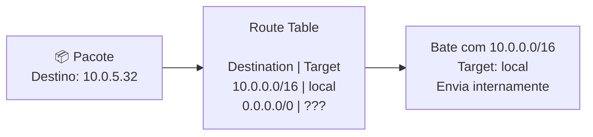
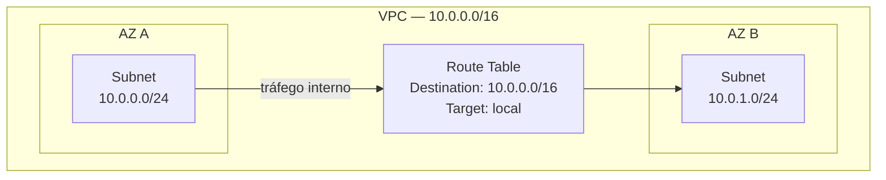
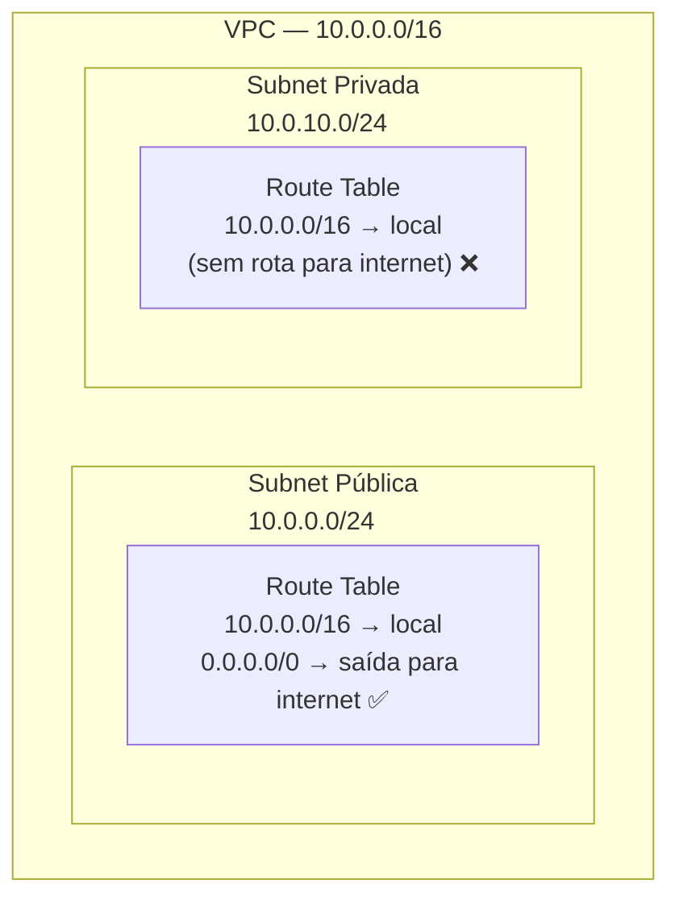
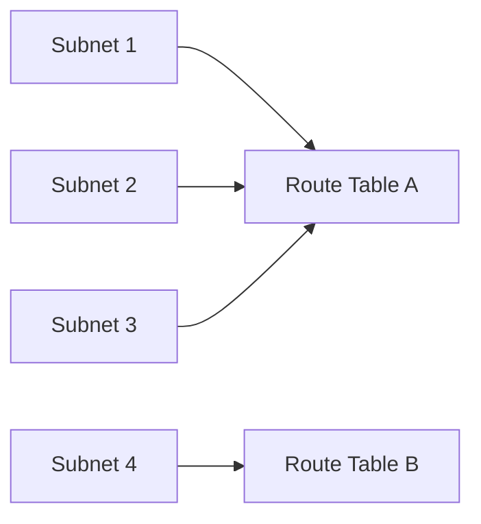
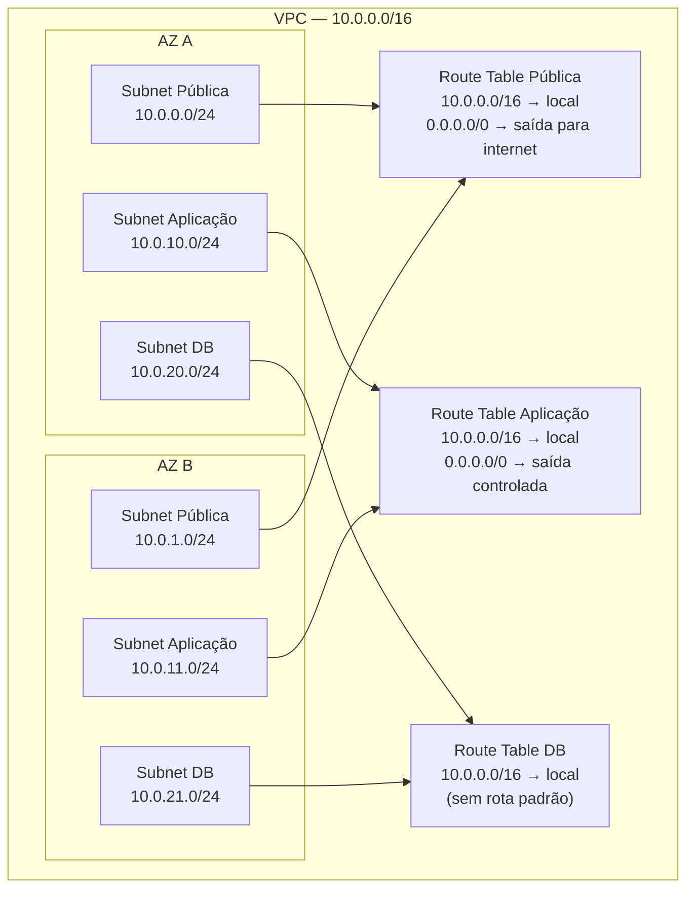

# 03 - Routing in VPC

## 1. Explicação Técnica

Lembra da analogia da cidade? A VPC é a cidade, a subnet é o bairro. Agora precisa entrar o **sistema de ruas e placas de sinalização** que diz para onde cada carro vai. Esse é o papel do roteamento.

Toda VPC tem um **roteador implícito**, ou seja, ele já existe automaticamente, você não cria ele, não gerencia o hardware, não precisa se preocupar com a instância. Ele simplesmente está lá. E ele tem uma **interface em cada subnet** criada na VPC, sendo acessível pelo endereço de rede + 1 de cada subnet.

Na prática:

| Subnet | Endereço do roteador |
|--------|---------------------|
| `192.168.1.0/24` | `192.168.1.1` |
| `10.0.10.0/24` | `10.0.10.1` |
| `172.16.5.0/24` | `172.16.5.1` |

Lembra dos IPs reservados da nota de subnets? O `.1` é justamente o VPC Router. Agora faz sentido por que ele está reservado.

O papel desse roteador é duplo: ele direciona o tráfego **entre subnets** dentro da mesma VPC, e também o tráfego **para dentro e para fora** da VPC. Mas ele não toma decisões sozinho. Ele consulta a **Route Table** para saber o que fazer com cada pacote.

---

## 2. Route Table - A Tabela de Decisões

Pensa na Route Table como um **guia de endereços dos Correios**. Quando um pacote chega ao roteador querendo ir para algum lugar, o roteador abre esse guia e procura: "qual é a regra para esse destino?"

Cada linha desse guia é uma **rota**, e toda rota tem dois campos obrigatórios:

- **Destination** - o endereço de destino, ou range de endereços (em CIDR), que essa regra cobre
- **Target** - para onde o pacote deve ser encaminhado quando o destino bater

O roteador verifica o IP de destino do pacote e procura na tabela a rota mais específica que case com aquele destino. Encontrou? Encaminha para o Target daquela rota.

---

## 3. A Rota Local - O Default que já vem pronto

Toda Route Table tem exatamente **uma rota que vem por padrão**: a **rota local**.

Ela tem como Destination o CIDR da sua VPC e como Target o valor `local`. E ela é imutável: você não consegue editar nem deletar essa rota.

Exemplo para uma VPC `10.0.0.0/16`:

| Destination | Target | Editável? |
|-------------|--------|-----------|
| `10.0.0.0/16` | `local` | Não |

O que essa rota faz? Ela garante que **todo tráfego dentro da VPC seja roteado internamente**, sem precisar sair para lugar nenhum. É por isso que subnets dentro da mesma VPC conseguem se comunicar por padrão, como vimos na nota anterior. A rota local é o que viabiliza isso.

Se a sua VPC tiver IPv6 habilitado, você vai ter duas rotas locais: uma para o bloco IPv4 e outra para o bloco IPv6.

---

## 4. Adicionando Rotas - É assim que você controla o mundo

Além da rota local, você pode adicionar quantas rotas quiser. E é aqui que a mágica acontece.

Fica ligado nesse ponto porque ele resolve uma dúvida que ficou em aberto na nota de subnets: **o que torna uma subnet pública ou privada não é uma propriedade da subnet, é a Route Table associada a ela**.

Se você adicionar uma rota apontando para um componente de saída para a internet (que vamos estudar na próxima nota), a subnet se torna pública. Se não tiver essa rota, ela é privada. Simples assim.

A diferença entre as duas subnets é uma única linha na Route Table. Guarda bem isso.

---

## 5. Relação entre Subnet e Route Table

Aqui tem uma regra que cai na prova e precisa ficar gravada:

- Uma **subnet** pode ter **apenas 1 Route Table** associada
- Uma **Route Table** pode ser associada a **várias subnets**

É uma relação `N:1` do ponto de vista da subnet, e `1:N` do ponto de vista da Route Table.

Subnets 1, 2 e 3 compartilham a mesma Route Table. Subnet 4 tem a sua própria. Isso é completamente válido e comum na prática: subnets públicas de múltiplas AZs geralmente compartilham uma route table com a rota de saída para internet, enquanto subnets privadas têm suas próprias rotas.

### Route Table Padrão da VPC (Main Route Table)

Toda VPC tem uma **Main Route Table** que é criada automaticamente. Qualquer subnet que você criar e não associar explicitamente a uma route table vai usar essa Main Route Table por padrão.

Por isso, em ambientes de produção, é boa prática criar route tables explícitas para cada tier e nunca depender da Main Route Table para comportamento específico.

---

## 6. Como o Roteador Escolhe a Rota Certa

Quando o pacote chega ao roteador e existem múltiplas rotas na tabela, qual ele escolhe?

A regra é a **rota mais específica** (longest prefix match). Quanto mais específico o CIDR do Destination, maior a prioridade.

Exemplo com uma route table assim:

| Destination | Target |
|-------------|--------|
| `10.0.0.0/16` | `local` |
| `10.0.5.0/24` | `algum destino específico` |
| `0.0.0.0/0` | `saída genérica` |

Se um pacote tem destino `10.0.5.32`:
- Casa com `10.0.0.0/16` (prefixo /16)
- Casa com `10.0.5.0/24` (prefixo /24) - mais específico, vence
- Casa com `0.0.0.0/0` (prefixo /0) - menos específico de todos

O roteador vai usar a rota `10.0.5.0/24` porque é a mais específica.

O `0.0.0.0/0` é sempre o último recurso: ele casa com qualquer destino, por isso é chamado de rota default. Quando nenhuma outra rota mais específica casar, cai aqui.

---

## 7. Cenário Real

Uma empresa tem uma VPC com três tiers: front-end (público), aplicação (privado) e banco de dados (sem saída nenhuma). Veja como as route tables ficam distribuídas:

Repara: as subnets públicas das duas AZs compartilham a mesma Route Table. O mesmo para aplicação e banco de dados. Isso é o padrão enterprise: 3 route tables para 6 subnets.

---

## 8. Quando Usar / Quando NÃO Usar

**Crie route tables separadas por tier** (pública, privada, isolada). Não dependa da Main Route Table para controlar comportamento de produção.

**Não associe subnets de tiers diferentes à mesma route table** se elas precisam de comportamentos de roteamento diferentes. Misturar subnet pública e privada na mesma route table vai deixar a privada com acesso à internet sem você querer.

**Não ignore a rota mais específica (longest prefix match)**. Esse comportamento resolve a maioria das dúvidas sobre "por qual caminho o tráfego vai?".

---

## 9. Pegadinhas Comuns da Prova

> **[PEGADINHA #1]** - *"Uma subnet pode estar associada a mais de uma Route Table?"*
> Não. Uma subnet tem exatamente uma Route Table. Mas uma Route Table pode ter várias subnets.

> **[PEGADINHA #2]** - *"Posso deletar a rota local de uma Route Table?"*
> Não. A rota local é imutável e não pode ser removida nem editada.

> **[PEGADINHA #3]** - *"O que torna uma subnet pública?"*
> A Route Table associada a ela ter uma rota para saída de internet (vamos ver o destino dessa rota na próxima nota). Não é uma propriedade da subnet em si.

> **[PEGADINHA #4]** - *"Quando existem duas rotas que casam com o mesmo destino, qual vence?"*
> A mais específica. O prefixo mais longo (longest prefix match) tem prioridade.

> **[PEGADINHA #5]** - *"O que acontece com uma subnet que não foi associada a nenhuma Route Table?"*
> Ela usa a Main Route Table da VPC automaticamente.

> **[PEGADINHA #6]** - *"A rota `0.0.0.0/0` cobre endereços IPv6?"*
> Não. Para IPv6, a rota equivalente é `::/0`. São rotas separadas.

---

## 10. Resumo Final

O roteador da VPC já existe, você não precisa criar. O que você controla é a **Route Table**: o conjunto de regras que diz para onde cada pacote vai. Toda Route Table nasce com a rota local que garante comunicação interna dentro da VPC. Você adiciona rotas para controlar o comportamento de saída de cada subnet.

A relação é clara: subnet tem uma Route Table, Route Table pode ter várias subnets. E o que define se uma subnet é pública ou privada é exatamente a Route Table que está associada a ela. Nas próximas notas vamos ver para onde essas rotas de saída apontam.

---

## 11. Flashcards Rápidos

**Q: Onde o roteador da VPC fica em cada subnet?**
A: No endereço de rede + 1. Ex: subnet `10.0.0.0/24`, roteador em `10.0.0.1`.

**Q: Quais são os dois campos obrigatórios de uma rota?**
A: Destination (destino, em CIDR) e Target (para onde encaminhar).

**Q: O que é a rota local de uma Route Table?**
A: A rota padrão que vem em toda Route Table com o CIDR da VPC como destino e `local` como target. Garante comunicação interna e não pode ser removida.

**Q: Uma subnet pode ter mais de uma Route Table?**
A: Não. Uma subnet = uma Route Table. Uma Route Table pode ter N subnets.

**Q: O que acontece com uma subnet sem Route Table explícita?**
A: Ela usa a Main Route Table da VPC automaticamente.

**Q: Como o roteador decide entre múltiplas rotas que casam com o mesmo destino?**
A: Longest prefix match. A rota com o prefixo CIDR mais específico vence.

**Q: O que é a rota `0.0.0.0/0`?**
A: A rota default, que casa com qualquer destino IPv4. É o último recurso quando nenhuma rota mais específica casar.

**Q: O que torna uma subnet pública ou privada?**
A: A Route Table associada. Se tem rota de saída para internet, é pública. Se não tem, é privada.
