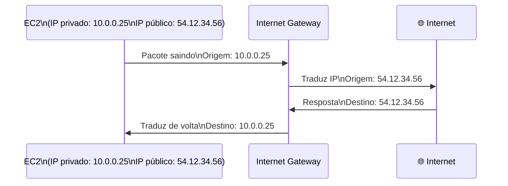
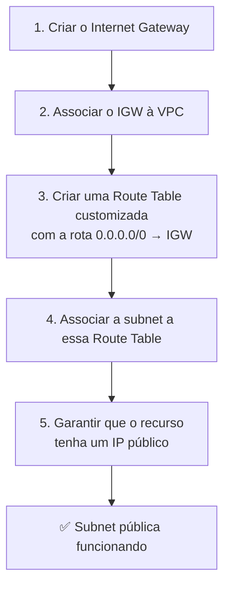
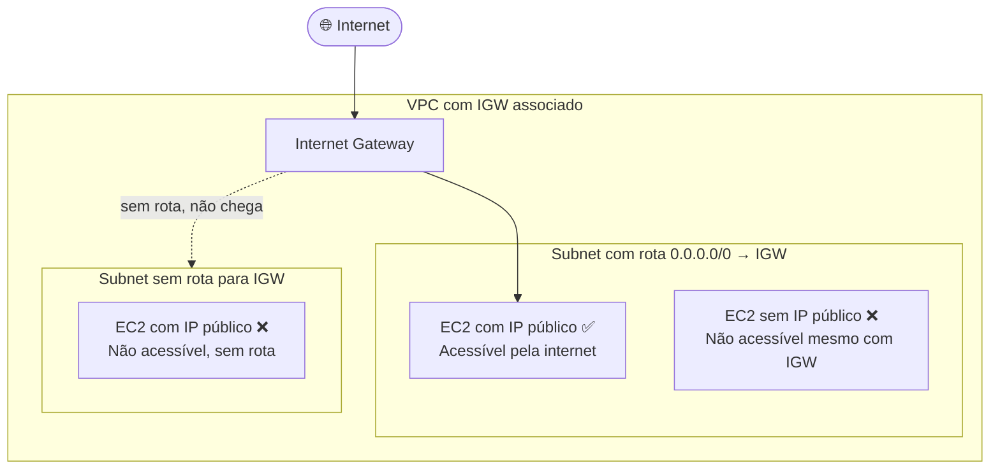
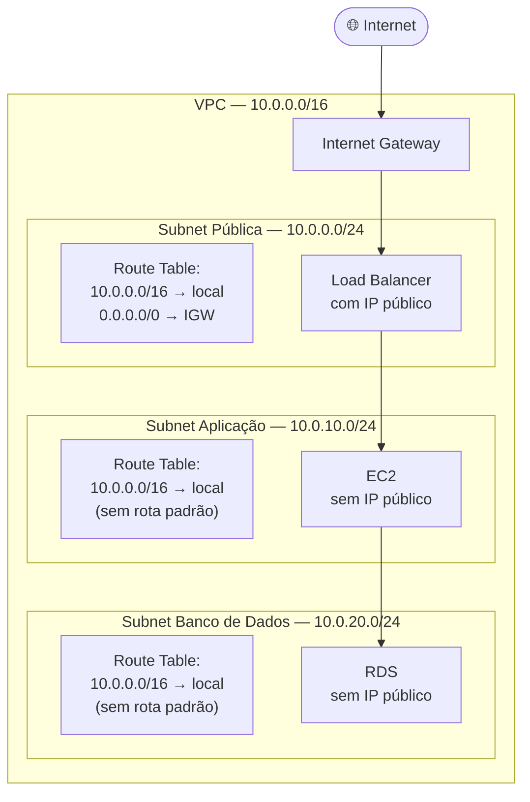

# 04 - Internet Gateway

## 1. Explicação Técnica

Na nota de Routing, a gente falou sobre a rota `0.0.0.0/0` e disse que ela aponta para "um componente de saída para a internet que vamos estudar na próxima nota". Chegou a hora.

Esse componente é o **Internet Gateway (IGW)**.

Pensa assim: a VPC é um condomínio fechado. As subnets são os apartamentos. O roteador é o sistema de interfones internos. Mas e quando alguém de fora quer entrar, ou quando um morador quer sair para a rua? Para isso existe a **portaria**, e essa portaria é o Internet Gateway.

Por padrão, lembra, toda subnet é privada. Isso quer dizer que os recursos dentro dela não conseguem se comunicar com a internet, e a internet não consegue alcançá-los. O IGW é o que muda essa equação, ele é a porta de entrada e saída entre a sua VPC e o mundo externo.

### Características principais

- **Gerenciado pela AWS** - você não precisa gerenciar instância, capacidade ou redundância. O IGW simplesmente funciona.
- **Resiliência regional** - ele cobre todas as AZs da região automaticamente. Não é um recurso por AZ como outros componentes que vamos ver mais à frente. Uma única instância de IGW já protege tudo.
- **Relação 1:1 com a VPC** - uma VPC pode ter no máximo um IGW. E um IGW pode estar associado a no máximo uma VPC. Não tem como compartilhar.
- **Bidirecional** - o tráfego flui nos dois sentidos: recursos da VPC acessam a internet, e a internet acessa recursos da VPC (desde que configurado corretamente).

---

## 2. Como o IGW Funciona - A Tradução de Endereços

Aqui tem um detalhe técnico importante que esclarece uma dúvida comum: os recursos dentro da VPC usam **endereços IP privados**. Mas a internet só entende endereços IP públicos. Como um recurso com IP privado `10.0.0.25` consegue se comunicar com um servidor na internet?

O IGW faz uma **tradução 1:1** entre o IP privado do recurso e seu IP público. Quando um pacote sai da VPC em direção à internet, o IGW substitui o IP privado pelo IP público correspondente. Quando a resposta volta, o IGW faz o caminho inverso.

Importante: essa tradução só acontece para recursos que **têm um IP público associado**. Se o recurso não tem IP público, o IGW não tem como fazer a tradução e o tráfego não flui. Ter IGW na VPC não é suficiente sozinho.

---

## 3. O Fluxo Completo para Tornar uma Subnet Pública

Esse é um dos pontos mais cobrados na prova, e a sua nota de aula acertou na sequência. Vamos consolidar:

Todos os cinco passos são necessários. Faltou um? Não vai funcionar. Vamos ver cada um:

**Passo 1 e 2** - sem IGW criado e associado à VPC, não existe portaria. Ninguém entra, ninguém sai.

**Passo 3** - lembra da nota de Routing? Sem a rota `0.0.0.0/0 → IGW` na Route Table, o roteador da VPC não sabe que deve enviar o tráfego de internet para o IGW. O IGW existe, mas o roteador não vai usá-lo.

**Passo 4** - a Route Table precisa estar associada à subnet correta. Uma Route Table com a rota de internet associada a uma subnet errada não vai ajudar nada.

**Passo 5** - sem IP público no recurso, o IGW não tem como fazer a tradução de endereços. Lembra da nota de subnets, onde falamos sobre `MapPublicIpOnLaunch`? Habilitar esse atributo garante que todo recurso criado naquela subnet já nasce com um IP público. Agora faz sentido completo por que isso existe.

---

## 4. Criar IGW não torna nada público automaticamente

Esse ponto precisa de destaque porque é onde muita gente erra e a prova explora bastante.

Associar um IGW à VPC não torna nenhuma subnet pública. Não torna nenhum recurso acessível pela internet. Não muda absolutamente nada no comportamento das suas subnets.

O IGW é só a portaria. Mas se o sistema de roteamento interno não aponta para a portaria, ninguém chega até ela. E mesmo que chegue à portaria, se o morador não tem um número de identificação pública (IP público), a portaria não sabe para onde encaminhar.

---

## 5. Cenário Real

Uma empresa de e-commerce tem três tiers na VPC. O fluxo de configuração de cada tier reflete tudo que aprendemos até aqui:

O IGW está presente na VPC, mas só o Load Balancer na subnet pública é acessível. A aplicação e o banco de dados estão em subnets sem rota para o IGW e sem IPs públicos. Mesmo com o IGW existindo, eles permanecem isolados da internet.

---

## 6. Quando Usar / Quando NÃO Usar

**Use Internet Gateway** quando você precisa que recursos da VPC sejam acessíveis pela internet, ou quando precisam acessar a internet diretamente com seus próprios IPs públicos.

**Não use para recursos privados** como bancos de dados, servidores de aplicação internos ou qualquer coisa que não deva ser exposta. Deixa esses sem a rota e sem IP público.

**Não confunda IGW com acesso à internet para subnets privadas.** Se uma subnet privada precisa acessar a internet para baixar atualizações, por exemplo, o IGW não é a solução direta. Existe outro componente para isso que vamos estudar nas próximas notas.

---

## 7. Trade-offs

| Característica | Detalhe |
|----------------|---------|
| Disponibilidade | Gerenciado pela AWS, resiliente regionalmente, sem downtime para gerenciar |
| Custo | O IGW em si não tem custo de provisionamento. Você paga pela transferência de dados que passa por ele |
| Escalabilidade | Escala automaticamente, sem limite de banda configurável |
| Segurança | O IGW não filtra tráfego. Filtragem é responsabilidade das camadas acima (Route Tables, e mecanismos que vamos estudar a seguir) |
| Limitação | Uma VPC só pode ter um IGW |

---

## 8. Pegadinhas Comuns da Prova

> **[PEGADINHA #1]** - *"Quantos Internet Gateways uma VPC pode ter?"*
> Um. A relação é 1:1 entre VPC e IGW.

> **[PEGADINHA #2]** - *"Associar o IGW à VPC torna as subnets públicas automaticamente?"*
> Não. Você ainda precisa da rota `0.0.0.0/0 → IGW` na Route Table da subnet e de IP público no recurso.

> **[PEGADINHA #3]** - *"O IGW é resiliente por AZ ou por região?"*
> Por região. Um único IGW cobre todas as AZs da região automaticamente. Não é preciso criar um por AZ.

> **[PEGADINHA #4]** - *"Um recurso sem IP público pode usar o IGW para acessar a internet?"*
> Não. Sem IP público, o IGW não tem como fazer a tradução de endereços. O recurso precisa ter um IP público associado.

> **[PEGADINHA #5]** - *"Qual é a rota que precisa existir na Route Table para a subnet ser pública?"*
> `0.0.0.0/0` com Target apontando para o IGW.

> **[PEGADINHA #6]** - *"O IGW filtra tráfego?"*
> Não. Ele apenas faz a tradução de endereços e encaminha o tráfego. Filtragem é responsabilidade de outros mecanismos.

---

## 9. Resumo Final

O Internet Gateway é a portaria da VPC. Ele é gerenciado pela AWS, resiliente para toda a região e tem uma relação 1:1 com a VPC. Mas sozinho ele não faz nada. Para que uma subnet seja pública de verdade, você precisa de três coisas alinhadas: IGW associado à VPC, rota `0.0.0.0/0 → IGW` na Route Table da subnet, e IP público no recurso.

Faltou qualquer um dos três? A comunicação com a internet não vai acontecer.

---

## 10. Flashcards Rápidos

**Q: O que é o Internet Gateway?**
A: O componente que permite comunicação bidirecional entre a VPC e a internet. Gerenciado pela AWS, resiliente regionalmente.

**Q: Quantos IGWs uma VPC pode ter?**
A: Um. Relação 1:1.

**Q: O IGW é resiliente por AZ ou por região?**
A: Por região. Cobre todas as AZs automaticamente.

**Q: Associar IGW à VPC torna as subnets públicas?**
A: Não. Precisa também de rota `0.0.0.0/0 → IGW` na Route Table e IP público no recurso.

**Q: O IGW filtra tráfego?**
A: Não. Apenas faz NAT e encaminha.

**Q: Quais são os 3 requisitos para uma subnet ser efetivamente pública?**
A: IGW associado à VPC, rota `0.0.0.0/0 → IGW` na Route Table da subnet, e IP público no recurso.

**Q: O que o IGW faz com o tráfego saindo da VPC?**
A: Traduz o IP privado do recurso para o IP público correspondente (NAT 1:1) antes de enviar para a internet.
