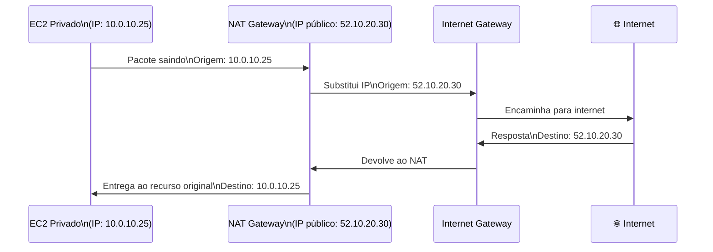
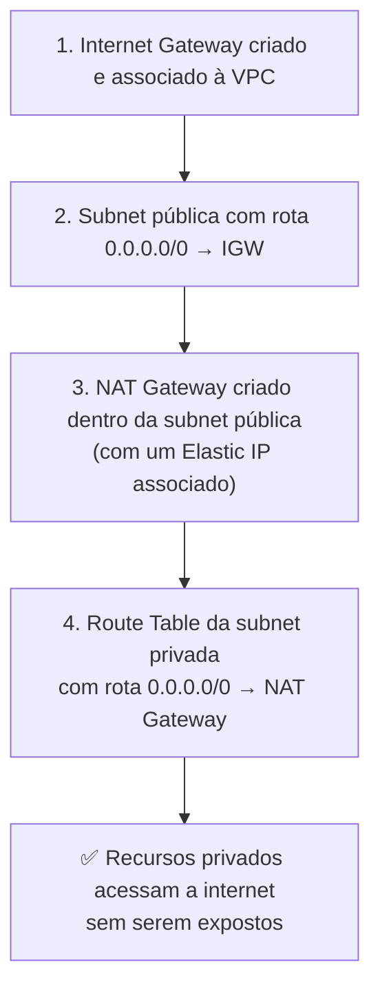
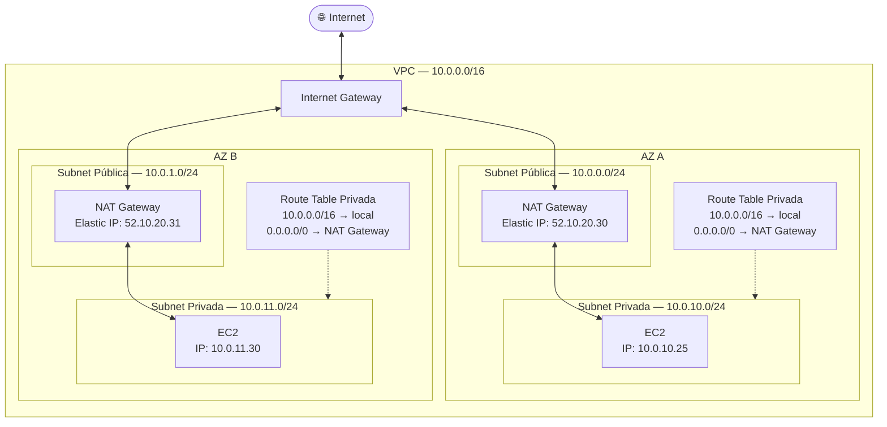
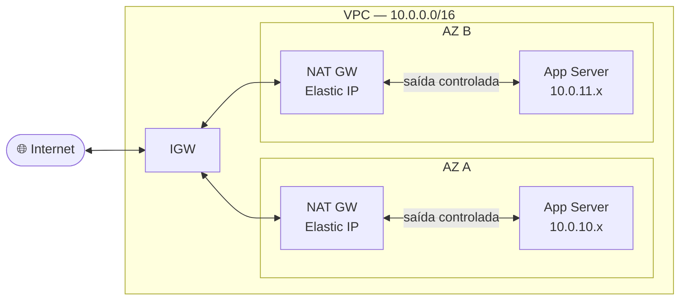

# 05 - NAT Gateway

## 1. Explicação Técnica

Na nota do Internet Gateway, a gente terminou com uma pergunta em aberto: e quando uma subnet privada precisa acessar a internet sem ficar exposta a ela?

Pensa no seguinte cenário: você tem um servidor de aplicação em uma subnet privada. Certo dia ele precisa baixar uma atualização de segurança da internet. Mas você não quer colocar esse servidor em uma subnet pública, porque aí qualquer pessoa na internet poderia tentar acessá-lo diretamente. O que você faz?

É aqui que entra o **NAT Gateway**. A analogia perfeita é a de um **intermediário confidencial**. É como quando você usa um serviço de caixa postal: você manda a carta pelo serviço, o serviço entrega no destino com o endereço dele, a resposta volta para o serviço, e o serviço te entrega. Quem respondeu nunca soube seu endereço real. O servidor privado acessa a internet, mas a internet só vê o endereço do NAT Gateway, nunca o endereço privado do servidor.

A consequência direta disso é o comportamento mais importante do NAT Gateway: **as conexões só podem ser iniciadas de dentro para fora**. O servidor privado acessa a internet. A internet nunca consegue iniciar uma conexão com o servidor privado. Não tem caminho de volta por iniciativa externa.

---

## 2. NAT Gateway vs Internet Gateway - A Diferença Fundamental

Você já conhece o IGW da nota anterior. Agora vamos comparar os dois para deixar a diferença cristalina:

| Característica | Internet Gateway | NAT Gateway |
|----------------|-----------------|-------------|
| Para quem? | Recursos com IP público que precisam ser acessíveis da internet | Recursos privados que precisam acessar a internet sem serem expostos |
| Direção do tráfego | Bidirecional (entrada e saída) | Apenas saída iniciada de dentro |
| A internet vê o quê? | O IP público do recurso | O IP do NAT Gateway (nunca o IP privado do recurso) |
| Fica em qual subnet? | Não fica em subnet, é attachado à VPC | Fica em uma **subnet pública** |
| Resiliência | Regional (cobre todas as AZs) | Por AZ (precisa de um por AZ para HA) |
| Custo | Só transferência de dados | Por hora de execução + por GB processado |

Presta atenção na linha de resiliência. Esse é um ponto que gera confusão: o IGW é regional e um único cobre toda a VPC. O NAT Gateway é diferente, ele vive dentro de uma AZ específica. Se a AZ onde o NAT Gateway está cair, as subnets privadas das outras AZs perdem o acesso à internet. Por isso, para alta disponibilidade de verdade, você precisa de **um NAT Gateway por AZ**.

---

## 3. Como o NAT Gateway Funciona

O NAT Gateway recebe o pacote de um recurso privado, substitui o IP de origem pelo seu próprio IP público (que é um Elastic IP, vamos estudar a seguir), e encaminha para a internet. Quando a resposta volta, ele identifica para qual recurso privado aquela resposta pertence e entrega corretamente.

O servidor na internet só viu o IP `52.10.20.30`. Nunca soube que existia um `10.0.10.25` lá atrás.

---

## 4. O Fluxo Completo de Configuração

O NAT Gateway sozinho não resolve nada. Ele depende de tudo que você aprendeu até aqui funcionando em conjunto. Veja a sequência completa:

Por que o NAT Gateway fica na subnet pública? Porque ele precisa de uma rota para o IGW para poder encaminhar o tráfego para a internet. Sem isso, o NAT Gateway não tem por onde sair.

---

## 5. Diagrama Completo do Fluxo de Tráfego

Repara: um NAT Gateway por AZ. Cada subnet privada tem sua própria route table apontando para o NAT Gateway da mesma AZ. Se AZ A cair, AZ B continua funcionando de forma independente.

---

## 6. Características Técnicas

- **Serviço gerenciado** - você faz o deploy, a AWS administra. Sem patches, sem gerenciamento de instância.
- **Elastic IP obrigatório** - o NAT Gateway precisa de um Elastic IP para ter um endereço público fixo. Vamos estudar Elastic IP a seguir.
- **Capacidade de banda** - começa com 5 Gbps e escala automaticamente até 100 Gbps conforme a demanda.
- **Escalabilidade automática** - a AWS gerencia a escala sem intervenção sua.
- **Escopo de AZ** - vive em uma AZ específica. Para HA real, um por AZ.

---

## 7. Custo - O Detalhe que Pesa

O NAT Gateway tem dois componentes de custo, e isso é cobrado na prova e na vida real:

| Componente | Detalhe |
|------------|---------|
| Taxa por hora | Cobrado por cada hora que o NAT Gateway está em execução, independente de uso |
| Taxa por GB | Cobrado por cada gigabyte de dados processado |

Isso significa que um NAT Gateway ocioso ainda gera custo. Em ambientes enterprise com múltiplas AZs, o custo de NAT Gateway pode ser significativo. Para ambientes de desenvolvimento ou staging, uma alternativa comum é ter apenas um NAT Gateway em uma AZ e aceitar o risco de indisponibilidade, reduzindo custo.

---

## 8. Cenário Real

Uma empresa tem um ambiente 3-tier em produção com alta disponibilidade em duas AZs. Os servidores de aplicação precisam baixar atualizações e se comunicar com APIs externas, mas jamais devem ser acessíveis diretamente da internet:

Os servidores de aplicação acessam a internet para atualizações. A internet não consegue iniciar conexões com eles. Se AZ A cair, AZ B continua operando normalmente com seu próprio NAT Gateway.

---

## 9. Quando Usar / Quando NÃO Usar

**Use NAT Gateway** quando recursos em subnet privada precisam de acesso à internet de saída: atualizações de SO, downloads de dependências, chamadas a APIs externas.

**Não use NAT Gateway** quando o recurso não precisa de acesso algum à internet. Um banco de dados que só se comunica internamente não precisa de rota para NAT Gateway. Adicionar essa rota só aumenta a superfície de risco e o custo.

**Não use um único NAT Gateway para todas as AZs** em produção. Se a AZ onde ele mora cair, todas as subnets privadas das outras AZs perdem o acesso à internet. Para HA real, um por AZ.

---

## 10. Pegadinhas Comuns da Prova

> **[PEGADINHA #1]** - *"O NAT Gateway é resiliente regionalmente como o IGW?"*
> Não. O NAT Gateway é scoped à AZ onde foi criado. O IGW é regional. Para HA, você precisa de um NAT Gateway por AZ.

> **[PEGADINHA #2]** - *"A internet consegue iniciar conexões com recursos atrás do NAT Gateway?"*
> Não. O NAT Gateway só permite tráfego iniciado de dentro. É um caminho de mão única: de dentro para fora.

> **[PEGADINHA #3]** - *"Em qual tipo de subnet o NAT Gateway deve ser criado?"*
> Em uma subnet pública. Ele precisa de uma rota para o IGW para funcionar.

> **[PEGADINHA #4]** - *"O NAT Gateway precisa de algum componente externo para funcionar?"*
> Sim. Precisa de um IGW na VPC, de uma subnet pública com rota para o IGW, e de um Elastic IP associado.

> **[PEGADINHA #5]** - *"Qual rota precisa existir na route table da subnet privada?"*
> `0.0.0.0/0` apontando para o NAT Gateway da mesma AZ.

> **[PEGADINHA #6]** - *"O NAT Gateway tem custo mesmo quando não está processando tráfego?"*
> Sim. A taxa por hora é cobrada independente de uso.

> **[PEGADINHA #7]** - *"Uma subnet privada em AZ B pode usar o NAT Gateway que está em AZ A?"*
> Tecnicamente sim, mas não é recomendado. Além do risco de indisponibilidade se AZ A cair, há custo adicional de transferência de dados entre AZs.

---

## 11. Resumo Final

O NAT Gateway é o intermediário confidencial da sua arquitetura. Recursos privados acessam a internet através dele, mas a internet nunca sabe quem está lá atrás. É gerenciado pela AWS, escala automaticamente e tem custo por hora mais por GB processado.

A diferença crítica em relação ao IGW: o IGW é regional e bidirecional. O NAT Gateway é por AZ e de mão única. Para alta disponibilidade real, você precisa de um por AZ, cada um na sua subnet pública, com as subnets privadas da mesma AZ apontando para ele via route table.

---

## 12. Flashcards Rápidos

**Q: Para que serve o NAT Gateway?**
A: Permite que recursos em subnets privadas acessem a internet de saída, sem ficarem expostos a conexões de entrada.

**Q: O NAT Gateway é resiliente por AZ ou por região?**
A: Por AZ. Para alta disponibilidade, precisa de um NAT Gateway por AZ.

**Q: Em qual tipo de subnet o NAT Gateway deve ser criado?**
A: Em uma subnet pública, pois precisa de rota para o IGW.

**Q: A internet consegue iniciar conexões com recursos atrás do NAT Gateway?**
A: Não. Só tráfego iniciado de dentro para fora é permitido.

**Q: Quais são os dois componentes de custo do NAT Gateway?**
A: Taxa por hora de execução + taxa por GB de dados processado.

**Q: Qual rota precisa estar na route table da subnet privada para usar o NAT Gateway?**
A: `0.0.0.0/0 → NAT Gateway` da mesma AZ.

**Q: Qual IP público o NAT Gateway usa?**
A: Um Elastic IP, que vamos estudar na próxima nota.

**Q: Qual a capacidade de banda do NAT Gateway?**
A: Começa com 5 Gbps e escala automaticamente até 100 Gbps.
