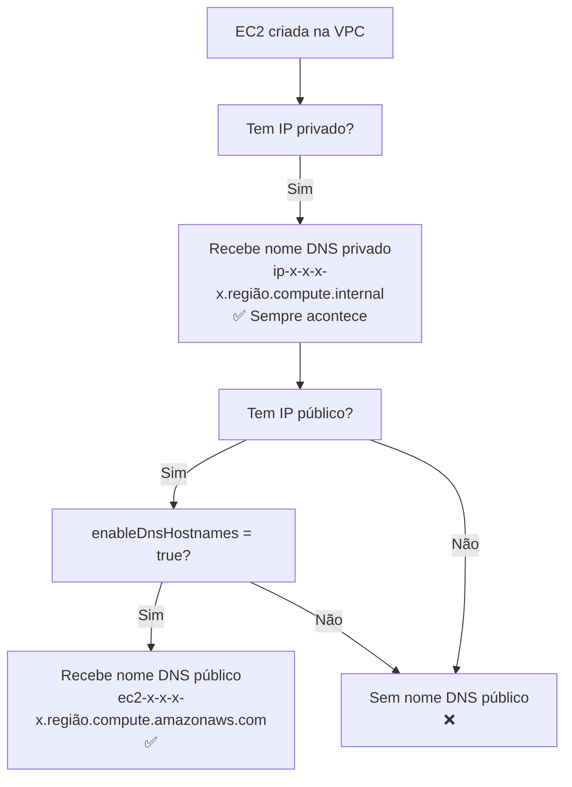
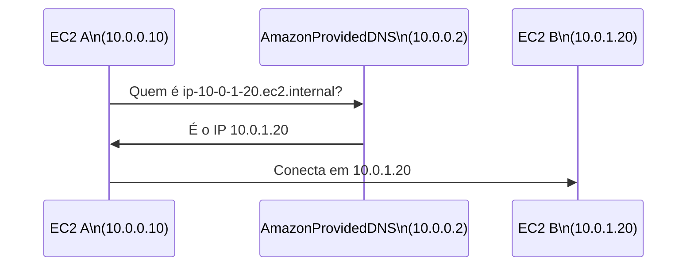
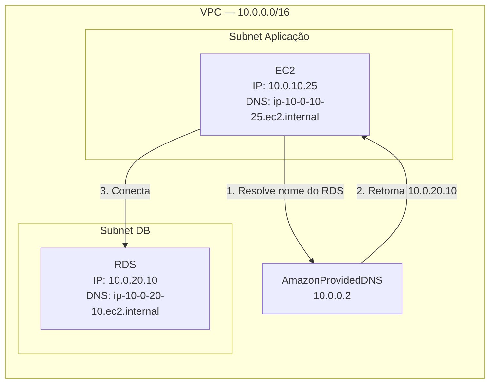

# 07 - DNS na VPC

## 1. Explicação Técnica

Você já sabe que toda subnet reserva o endereço `.2` para o DNS da AWS. Isso ficou na nota de Subnets, lembra? Aquele IP que parecia abstrato na época agora vai fazer todo sentido.

Pensa assim: IP é como o número de um apartamento. Ninguém fala "vou visitar o apartamento 10.0.100.10". As pessoas falam "vou visitar a casa do João". O **DNS é o serviço de lista telefônica** que traduz nomes legíveis por humanos em endereços IP que as máquinas entendem.

Dentro da VPC, a AWS fornece esse serviço automaticamente. Quando você cria um recurso, como uma instância EC2, ela recebe dois presentes: um **endereço IP privado** e um **nome DNS** correspondente. Você não precisa configurar nada para isso acontecer.

---

## 2. O Servidor DNS da AWS dentro da VPC

A AWS disponibiliza um resolver DNS em dois endereços que são garantidos em qualquer VPC:

| Endereço | Descrição |
|----------|-----------|
| `169.254.169.253` | IP de link-local, acessível de qualquer lugar |
| `VPC base IP + 2` | Ex: VPC `10.0.0.0/16` → DNS em `10.0.0.2` |

Conecta com a nota de Subnets: o `.2` que estava reservado em toda subnet não é à toa. É exatamente esse DNS da AWS. Agora o quebra-cabeça fecha.

Esse resolver é chamado internamente de **AmazonProvidedDNS** e é quem responde às consultas de DNS dentro da VPC por padrão.

---

## 3. Nomes DNS Atribuídos Automaticamente

Quando uma instância EC2 é criada na VPC, ela recebe automaticamente um nome DNS privado baseado no seu IP privado. O formato varia por região:

**Para us-east-1 (N. Virginia):**
```
ip-{IP-com-traços}.ec2.internal
```

**Para todas as outras regiões:**
```
ip-{IP-com-traços}.{região}.compute.internal
```

Exemplo concreto: uma EC2 com IP privado `10.0.100.10` em `us-east-1` recebe o nome:
```
ip-10-0-100-10.ec2.internal
```

Em `us-west-2` o mesmo IP ficaria:
```
ip-10-0-100-10.us-west-2.compute.internal
```

E se a instância também tiver um IP público (e o `enableDnsHostnames` estiver habilitado, como veremos a seguir), ela ganha um nome DNS público também:
```
ec2-{IP-público-com-traços}.{região}.compute.amazonaws.com
```

Exemplo: IP público `54.12.34.56` em `us-east-1`:
```
ec2-54-12-34-56.compute-1.amazonaws.com
```

---

## 4. Os Dois Atributos de DNS da VPC

Aqui tem uma distinção que cai muito na prova. A VPC tem dois atributos booleanos independentes que controlam o comportamento de DNS:

### `enableDnsSupport`

Habilita ou desabilita a resolução de DNS dentro da VPC. Quando está `true`, os recursos da VPC podem usar o resolver DNS da AWS (o `.2`) para resolver nomes de domínio.

- **Valor padrão:** `true` para todas as VPCs (inclusive a Default)
- **Se desabilitar:** os recursos da VPC não conseguem resolver DNS via AWS. Você teria que fornecer seu próprio servidor DNS.

### `enableDnsHostnames`

Controla se as instâncias com IP público recebem um **nome DNS público** automaticamente.

- **Valor padrão:** `true` na VPC Default, `false` em VPCs customizadas
- **Se estiver `false`:** instâncias com IP público existem, mas não têm nome DNS público associado
- **Se estiver `true`:** instâncias com IP público ganham um nome DNS público automaticamente



---

## 5. A Dependência entre os Dois Atributos

Atenção para esse detalhe que a prova adora cobrar:

**`enableDnsHostnames` só funciona se `enableDnsSupport` também estiver `true`.**

Se você habilitar `enableDnsHostnames` mas desabilitar `enableDnsSupport`, os nomes DNS públicos não vão funcionar. O suporte a DNS é o pré-requisito.

| `enableDnsSupport` | `enableDnsHostnames` | Resultado |
|-------------------|---------------------|-----------|
| `true` | `true` | DNS privado + DNS público para instâncias com IP público |
| `true` | `false` | Apenas DNS privado |
| `false` | `false` | Sem DNS da AWS |
| `false` | `true` | Inválido na prática. `enableDnsHostnames` não funciona sem suporte DNS |

---

## 6. Como Funciona a Resolução na Prática



O EC2 A não precisa saber o IP do EC2 B de cor. Ele pergunta ao DNS da VPC pelo nome, recebe o IP, e conecta. Se o IP do EC2 B mudar, basta atualizar o DNS e o EC2 A continua funcionando sem nenhuma alteração de configuração.

---

## 7. Cenário Real

Uma empresa tem uma aplicação em subnet privada que precisa se comunicar com um banco de dados também em subnet privada. Ao invés de hardcodar o IP do banco, a aplicação usa o nome DNS:



Se o RDS for substituído e ganhar um novo IP, a aplicação não precisa ser reconfigurada. Ela resolve o nome DNS e recebe o novo IP automaticamente. Isso é o poder do DNS na arquitetura.

---

## 8. Quando Usar / Quando NÃO Usar

**Mantenha `enableDnsSupport = true`** sempre. Desabilitar o DNS da AWS sem ter um servidor DNS próprio configurado vai quebrar a resolução de nomes dentro da VPC.

**Habilite `enableDnsHostnames`** quando você precisar que instâncias com IP público tenham nomes DNS públicos, como ao usar serviços que exigem endpoints com nome de domínio.

**Use nomes DNS ao invés de IPs hardcoded** em configurações de aplicação. IPs podem mudar, nomes DNS são mais estáveis.

---

## 9. Pegadinhas Comuns da Prova

> **[PEGADINHA #1]** - *"Por padrão, VPCs customizadas têm `enableDnsHostnames = true`?"*
> Não. VPCs customizadas nascem com `enableDnsHostnames = false`. Apenas a VPC Default tem `true` por padrão.

> **[PEGADINHA #2]** - *"`enableDnsHostnames = true` é suficiente para instâncias terem nome DNS público?"*
> Não. `enableDnsSupport` também precisa estar `true`. Um depende do outro.

> **[PEGADINHA #3]** - *"Qual IP o DNS da AWS ocupa em cada subnet?"*
> O base IP da VPC + 2. Ex: VPC `10.0.0.0/16` → DNS em `10.0.0.2`. É o mesmo para todas as subnets da VPC.

> **[PEGADINHA #4]** - *"Instâncias em subnet privada recebem nome DNS?"*
> Sim. O nome DNS privado (`ip-x-x-x-x.ec2.internal`) é atribuído sempre que a instância tem um IP privado, independente de ser subnet pública ou privada.

> **[PEGADINHA #5]** - *"Qual a diferença de formato do nome DNS privado entre us-east-1 e outras regiões?"*
> Em `us-east-1` o sufixo é `.ec2.internal`. Em outras regiões é `.{região}.compute.internal`.

---

## 10. Resumo Final

A VPC da AWS vem com DNS embutido. Todo recurso criado ganha um nome DNS privado automaticamente baseado no seu IP. Para IPs públicos também ganharem nomes DNS, você precisa habilitar `enableDnsHostnames`, que depende de `enableDnsSupport` estar ativo.

O DNS resolve no endereço `.2` de qualquer subnet da VPC, aquele IP reservado que pareceu estranho lá na nota de Subnets. Agora você sabe exatamente para que ele serve.

---

## 11. Flashcards Rápidos

**Q: Qual endereço o DNS da AWS ocupa dentro de qualquer subnet da VPC?**
A: O base IP da VPC + 2. Ex: VPC `10.0.0.0/16` → DNS em `10.0.0.2`.

**Q: Qual o outro endereço IP onde o DNS da AWS pode ser acessado?**
A: `169.254.169.253` (link-local, acessível de qualquer lugar).

**Q: O que controla `enableDnsSupport`?**
A: Se a VPC usa o resolver DNS da AWS. Padrão `true`. Se desabilitado, recursos não resolvem DNS via AWS.

**Q: O que controla `enableDnsHostnames`?**
A: Se instâncias com IP público recebem nome DNS público. Padrão `false` em VPCs customizadas, `true` na VPC Default.

**Q: `enableDnsHostnames = true` funciona se `enableDnsSupport = false`?**
A: Não. `enableDnsSupport` é pré-requisito para `enableDnsHostnames` funcionar.

**Q: Qual o formato do nome DNS privado de uma EC2 com IP `10.0.10.25` em us-east-1?**
A: `ip-10-0-10-25.ec2.internal`

**Q: Instâncias em subnet privada recebem nome DNS privado?**
A: Sim, sempre. O nome DNS privado não depende do tipo de subnet.
