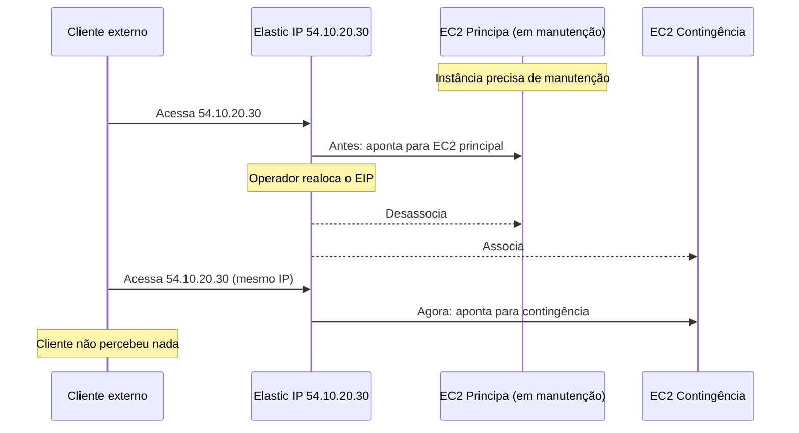
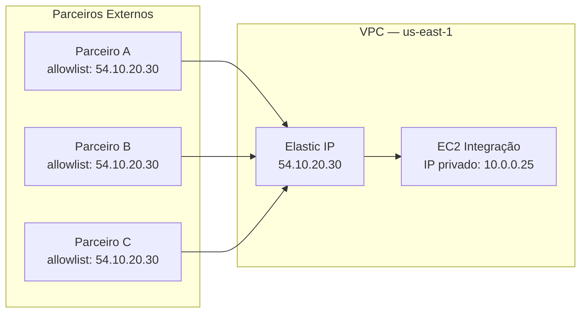

# 08 - Elastic IP

## 1. Explicação Técnica

Lembra da nota do NAT Gateway, onde falamos que ele usa um Elastic IP? E nas notas anteriores, quando mencionamos que instâncias podem receber um IP público? Chegou a hora de entender exatamente o que é esse IP público e qual a diferença entre os dois tipos que existem.

Pensa assim: imagine que seu endereço residencial mudasse toda vez que você saísse de casa e voltasse. Nenhum serviço de entrega conseguiria te encontrar, nenhum contato saberia onde te mandar uma carta. Isso é exatamente o que acontece com um **IP público comum** na AWS.

Agora pensa num serviço de caixa postal com endereço fixo: independente de onde você esteja, tudo chega no mesmo lugar. Esse é o **Elastic IP**.

---

## 2. IP Público Comum vs Elastic IP

Existem dois tipos de IP público que um recurso pode ter na AWS:

| Característica | IP Público Comum | Elastic IP Address |
|----------------|-----------------|-------------------|
| Como é obtido | Atribuído automaticamente ao criar a instância | Você reserva explicitamente |
| É estático? | Não. Muda ao parar e iniciar a instância | Sim. Permanece o mesmo indefinidamente |
| Pertence a quem? | Pool compartilhado da AWS. Ninguém "dono" | Pertence à sua conta até você liberar |
| Custo | Sem custo adicional | Custo quando não está em uso (ver seção de custo) |
| Pode ser movido? | Não | Sim, entre instâncias e serviços da mesma região |

O ponto crítico é esse: quando você **para** uma instância com IP público comum e **inicia** ela novamente, ela recebe um IP diferente. Qualquer sistema externo que dependia daquele IP agora está apontando para o lugar errado.

---

## 3. O Que Torna o Elastic IP Especial

O Elastic IP Address é um **IPv4 público estático** que fica reservado para a sua conta AWS em uma região específica. Ele não vai a lugar nenhum enquanto você não decidir liberá-lo.

Isso abre dois cenários que mudam a forma como você arquiteta:

### Estabilidade de Endereço

Mesmo que a instância seja parada, reiniciada, movida para outro host físico ou substituída por outra, o IP permanece. Quem depende desse IP não percebe nada.

### Realocação para Failover

Esse é um padrão arquitetural clássico. Se você tem uma instância principal e uma de contingência, e a principal precisar de manutenção ou falhar, você pode **mover o Elastic IP para a instância de contingência** em questão de segundos.

O cliente continua usando o mesmo IP. A troca acontece por baixo dos panos.

---

## 4. Custo - A Lógica Invertida que Confunde

A cobrança do Elastic IP é por hora e segue uma lógica que vai contra o intuitivo:

| Situação | Cobrado? |
|----------|----------|
| EIP associado a uma instância **em execução** | Não (gratuito) |
| EIP reservado mas **não associado** a nada | Sim |
| EIP associado a uma instância **parada** | Sim |
| Segundo EIP ou mais na mesma instância | Sim (por cada EIP adicional) |

A lógica da AWS aqui é: IPs públicos são um recurso escasso. Se você reservou um e não está usando, está desperdiçando um recurso que outro cliente poderia usar. Por isso o incentivo financeiro é para que você libere IPs que não estão em uso.

Resumindo a regra de ouro: **EIP em instância rodando = grátis. EIP parado ou sem instância = paga.**

---

## 5. Escopo Regional e Limites

Elastic IPs são **específicos de uma região**. Um EIP reservado em `us-east-1` não pode ser movido para `us-west-2` nem associado a recursos em outra região.

Por padrão, cada conta AWS tem um limite de **5 Elastic IPs por região**. Esse limite pode ser aumentado via solicitação de suporte, mas a AWS encoraja arquiteturas que não dependem de muitos IPs estáticos.

---

## 6. BYOIP - Trazendo Seus Próprios IPs

Além de usar IPs do pool da AWS, é possível trazer **blocos de IP que você já possui** para dentro da sua conta. Isso se chama **BYOIP (Bring Your Own IP)**.

Quando faz sentido usar BYOIP?

- A empresa tem IPs que já estão na lista de permissão (allowlist) de parceiros ou clientes e não quer reconfigurá-los
- Requisito de compliance que exige usar IPs da própria empresa
- Reputação de IP já estabelecida (relevante para envio de e-mail, por exemplo)

Os requisitos técnicos envolvem verificação de propriedade do bloco via registros de internet (ROA), mas os detalhes de configuração ficam para estudos mais avançados.

---

## 7. Cenário Real

Uma empresa tem um servidor de integração que recebe conexões de parceiros externos. Esses parceiros fizeram allowlist do IP do servidor nas suas firewalls. Se o IP mudar, todas as integrações quebram e cada parceiro precisa reconfigurar manualmente.

Solução: associar um Elastic IP ao servidor de integração.

Se o EC2 precisar ser substituído por uma versão maior, basta lançar a nova instância e realocar o EIP. Os parceiros continuam apontando para `54.10.20.30` sem nenhuma mudança do lado deles.

---

## 8. Quando Usar / Quando NÃO Usar

**Use Elastic IP** quando o recurso precisa de um endereço público estável e previsível: servidores de integração com parceiros, servidores de licença que validam por IP, ou qualquer situação de failover onde você quer trocar a instância sem mudar o IP.

**Use Elastic IP no NAT Gateway** sempre. O NAT Gateway exige um EIP para funcionar, como você viu na nota anterior.

**Não use Elastic IP como solução padrão para todos os recursos públicos.** Para a maioria dos casos, um Load Balancer com DNS é a arquitetura correta. EIP deve ser reservado para casos onde o IP fixo é de fato necessário.

**Não esqueça de liberar EIPs que não estão mais em uso.** Eles geram custo mesmo sem fazer nada.

---

## 9. Pegadinhas Comuns da Prova

> **[PEGADINHA #1]** - *"O IP público muda quando você para e reinicia uma instância?"*
> Sim, o IP público comum muda. O Elastic IP não muda.

> **[PEGADINHA #2]** - *"Elastic IP tem custo quando associado a uma instância em execução?"*
> Não. O custo ocorre quando o EIP está reservado mas não associado a uma instância em execução.

> **[PEGADINHA #3]** - *"Posso mover um Elastic IP de us-east-1 para us-west-2?"*
> Não. EIPs são específicos de região.

> **[PEGADINHA #4]** - *"Qual o limite padrão de Elastic IPs por região?"*
> 5 por região por conta. Aumentável via suporte.

> **[PEGADINHA #5]** - *"Uma instância pode ter mais de um Elastic IP?"*
> Sim. Mas o primeiro é gratuito quando a instância está rodando. O segundo em diante é cobrado.

> **[PEGADINHA #6]** - *"EIP associado a uma instância parada é cobrado?"*
> Sim. A instância precisa estar em execução para o EIP ser gratuito.

---

## 10. Resumo Final

Elastic IP é o endereço de caixa postal fixo do seu recurso na AWS. IP público comum é o endereço que muda toda vez que você sai de casa. Para recursos que precisam de endereço estável, seja por integração com parceiros ou por failover manual, o Elastic IP é a ferramenta certa.

A regra de custo é contra-intuitiva mas simples: paga quando não usa, não paga quando usa (com a instância rodando). Isso incentiva a liberação de IPs ociosos.

O EIP é regional, tem limite de 5 por conta e pode vir do pool da AWS ou dos seus próprios blocos via BYOIP.

---

## 11. Flashcards Rápidos

**Q: Qual a diferença entre IP público comum e Elastic IP?**
A: IP público comum é efêmero e muda ao parar/iniciar a instância. Elastic IP é estático e pertence à sua conta até você liberar.

**Q: Quando o Elastic IP é cobrado?**
A: Quando está reservado mas não associado a uma instância em execução. Se estiver associado a uma instância rodando, é gratuito.

**Q: Elastic IP pode ser movido entre regiões?**
A: Não. É específico da região onde foi criado.

**Q: Qual o limite padrão de Elastic IPs por região?**
A: 5 por conta. Aumentável via solicitação de suporte.

**Q: Para que serve o BYOIP?**
A: Permite trazer blocos de IP da sua empresa para dentro da conta AWS, mantendo IPs que já estão em allowlists de parceiros ou têm reputação estabelecida.

**Q: O NAT Gateway precisa de Elastic IP?**
A: Sim. O NAT Gateway exige um Elastic IP para ter um endereço público fixo de saída.

**Q: Um EIP associado a uma instância parada é cobrado?**
A: Sim. A instância precisa estar em execução para o EIP ser gratuito.
