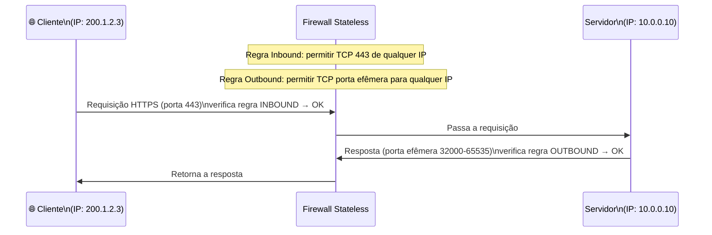
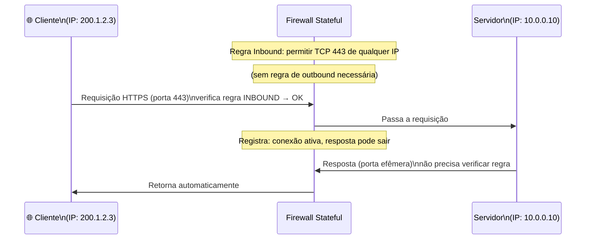
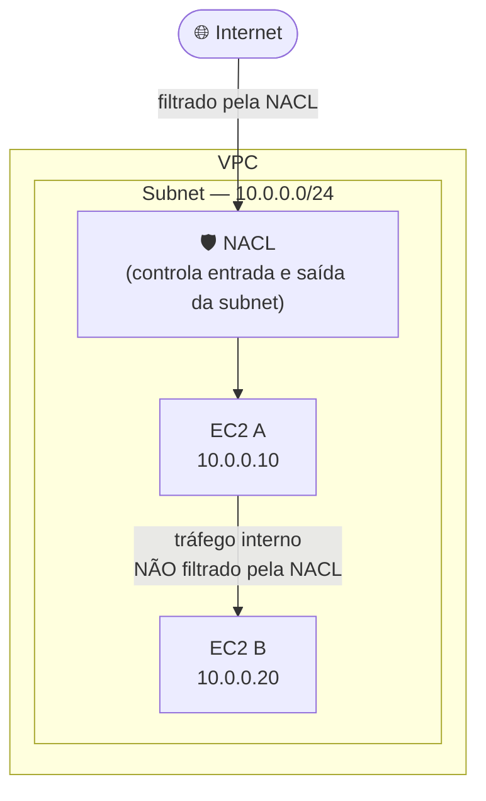
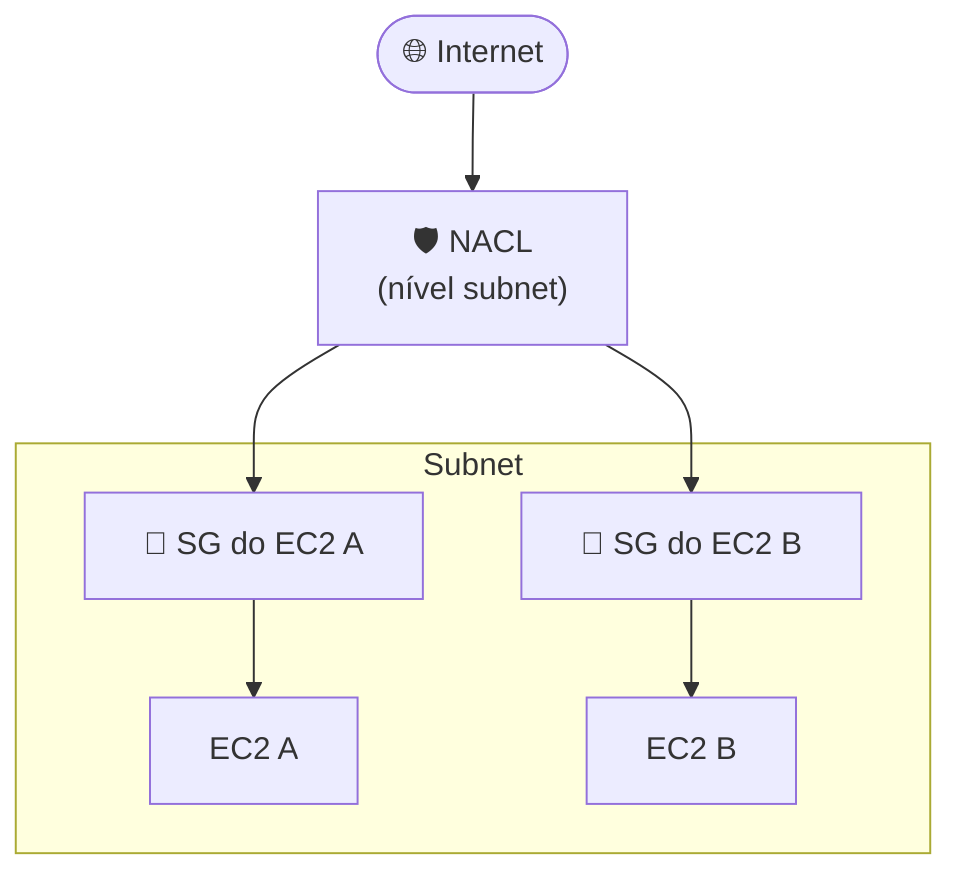
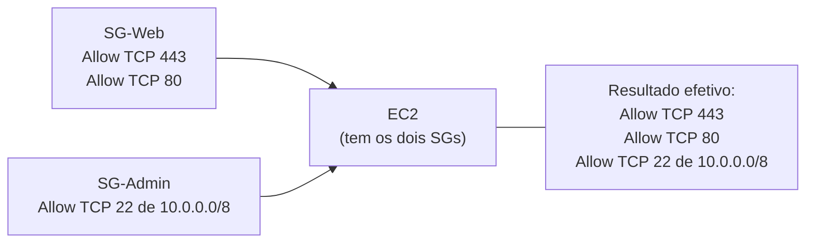
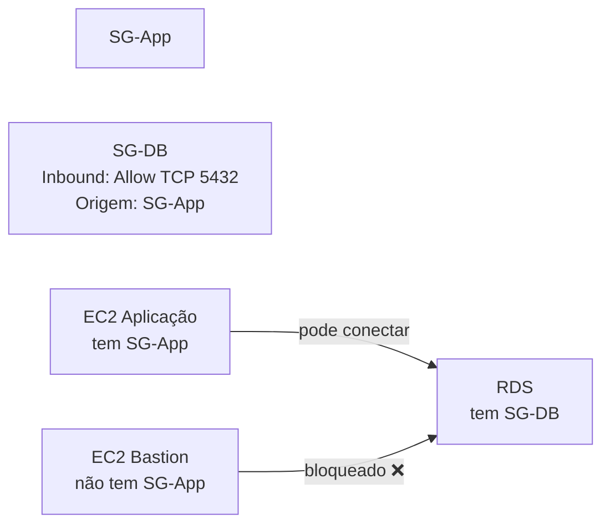
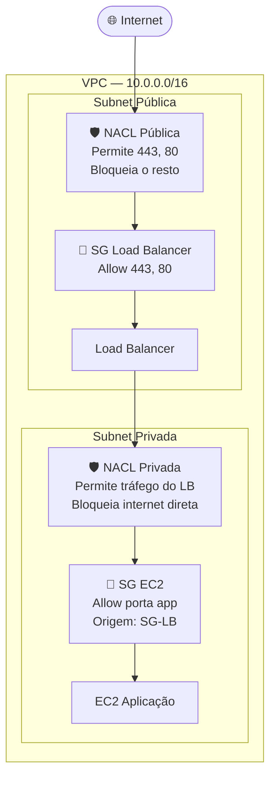

# 09 - Security Groups e NACLs

## 1. Explicação Técnica

Você aprendeu que VPCs são isoladas por padrão e que subnets controlam onde os recursos ficam. Mas dentro da VPC, uma vez que o tráfego passa pela route table e chega até um recurso, o que decide se ele pode ou não entrar?

Pensa assim: a VPC é o condomínio, a subnet é o andar do prédio, e o recurso é o apartamento. Até agora, aprendemos quem pode entrar no condomínio (IGW, NAT Gateway). Agora vamos aprender sobre a **portaria do andar** (NACLs) e o **interfone do apartamento** (Security Groups). Dois filtros, dois momentos diferentes, dois comportamentos diferentes.

Esses dois serviços são os **firewalls dentro da AWS**, e toda a responsabilidade de configurá-los é sua. A AWS não define as regras. Isso é responsabilidade compartilhada na prática: a infraestrutura é da AWS, as regras de segurança são suas.

---

## 2. Stateful vs Stateless - A Diferença Fundamental

Antes de entrar em cada serviço, precisamos entender os dois tipos de firewall que existem. Essa distinção é o coração de tudo nessa nota.

### Firewall Stateless

O firewall stateless não tem memória. Ele olha cada pacote de forma independente, sem saber se aquele pacote é uma resposta de uma conexão que já foi permitida. Para ele, cada pacote é um estranho.

Isso significa que você precisa criar regras tanto para o tráfego de **entrada (inbound)** quanto para o tráfego de **saída (outbound)**, incluindo as respostas.

Se a regra de outbound não existir, a resposta é bloqueada, mesmo que a requisição original tenha sido permitida. O firewall não se lembra que foi você que pediu.

### Firewall Stateful

O firewall stateful tem memória. Ele rastreia as conexões ativas e sabe que se uma requisição foi permitida na entrada, a resposta dela pode sair automaticamente, sem precisar de regra explícita.

Você só precisa se preocupar com quem pode entrar. O que entra autorizado, pode sair para responder.

| Característica | Stateless | Stateful |
|----------------|-----------|----------|
| Rastreia conexões? | Não | Sim |
| Precisa de regra de outbound para respostas? | Sim | Não |
| Quem usa na AWS | NACLs | Security Groups |

---

## 3. NACLs - A Portaria do Andar (Nível Subnet)

A **Network Access Control List (NACL)** é um firewall **stateless** que age no nível da **subnet**. Ela controla o tráfego que entra e sai da subnet, mas não filtra tráfego que circula **dentro** da mesma subnet.

O tráfego entre `EC2 A` e `EC2 B`, dentro da mesma subnet, não passa pela NACL. Ela só atua na fronteira da subnet.

### Regras da NACL - A Lógica do Número

NACLs têm um sistema de **rule number** que define a ordem de avaliação. Funciona como um `if/else if`: a primeira regra que casar com o tráfego é aplicada e o processamento para. As regras seguintes não são avaliadas.

Regras com número menor são avaliadas primeiro.

Exemplo de NACL de entrada:

| Rule # | Tipo | Protocolo | Porta | Origem | Ação |
|--------|------|-----------|-------|--------|------|
| 100 | ALLOW | TCP | 443 | 0.0.0.0/0 | ALLOW |
| 200 | ALLOW | TCP | 80 | 0.0.0.0/0 | ALLOW |
| 300 | DENY | TCP | 22 | 0.0.0.0/0 | DENY |
| * | — | Tudo | Tudo | 0.0.0.0/0 | DENY |

O que acontece com um pacote na porta 443? A regra 100 casa, permite. Fim.
O que acontece com um pacote na porta 22? A regra 300 casa, bloqueia. A regra `*` nunca é avaliada.
O que acontece com qualquer outra porta? Nenhuma regra numeral casa, chega na `*`, bloqueia.

A regra com número `*` é especial: **não tem número, sempre fica por último e não pode ser removida**. Ela é o comportamento final quando nenhuma outra regra casar.

> Boa prática: sempre configure regras explícitas antes da `*`. NACLs customizadas bloqueiam tudo por padrão via a regra `*`. A NACL Default que vem com a VPC libera tudo, o que precisa ser revisto em produção.

### NACL Default vs NACL Customizada

| Tipo | Comportamento Padrão |
|------|---------------------|
| NACL Default (criada com a VPC) | Permite todo tráfego de entrada e saída |
| NACL Customizada (criada por você) | Bloqueia todo tráfego até você criar regras |

---

## 4. Security Groups - O Interfone do Apartamento (Nível Recurso)

O **Security Group (SG)** é um firewall **stateful** que age no nível do **recurso**, especificamente na interface de rede (ENI) de cada instância, banco de dados, load balancer ou qualquer recurso que tenha uma ENI.

O tráfego passa primeiro pela NACL da subnet, depois pelo Security Group do recurso. São duas camadas independentes.

### Comportamento Default do Security Group

- **Todo tráfego de entrada é bloqueado por padrão.** Se não tem regra de allow, não entra.
- **Todo tráfego de saída é permitido por padrão.** O SG default permite toda saída.

Ao contrário da NACL, o Security Group **não tem regras de DENY explícitas**. Você só adiciona regras de ALLOW. O que não está na lista simplesmente não entra.

| Característica | NACL | Security Group |
|----------------|------|---------------|
| Nível de atuação | Subnet | Recurso (ENI) |
| Stateful? | Não | Sim |
| Suporta regras DENY? | Sim | Não (só ALLOW) |
| Ordem de regras | Numérada, processada em ordem | Todas avaliadas, mais permissivo vence |
| Default (tráfego de entrada) | Permitido (NACL Default) | Bloqueado |
| Default (tráfego de saída) | Permitido (NACL Default) | Permitido |

### Múltiplos Security Groups no Mesmo Recurso

Um recurso pode ter **múltiplos Security Groups** associados. Quando isso acontece, as regras são unificadas (merge). O conjunto combinado de todas as regras ALLOW de todos os SGs é o que define o que passa.

É uma forma elegante de compor regras: um SG para tráfego web, outro para acesso administrativo, outro para monitoramento. Cada um com sua responsabilidade.

### Security Group Referenciando Outro Security Group

Esse é um recurso poderoso que o SAP cobra muito. Em vez de colocar um range de IP como origem de uma regra, você pode referenciar **outro Security Group**.

Exemplo: o banco de dados só aceita tráfego de recursos que têm o SG da aplicação. Não importa qual IP. Se o recurso tiver aquele SG, passa.

Isso é muito mais robusto do que allowlist de IP, porque IPs mudam (lembra do IP público efêmero?). Usando referência a SG, qualquer recurso com o SG certo tem acesso, e qualquer recurso sem ele é bloqueado, independente do IP.

---

## 5. As Duas Camadas Juntas - Defense in Depth

O modelo correto é usar **ambos em conjunto**. Cada camada tem um papel:

O tráfego passa por quatro filtros antes de chegar no EC2: NACL da subnet pública, SG do Load Balancer, NACL da subnet privada, SG do EC2. Isso é **defense in depth**.

---

## 6. Cenário Real - Portas Efêmeras e o Detalhe Stateless

Esse é um detalhe técnico que derruba muita gente em cenários da prova. Como a NACL é stateless, quando um servidor responde uma requisição, a resposta sai por uma **porta efêmera** (geralmente entre 1024 e 65535). Você precisa liberar esse range na regra de outbound da NACL.

Exemplo: cliente acessa o servidor na porta 443. O servidor responde pela porta `54231` (efêmera escolhida pelo SO). A NACL precisa de uma regra de outbound que permita TCP nas portas `1024-65535` para qualquer destino. Sem essa regra, a resposta é bloqueada.

| Regra NACL Outbound | Tipo | Porta | Destino | Ação |
|---------------------|------|-------|---------|------|
| 100 | TCP | 1024-65535 | 0.0.0.0/0 | ALLOW |
| * | Tudo | Tudo | 0.0.0.0/0 | DENY |

O Security Group não tem esse problema porque é stateful. A resposta sai automaticamente.

---

## 7. Quando Usar / Quando NÃO Usar

**Use Security Groups como primeira linha de defesa para cada recurso.** É o controle mais granular e o mais fácil de gerenciar. Para a maioria dos casos, SG bem configurado já é suficiente.

**Use NACLs para defesa em profundidade no nível de subnet.** Quando você precisa bloquear um range de IP inteiro de acessar uma subnet, ou criar uma barreira explícita entre tiers, NACL é a ferramenta certa.

**Use referência de SG a SG** sempre que possível no lugar de ranges de IP. É mais seguro e mais fácil de manter.

**Não confie só na NACL.** Ela protege a subnet, mas tráfego dentro da mesma subnet não passa por ela.

**Não deixe a NACL Default sem revisão em produção.** Ela permite tudo por padrão.

---

## 8. Pegadinhas Comuns da Prova

> **[PEGADINHA #1]** - *"NACL filtra tráfego entre instâncias na mesma subnet?"*
> Não. NACL só filtra o tráfego que entra e sai da subnet. Tráfego dentro da mesma subnet não é filtrado pela NACL.

> **[PEGADINHA #2]** - *"Security Group suporta regras de DENY?"*
> Não. SG só tem regras de ALLOW. O que não está explicitamente permitido é bloqueado.

> **[PEGADINHA #3]** - *"NACL é stateful ou stateless?"*
> Stateless. Você precisa de regras de inbound E outbound, incluindo portas efêmeras na resposta.

> **[PEGADINHA #4]** - *"Security Group é stateful ou stateless?"*
> Stateful. Se a requisição entrou, a resposta sai automaticamente sem regra de outbound explícita.

> **[PEGADINHA #5]** - *"Se duas regras de NACL casam com o mesmo tráfego, qual vence?"*
> A de menor número. A regra com rule number menor é avaliada primeiro e o processamento para.

> **[PEGADINHA #6]** - *"A NACL Default de uma VPC bloqueia tudo?"*
> Não. A NACL Default permite todo tráfego. É a NACL customizada que bloqueia tudo até você criar regras.

> **[PEGADINHA #7]** - *"Um recurso pode ter múltiplos Security Groups?"*
> Sim. As regras de todos os SGs são combinadas (merge). O conjunto de todos os ALLOWs forma a política efetiva.

> **[PEGADINHA #8]** - *"Qual a ordem de avaliação: NACL primeiro ou Security Group?"*
> NACL primeiro (nível subnet), depois Security Group (nível recurso).

---

## 9. Resumo Final

NACLs e Security Groups são as duas camadas de firewall dentro da VPC. Eles trabalham em níveis diferentes e com comportamentos diferentes. NACL é stateless e age na fronteira da subnet. Security Group é stateful e age no nível do recurso.

O modelo correto é usar os dois juntos: NACL como barreira de subnet para bloqueios mais amplos, Security Group como controle granular por recurso. Prefira referência de SG a SG no lugar de ranges de IP. E nunca esqueça que a NACL não filtra tráfego dentro da mesma subnet.

---

## 10. Flashcards Rápidos

**Q: NACL age em qual nível?**
A: Nível de subnet. Filtra o tráfego que entra e sai da subnet.

**Q: Security Group age em qual nível?**
A: Nível de recurso (ENI). Filtra o tráfego que chega em cada instância ou serviço.

**Q: NACL é stateful ou stateless?**
A: Stateless. Precisa de regras de inbound E outbound.

**Q: Security Group é stateful ou stateless?**
A: Stateful. Só precisa de regras de inbound. A resposta sai automaticamente.

**Q: SG suporta regras DENY?**
A: Não. Só ALLOW. O que não está na lista é bloqueado.

**Q: NACL suporta regras DENY?**
A: Sim. Você pode ter regras de ALLOW e DENY explícitas.

**Q: Qual a ordem de avaliação do tráfego entrando em um recurso?**
A: NACL da subnet primeiro, depois Security Group do recurso.

**Q: NACL filtra tráfego entre EC2s na mesma subnet?**
A: Não. Apenas o tráfego que atravessa a fronteira da subnet.

**Q: O que acontece quando um recurso tem múltiplos Security Groups?**
A: As regras de todos os SGs são combinadas. O conjunto de ALLOWs é a política efetiva.

**Q: Por que é mais seguro referenciar um SG como origem de uma regra do que usar range de IP?**
A: Porque IPs podem mudar. Com referência de SG, qualquer recurso com aquele SG tem acesso, independente do IP.
