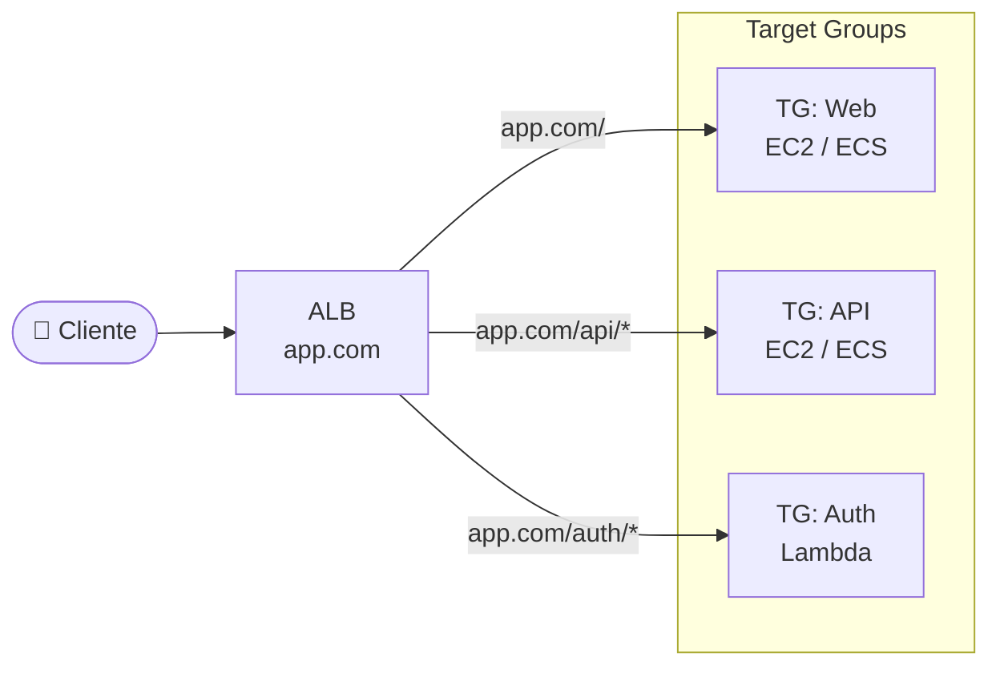
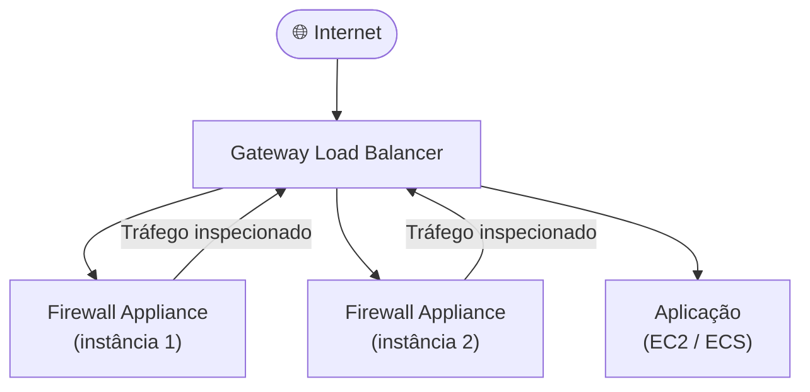
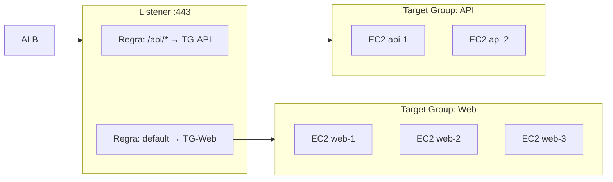
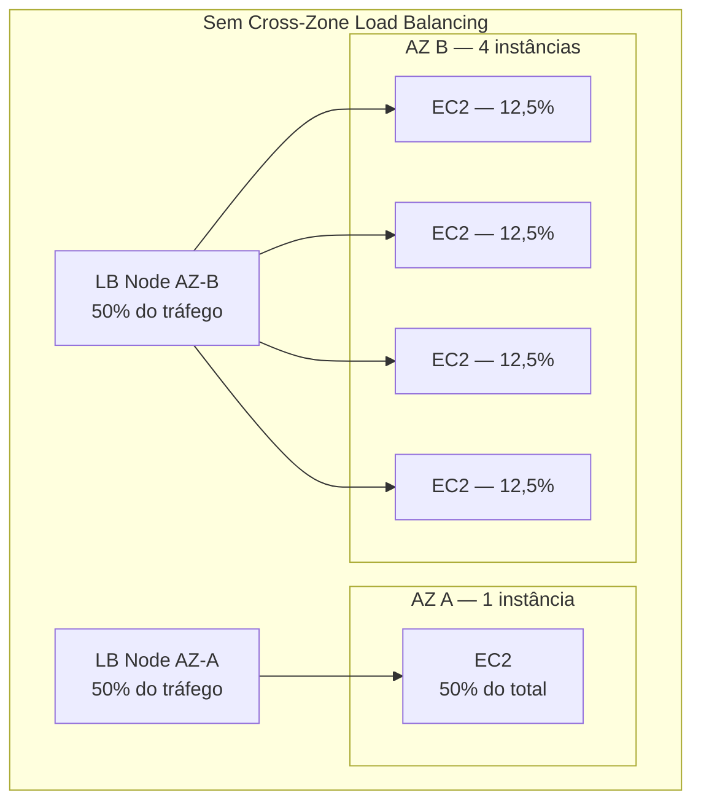
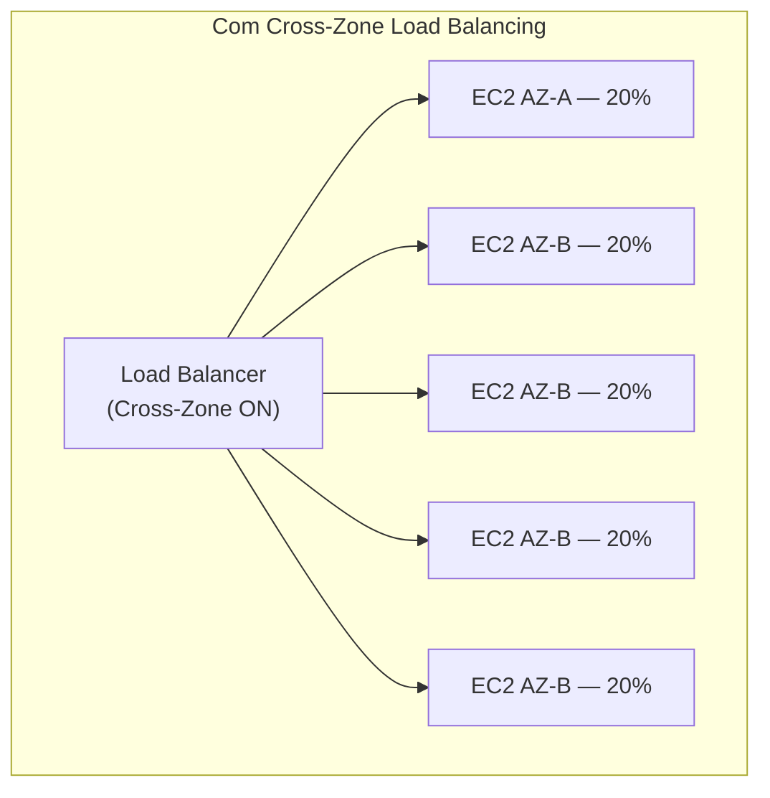
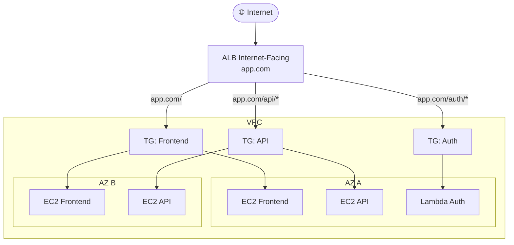

# 10 - Load Balancers (ELB)

## 1. Explicação Técnica

Lembra da nota do Elastic IP, onde a gente falou que para a maioria dos casos "um Load Balancer com DNS é a arquitetura correta"? Chegou a hora de entender o porquê disso.

Pensa no seguinte cenário: você tem um restaurante muito famoso. Tem uma única fila na porta e um único maitre que recebe todo mundo. Não importa se tem 2 ou 200 mesas disponíveis lá dentro. O cliente faz reserva pelo nome do restaurante, chega na porta, e o maitre distribui para a mesa disponível mais adequada. O cliente nunca sabe em qual mesa vai sentar antes de chegar. E se uma mesa estiver suja ou ocupada, o maitre simplesmente não manda ninguém para ela.

Isso é exatamente o **Elastic Load Balancer (ELB)**. Um único ponto de entrada com um único endereço DNS, que distribui as requisições entre N instâncias por trás. O cliente sempre fala com o mesmo endereço. A distribuição acontece por baixo dos panos.

O benefício imediato é duplo: você ganha **resiliência** (se um servidor cair, o tráfego vai para os outros) e **escalabilidade** (quer mais capacidade? Basta adicionar mais servidores no pool).

---

## 2. Os 4 Tipos de Load Balancer

A AWS tem quatro tipos de load balancer, cada um projetado para um caso diferente:

| Tipo | Camada OSI | Protocolos | Caso de uso principal |
|------|-----------|------------|----------------------|
| Classic Load Balancer (CLB) | 4 e 7 | HTTP, HTTPS, TCP, SSL | Legado. Não use em novos projetos |
| Application Load Balancer (ALB) | 7 | HTTP, HTTPS, WebSocket, gRPC | Aplicações web com roteamento inteligente |
| Network Load Balancer (NLB) | 4 | TCP, UDP, TLS | Alta performance, baixa latência, IPs fixos |
| Gateway Load Balancer (GWLB) | 3 | IP (GENEVE) | Inspeção de tráfego com appliances de rede |

Vamos destrinchar cada um.

---

## 3. Classic Load Balancer (CLB)

O CLB foi o primeiro tipo de load balancer da AWS. Hoje ele é considerado legado e a AWS não recomenda mais o uso para novos projetos.

A limitação mais citada é a de certificados SSL: o CLB aceita apenas um certificado SSL por load balancer. Se você precisar servir duas aplicações com domínios diferentes e certificados diferentes pelo mesmo load balancer, o CLB não consegue. Você precisaria de dois load balancers separados.

Existe apenas para suportar workloads antigos que ainda não foram migrados. Se você vir CLB na prova, a resposta quase sempre vai ser "migre para ALB ou NLB."

---

## 4. Application Load Balancer (ALB)

O ALB opera na **camada 7 do modelo OSI**, o que significa que ele entende o conteúdo da requisição HTTP. Não é só "chegou um pacote, manda para alguém." É "chegou uma requisição para `/api/users`, manda para o Target Group de microserviço de usuários."

### Roteamento Inteligente

O ALB consegue rotear baseado em:

- **Path da URL**: `/api` vai para um target group, `/static` vai para outro
- **Host header**: `app1.com` vai para um target group, `app2.com` vai para outro
- **HTTP headers**: valor de qualquer header HTTP
- **HTTP method**: GET, POST, DELETE, etc.
- **Query string**: parâmetros na URL
- **IP de origem**: CIDR do cliente



### SSL/TLS Termination

O ALB faz **SSL termination**: ele recebe a requisição HTTPS do cliente, decifra, e encaminha em HTTP puro para os targets. Isso tira a carga de processamento criptográfico das instâncias. E diferente do CLB, o ALB suporta **múltiplos certificados SSL** via SNI (Server Name Indication), um por domínio.

### Health Checks

O ALB faz health checks específicos na aplicação. Você configura um endpoint como `/health` e o ALB bate nele periodicamente. Se o target não responder com sucesso, o ALB para de mandar tráfego para ele automaticamente até que ele se recupere.

---

## 5. Network Load Balancer (NLB)

O NLB opera na **camada 4**, o que significa que ele não lê o conteúdo HTTP. Ele trabalha com TCP, UDP e TLS puro. Sem entender o conteúdo, ele processa muito mais tráfego e com latência muito menor.

As vantagens do NLB em relação ao ALB:

- **Performance**: consegue processar milhões de requisições por segundo com latência de milissegundos
- **IP estático por AZ**: o NLB recebe um Elastic IP por AZ, dando endereços fixos ao load balancer. Isso é crucial para clientes que precisam colocar o IP do load balancer em allowlists de firewall
- **Suporte a protocolos não-HTTP**: UDP, TCP puro, qualquer protocolo baseado em IP

### SSL no NLB

Ao contrário do ALB, o NLB age como um **proxy transparente**. O SSL pode ser terminado no próprio NLB (TLS termination) ou pode ser passado diretamente para os targets (TLS passthrough), onde cada instância faz a decriptografia. Isso é útil quando compliance exige que a decriptografia aconteça dentro do servidor da aplicação.

### Health Checks no NLB

Health checks no NLB são baseados em **conexão TCP ou ICMP**, não em conteúdo HTTP. Ele verifica se consegue abrir uma conexão com o target, não se a aplicação está saudável de verdade. Isso é uma diferença importante em relação ao ALB.

---

## 6. Gateway Load Balancer (GWLB)

O GWLB é o menos óbvio dos quatro, mas é muito cobrado no SAP. Ele opera na **camada 3**, antes mesmo do TCP/IP, usando o protocolo GENEVE.

O caso de uso é específico: você quer que todo o tráfego de entrada na sua VPC passe por uma **appliance de segurança de terceiros** (firewall, IDS/IPS, inspeção de pacotes) antes de chegar nas suas instâncias.



O tráfego entra, o GWLB distribui para as appliances de segurança, as appliances inspecionam e devolvem para o GWLB, e só então o tráfego segue para a aplicação. Se precisar escalar as appliances de segurança, basta adicionar mais instâncias no Target Group.

---

## 7. Listeners e Target Groups

Essa é a dupla fundamental de qualquer load balancer na AWS (exceto CLB).

### Listener

Um **Listener** é o processo que fica escutando requisições em uma porta e protocolo específicos. Você configura uma regra no Listener que diz: "quando receber uma requisição com tal característica, mande para tal Target Group."

Exemplo de regras num ALB:

```
Listener porta 443 (HTTPS):
  Regra 1: SE path = /api/*  → encaminhar para TG-API
  Regra 2: SE host = auth.app.com → encaminhar para TG-Auth
  Regra 3: Padrão (default) → encaminhar para TG-Web
```

### Target Group

Um **Target Group** é uma coleção de destinos para onde o load balancer pode enviar tráfego. Os targets podem ser:

- Instâncias EC2
- Endereços IP (útil para servidores on-premises via VPN/Direct Connect)
- Funções Lambda (apenas ALB)
- Outros load balancers (NLB dentro de ALB)



Cada Target Group tem seu próprio health check configurado de forma independente.

---

## 8. Cross-Zone Load Balancing

Por padrão, sem Cross-Zone, o load balancer distribui o tráfego **igualmente entre os nós do load balancer por AZ**, não entre as instâncias individuais. Isso cria um problema quando as AZs têm números diferentes de instâncias.



Com Cross-Zone habilitado, o load balancer ignora as fronteiras de AZ e distribui **igualmente entre todas as instâncias registradas**:



Comportamento padrão por tipo:

| Tipo de LB | Cross-Zone padrão | Custo de transferência entre AZs |
|------------|------------------|----------------------------------|
| ALB | Sempre habilitado (não pode desligar) | Sem custo adicional |
| NLB | Desabilitado por padrão | Cobrado quando habilitado |
| GWLB | Desabilitado por padrão | Cobrado quando habilitado |

---

## 9. Internal vs Internet-Facing

Ao criar um load balancer, você escolhe se ele é **internet-facing** ou **internal**:

| Tipo | DNS resolve para | Quando usar |
|------|-----------------|-------------|
| Internet-Facing | IP público | Receber tráfego de usuários na internet |
| Internal | IP privado | Comunicação entre serviços dentro da VPC |

Um padrão enterprise clássico é ter um ALB internet-facing recebendo tráfego público e um NLB internal distribuindo tráfego entre microserviços dentro da VPC. Os clientes externos nunca tocam nos serviços internos diretamente.

---

## 10. Cenário Real Enterprise

Uma empresa tem um e-commerce com três componentes: frontend web, API de produtos e serviço de autenticação. Os três precisam escalar de forma independente durante Black Friday:



Com essa arquitetura, o frontend pode ter 10 instâncias, a API pode ter 50 e o serviço de autenticação pode ser uma Lambda com escala automática, tudo gerenciado por um único ALB com regras de roteamento.

---

## 11. Quando Usar / Quando NÃO Usar

**Use ALB** para qualquer aplicação web HTTP/HTTPS com necessidade de roteamento baseado em conteúdo. É o padrão para a maioria dos workloads web modernos.

**Use NLB** quando precisar de latência mínima, suporte a UDP, ou quando clientes externos precisam de um IP fixo para colocar em allowlist de firewall.

**Use GWLB** quando precisar inspecionar tráfego com appliances de segurança de terceiros antes de chegar nas suas instâncias.

**Não use CLB** em nenhum projeto novo. Migre para ALB ou NLB quando encontrar.

**Não use um único load balancer sem Cross-Zone** quando suas AZs tiverem números muito diferentes de instâncias.

---

## 12. Trade-offs

| Dimensão | ALB | NLB | GWLB |
|----------|-----|-----|------|
| Performance | Alta | Extremamente alta | Alta |
| Latência | ~ms | Sub-ms | ~ms |
| Roteamento | Por conteúdo HTTP (L7) | Apenas por IP/porta (L4) | Transparente (L3) |
| IP fixo | Não (DNS dinâmico) | Sim (Elastic IP por AZ) | Sim |
| SSL Termination | Sim, com SNI multi-cert | Sim ou passthrough | Não (transparente) |
| WebSocket | Sim | Sim | Não |
| Lambda como target | Sim | Não | Não |
| Cross-Zone padrão | Sempre ON | OFF por padrão | OFF por padrão |
| Custo Cross-Zone | Grátis | Cobrado | Cobrado |

---

## 13. Pegadinhas Comuns da Prova

> **[PEGADINHA #1]** - *"O ALB suporta protocolos não-HTTP como TCP puro ou UDP?"*
> Não. ALB só funciona com HTTP, HTTPS, WebSocket e gRPC. Para TCP/UDP, use NLB.

> **[PEGADINHA #2]** - *"O NLB consegue fazer roteamento baseado em path de URL?"*
> Não. O NLB opera na camada 4 e não lê conteúdo HTTP. Roteamento por path é exclusivo do ALB (camada 7).

> **[PEGADINHA #3]** - *"Cross-Zone Load Balancing tem custo adicional no ALB?"*
> Não. No ALB, Cross-Zone é sempre ativo e sem custo adicional. No NLB e GWLB, quando habilitado, gera custo de transferência entre AZs.

> **[PEGADINHA #4]** - *"O cliente precisa de um IP fixo para colocar em allowlist. Qual load balancer usar?"*
> NLB. Ele recebe Elastic IP por AZ, dando endereços fixos. O ALB usa DNS dinâmico, sem IP fixo garantido.

> **[PEGADINHA #5]** - *"Qual load balancer usar para inspecionar tráfego com um firewall de terceiros?"*
> GWLB. Ele foi projetado exatamente para esse padrão de inserção de appliances de segurança.

> **[PEGADINHA #6]** - *"Lambda pode ser target de qualquer load balancer?"*
> Não. Lambda como target só funciona com ALB.

> **[PEGADINHA #7]** - *"O CLB suporta múltiplos certificados SSL?"*
> Não. O CLB aceita apenas um certificado SSL. Para múltiplos domínios com certificados diferentes, use ALB com SNI.

> **[PEGADINHA #8]** - *"O NLB por padrão tem Cross-Zone habilitado?"*
> Não. No NLB, Cross-Zone está desabilitado por padrão. No ALB, está sempre habilitado.

> **[PEGADINHA #9]** - *"Um load balancer internal recebe um IP público?"*
> Não. Load balancers internal recebem apenas IPs privados. Somente internet-facing recebem IPs públicos.

> **[PEGADINHA #10]** - *"O NLB faz health check baseado em conteúdo HTTP como o ALB?"*
> Não. O NLB faz health checks baseados em conexão TCP ou ICMP. Não interpreta a resposta HTTP.

---

## 14. Resumo Final

O ELB é a camada de abstração que separa o cliente dos seus servidores. Em vez de clientes apontarem para IPs de instâncias individuais, eles falam com o load balancer que distribui o tráfego de forma inteligente.

Você tem quatro tipos: o CLB legado que não usar mais, o ALB para aplicações web com roteamento L7, o NLB para alta performance e IP fixo em L4, e o GWLB para inserção de appliances de segurança em L3.

Listeners definem como as requisições chegam. Target Groups definem para onde elas vão. Health checks garantem que o tráfego só vai para targets saudáveis. Cross-Zone garante distribuição uniforme entre instâncias independente da AZ onde estão.

---

## 15. Flashcards Rápidos

**Q: Em qual camada OSI o ALB opera?**
A: Camada 7 (aplicação). Entende HTTP, HTTPS, WebSocket, gRPC.

**Q: Em qual camada OSI o NLB opera?**
A: Camada 4 (transporte). Trabalha com TCP, UDP, TLS.

**Q: Em qual camada OSI o GWLB opera?**
A: Camada 3 (rede). Usa o protocolo GENEVE para tráfego transparente.

**Q: Qual load balancer suporta Lambda como target?**
A: Apenas o ALB.

**Q: Qual load balancer tem IP fixo por AZ?**
A: NLB. Recebe um Elastic IP por AZ.

**Q: O Cross-Zone Load Balancing tem custo no ALB?**
A: Não. No ALB é sempre ativo e gratuito. No NLB e GWLB, quando habilitado, gera custo de transferência entre AZs.

**Q: O que é um Listener?**
A: O processo que escuta requisições em uma porta/protocolo e aplica regras para encaminhar ao Target Group correto.

**Q: O que é um Target Group?**
A: Uma coleção de destinos (EC2, IP, Lambda, outro LB) para onde o load balancer envia tráfego, com health check próprio.

**Q: Qual load balancer usar para inspecionar tráfego com appliance de segurança de terceiros?**
A: Gateway Load Balancer (GWLB).

**Q: Por que não usar Classic Load Balancer em novos projetos?**
A: Suporta apenas um certificado SSL, sem roteamento por conteúdo, sem suporte a features modernas. Use ALB ou NLB.
