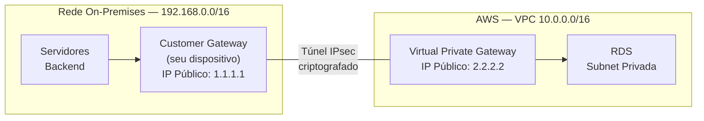
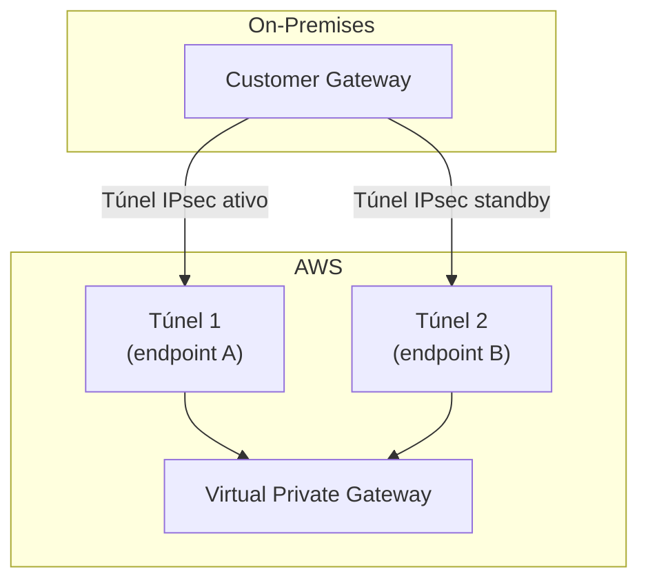
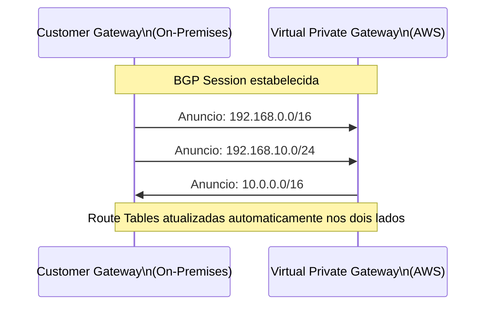
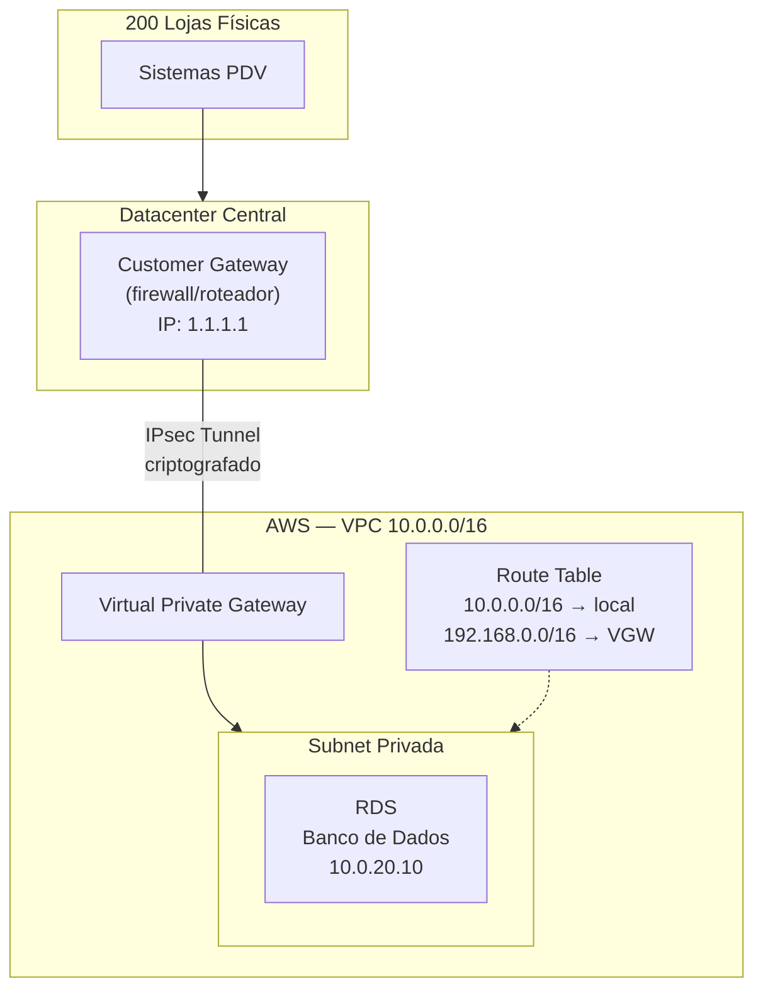

# 11 - VPN (Site-to-Site)

## 1. Explicação Técnica

Na nota de Load Balancers, a gente fechou o ciclo de como o tráfego público chega até os seus recursos dentro da VPC. Mas e o movimento contrário? E quando o tráfego precisa vir de um datacenter corporativo, de uma rede on-premises, de um escritório que sua empresa já tem rodando há anos? Como você conecta esses dois mundos de forma segura sem expor seus recursos à internet?

Pensa assim: a VPN é como um **túnel subterrâneo entre dois prédios**. Do lado de fora, quem olhar vai ver só o chão. Quem transita dentro do túnel passa de um prédio ao outro com total privacidade, sem ser visto nem interceptado. E os dois prédios continuam sendo acessados pela rua normal para tudo o mais. Você não fechou a rua. Só construiu um canal privado entre eles.

Tecnicamente, o **Site-to-Site VPN** cria um túnel **IPsec criptografado** entre a sua rede on-premises e a sua VPC na AWS. O tráfego dentro do túnel é criptografado ponta a ponta. A internet continua sendo a infraestrutura por baixo, mas ninguém consegue interceptar o conteúdo.

Esse é o ponto que mais confunde e mais cai na prova: **a VPN ainda usa a internet pública como meio de transporte**. Ela criptografa o tráfego, mas não elimina a dependência da internet. Não é um link dedicado. Isso tem consequências diretas em latência, throughput e disponibilidade.

---

## 2. Os Dois Componentes da VPN

Para que o túnel exista, você precisa de um componente de cada lado da conexão:

### Virtual Private Gateway (VGW)

É o componente **do lado AWS**. Ele fica anexado à sua VPC e representa o ponto de entrada do túnel dentro do ambiente cloud. Você não gerencia hardware, não gerencia instância. Ele simplesmente existe como um gateway gerenciado pela AWS.

### Customer Gateway (CGW)

É o componente **do lado on-premises**. Pode ser um dispositivo físico de rede (roteador, firewall, appliance de SD-WAN) ou um software rodando em uma máquina. Na AWS, você cria um recurso lógico chamado Customer Gateway que representa esse dispositivo: você registra o IP público do seu equipamento on-premises, e a AWS sabe para onde estabelecer o túnel.

Entre o VGW e o CGW, a AWS estabelece automaticamente **dois túneis IPsec**, cada um em um endpoint diferente do lado AWS. Por que dois? Alta disponibilidade. Se um túnel cair, o tráfego continua pelo outro.

---

## 3. Alta Disponibilidade - Os Dois Túneis por Padrão

Esse detalhe é menos óbvio, mas a prova adora cobrar: cada conexão Site-to-Site VPN cria **dois túneis IPsec automaticamente**, em dois endpoints distintos do Virtual Private Gateway.

A AWS recomenda que você configure seu dispositivo on-premises para usar os dois túneis ativamente (modo ativo-ativo), o que dobra o throughput disponível. Se o seu equipamento não suporta isso, ele pode usar o modo ativo-passivo: um túnel ativo e o outro como failover automático.

O ponto arquitetural aqui: **redundância é embutida sem custo adicional**. Você não pede, ela vem por padrão.

---

## 4. VPN Routing - Static vs BGP

Como o tráfego sabe o caminho? Como um pacote saindo da sua VPC `10.0.0.0/16` sabe que precisa ir pelo VGW até a rede on-premises `192.168.0.0/16`?

A resposta está nas Route Tables que você já conhece. Você precisa adicionar uma rota na Route Table da subnet apontando a rede on-premises para o VGW como target. Mas existem duas formas de fazer isso:

### Static Routing

Você define as rotas manualmente. Cadastra os CIDRs das redes on-premises que devem ser alcançadas pelo túnel e aponta para o VGW. Simples, previsível, zero configuração adicional.

A desvantagem: qualquer mudança de topologia on-premises (uma nova subnet criada, um range alterado) exige que você atualize as tabelas manualmente. Não escala bem em redes complexas.

### Dynamic Routing com BGP

O **BGP (Border Gateway Protocol)** é o protocolo de roteamento que conecta a internet. Com ele habilitado entre o VGW e o CGW, os dois lados trocam informações de rota automaticamente. Uma nova subnet criada on-premises é propagada para a AWS sem intervenção manual. Uma rota que some é removida automaticamente.

| Característica | Static Routing | Dynamic Routing (BGP) |
|----------------|---------------|----------------------|
| Configuração | Manual | Automática |
| Escala | Pequenas redes, topologia estável | Redes complexas, topologia dinâmica |
| Falha de rota | Sem detecção automática | Convergência automática |
| Complexidade | Baixa | Requer conhecimento de BGP |
| Uso na prova | Cenários simples | Cenários enterprise com múltiplas redes |

Para a prova SAP: sempre que o enunciado mencionar "automatic route propagation", "dynamic routing" ou cenários com múltiplas redes que mudam, pensa em BGP.

---

## 5. Custo da VPN

Nada na AWS é gratuito, e a VPN tem dois componentes de custo que você precisa saber:

| Componente | Detalhe |
|------------|---------|
| Taxa por hora de conexão | Cobrado enquanto o Virtual Private Gateway estiver ativo com a conexão estabelecida, independente de tráfego |
| Taxa por outbound data transfer | Dados saindo da AWS para a internet (ou seja, do VGW para o Customer Gateway) são cobrados. Tráfego de entrada (inbound) não é cobrado |

A regra é análoga ao que você viu no NAT Gateway: você paga pelo tempo e pelo tráfego de saída.

---

## 6. Limites do Virtual Private Gateway

A VPN tem limites técnicos que definem quando ela é suficiente e quando você precisa de outra solução:

| Limite | Valor |
|--------|-------|
| Bandwidth máximo por túnel | 1.25 Gbps |
| Pacotes por segundo (máximo) | 140.000 pps |
| MTU máxima | 1.466 bytes |

Fica ligado nesse ponto: o limite de 1.25 Gbps é **por túnel**, não por conexão VPN. Como cada conexão tem dois túneis, você pode potencialmente chegar a 2.5 Gbps, mas a AWS não garante agregação dos dois e o comportamento real depende do seu equipamento on-premises.

Se mesmo assim os limites não forem suficientes, você pode ter múltiplos Virtual Private Gateways ou múltiplas conexões VPN e fazer ECMP (Equal-Cost Multi-Path routing) para distribuir o tráfego. Mas isso já entra em cenários mais avançados.

---

## 7. Cenário Real Enterprise

Uma empresa de retail com 200 lojas físicas decidiu migrar o banco de dados centralizado para a AWS. O sistema de PDV (ponto de venda) de cada loja precisa continuar acessando o banco de dados, mas o time de segurança vetou expor o banco à internet.

A solução de primeiro momento: Site-to-Site VPN entre o datacenter central (que agrega as conexões das lojas) e a VPC na AWS.

O banco de dados fica numa subnet privada sem rota para internet. A Route Table da subnet tem uma entrada que aponta a rede do datacenter (`192.168.0.0/16`) para o VGW. O tráfego dos PDVs chega criptografado via IPsec e o banco nunca precisa ser exposto.

A ressalva que o arquiteto anota no design: se houver instabilidade na internet, a conexão VPN sofre. Para um primeiro momento de migração, esse trade-off é aceitável. Para produção de longo prazo, existe uma alternativa que vamos estudar mais à frente.

---

## 8. Quando Usar / Quando NÃO Usar

**Use Site-to-Site VPN** quando:

- Você precisa conectar on-premises à AWS de forma segura e rápida de provisionar (horas, não semanas)
- O orçamento não permite um link dedicado no curto prazo
- O throughput necessário cabe em 1.25 Gbps por túnel
- Você precisa de um caminho de failover para uma conexão dedicada que já existe
- O ambiente é de desenvolvimento ou homologação e não justifica custo de link dedicado

**Não use Site-to-Site VPN** quando:

- A aplicação exige latência consistente e previsível (VPN sobre internet é variável)
- O throughput de dados é muito alto e ultrapassa o limite de 1.25 Gbps por túnel
- Regulamentação ou compliance exigem que o tráfego nunca trafegue por redes públicas
- A disponibilidade da conexão é crítica e a variabilidade da internet é inaceitável

---

## 9. Trade-offs

| Dimensão | Site-to-Site VPN |
|----------|-----------------|
| Custo | Baixo. Paga por hora de conexão + outbound data |
| Velocidade de provisionamento | Alta. Configurado em horas |
| Latência | Variável. Depende da internet entre os dois pontos |
| Throughput máximo | 1.25 Gbps por túnel |
| Segurança do tráfego | Criptografado via IPsec, mas ainda trafega internet pública |
| Disponibilidade | Dois túneis por padrão para redundância |
| Escalabilidade | Limitada pelo throughput do túnel |
| Complexidade operacional | Baixa para static routing, média para BGP |

---

## 10. Pegadinhas Comuns da Prova

> **[PEGADINHA #1]** - *"VPN garante que o tráfego não passa pela internet pública?"*
> Não. VPN criptografa o tráfego, mas ainda usa a internet como infraestrutura. Se o enunciado pedir "conexão que não depende da internet pública", VPN não é a resposta correta.

> **[PEGADINHA #2]** - *"Cada conexão Site-to-Site VPN cria quantos túneis?"*
> Dois túneis IPsec, automaticamente, em endpoints distintos do Virtual Private Gateway. A redundância é embutida por padrão.

> **[PEGADINHA #3]** - *"O limite de 1.25 Gbps é por conexão VPN ou por túnel?"*
> Por túnel. Cada conexão tem dois túneis, então o throughput teórico máximo é 2.5 Gbps, mas a AWS não garante agregação automática dos dois.

> **[PEGADINHA #4]** - *"Qual protocolo de routing permite propagação automática de rotas na VPN?"*
> BGP. Se o enunciado mencionar "automatic route propagation" ou "dynamic routing", a resposta é BGP, não static routing.

> **[PEGADINHA #5]** - *"O Customer Gateway é criado pela AWS?"*
> Não. O CGW é o seu dispositivo on-premises (roteador, firewall). O que você cria na AWS é um recurso lógico que representa esse dispositivo, registrando seu IP público.

> **[PEGADINHA #6]** - *"VPN tem custo quando não está transferindo dados?"*
> Sim. A taxa por hora de conexão é cobrada enquanto o VGW estiver ativo, independente de tráfego.

> **[PEGADINHA #7]** - *"Posso usar a VPN como backup de uma conexão dedicada?"*
> Sim. Esse é um padrão muito cobrado no SAP: conexão dedicada como link principal e VPN como failover automático.

---

## 11. Resumo Final

O Site-to-Site VPN conecta sua rede on-premises à VPC usando dois componentes: o **Virtual Private Gateway** do lado AWS e o **Customer Gateway** do lado on-premises. Entre os dois, a AWS cria automaticamente **dois túneis IPsec** para redundância. O tráfego é criptografado, mas continua usando a internet pública como infraestrutura.

O roteamento pode ser **estático** (você define as rotas manualmente) ou **dinâmico com BGP** (rotas propagadas automaticamente). O custo é por hora de conexão mais outbound data transfer. O limite de throughput é de **1.25 Gbps por túnel**.

Para a prova: o que diferencia VPN de uma conexão dedicada é justamente o uso da internet pública. Se a questão exigir latência previsível, throughput alto garantido ou proibição de tráfego pela internet, a VPN não é a resposta.

---

## 12. Flashcards Rápidos

**Q: O que é o Virtual Private Gateway (VGW)?**
A: O componente AWS de uma Site-to-Site VPN. Fica anexado à VPC e representa o ponto de entrada do túnel IPsec do lado cloud.

**Q: O que é o Customer Gateway (CGW)?**
A: O dispositivo on-premises (roteador, firewall) que representa o ponto de saída do túnel. O que você cria na AWS é um recurso lógico registrando o IP público do seu equipamento.

**Q: Quantos túneis IPsec uma conexão Site-to-Site VPN cria por padrão?**
A: Dois túneis, em endpoints distintos do VGW, para alta disponibilidade automática.

**Q: A VPN usa internet pública ou link dedicado?**
A: Internet pública. O tráfego é criptografado via IPsec, mas ainda passa pela internet.

**Q: Qual protocolo habilita propagação automática de rotas na VPN?**
A: BGP (Border Gateway Protocol).

**Q: Qual o limite de throughput por túnel VPN?**
A: 1.25 Gbps.

**Q: Como a VPN é cobrada?**
A: Por hora de conexão ativa (VGW) + outbound data transfer (dados saindo da AWS).

**Q: VPN pode ser usada como backup de um link dedicado?**
A: Sim. É um padrão clássico de arquitetura: link dedicado como principal, VPN como failover automático.

**Q: Qual a diferença entre static routing e BGP na VPN?**
A: Static routing é manual e simples. BGP é dinâmico e propaga rotas automaticamente entre os dois lados do túnel. BGP é o correto para redes complexas e topologias que mudam.
