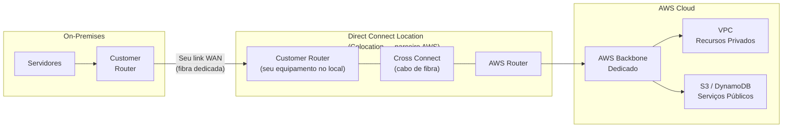
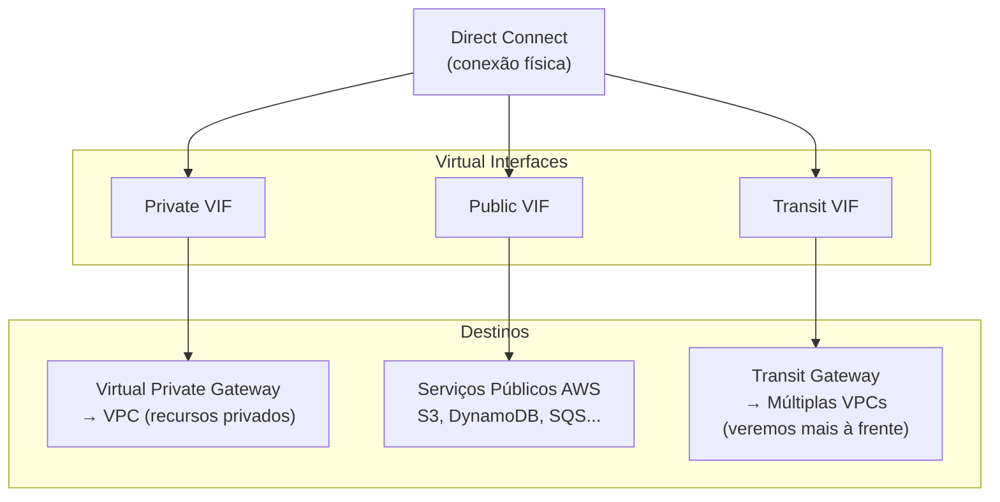
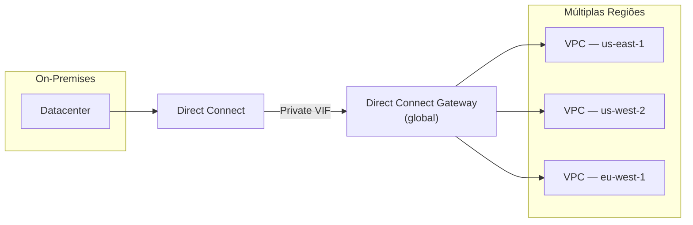
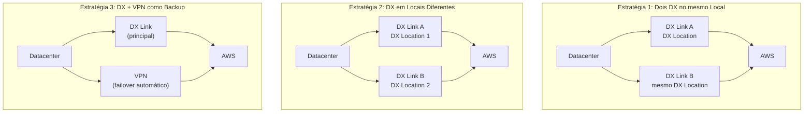
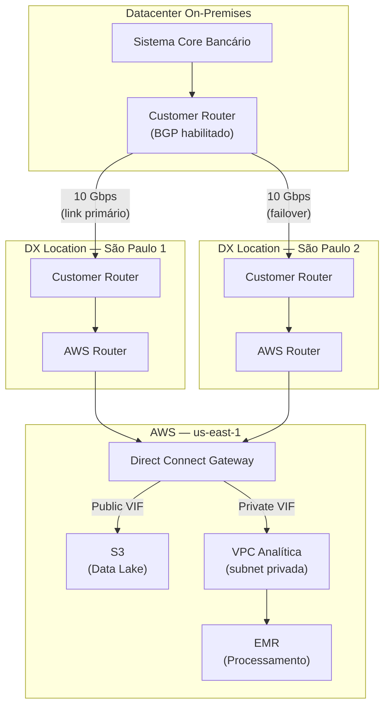

# 12 - Direct Connect (DX)

## 1. Explicação Técnica

Na nota da VPN, a gente viu que o túnel IPsec ainda usa a internet pública como infraestrutura. Criptografa o tráfego, mas a latência é variável, o throughput tem teto de 1.25 Gbps por túnel e você ainda está sujeito às instabilidades da internet. No final da nota, deixei uma ressalva: para cenários onde isso não é aceitável, existe uma alternativa. Chegou a hora de estudá-la.

Pensa assim: a VPN é como ligar dois escritórios usando a linha telefônica pública. O conteúdo da conversa é criptografado, mas a linha em si é compartilhada com todo mundo. O **Direct Connect** é quando você manda uma equipe de obras cavar um cabo de fibra óptica diretamente do seu datacenter até a infraestrutura da AWS. A linha é sua, exclusiva, e ninguém mais compartilha aquele meio físico.

Tecnicamente, o **AWS Direct Connect (DX)** é uma conexão de rede **dedicada e privada** entre o seu ambiente on-premises e a AWS. Ela não passa pela internet pública. O tráfego flui por um link físico exclusivo, o que garante latência consistente, throughput previsível e sem concorrência de banda com outros usuários da internet.

Esse é o contraste fundamental com a VPN que você precisa ter gravado para a prova: **VPN = internet pública criptografada. Direct Connect = link físico dedicado, sem internet**.

---

## 2. Arquitetura do Direct Connect

A conexão Direct Connect tem três componentes físicos e lógicos que precisam estar alinhados para funcionar:

### On-Premises: Customer Router

Do seu lado, você precisa de um **roteador compatível com BGP** (o protocolo que você viu na nota de VPN). Pode ser o mesmo roteador que você já usa para internet, ou um equipamento dedicado para a conexão DX. Ele é o ponto de saída da sua rede em direção à AWS.

### DX Location: O Ponto de Encontro

No meio do caminho existe um local chamado **Direct Connect Location** (ou DX Location). Pensa nele como um datacenter de colocation neutro, geralmente operado por um parceiro da AWS (Equinix, Cyxtera, Digital Realty e outros), onde a infraestrutura da AWS e a do cliente se encontram fisicamente.

Dentro de uma DX Location existem dois roteadores lado a lado:

- **Customer Router**: um equipamento que você (ou seu provedor de telecomunicações) instala no local, dedicado à sua conexão
- **AWS Router**: um roteador da AWS presente no mesmo local

A conexão física entre os dois é chamada de **Cross Connect**: literalmente um cabo de fibra óptica ligando a porta do seu Customer Router à porta do AWS Router dentro do mesmo rack ou sala. É isso que você está "comprando" quando adquire um Direct Connect: uma porta no AWS Router e o cabo que a conecta ao seu equipamento.

### AWS Cloud: A Saída para os Recursos

A partir do AWS Router, o tráfego flui pelo backbone dedicado da AWS até os recursos que você precisa acessar: recursos privados dentro de uma VPC ou serviços públicos como S3 e DynamoDB. Mas a forma como esse tráfego chega lá depende do tipo de **Virtual Interface** que você configurou, e é isso que veremos a seguir.

---

## 3. Virtual Interfaces (VIFs) - Como o Tráfego Chega aos Recursos

Aqui está o conceito que separa quem estudou de quem não estudou Direct Connect para o SAP. Não basta ter a conexão física. Você precisa criar **Virtual Interfaces (VIFs)** sobre ela para definir como e para onde o tráfego vai. São três tipos:

### Private VIF

Usada para acessar **recursos privados dentro de uma VPC** (EC2, RDS, qualquer coisa em subnet privada). O Private VIF se conecta a um **Virtual Private Gateway (VGW)** na sua VPC, que você já conhece da nota de VPN. Do ponto de vista da VPC, é como se o Direct Connect fosse uma VPN muito mais rápida e estável.

### Public VIF

Usada para acessar **serviços públicos da AWS** como S3, DynamoDB, SQS e qualquer endpoint público de serviço gerenciado. O tráfego vai do seu datacenter pelo DX até o backbone da AWS e chega nesses serviços sem jamais passar pela internet pública. Os serviços continuam sendo "públicos" por natureza, mas o caminho que o seu tráfego faz é privado.

### Transit VIF

Usada para conectar a uma **Transit Gateway**, que permite alcançar múltiplas VPCs através de uma única conexão DX. Esse é um tópico que vamos aprofundar mais à frente na jornada quando estudarmos conectividade entre VPCs em escala.

| Virtual Interface | Acessa | Componente AWS necessário |
|-------------------|--------|--------------------------|
| Private VIF | Recursos privados na VPC | Virtual Private Gateway (VGW) |
| Public VIF | Serviços públicos (S3, DynamoDB...) | Nenhum, acesso direto pelo backbone |
| Transit VIF | Múltiplas VPCs via Transit Gateway | Transit Gateway |

---

## 4. Dedicated vs Hosted Connections

Existem dois modelos de aquisição de Direct Connect, e a diferença vai muito além do preço:

### Dedicated Connection

Você tem uma porta física **exclusiva sua** no AWS Router, com capacidade de **1 Gbps, 10 Gbps ou 100 Gbps**. A conexão é solicitada diretamente para a AWS e provisionada especificamente para você. Nenhum outro cliente compartilha aquela porta.

O processo de instalação é mais demorado: envolve aprovação da AWS, instalação física no DX Location e configuração do Cross Connect com seu provedor. Tipicamente leva dias a semanas.

### Hosted Connection

Um **parceiro autorizado da AWS** (um provedor de telecomunicações ou um provedor de managed connectivity) já tem sua própria Dedicated Connection com a AWS. Ele subdivide essa capacidade e vende fatias para você. As capacidades disponíveis vão de **50 Mbps até 10 Gbps**.

O processo é mais rápido porque o parceiro já tem a infra montada. Você está comprando uma fração da capacidade dele.

| Característica | Dedicated Connection | Hosted Connection |
|----------------|---------------------|-------------------|
| Capacidade | 1, 10 ou 100 Gbps | 50 Mbps a 10 Gbps |
| Quem provisiona | AWS diretamente | Parceiro autorizado |
| Exclusividade | Porta física exclusiva | Capacidade compartilhada |
| Tempo de setup | Semanas | Mais rápido (dias) |
| VIFs disponíveis | Múltiplos VIFs | 1 VIF por vez |
| Ideal para | Grandes volumes, garantia total | Menor custo inicial, mais flexível |

---

## 5. Direct Connect Gateway - Um DX para Múltiplas VPCs

Aqui tem um detalhe arquitetural que muda bastante o design de redes enterprise. Por padrão, um Private VIF conecta o DX a um único VGW, que está associado a uma única VPC. Se você precisa acessar 10 VPCs diferentes pelo mesmo link DX, teria que criar 10 Private VIFs, o que é ineficiente e caro.

O **Direct Connect Gateway (DXGW)** resolve isso. Ele é um componente global que atua como um ponto de agregação: você conecta seu Private VIF a ele, e ele pode rotear tráfego para múltiplas VPCs em múltiplas regiões AWS.

Um único Private VIF, um único DXGW, e você alcança VPCs em qualquer região onde a AWS opera. Isso é o que faz a diferença em arquiteturas multi-região enterprise.

Importante: o DXGW não permite comunicação entre as VPCs entre si. Ele só conecta o DX às VPCs. Se VPC1 precisar falar com VPC2, isso é outro problema, outro serviço.

---

## 6. Alta Disponibilidade e Resiliência

Esse é um dos pontos mais cobrados no SAP quando o assunto é Direct Connect, porque o comportamento padrão do DX não tem redundância nenhuma.

Uma única conexão DX é um **Single Point of Failure**. Se o link físico cair, se o equipamento no DX Location falhar, se houver uma interrupção no DX Location em si: você perde a conectividade. E diferente do VPN que cria dois túneis por padrão, o DX não faz nada automaticamente.

Para ter resiliência real, você precisa de uma das estratégias abaixo:

| Estratégia | Proteção contra | Limitação |
|------------|-----------------|-----------|
| Dois DX no mesmo local | Falha de link físico | DX Location ainda é SPOF |
| DX em dois locais diferentes | Falha de link + falha do local | Custo mais alto |
| DX + VPN como backup | Falha total do DX | VPN usa internet (menor throughput) |

Para a prova SAP, o padrão **DX + VPN como backup** aparece muito. O DX é o link primário de alta capacidade e baixa latência, e a VPN entra automaticamente via BGP se o DX cair.

---

## 7. Custo do Direct Connect

O Direct Connect tem dois componentes de custo, análogos ao que você viu na VPN:

| Componente | Detalhe |
|------------|---------|
| Taxa por hora de porta | Cobrado por cada hora que a porta está provisionada, seja você usando ou não |
| Taxa por outbound data transfer | Dados saindo da AWS pelo DX são cobrados. O inbound não é cobrado. A taxa de outbound pelo DX é **significativamente menor** do que a taxa de outbound pela internet |

O segundo ponto é importante para decisão arquitetural: além de performance e segurança, para grandes volumes de dados o DX pode ser **mais barato** do que a transferência de dados pela internet convencional. Não é só custo de infraestrutura, o custo por GB transferido favorece o DX em escala.

---

## 8. Cenário Real Enterprise

Uma empresa de serviços financeiros fez uma migração parcial para a AWS. O core bancário ainda fica on-premises por requisitos regulatórios, mas toda a camada analítica e de relatórios foi movida para a AWS. Diariamente, são transferidos 5 TB de dados transacionais do datacenter on-premises para o data lake na AWS (S3).

Usar a internet pública para isso seria inviável em três dimensões: latência variável afetaria as janelas de processamento noturno, o custo de outbound data transfer pela internet para 5 TB/dia seria proibitivo, e o compliance do setor financeiro exige que dados sensíveis não trafeguem pela internet pública.

A solução: Direct Connect de 10 Gbps com dois links em DX Locations diferentes para resiliência, usando Public VIF para acessar o S3 diretamente pelo backbone da AWS.

5 TB de dados transacionais por dia, transferidos com latência consistente, via link dedicado que nunca toca a internet pública. A equipe de compliance aprova. A equipe de infra dorme tranquila.

---

## 9. Quando Usar / Quando NÃO Usar

**Use Direct Connect quando:**

- O compliance ou regulação proíbe que dados sensíveis trafeguem pela internet pública
- A latência precisa ser consistente e previsível (aplicações financeiras, trading, sistemas em tempo real)
- O throughput necessário supera os limites da VPN (mais de 1.25 Gbps por túnel)
- O volume de dados transferido é tão alto que o custo de outbound via internet supera o custo do DX
- Você quer garantia de largura de banda sem concorrência com outros usuários

**Não use Direct Connect quando:**

- O tempo de setup é crítico e você não pode esperar semanas pelo provisionamento
- O orçamento não comporta o custo de porta dedicada e do link WAN
- A conexão é temporária (prova de conceito, ambiente de teste com prazo curto)
- O throughput necessário cabe confortavelmente dentro dos limites da VPN e a variabilidade de latência é aceitável

---

## 10. Trade-offs

| Dimensão | Direct Connect | Site-to-Site VPN |
|----------|---------------|-----------------|
| Custo inicial | Alto (porta dedicada + link WAN) | Baixo |
| Custo em escala | Favorável para grandes volumes de dados | Pode ficar caro com alto outbound |
| Latência | Consistente e previsível | Variável (depende da internet) |
| Throughput | Até 100 Gbps (dedicated) | Até 1.25 Gbps por túnel |
| Tempo de setup | Semanas | Horas |
| Tráfego pela internet | Não. Link físico dedicado | Sim. IPsec sobre internet pública |
| Criptografia padrão | Não. Requer configuração adicional | Sim. IPsec criptografa por padrão |
| Redundância padrão | Nenhuma. Você precisa configurar | Dois túneis automáticos |
| Compliance/regulação | Ideal para dados sensíveis | Aceitável com criptografia |

---

## 11. Pegadinhas Comuns da Prova

> **[PEGADINHA #1]** - *"O Direct Connect criptografa o tráfego por padrão?"*
> Não. Diferente da VPN que usa IPsec, o Direct Connect não criptografa por padrão. O tráfego é privado porque o link é dedicado, mas não está criptografado. Para criptografia sobre DX, você pode configurar uma VPN sobre o próprio túnel DX, ou usar MACsec para criptografia na camada física.

> **[PEGADINHA #2]** - *"Uma conexão Direct Connect tem redundância automática como a VPN?"*
> Não. A VPN cria dois túneis por padrão. O DX não tem nenhuma redundância embutida. Um único link DX é um Single Point of Failure. Para HA, você precisa de múltiplos links ou de VPN como backup.

> **[PEGADINHA #3]** - *"Para acessar S3 pelo Direct Connect, preciso de um Virtual Private Gateway?"*
> Não. S3 é um serviço público. Para acessá-lo via DX, você usa um Public VIF, que conecta diretamente aos serviços públicos da AWS pelo backbone. O Virtual Private Gateway é necessário apenas para o Private VIF (recursos privados na VPC).

> **[PEGADINHA #4]** - *"O Direct Connect Gateway permite comunicação entre VPCs?"*
> Não. O DXGW conecta o DX a múltiplas VPCs, mas não cria comunicação entre as VPCs entre si. Cada VPC se comunica com o datacenter on-premises, mas não entre elas via DXGW.

> **[PEGADINHA #5]** - *"Uma Hosted Connection tem as mesmas opções de capacidade de uma Dedicated Connection?"*
> Não. Dedicated oferece 1, 10 ou 100 Gbps. Hosted oferece de 50 Mbps até 10 Gbps, em frações provisionadas pelo parceiro.

> **[PEGADINHA #6]** - *"O Direct Connect é um serviço regional?"*
> Não. O Direct Connect Gateway é global. Um único Private VIF conectado a um DXGW pode alcançar VPCs em múltiplas regiões AWS.

> **[PEGADINHA #7]** - *"O custo de outbound data transfer é o mesmo pelo DX e pela internet?"*
> Não. O custo de outbound pelo DX é consideravelmente menor do que pela internet pública. Para grandes volumes de dados, o DX pode ser economicamente mais vantajoso além de tecnicamente superior.

> **[PEGADINHA #8]** - *"A empresa precisa de criptografia e baixa latência garantida. DX puro resolve?"*
> Não completamente. DX garante baixa latência, mas não criptografia por padrão. A solução correta é DX com IPsec VPN por cima (VPN over DX) ou MACsec, combinando o melhor dos dois: link dedicado com criptografia.

---

## 12. Resumo Final

O Direct Connect é uma conexão física dedicada entre o seu datacenter on-premises e a AWS, que nunca passa pela internet pública. A arquitetura tem três peças: o seu Customer Router on-premises, um Customer Router instalado em um DX Location (colocation neutro), e o AWS Router no mesmo local conectado ao seu via Cross Connect.

Sobre essa conexão física, você cria **Virtual Interfaces**: Private VIF para alcançar recursos privados na VPC (via VGW), Public VIF para acessar serviços públicos como S3 pelo backbone da AWS. O **Direct Connect Gateway** permite que um único link DX alcance múltiplas VPCs em múltiplas regiões.

O contraste com a VPN é o coração do tema: DX tem latência consistente, throughput muito maior e tráfego que nunca toca a internet, mas não tem redundância automática e leva semanas para provisionar. A VPN é rápida, barata e tem dois túneis por padrão, mas depende da internet e tem throughput limitado.

Um detalhe que muita gente erra: **DX não criptografa por padrão**. O link é privado, mas não criptografado. Para compliance que exige os dois, combina-se DX com VPN ou MACsec por cima.

---

## 13. Flashcards Rápidos

**Q: Qual a diferença fundamental entre Direct Connect e VPN?**
A: VPN usa a internet pública com criptografia IPsec. Direct Connect usa um link físico dedicado que nunca passa pela internet, com latência consistente e throughput muito maior.

**Q: O que é um DX Location?**
A: Um datacenter de colocation neutro (geralmente operado por um parceiro, não pela AWS) onde o Customer Router do cliente e o AWS Router ficam fisicamente no mesmo local. O Cross Connect é o cabo que os une.

**Q: O Direct Connect criptografa o tráfego por padrão?**
A: Não. O link é privado e dedicado, mas não está criptografado. Para criptografia, use VPN sobre DX ou MACsec.

**Q: Quais são os três tipos de Virtual Interface (VIF)?**
A: Private VIF (recursos privados na VPC via VGW), Public VIF (serviços públicos como S3 via backbone), Transit VIF (Transit Gateway para múltiplas VPCs).

**Q: Para que serve o Direct Connect Gateway?**
A: Permite que um único Private VIF conectado ao DX alcance múltiplas VPCs em múltiplas regiões, sem precisar criar um VIF por VPC.

**Q: O DX tem redundância automática como a VPN?**
A: Não. Um único DX é um Single Point of Failure. Para HA, você precisa de dois links DX ou DX + VPN como failover.

**Q: Qual a capacidade de uma Dedicated Connection?**
A: 1 Gbps, 10 Gbps ou 100 Gbps.

**Q: Qual a vantagem de custo do Direct Connect em escala?**
A: O custo de outbound data transfer pelo DX é menor do que pela internet pública. Para grandes volumes de dados, o DX pode ser mais econômico além de tecnicamente superior.

**Q: Para acessar S3 via Direct Connect, qual VIF usar?**
A: Public VIF. S3 é um serviço público e o Public VIF acessa diretamente pelo backbone da AWS sem precisar de VGW.

**Q: Qual o padrão de HA mais cobrado no SAP envolvendo Direct Connect?**
A: DX como link principal com VPN como failover automático via BGP. O DX cai, o BGP redireciona para a VPN automaticamente.
