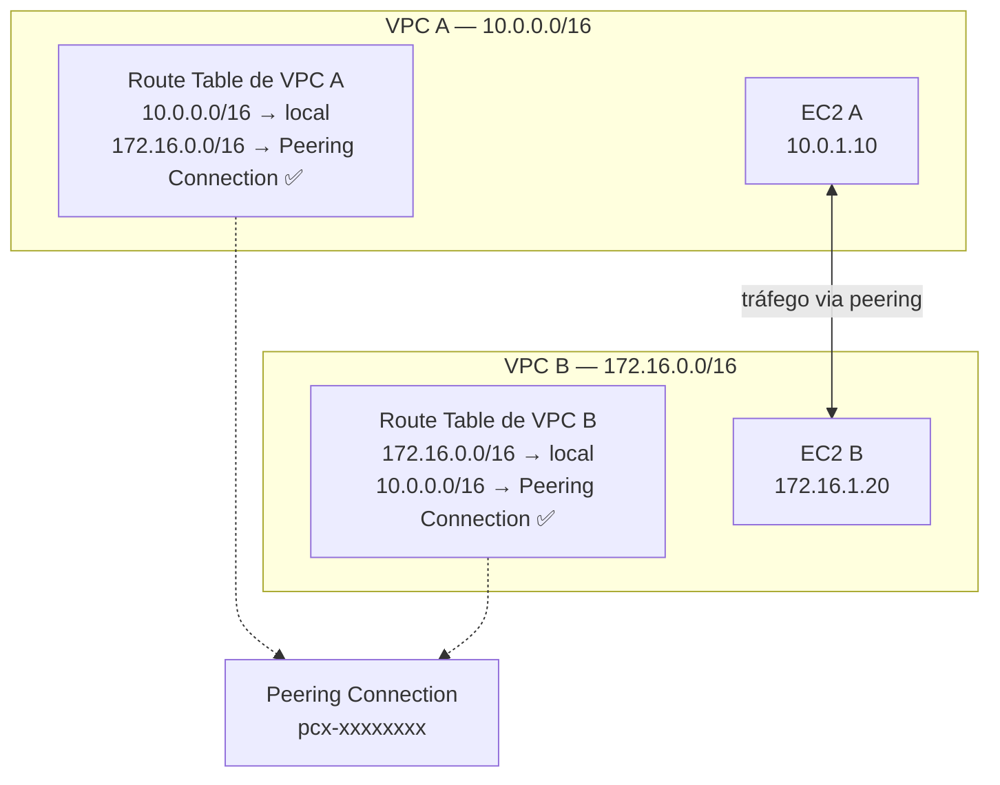
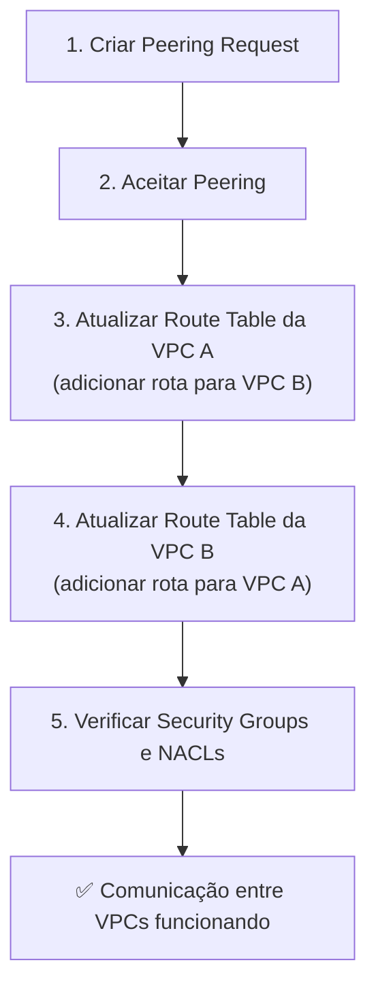
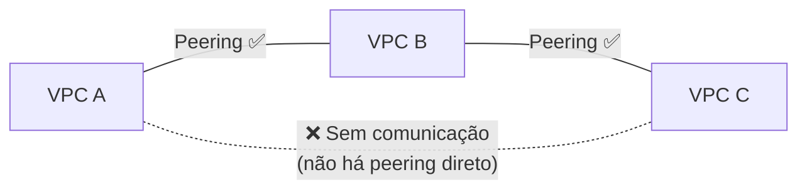
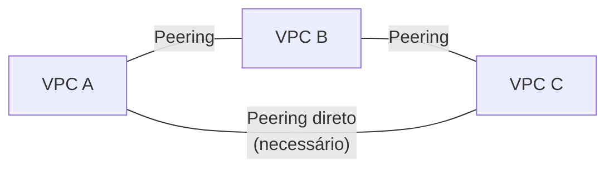
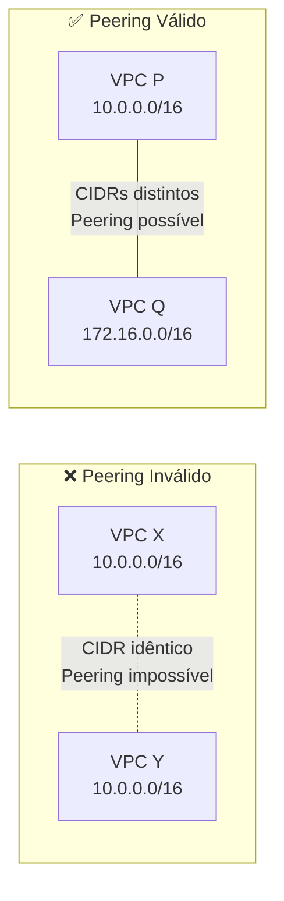
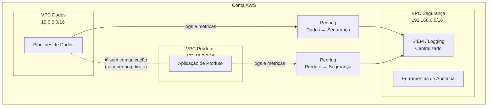

# 13 - VPC Peering

## 1. Explicação Técnica

Lá na primeira nota, quando a gente definiu o que é uma VPC, ficou gravado um princípio fundamental: **VPCs são ilhas. Elas não se comunicam por padrão**. Isso é uma feature de segurança, não um bug. Mas em algum momento da sua jornada de arquitetura, você vai precisar ligar duas dessas ilhas. Talvez você tenha uma VPC de produção e uma de desenvolvimento e precise que elas compartilhem um serviço interno. Talvez sua empresa adquiriu outra empresa e agora o time de infra está de frente com duas contas AWS separadas que precisam se falar.

O **VPC Peering** é a ponte que conecta duas ilhas.

Pensa assim: imagine dois condomínios fechados, cada um com suas próprias regras, suas próprias guaritas, seus próprios moradores. Por padrão, ninguém de um condomínio entra no outro. O VPC Peering é como assinar um acordo formal entre os dois: a guarita de cada um recebe a lista do outro e o tráfego autorizado pode circular entre os dois. Mas, e isso é importante, **nenhum terceiro condomínio pega carona nessa autorização**. O acordo é estritamente bilateral.

Tecnicamente, o VPC Peering cria uma **conexão de rede ponto a ponto entre duas VPCs**, permitindo que os recursos das duas se comuniquem usando endereços IP privados. O tráfego viaja pela infraestrutura da AWS e nunca passa pela internet pública, nem passa por gateways de internet, nem por VPNs.

---

## 2. Configuração do Peering - Os Três Passos

Criar um VPC Peering não é só clicar em um botão. Existem três etapas que precisam acontecer para o tráfego realmente fluir:

### Passo 1: Solicitação e Aceite

O dono da VPC solicitante envia um **Peering Request** para a VPC de destino. Se as VPCs são de contas diferentes, o dono da outra conta precisa aceitar explicitamente. Se for a mesma conta, você mesmo pode aceitar.

Enquanto o aceite não acontece, a conexão fica em estado `pending-acceptance`. Nenhum tráfego flui.

### Passo 2: Atualizar Route Tables nos Dois Lados

Esse é o passo que mais gente esquece e que mais cai na prova. **A conexão de peering sozinha não faz nada.** Você precisa adicionar rotas nas Route Tables de cada VPC apontando o CIDR da outra VPC para a conexão de peering.

Se você atualizar a Route Table apenas de um lado, o tráfego vai em uma direção mas não volta. Ambos os lados precisam ser atualizados.

### Passo 3: Verificar Security Groups e NACLs

O Peering abre o caminho de roteamento, mas as regras de firewall ainda se aplicam. Os Security Groups das instâncias e as NACLs das subnets continuam filtrando o tráfego normalmente. Se o Security Group do EC2_B não permitir tráfego de `10.0.0.0/16`, o pacote vai ser bloqueado mesmo com o peering funcionando.

---

## 3. Sem Peering Transitivo - A Regra Mais Importante

Esse é o conceito mais cobrado do VPC Peering no SAP. Fica esse ponto gravado porque ele derruba muita gente.

**O VPC Peering não é transitivo.** Isso quer dizer: se a VPC A tem peering com a VPC B, e a VPC B tem peering com a VPC C, a VPC A **não consegue se comunicar com a VPC C** por causa disso.

Pensa no acordo dos condomínios: o condomínio A assinou um acordo com o B, e o B assinou um acordo com o C. Isso não significa que o A tem livre acesso ao C. São acordos bilaterais independentes.

Para que A se comunique com C, você precisa criar um peering direto entre A e C.

Agora pensa no que isso significa em escala. Se você tem **N VPCs** que precisam se comunicar entre si, você precisa de **N × (N - 1) / 2** conexões de peering. Para 10 VPCs: 45 peerings. Para 20 VPCs: 190 peerings. O gerenciamento vira um pesadelo operacional. É exatamente por isso que para redes com muitas VPCs existe uma alternativa que vamos estudar mais à frente na jornada.

---

## 4. Restrições do VPC Peering

Além da não transitividade, existem outras restrições que você precisa conhecer:

### CIDRs Não Podem se Sobrepor

Duas VPCs com blocos CIDR que se sobrepõem não podem fazer peering. A AWS não consegue rotear o tráfego de forma determinística se os dois lados têm endereços iguais.

Esse é um dos argumentos mais fortes para planejar os CIDRs das VPCs com cuidado desde o início, que a gente já viu na nota de VPC.

### Uma Conexão de Peering por Par

Você não pode criar múltiplos peerings entre o mesmo par de VPCs. É uma conexão por par, sempre.

### Edge-to-Edge Routing Não Funciona

Isso é uma restrição mais avançada, mas muito cobrada no SAP. Se a VPC B tem um Internet Gateway e a VPC A faz peering com a VPC B, o tráfego da VPC A **não pode sair pela internet usando o IGW da VPC B**. O mesmo vale para VPNs, Direct Connect, NAT Gateways e Endpoints configurados na VPC B. Cada VPC precisa dos seus próprios gateways para acessar esses recursos.

Pensa assim: a ponte entre os condomínios não dá acesso à garagem de um para servir o outro.

---

## 5. Escopo do Peering - Onde Funciona

O VPC Peering funciona em três cenários diferentes:

| Cenário | Suportado | Observação |
|---------|-----------|------------|
| Mesma conta, mesma região | Sim | O mais simples e comum |
| Mesma conta, regiões diferentes | Sim | Inter-Region Peering |
| Contas diferentes, mesma região | Sim | Cross-Account Peering |
| Contas diferentes, regiões diferentes | Sim | Combinação dos dois |

Para o **Inter-Region VPC Peering**, o tráfego é criptografado pela AWS automaticamente no backbone. Ele não passa pela internet pública, mas existe uma latência adicional por conta da distância geográfica e pode haver custo de transferência de dados entre regiões além do custo de transferência entre AZs.

---

## 6. Custo do VPC Peering

| Componente | Custo |
|------------|-------|
| Criação da conexão de peering | Gratuito |
| Transferência de dados na mesma AZ | Gratuito |
| Transferência de dados entre AZs (mesma região) | Cobrado por GB |
| Transferência de dados entre regiões | Cobrado por GB (taxa de inter-região) |

O ponto de atenção aqui é arquitetural: se você tem duas instâncias em VPCs diferentes mas na mesma AZ, a transferência é gratuita. Mas se elas estão em AZs diferentes, mesmo dentro da mesma região, você paga por GB transferido. Isso influencia onde você coloca recursos em ambientes com muito tráfego cross-VPC.

---

## 7. Cenário Real Enterprise

Uma empresa de tecnologia tem três unidades de negócio que operam de forma semi-independente dentro da mesma conta AWS: uma equipe de dados, uma equipe de produto e uma equipe de segurança. Cada unidade tem sua própria VPC com CIDRs planejados sem sobreposição.

A equipe de segurança opera uma VPC com ferramentas centralizadas de monitoramento e logging que as outras duas precisam acessar. A equipe de dados e a equipe de produto não precisam se comunicar entre si.

Dois peerings, não três. A topologia reflete exatamente o que o negócio precisa: cada unidade fala com segurança, mas isoladas entre si. O planejamento de CIDRs sem sobreposição feito desde o início tornou isso possível.

---

## 8. Quando Usar / Quando NÃO Usar

**Use VPC Peering quando:**

- Você tem duas ou poucas VPCs que precisam se comunicar de forma estável
- O número de pares de VPCs é pequeno e gerenciável (até 5 ou 10 peerings)
- Você precisa de conectividade cross-account entre times ou unidades de negócio
- O cenário é de "shared services" onde uma VPC central é acessada por algumas VPCs satélites
- Você quer comunicação sem custo adicional de gateway e com baixa latência dentro da mesma AZ

**Não use VPC Peering quando:**

- Você tem muitas VPCs que todas precisam se comunicar entre si (cresce exponencialmente)
- As VPCs têm CIDRs sobrepostos (peering é impossível nesse caso)
- Você precisa de roteamento transitivo (A fala com B que fala com C e A precisa falar com C sem peering direto)
- O número de peerings começa a dificultar o gerenciamento de route tables e regras de SG

---

## 9. Trade-offs

| Dimensão | VPC Peering |
|----------|-------------|
| Custo de setup | Gratuito |
| Custo de tráfego | Grátis na mesma AZ, cobrado entre AZs e regiões |
| Latência | Baixa (infraestrutura interna da AWS) |
| Escalabilidade | Baixa: cresce N×(N-1)/2 com o número de VPCs |
| Complexidade operacional | Baixa para poucos pares, alta para muitas VPCs |
| Transitividade | Não suportada |
| CIDRs sobrepostos | Não suportado |
| Escopo | Mesma ou diferentes contas e regiões |
| Segurança | Tráfego nunca passa pela internet pública |

---

## 10. Pegadinhas Comuns da Prova

> **[PEGADINHA #1]** - *"VPC A tem peering com VPC B, e VPC B tem peering com VPC C. VPC A consegue acessar VPC C?"*
> Não. O VPC Peering não é transitivo. Para A acessar C, você precisa de um peering direto entre A e C.

> **[PEGADINHA #2]** - *"Criar a conexão de peering é suficiente para o tráfego fluir?"*
> Não. Você precisa criar a conexão de peering, aceitar o request E atualizar as Route Tables dos dois lados para apontar o CIDR da outra VPC para a conexão. E ainda garantir que Security Groups e NACLs permitem o tráfego.

> **[PEGADINHA #3]** - *"Posso fazer peering entre duas VPCs com o CIDR 10.0.0.0/16?"*
> Não. CIDRs sobrepostos impedem o peering. As duas VPCs precisam ter blocos de endereço distintos e sem sobreposição.

> **[PEGADINHA #4]** - *"Se a VPC B tem um Internet Gateway, a VPC A pode usar esse IGW via peering para acessar a internet?"*
> Não. Edge-to-edge routing não é suportado. Cada VPC precisa do seu próprio IGW, NAT Gateway, VPN ou Direct Connect. Gateways não são compartilhados via peering.

> **[PEGADINHA #5]** - *"A transferência de dados entre VPCs com peering é sempre gratuita?"*
> Não. Só é gratuita quando as instâncias estão na mesma AZ. Transferência entre AZs e entre regiões tem custo por GB.

> **[PEGADINHA #6]** - *"Posso criar dois peerings entre as mesmas duas VPCs?"*
> Não. Uma conexão de peering por par de VPCs. Não é possível duplicar.

> **[PEGADINHA #7]** - *"Para 5 VPCs se comunicarem entre si, quantos peerings são necessários?"*
> 10. A fórmula é N × (N-1) / 2. Para 5 VPCs: 5 × 4 / 2 = 10 peerings.

> **[PEGADINHA #8]** - *"O tráfego no Inter-Region VPC Peering passa pela internet pública?"*
> Não. O tráfego inter-região via peering viaja pelo backbone da AWS e é criptografado automaticamente. Mas há custo adicional de transferência entre regiões.

---

## 11. Resumo Final

O VPC Peering cria uma conexão ponto a ponto entre duas VPCs, permitindo que recursos se comuniquem usando IPs privados sem passar pela internet. Funciona dentro da mesma conta, entre contas diferentes, na mesma região ou entre regiões.

Para funcionar de verdade, você precisa de três coisas: a conexão aceita, as Route Tables atualizadas nos dois lados e os Security Groups e NACLs liberando o tráfego.

A regra mais importante é a **não transitividade**: peering é sempre bilateral e direto. Se A fala com B e B fala com C, A não fala com C automaticamente. Para N VPCs em full mesh você precisa de N × (N - 1) / 2 peerings, o que cresce rapidamente e se torna inviável em redes grandes. Para esses cenários, existe uma alternativa que vamos estudar mais à frente.

Uma última restrição que o SAP adora cobrar: **CIDRs sobrepostos impedem peering** e **gateways não são compartilhados via peering** (edge-to-edge routing não funciona).

---

## 12. Flashcards Rápidos

**Q: O VPC Peering é transitivo?**
A: Não. Se A tem peering com B e B tem peering com C, A não consegue falar com C. Peering é sempre ponto a ponto e bilateral.

**Q: Quais são os três passos para o tráfego fluir via peering?**
A: (1) Criar a conexão e aceitar o request. (2) Atualizar as Route Tables nos dois lados. (3) Garantir que Security Groups e NACLs permitem o tráfego.

**Q: Posso fazer peering entre VPCs com CIDRs sobrepostos?**
A: Não. Os blocos de IP precisam ser completamente distintos.

**Q: Quantos peerings são necessários para 6 VPCs se comunicarem em full mesh?**
A: 15. Fórmula: N × (N-1) / 2 = 6 × 5 / 2 = 15.

**Q: Edge-to-edge routing funciona via VPC Peering?**
A: Não. Gateways (IGW, NAT, VPN, DX) de uma VPC não podem ser usados por outra VPC via peering.

**Q: A transferência de dados via peering na mesma AZ tem custo?**
A: Não. É gratuita. Entre AZs e entre regiões, há custo por GB.

**Q: VPC Peering funciona entre contas AWS diferentes?**
A: Sim. A conta solicitante envia o request e a conta de destino precisa aceitar explicitamente.

**Q: O tráfego no Inter-Region VPC Peering passa pela internet pública?**
A: Não. Viaja pelo backbone da AWS e é criptografado automaticamente.

**Q: Posso criar dois peerings entre as mesmas duas VPCs?**
A: Não. Uma conexão de peering por par de VPCs.
