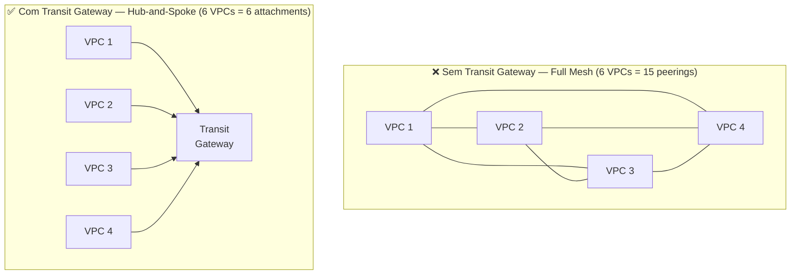
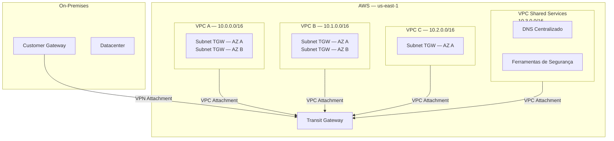
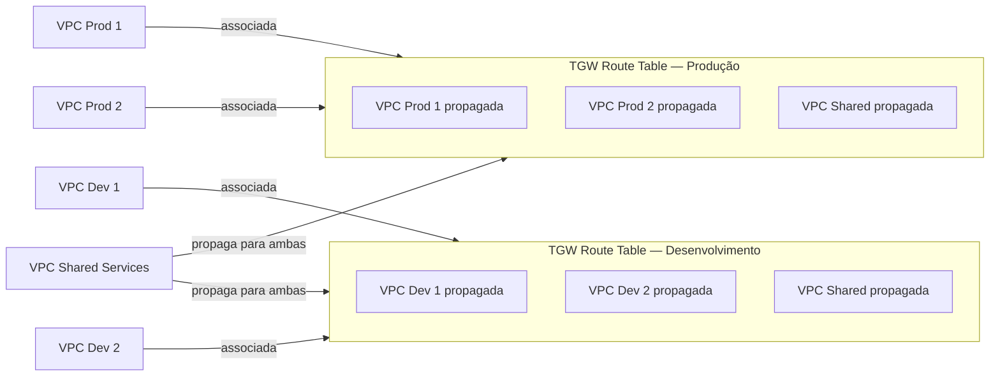
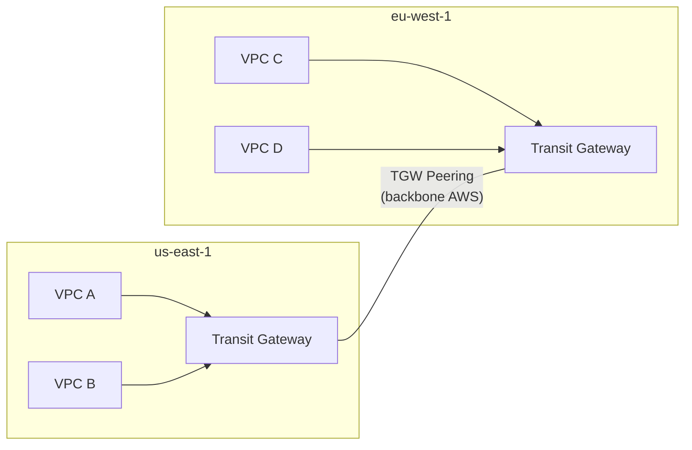
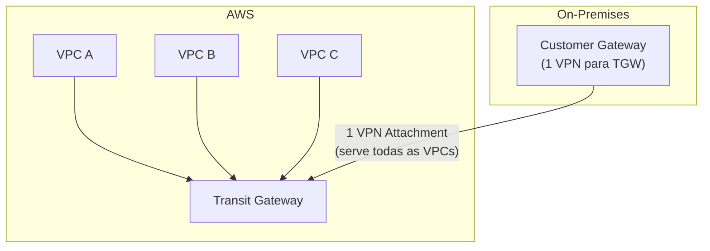
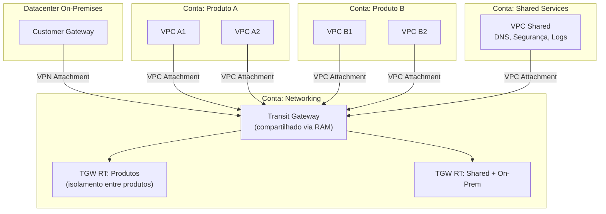

# 14 - Transit Gateway (TGW)

## 1. Explicação Técnica

Na nota de VPC Peering, a gente terminou com um alerta: para N VPCs se comunicarem em full mesh, você precisa de N × (N-1) / 2 peerings. Para 10 VPCs, são 45 peerings. Para 50 VPCs, são 1.225. Cada peering com Route Tables a configurar nos dois lados, Security Groups a ajustar, e sem nenhuma transitividade. Fica ingovernável muito rápido. E nem estamos falando ainda da conectividade on-premises: sem o TGW, você precisaria de uma VPN ou Direct Connect separada para cada VPC.

Pensa assim: imagina uma cidade sem rodovias. Cada bairro que precisa se conectar a outro tem que construir uma rua direta entre eles. Para 10 bairros em full mesh, são 45 ruas. Para 50 bairros, são 1.225 ruas. O caos é absoluto. O **Transit Gateway** é a **rodovia central** da cidade: todos os bairros constroem uma única rua até a rodovia, e a rodovia se encarrega de conectar todo mundo. Uma conexão por bairro, N bairros, total de N conexões.

Tecnicamente, o **AWS Transit Gateway (TGW)** é um hub de roteamento regional que atua como ponto central de conectividade entre VPCs, redes on-premises via VPN e Direct Connect, e até outros Transit Gateways em outras regiões. Ele suporta **roteamento transitivo**: se A está conectado ao TGW e C está conectado ao TGW, A pode falar com C sem nenhum peering direto entre eles.

---

## 2. Arquitetura Hub-and-Spoke

O modelo arquitetural do Transit Gateway é o **hub-and-spoke**: o TGW é o hub central e cada VPC ou rede conectada é um spoke. Todo tráfego passa pelo hub, que decide para onde encaminhar baseado nas suas próprias Route Tables.

Para conectar uma VPC ao TGW, você cria um **Attachment**. No caso de VPCs, você especifica quais subnets em quais AZs o TGW pode usar para rotear tráfego. A recomendação da AWS é ter uma subnet dedicada para o TGW em cada AZ que você usa, porque o TGW só consegue rotear tráfego para os recursos nas AZs onde ele tem subnets configuradas.

---

## 3. Tipos de Attachment

O Transit Gateway aceita conexões de diferentes fontes, e cada tipo de conexão é chamado de **attachment**:

| Tipo de Attachment | Conecta o TGW a | Uso principal |
|--------------------|-----------------|---------------|
| VPC Attachment | Uma VPC (subnets por AZ) | Conectividade entre VPCs |
| VPN Attachment | Uma conexão Site-to-Site VPN | On-premises via internet |
| Direct Connect Attachment | DX via Transit VIF | On-premises via link dedicado |
| TGW Peering Attachment | Outro Transit Gateway (outra região/conta) | Conectividade cross-região |
| Connect Attachment | Appliances SD-WAN de terceiros | Redes corporativas gerenciadas |

O poder dessa lista é o que ela resolve em relação ao modelo anterior: com o VPC Peering puro, você precisava de uma VPN por VPC para conectar on-premises. Com o TGW, **uma única VPN conectada ao TGW serve todas as VPCs** anexadas a ele.

---

## 4. Route Tables do Transit Gateway

Esse é o conceito mais profundo do TGW e o que separa uma arquitetura básica de uma arquitetura segura de verdade. O TGW não usa as Route Tables das suas VPCs para tomar decisões de roteamento. Ele tem as suas próprias **TGW Route Tables**.

Cada attachment é **associado** a uma TGW Route Table. Quando um pacote chega ao TGW por um attachment, o TGW consulta a Route Table associada àquele attachment para decidir para onde encaminhar o tráfego.

As rotas dentro da TGW Route Table vêm de duas fontes:

**Propagação automática (propagation):** quando você habilita a propagação de um attachment, o TGW aprende automaticamente o CIDR daquele attachment e adiciona à Route Table. Se o CIDR da VPC A mudar, o TGW se atualiza.

**Rotas estáticas:** você adiciona manualmente, útil para casos específicos como rota default apontando para uma appliance de segurança.

### Isolamento com Múltiplas TGW Route Tables

Aqui está o recurso mais cobrado no SAP quando o assunto é TGW. Por padrão, todos os attachments compartilham a mesma Route Table e todos se enxergam. Mas você pode criar **múltiplas TGW Route Tables** para isolar grupos de VPCs.

Exemplo clássico: VPCs de produção não podem falar com VPCs de desenvolvimento, mas ambas precisam acessar a VPC de serviços compartilhados.

VPC Prod 1 e VPC Prod 2 se enxergam. VPC Dev 1 e VPC Dev 2 se enxergam. Mas nenhuma VPC de produção enxerga as VPCs de desenvolvimento e vice-versa. Todas acessam a VPC Shared Services. Isso é **isolamento de rede com serviços compartilhados**, e é exatamente o modelo que enterprises usam.

---

## 5. TGW entre Regiões e Contas

### TGW Peering entre Regiões

O Transit Gateway é um recurso regional. Se você precisa de conectividade entre VPCs em regiões diferentes, pode criar um **TGW Peering** entre dois Transit Gateways, um em cada região. O tráfego vai pelo backbone da AWS, sem passar pela internet pública, mas você precisa configurar rotas estáticas manualmente nos dois lados (não há propagação automática em peerings inter-região).

### TGW entre Contas com RAM

Para compartilhar um TGW entre contas AWS, a AWS usa o **Resource Access Manager (RAM)**. O dono do TGW compartilha o recurso via RAM, e as outras contas podem criar attachments nele como se o TGW fosse delas. Isso é fundamental para arquiteturas multi-account enterprise, onde um TGW central é mantido por uma conta de networking dedicada.

---

## 6. TGW + On-Premises: VPN e Direct Connect Centralizados

Esse é um dos grandes benefícios do TGW que o SAP adora cobrar em comparação com o modelo anterior.

**Modelo antigo (sem TGW):** cada VPC que precisava de acesso on-premises tinha sua própria conexão VPN com um VGW dedicado. 10 VPCs significavam 10 VGWs e 10 conexões VPN no seu Customer Gateway on-premises. Uma bagunça operacional.

**Modelo com TGW:** uma única conexão VPN (ou Direct Connect via Transit VIF) é feita ao TGW. Todas as VPCs anexadas ao TGW automaticamente alcançam a rede on-premises. O Customer Gateway on-premises gerencia uma conexão, não dezenas.

O mesmo princípio vale para o Direct Connect: um Transit VIF conectado ao TGW serve todas as VPCs, eliminando a necessidade de múltiplos Private VIFs com VGWs separados.

---

## 7. Custo do Transit Gateway

O TGW tem dois componentes de custo que precisam entrar no seu raciocínio arquitetural:

| Componente | Detalhe |
|------------|---------|
| Taxa por hora de attachment | Cobrado por cada hora que um attachment está ativo, independente de uso |
| Taxa por GB processado | Cobrado por cada gigabyte de dados que passa pelo TGW |

Fica ligado nesse ponto: **para poucas VPCs, o VPC Peering pode ser mais barato**. Se você tem apenas 2 ou 3 VPCs se comunicando, o custo de peering (grátis na mesma AZ, por GB entre AZs) pode ser menor do que o custo de múltiplos attachments mais o custo por GB do TGW. O TGW começa a valer economicamente conforme o número de VPCs cresce e a complexidade operacional do peering aumenta.

---

## 8. Cenário Real Enterprise

Uma empresa de tecnologia tem uma arquitetura multi-account na AWS: uma conta central de networking, 5 contas de produto com 3 VPCs cada, uma conta de segurança e um datacenter on-premises. Total de mais de 15 VPCs que precisam se comunicar com os serviços compartilhados e com o datacenter, mas as VPCs de produtos diferentes não podem se enxergar entre si.

Um único TGW na conta de networking, compartilhado via RAM com todas as outras contas. Uma única VPN para on-premises. Cada grupo de produto associado a uma TGW Route Table isolada. A VPC Shared Services propaga suas rotas para todas as Route Tables. O resultado: isolamento entre produtos, acesso universal aos serviços compartilhados e conectividade on-premises centralizada. Operacionalmente, você gerencia um TGW, não dezenas de peerings e VPNs.

---

## 9. Quando Usar / Quando NÃO Usar

**Use Transit Gateway quando:**

- Você tem muitas VPCs (mais de 5 a 10) que precisam de conectividade entre si
- Você precisa de conectividade on-premises que sirva múltiplas VPCs com uma única VPN ou Direct Connect
- Você precisa de isolamento granular entre grupos de VPCs com serviços compartilhados
- A sua arquitetura é multi-account e você precisa de um ponto central de roteamento
- Você precisa de conectividade cross-região entre múltiplas VPCs em escala

**Não use Transit Gateway quando:**

- Você tem apenas 2 ou 3 VPCs com comunicação simples, o VPC Peering é mais barato e mais simples
- O custo por attachment e por GB é inviável para o volume de tráfego esperado
- A latência adicional de passar pelo TGW é inaceitável para a aplicação (peering tem latência menor)

---

## 10. Trade-offs

| Dimensão | Transit Gateway | VPC Peering |
|----------|----------------|-------------|
| Escalabilidade | Alta: N attachments para N VPCs | Baixa: N×(N-1)/2 peerings |
| Transitividade | Suportada nativamente | Não suportada |
| Custo (poucas VPCs) | Mais caro (por attachment + GB) | Mais barato (grátis na mesma AZ) |
| Custo (muitas VPCs) | Mais eficiente em escala | Inviável operacionalmente |
| Complexidade operacional | Baixa: um hub central | Alta em redes grandes |
| Isolamento de tráfego | Múltiplas TGW Route Tables | Controlado por SGs e NACLs por par |
| Conectividade on-premises | Uma VPN/DX serve todas as VPCs | Uma VPN/DX por VPC |
| Latência | Levemente maior (hop extra no TGW) | Menor (sem hop intermediário) |
| CIDRs sobrepostos | Não suportado entre attachments | Não suportado |
| Multi-account | Via RAM (nativo) | Suportado, mas sem hub central |

---

## 11. Pegadinhas Comuns da Prova

> **[PEGADINHA #1]** - *"O Transit Gateway suporta roteamento transitivo entre VPCs?"*
> Sim. Esse é o diferencial central do TGW em relação ao VPC Peering. Se VPC A e VPC B estão ambas conectadas ao TGW, elas se comunicam automaticamente via o TGW, sem peering direto.

> **[PEGADINHA #2]** - *"Uma VPN conectada ao Transit Gateway serve automaticamente todas as VPCs conectadas a ele?"*
> Sim, desde que as rotas estejam configuradas nas TGW Route Tables. Esse é o grande ganho em relação ao modelo de uma VPN por VPC.

> **[PEGADINHA #3]** - *"O Transit Gateway é um recurso regional ou global?"*
> Regional. Cada TGW existe em uma região. Para conectividade cross-região, você usa TGW Peering entre dois TGWs em regiões diferentes.

> **[PEGADINHA #4]** - *"Como compartilhar um Transit Gateway entre contas AWS?"*
> Via Resource Access Manager (RAM). O dono do TGW compartilha o recurso e as outras contas criam attachments nele.

> **[PEGADINHA #5]** - *"O que acontece se você não configurar subnets em todas as AZs para um VPC Attachment?"*
> O TGW só roteia tráfego para as AZs onde tem subnets configuradas. Recursos em AZs sem subnet TGW não receberão tráfego roteado pelo TGW.

> **[PEGADINHA #6]** - *"VPCs com CIDRs sobrepostos podem se conectar ao mesmo TGW?"*
> Não. Assim como no VPC Peering, CIDRs sobrepostos impedem o roteamento correto e o TGW não aceita attachments com CIDRs conflitantes.

> **[PEGADINHA #7]** - *"Com TGW, a empresa precisa de uma VPN por VPC para conectar on-premises?"*
> Não. Uma única VPN (ou DX via Transit VIF) conectada ao TGW serve todas as VPCs anexadas a ele. É um dos maiores benefícios operacionais do TGW.

> **[PEGADINHA #8]** - *"Como isolar grupos de VPCs no TGW para que produção não veja desenvolvimento?"*
> Criando múltiplas TGW Route Tables e associando cada grupo de VPCs a uma Route Table diferente. Rotas de uma RT não são visíveis para outra a menos que você configure explicitamente.

> **[PEGADINHA #9]** - *"O TGW Peering entre regiões suporta propagação automática de rotas?"*
> Não. Em TGW Peering entre regiões, as rotas precisam ser adicionadas manualmente como rotas estáticas. Propagação automática só funciona dentro da mesma região.

> **[PEGADINHA #10]** - *"Para poucos pares de VPCs, qual é mais econômico: TGW ou VPC Peering?"*
> VPC Peering, especialmente para recursos na mesma AZ onde a transferência é gratuita. O TGW tem custo por attachment e por GB processado, o que só vantaja em escala.

---

## 12. Resumo Final

O Transit Gateway é o hub central de roteamento da AWS. Ele resolve o problema de escala do VPC Peering: em vez de N×(N-1)/2 conexões, você tem N attachments para N recursos. O roteamento é transitivo, o que significa que toda VPC conectada ao TGW pode falar com qualquer outra VPC também conectada, sem peerings diretos.

O TGW tem suas próprias Route Tables, independentes das Route Tables das VPCs. Você pode criar múltiplas TGW Route Tables para isolar grupos de VPCs com serviços compartilhados, o que é o padrão enterprise para separar produção, desenvolvimento e ferramentas de segurança. O compartilhamento entre contas é feito via RAM.

O benefício operacional mais imediato: **uma única VPN ou Direct Connect conectada ao TGW serve todas as VPCs**. Isso elimina dezenas de VGWs e VPNs separadas que seriam necessárias no modelo antigo.

O custo por attachment e por GB processado significa que o TGW não é sempre a escolha mais econômica. Para 2 ou 3 VPCs, o VPC Peering ainda pode ser mais simples e mais barato. O ponto de inflexão está entre 5 e 10 VPCs, dependendo do volume de tráfego.

---

## 13. Flashcards Rápidos

**Q: Qual problema central o Transit Gateway resolve que o VPC Peering não resolve?**
A: Escalabilidade e transitividade. O TGW permite roteamento transitivo e cresce linearmente (N attachments para N VPCs), enquanto o peering cresce exponencialmente (N×(N-1)/2 conexões).

**Q: O Transit Gateway é regional ou global?**
A: Regional. Para conectividade cross-região, use TGW Peering entre dois TGWs em regiões diferentes.

**Q: Como compartilhar um TGW entre contas AWS?**
A: Usando o Resource Access Manager (RAM).

**Q: O que é uma TGW Route Table?**
A: A tabela de roteamento própria do TGW, independente das Route Tables das VPCs. Define como o TGW encaminha o tráfego entre os attachments.

**Q: Para que servem múltiplas TGW Route Tables?**
A: Para isolar grupos de VPCs. Cada attachment é associado a uma TGW Route Table, e VPCs em Route Tables diferentes não se enxergam, mesmo conectadas ao mesmo TGW.

**Q: Quantas VPNs on-premises são necessárias com um TGW?**
A: Uma. Uma única VPN Attachment ao TGW serve todas as VPCs conectadas a ele.

**Q: O TGW Peering entre regiões suporta propagação automática de rotas?**
A: Não. Rotas em TGW Peering inter-região precisam ser configuradas manualmente como rotas estáticas.

**Q: VPCs com CIDRs sobrepostos podem se conectar ao mesmo TGW?**
A: Não. CIDRs conflitantes impedem o roteamento correto, assim como no VPC Peering.

**Q: Quais são os dois componentes de custo do TGW?**
A: Taxa por hora de attachment ativo + taxa por GB de dados processado pelo TGW.

**Q: Quando o VPC Peering ainda é preferível ao TGW?**
A: Para poucas VPCs (2 a 5), onde o custo do peering é menor (gratuito na mesma AZ) e a complexidade operacional ainda é gerenciável.
