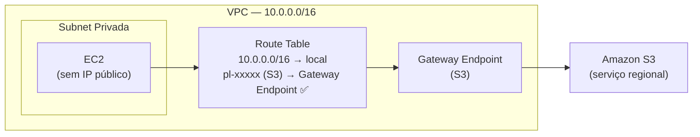
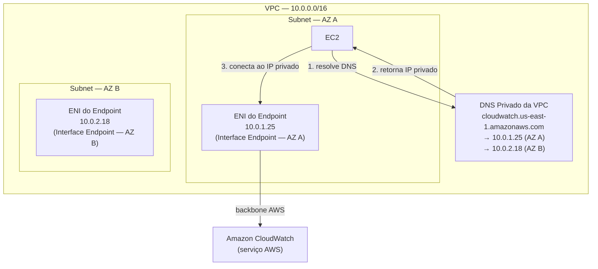
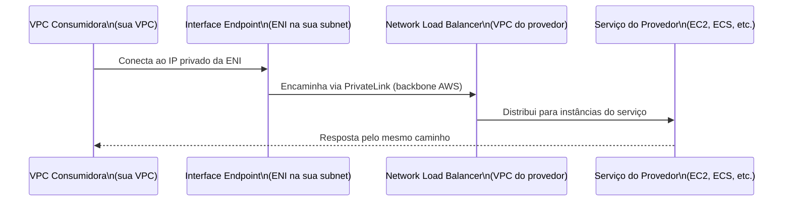
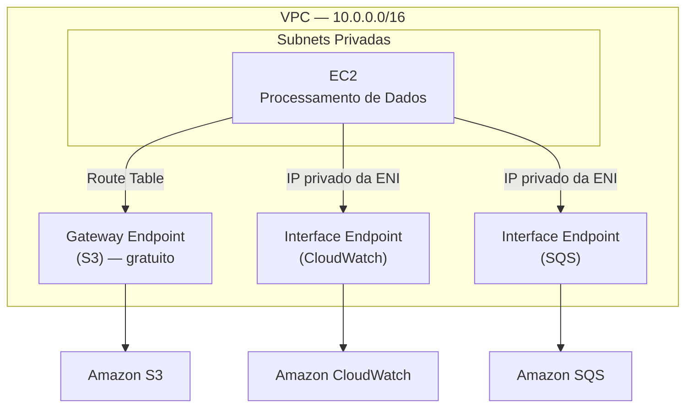

# 15 - VPC Endpoints e AWS PrivateLink

## 1. Explicação Técnica

Nas últimas notas, a gente aprendeu a conectar VPCs entre si e ao mundo on-premises via VPN, Direct Connect e Transit Gateway. Mas ainda existe uma lacuna: e quando um recurso dentro de uma subnet privada, sem rota para internet, precisa acessar um serviço AWS como o S3, o CloudWatch ou o SQS?

O caminho padrão seria: criar um NAT Gateway na subnet pública, o tráfego sai pela internet para o endpoint público do serviço AWS, e volta. Funciona, mas tem dois problemas sérios. Primeiro, o tráfego está trafegando pela internet pública, o que pode conflitar com requisitos de compliance. Segundo, você está pagando pelo NAT Gateway e pelo outbound data transfer sendo que o destino final é a própria AWS.

Pensa assim: você mora num condomínio (a VPC) e precisa comprar alguma coisa na loja de conveniência do próprio prédio (um serviço AWS). Pelo caminho padrão, você sairia pelo portão, andaria pela rua pública, entraria pela frente da loja. Pela rua pública, qualquer um pode ver que você saiu e entrou. O **VPC Endpoint** é o corredor interno que liga diretamente o seu apartamento à loja, sem precisar sair do condomínio.

Os **VPC Endpoints** permitem que recursos dentro da VPC acessem serviços AWS usando seus IPs privados, sem rota para internet, sem NAT Gateway, sem Internet Gateway. O tráfego nunca sai da rede da AWS.

Existem dois tipos completamente diferentes de Endpoint, e confundi-los é o erro mais comum na prova.

---

## 2. Gateway Endpoints vs Interface Endpoints

| Característica | Gateway Endpoint | Interface Endpoint (PrivateLink) |
|----------------|-----------------|----------------------------------|
| Mecanismo | Entrada na Route Table | ENI com IP privado na subnet |
| Serviços suportados | S3 e DynamoDB apenas | A maioria dos serviços AWS + terceiros |
| Custo | Gratuito | Por hora de ENI + por GB processado |
| Escopo | Regional | Por AZ (recomenda-se um por AZ) |
| DNS | Não muda | Resolve o nome do serviço para o IP da ENI |
| Segurança | Endpoint Policy | Endpoint Policy + Security Groups |

O Gateway Endpoint é **gratuito e simples**: você adiciona uma entrada na Route Table e o tráfego destinado ao S3 ou DynamoDB é redirecionado internamente. Sem ENI, sem IP, sem Security Group.

O Interface Endpoint é uma **ENI (Elastic Network Interface)** criada dentro da sua subnet com um IP privado. Quando sua aplicação resolve o DNS do serviço (por exemplo `s3.amazonaws.com`), o DNS retorna o IP privado da ENI em vez do IP público do serviço. O tráfego vai direto para a ENI, que o encaminha ao serviço via backbone da AWS.

---

## 3. Gateway Endpoints — S3 e DynamoDB

O Gateway Endpoint é a forma mais simples de conectar à AWS internamente. Você cria o endpoint, associa às Route Tables das subnets que precisam de acesso, e uma nova rota aparece automaticamente: `pl-XXXXXXXX (S3) → vpce-XXXXXXXX`.



O tráfego do EC2 destinado ao S3 é interceptado na Route Table e direcionado ao Gateway Endpoint, que o encaminha pelo backbone da AWS. Nenhum byte passa pela internet pública. E não custa nada além do que você já paga pelo S3.

Uma restrição importante: o Gateway Endpoint é regional. Você não pode usar um Gateway Endpoint de `us-east-1` para acessar um bucket em `us-west-2`. O acesso é sempre dentro da mesma região.

---

## 4. Interface Endpoints — AWS PrivateLink

O **Interface Endpoint** usa a tecnologia **AWS PrivateLink** por baixo. Você cria uma ENI em uma subnet da sua VPC, com um IP privado daquela subnet, e ela representa o endpoint de um serviço AWS específico (CloudWatch, SQS, SNS, EC2 API, entre dezenas de outros) ou um serviço de terceiros.



Quando você habilita o **Private DNS** do Interface Endpoint, o DNS da VPC passa a resolver o nome público do serviço para o IP privado da ENI. A sua aplicação não precisa mudar nada: ela continua chamando `cloudwatch.amazonaws.com`, mas agora esse nome resolve para um IP privado dentro da VPC.

A recomendação é criar uma ENI por AZ para garantir que, se uma AZ cair, as outras continuam com acesso ao serviço sem depender de roteamento cross-AZ.

---

## 5. Endpoint Services — Exponha Seu Próprio Serviço via PrivateLink

Aqui está o recurso mais avançado e mais cobrado no SAP. Além de acessar serviços da AWS, você pode usar o PrivateLink para **expor o seu próprio serviço** para outras VPCs ou outras contas, sem precisar de VPC Peering, Transit Gateway nem internet.

O modelo funciona assim:

**Lado do provedor (quem oferece o serviço):**
1. Cria um Network Load Balancer na frente do serviço
2. Cria um **Endpoint Service** associado ao NLB
3. Define quem tem permissão para se conectar (accept manual ou automático)

**Lado do consumidor (quem usa o serviço):**
1. Cria um Interface Endpoint apontando para o Endpoint Service do provedor
2. O serviço aparece na sua VPC como um IP privado



Esse padrão é muito usado em dois cenários: empresas SaaS que vendem um serviço para clientes AWS (o cliente cria um Interface Endpoint no lugar de abrir conexão pela internet), e times dentro da mesma empresa que querem compartilhar serviços entre contas sem criar peerings ou dar acesso de rede amplo.

---

## 6. Políticas de Endpoint

Tanto Gateway quanto Interface Endpoints suportam **Endpoint Policies**: documentos JSON no estilo IAM que controlam quais ações são permitidas através do endpoint.

Por exemplo, você pode criar um Gateway Endpoint para S3 que só permite acesso a um bucket específico:

```json
{
  "Statement": [{
    "Effect": "Allow",
    "Principal": "*",
    "Action": "s3:GetObject",
    "Resource": "arn:aws:s3:::meu-bucket-producao/*"
  }]
}
```

Isso significa que mesmo que o EC2 tente acessar qualquer outro bucket S3 pelo endpoint, a política vai bloquear. É uma camada de controle adicional além do IAM da instância e da bucket policy do S3.

---

## 7. Custo

| Tipo | Custo |
|------|-------|
| Gateway Endpoint (S3 e DynamoDB) | Gratuito |
| Interface Endpoint | Por hora de ENI ativa + por GB processado |
| Endpoint Service (provedor) | Por hora de endpoint + por GB processado |

O Gateway Endpoint sendo gratuito é um motivo forte para sempre usá-lo para S3 e DynamoDB em vez de Interface Endpoint ou NAT Gateway. Além de não custar nada, o tráfego não conta no custo de NAT Gateway.

---

## 8. Cenário Real Enterprise

Uma empresa de saúde tem instâncias processando dados sensíveis de pacientes em subnets privadas. As instâncias precisam: fazer logs no CloudWatch, ler arquivos de configuração do S3 e publicar eventos no SQS. Nenhum desses acessos pode passar pela internet por requisito de compliance (HIPAA).



S3 via Gateway Endpoint (gratuito). CloudWatch e SQS via Interface Endpoints. Zero bytes de dados de pacientes trafegando pela internet pública. Compliance satisfeito.

---

## 9. Quando Usar / Quando NÃO Usar

**Use Gateway Endpoint** sempre que precisar acessar S3 ou DynamoDB de dentro de uma VPC. É gratuito, simples, não há razão para não usar.

**Use Interface Endpoint (PrivateLink)** quando recursos privados precisam acessar outros serviços AWS (CloudWatch, SQS, SNS, Secrets Manager, etc.) sem passar pela internet, especialmente em ambientes com requisitos de compliance que proíbem tráfego pela internet pública.

**Use Endpoint Services** quando você precisa expor um serviço de uma VPC ou conta para consumidores externos sem criar peering ou dar acesso de rede amplo.

**Não use Interface Endpoint** para S3 e DynamoDB se o custo é uma preocupação. O Gateway Endpoint resolve o mesmo problema de forma gratuita.

**Não confunda VPC Endpoint com VPN ou Direct Connect**: Endpoints são para acessar serviços AWS, não para conectar redes on-premises à AWS.

---

## 10. Trade-offs

| Dimensão | Gateway Endpoint | Interface Endpoint |
|----------|-----------------|-------------------|
| Custo | Gratuito | Por hora + por GB |
| Serviços suportados | S3 e DynamoDB apenas | Maioria dos serviços AWS e terceiros |
| Implementação | Entrada na Route Table | ENI na subnet + DNS privado |
| Alta disponibilidade | Regional (automático) | Por AZ (recomenda-se uma ENI por AZ) |
| Security Group | Não suportado | Suportado |
| Endpoint Policy | Suportado | Suportado |
| Resolução DNS | Sem mudança | Reescreve para IP privado da ENI |

---

## 11. Pegadinhas Comuns da Prova

> **[PEGADINHA #1]** - *"Quais são os únicos dois serviços suportados por Gateway Endpoint?"*
> S3 e DynamoDB. Todos os outros serviços AWS usam Interface Endpoint.

> **[PEGADINHA #2]** - *"Um Gateway Endpoint para S3 funciona para buckets em outras regiões?"*
> Não. O Gateway Endpoint é regional. Acesso a buckets em outras regiões ainda vai pela internet (ou exigiria Interface Endpoint na outra região).

> **[PEGADINHA #3]** - *"Para acessar S3 sem internet, devo usar Interface Endpoint ou Gateway Endpoint?"*
> Gateway Endpoint. É gratuito, resolve o problema e é mais simples de implementar para S3 e DynamoDB.

> **[PEGADINHA #4]** - *"Um Interface Endpoint precisa de Security Group?"*
> Sim, e diferente do Gateway Endpoint, o Interface Endpoint tem uma ENI que pode ser controlada por Security Groups.

> **[PEGADINHA #5]** - *"O que é necessário no lado do provedor para expor um serviço via PrivateLink?"*
> Um Network Load Balancer (NLB) na frente do serviço e um Endpoint Service criado associado ao NLB.

> **[PEGADINHA #6]** - *"Uma EC2 sem IP público e sem NAT Gateway pode acessar o CloudWatch?"*
> Sim, via Interface Endpoint (PrivateLink) para o CloudWatch. O acesso é feito pelo IP privado da ENI do endpoint.

> **[PEGADINHA #7]** - *"VPC Endpoint e VPN resolvem o mesmo problema?"*
> Não. VPN conecta redes on-premises à AWS. VPC Endpoint permite que recursos dentro da VPC acessem serviços AWS sem internet. São soluções para problemas diferentes.

> **[PEGADINHA #8]** - *"Endpoint Policy e IAM Policy são a mesma coisa?"*
> Não. A Endpoint Policy controla quais ações são permitidas através daquele endpoint específico. É uma camada adicional ao IAM: o acesso precisa ser permitido tanto pelo IAM quanto pela Endpoint Policy.

---

## 12. Resumo Final

VPC Endpoints resolvem um problema específico: como acessar serviços AWS de dentro de uma VPC sem passar pela internet pública. Existem dois tipos com comportamentos completamente diferentes.

O **Gateway Endpoint** é gratuito, funciona apenas para S3 e DynamoDB, e se integra via Route Table. É a escolha óbvia para esses dois serviços em qualquer ambiente.

O **Interface Endpoint** cria uma ENI com IP privado na sua subnet, usando a tecnologia PrivateLink. Serve para a maioria dos serviços AWS e para serviços de terceiros. O DNS do serviço resolve para o IP privado da ENI, transparente para a aplicação. Tem custo por hora e por GB.

O **Endpoint Service** inverte o modelo: em vez de consumir um serviço, você expõe o seu. Um NLB na frente do serviço, um Endpoint Service criado, e consumidores de outras VPCs ou contas criam Interface Endpoints apontando para ele. Tráfego privado sem peering, sem TGW, sem internet.

---

## 13. Flashcards Rápidos

**Q: Quais são os dois tipos de VPC Endpoint?**
A: Gateway Endpoint (para S3 e DynamoDB, gratuito, via Route Table) e Interface Endpoint (para maioria dos serviços, via ENI com IP privado, tem custo).

**Q: Quais serviços o Gateway Endpoint suporta?**
A: Apenas S3 e DynamoDB.

**Q: O Interface Endpoint usa qual tecnologia por baixo?**
A: AWS PrivateLink.

**Q: Por que o Gateway Endpoint é preferível ao Interface Endpoint para S3?**
A: Porque é gratuito e resolve o mesmo problema de acesso privado ao S3 sem internet.

**Q: O que é um Endpoint Service?**
A: Um serviço que você expõe via PrivateLink para ser consumido por outras VPCs ou contas, usando um NLB como ponto de entrada.

**Q: O que é necessário para usar o Private DNS de um Interface Endpoint?**
A: O atributo `enableDnsSupport` da VPC precisa estar habilitado (que é o padrão).

**Q: Interface Endpoint suporta Security Groups?**
A: Sim. A ENI do Interface Endpoint pode ter Security Groups associados.

**Q: Para acessar CloudWatch de uma subnet privada sem internet, o que usar?**
A: Interface Endpoint (PrivateLink) para o serviço CloudWatch.

**Q: Endpoint Policy substitui a IAM Policy?**
A: Não. São camadas independentes. O acesso precisa ser permitido pelo IAM e pela Endpoint Policy.
