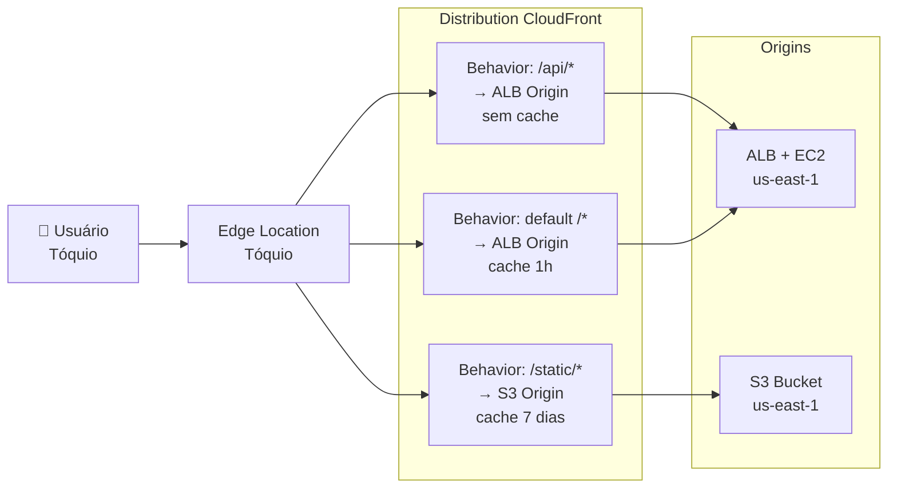
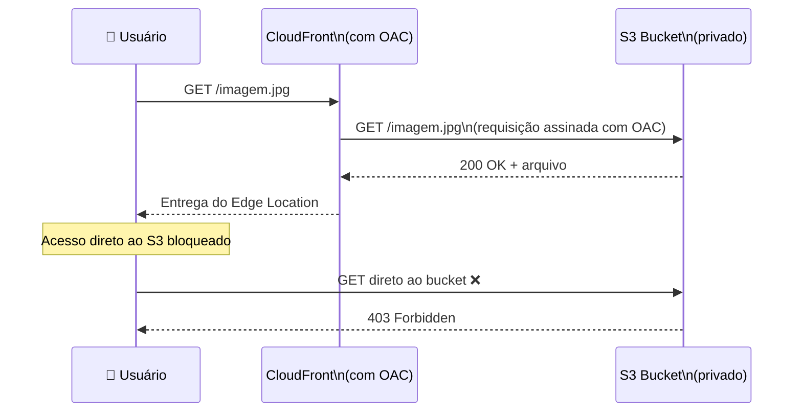
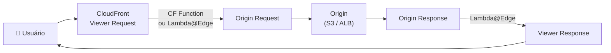

# 16 - Amazon CloudFront

## 1. Explicação Técnica

Você tem uma aplicação rodando em `us-east-1`. Um usuário em São Paulo a acessa sem problemas, porque está geograficamente perto. Mas um usuário em Tóquio faz a mesma requisição, e o pacote precisa atravessar o oceano Pacífico, processar no servidor na Virgínia, e voltar para o Japão. São dezenas de saltos de rede, milhares de quilômetros de fibra submarina, latência na casa dos 150ms ou mais. Para uma página HTML estática, isso é inaceitável.

Pensa assim: você gerencia uma biblioteca com um único exemplar de cada livro, localizada em Nova York. Leitores do mundo inteiro precisam acessar esses livros, mas toda vez que alguém em Tóquio quer ler, precisa esperar o livro viajar de Nova York e voltar. A solução óbvia é criar **filiais da biblioteca espalhadas pelo mundo**, onde cada filial guarda uma cópia dos livros mais populares. Quando um leitor de Tóquio pede um livro, a filial local verifica se tem no estoque. Se sim, entrega na hora. Se não, busca em Nova York, entrega, e guarda uma cópia para o próximo. Esse é exatamente o modelo do **Amazon CloudFront**.

O CloudFront é um **CDN (Content Delivery Network)** gerenciado pela AWS. Ele usa uma rede global de **Edge Locations**, pontos de presença distribuídos pelo mundo, para fazer cache do seu conteúdo próximo aos usuários finais. Quando o usuário faz uma requisição, ela vai para o Edge Location mais próximo. Se o conteúdo está em cache, é entregue imediatamente. Se não está, o Edge Location busca na **origem** (origin), faz cache, e entrega.

O resultado: latência drasticamente menor, menos carga no servidor de origem e melhor experiência para o usuário em qualquer lugar do planeta.

![[CleanShot 2026-05-17 at 13.46.15.png]]

---

## 2. Arquitetura do CloudFront

Três conceitos estruturais para entender antes de qualquer outra coisa:

### Origin

A **Origin** é onde o conteúdo original vive, o servidor que o CloudFront consulta quando o cache está vazio ou expirado. Existem dois tipos:

- **S3 Origin**: um bucket S3 com os arquivos estáticos. Ideal para sites estáticos, imagens, vídeos, arquivos para download
- **Custom Origin**: qualquer servidor HTTP acessível pela internet, incluindo um Application Load Balancer na frente de instâncias EC2, uma instância EC2 diretamente (não recomendado), ou qualquer endpoint HTTP de terceiros

Você pode configurar um **Origin Group** com duas origins: uma primária e uma secundária para failover. Se a primária retornar erro (4xx ou 5xx configurável), o CloudFront automaticamente tenta a secundária.

### Distribution

Uma **Distribution** é o bloco de configuração do CloudFront: você define as origins, os comportamentos de cache, as políticas de segurança e o domínio. Ao criar uma Distribution, a AWS gera um domínio no formato `xxxxxxxxxxxx.cloudfront.net`. Você pode associar seus próprios domínios customizados.

### Behaviors

Os **Behaviors** são regras de roteamento baseadas no path da URL. Cada behavior define qual origin serve aquele padrão de URL e como o cache funciona para ele.



---

## 3. Edge Locations e Price Classes

A AWS opera mais de 400 Edge Locations em dezenas de países. Elas ficam em pontos de troca de tráfego (IXPs) e grandes centros metropolitanos, garantindo que o Edge mais próximo esteja a menos de 20ms da maioria dos usuários globais.

Além dos Edge Locations, existem os **Regional Edge Caches**: pontos intermediários maiores entre os Edge Locations e as origins. Conteúdo que não cabe no cache do Edge Location fica nesses caches regionais, reduzindo o número de requisições que chegam à origin.

Nem sempre faz sentido usar todos os Edge Locations do mundo. A AWS permite configurar **Price Classes** para controlar quais regiões são utilizadas, equilibrando cobertura e custo:

| Price Class | Regiões incluídas | Custo |
|-------------|------------------|-------|
| Price Class All | Todos os Edge Locations globais | Mais alto |
| Price Class 200 | Maioria das regiões (exclui as mais caras) | Intermediário |
| Price Class 100 | América do Norte e Europa | Mais baixo |

Se seus usuários estão concentrados na América do Norte e Europa, Price Class 100 entrega performance equivalente com custo menor.

---

## 4. Cache — TTL e Cache Invalidation

### TTL (Time to Live)

O **TTL** define por quanto tempo um objeto fica em cache no Edge Location antes de o CloudFront verificar na origin se há uma versão mais nova. O padrão é **86.400 segundos (24 horas)**.

Você controla o TTL de três formas:

- **Cache-Control header** na resposta da origin: a origin envia `Cache-Control: max-age=3600` e o CloudFront respeita
- **TTL mínimo, máximo e padrão** configurados no Behavior da Distribution
- **TTL = 0**: força o CloudFront a verificar a origin em toda requisição (revalidação), mas ainda pode servir o cache se a origin responder `304 Not Modified`

### Cache Invalidation

Quando você atualiza um arquivo na origin (uma imagem mudou, um JS foi corrigido), o cache do Edge Location ainda tem a versão antiga até o TTL expirar. Para forçar a atualização imediata, você usa a **Cache Invalidation**.

Você pode invalidar por path específico (`/static/logo.png`), por padrão (`/static/*`) ou tudo de uma vez (`/*`). A invalidação tem custo: os primeiros 1.000 paths por mês são gratuitos, depois cobra por path.

Uma estratégia mais elegante e sem custo de invalidação é usar **versionamento de arquivos no nome**: em vez de `app.js`, você faz deploy como `app.v2.js` e atualiza a referência no HTML. O arquivo antigo expira naturalmente no cache, o novo nunca foi cacheado, e você não paga por invalidação.

---

## 5. Acesso Privado ao S3 com OAC

Esse é um dos padrões mais cobrados no SAP quando o assunto é CloudFront + S3. O problema: você quer que o conteúdo do bucket S3 seja acessível apenas pelo CloudFront, não diretamente pela URL pública do S3.

A solução é o **Origin Access Control (OAC)**, que substitui o antigo OAI (Origin Access Identity). Você configura o bucket S3 para aceitar requisições somente do CloudFront usando o OAC. O bucket pode ficar privado (sem acesso público), e o CloudFront autentica automaticamente suas requisições usando o OAC.



O resultado: os arquivos no S3 só são acessíveis pelo CloudFront. Usuários não conseguem contornar o CDN para acessar diretamente os objetos, o que protege os dados e garante que as políticas de cache e segurança do CloudFront sejam sempre aplicadas.

---

## 6. Conteúdo Privado — Signed URLs e Signed Cookies

Para conteúdo que não deve ser público (vídeos pagos, relatórios por assinatura, downloads de software), o CloudFront suporta dois mecanismos de controle de acesso:

### Signed URL

Gera uma URL com uma assinatura criptográfica embutida que tem **expiração, IP de origem permitido e o recurso específico** que pode ser acessado. É ideal para conceder acesso a um único arquivo por um tempo limitado.

```
https://xxxx.cloudfront.net/video.mp4?Policy=...&Signature=...&Key-Pair-Id=...
```

### Signed Cookie

Em vez de uma URL assinada por arquivo, você emite um **cookie criptografado** que dá acesso a múltiplos arquivos de uma vez. Ideal para conteúdo por assinatura onde o usuário precisa acessar uma coleção inteira (como todos os vídeos de um curso).

| Mecanismo | Caso de uso ideal |
|-----------|------------------|
| Signed URL | Acesso a um arquivo específico por tempo limitado |
| Signed Cookie | Acesso a múltiplos arquivos (área de membros, assinatura) |

Ambos exigem que você use um **CloudFront Key Pair** para assinar as URLs ou cookies, e que a origin (S3 com OAC ou Custom Origin) não aceite acesso sem a assinatura.

---

## 7. Lambda@Edge e CloudFront Functions

O CloudFront não é apenas cache passivo. Você pode executar código diretamente nos Edge Locations, o que abre possibilidades poderosas de personalização sem latência de roundtrip até a origin.

### CloudFront Functions

Código JavaScript leve executado no Edge Location para manipulação de requisições e respostas. Latência inferior a 1ms, custo muito baixo, mas com limitações: sem acesso à rede, sem filesystem, apenas manipulação de headers, cookies e URLs.

Casos de uso: redirect de URLs, normalização de cache keys, adição de headers de segurança (HSTS, X-Frame-Options), reescrita de path.

### Lambda@Edge

Funções Lambda executadas nos Edge Locations (mais precisamente, nos Regional Edge Caches), com mais poder: acesso à rede, às variáveis de ambiente, mais memória. Suporte a Node.js e Python. Latência um pouco maior que CloudFront Functions, mas muito menor do que uma Lambda na origem.



Casos de uso de Lambda@Edge: autenticação e autorização no edge, personalização de conteúdo por geolocalização, A/B testing, redirecionamento baseado no User-Agent ou cookie.

---

## 8. SSL/TLS e Domínios Customizados

Por padrão, toda Distribution CloudFront recebe um certificado SSL para o domínio `*.cloudfront.net`. Para usar seu domínio customizado (`cdn.seusite.com`), você precisa de:

1. Um certificado SSL no **AWS Certificate Manager (ACM)**, obrigatoriamente na região **us-east-1** (independente de onde está sua origin)
2. O CNAME ou Alias DNS do seu domínio apontando para o domínio CloudFront

Fica ligado nesse ponto que cai muito na prova: o certificado ACM para uso com CloudFront **precisa estar em us-east-1**, independente da região da sua aplicação. Se você criar o certificado em `us-east-2`, não vai aparecer para ser selecionado no CloudFront.

---

## 9. Custo

O CloudFront cobra por três dimensões:

| Componente | Detalhe |
|------------|---------|
| Transferência de dados para internet | Por GB de dados entregues dos Edge Locations para os usuários |
| Requisições HTTP/HTTPS | Por número de requisições (diferente para HTTP e HTTPS) |
| Invalidações | Primeiros 1.000 paths/mês gratuitos, depois por path |

O custo varia por região geográfica: entregar dados na América do Norte é mais barato do que na América do Sul ou na Índia. A Price Class controla isso.

Uma observação importante: transferência de dados **da origin para o CloudFront** (S3 ou serviços AWS na mesma região) é gratuita. Você só paga pela entrega final ao usuário.

---

## 10. Cenário Real Enterprise

Uma empresa de streaming de vídeo tem 50 milhões de usuários espalhados por América, Europa e Ásia-Pacífico. O conteúdo de vídeo fica em um bucket S3 em `us-east-1`. Sem CDN, um usuário em Tóquio teria que baixar gigabytes de vídeo diretamente do S3 na Virgínia.

Com CloudFront:

```mermaid
graph TB
    subgraph Users["Usuários"]
        US["EUA\n(Edge NYC, LA...)"]
        EU["Europa\n(Edge Frankfurt, London...)"]
        AP["Ásia-Pac\n(Edge Tokyo, Singapore...)"]
    end

    subgraph CloudFront_Global["CloudFront — Edge Locations Globais"]
        Cache["Cache de Vídeos\n(HLS segments, thumbnails)"]
    end

    subgraph Origin["Origin — us-east-1"]
        S3_Videos["S3 Bucket\n(vídeos originais)\n(privado — OAC)"]
        ALB_API["ALB + API\n(metadados, catálogo)"]
    end

    US & EU & AP --> Cache
    Cache -- "miss: busca origem\n(paga 1x, cacheia)" --> S3_Videos
    Cache -- "API: sem cache\n(behavior /api/*)" --> ALB_API
    S3_Videos -- "acesso bloqueado\n para usuários diretos" -.-> US
```

Vídeos em cache nos Edges locais. Signed URLs para garantir que só assinantes acessam. OAC bloqueando acesso direto ao S3. Lambda@Edge verificando o JWT do usuário antes de servir o conteúdo. Price Class All para cobertura global. O resultado: latência de milissegundos para qualquer usuário no mundo, S3 acessado apenas uma vez por segmento de vídeo.

---

## 11. Quando Usar / Quando NÃO Usar

**Use CloudFront quando:**

- Você tem usuários globais e precisa minimizar latência de entrega de conteúdo
- O conteúdo é estático ou semi-estático (imagens, CSS, JS, vídeos, PDFs)
- Você precisa proteger a origin de picos de tráfego (o Edge absorve a carga)
- Você precisa de HTTPS com certificado customizado e não quer gerenciar servidores SSL
- O conteúdo do S3 deve ser acessível apenas via CloudFront (OAC)
- Você precisa de controle de acesso baseado em geolocalização ou tokens temporários

**Não use CloudFront quando:**

- O conteúdo é altamente dinâmico e personalizado por usuário (não faz sentido cachear, o TTL seria zero)
- Todos os seus usuários estão concentrados em uma única região e a latência já é aceitável
- A aplicação precisa de WebSockets persistentes de longa duração (use Application Load Balancer diretamente)

---

## 12. Trade-offs

| Dimensão | Com CloudFront | Sem CloudFront |
|----------|---------------|----------------|
| Latência para usuários globais | Baixa (Edge Location próximo) | Alta (roundtrip até a origin) |
| Custo de data transfer | Paga pelo CDN | Paga pelo egress da origin (geralmente maior) |
| Carga na origin | Reduzida (cache absorve) | Total (cada requisição chega na origin) |
| Controle de acesso | Signed URLs, Signed Cookies, Geo-restriction | Implementação própria na aplicação |
| Cache de conteúdo dinâmico | Difícil de gerenciar (TTL baixo, invalidações) | Não se aplica |
| Complexidade operacional | Adiciona uma camada a gerenciar | Mais simples para cargas regionais |

---

## 13. Pegadinhas Comuns da Prova

> **[PEGADINHA #1]** - *"O certificado ACM para usar com CloudFront pode estar em qualquer região?"*
> Não. Obrigatoriamente precisa estar em `us-east-1`, independente da região da sua aplicação ou origin.

> **[PEGADINHA #2]** - *"CloudFront faz cache de conteúdo dinâmico de API?"*
> Por padrão sim, mas é um comportamento que você deve desabilitar ou configurar com TTL zero para rotas de API. Usar um Behavior separado com `Cache-Control: no-cache` para `/api/*` é a solução correta.

> **[PEGADINHA #3]** - *"O que é OAC e para que serve?"*
> Origin Access Control. Permite que o bucket S3 fique privado (sem acesso público) e só aceite requisições autenticadas do CloudFront. Substitui o OAI (Origin Access Identity), que é o mecanismo legado.

> **[PEGADINHA #4]** - *"Signed URL e Signed Cookie: qual usar para dar acesso a toda uma biblioteca de vídeos de uma vez?"*
> Signed Cookie. O Signed URL é para um único arquivo. O Signed Cookie concede acesso a múltiplos arquivos de uma vez.

> **[PEGADINHA #5]** - *"A transferência de dados do S3 para o CloudFront tem custo?"*
> Não. A transferência de dados entre serviços AWS na mesma região para o CloudFront é gratuita. O custo é cobrado apenas pela entrega dos dados aos usuários finais.

> **[PEGADINHA #6]** - *"Cache Invalidation invalida o cache de todos os Edge Locations globalmente?"*
> Sim. Uma Cache Invalidation se propaga para todos os Edge Locations da Distribution. Pode levar alguns minutos para completar em todos.

> **[PEGADINHA #7]** - *"CloudFront Functions e Lambda@Edge fazem a mesma coisa?"*
> Não. CloudFront Functions são mais rápidas e baratas, mas limitadas (sem acesso à rede). Lambda@Edge é mais poderosa (acesso à rede, mais memória), mas com latência ligeiramente maior. CF Functions para manipulação simples de headers e URLs; Lambda@Edge para lógica mais complexa.

> **[PEGADINHA #8]** - *"Qual componente do CloudFront permite routear `/api/*` para um ALB e `/static/*` para S3?"*
> Behaviors. Cada Behavior define um padrão de path e a origin correspondente.

---

## 14. Resumo Final

O CloudFront é o CDN da AWS. Ele usa uma rede global de Edge Locations para fazer cache do seu conteúdo próximo ao usuário, reduzindo latência e aliviando a carga da origin. A arquitetura central é simples: uma Distribution com Origins (S3 ou Custom) e Behaviors que definem qual origin serve cada path e como o cache funciona.

Para S3 privado, use OAC para garantir que o bucket só aceite requisições do CloudFront. Para conteúdo por assinatura, Signed URLs (arquivo único) ou Signed Cookies (múltiplos arquivos). Para executar lógica no edge, CloudFront Functions (leve e rápida) ou Lambda@Edge (mais poder). Para HTTPS com domínio customizado, o certificado ACM precisa estar obrigatoriamente em `us-east-1`.

O TTL define por quanto tempo o cache vive. Cache Invalidation força a atualização imediata com custo. Versionamento de arquivos no nome é a alternativa elegante e sem custo para gerenciar atualizações de conteúdo estático.

---

## 15. Flashcards Rápidos

**Q: O que é um Edge Location no contexto do CloudFront?**
A: Um ponto de presença da AWS distribuído globalmente onde o conteúdo é cacheado próximo ao usuário final, reduzindo a latência de entrega.

**Q: Qual a diferença entre Origin S3 e Custom Origin?**
A: S3 Origin serve arquivos estáticos de um bucket S3. Custom Origin é qualquer servidor HTTP acessível: ALB, EC2, endpoint externo.

**Q: Para que serve o OAC (Origin Access Control)?**
A: Permite que o bucket S3 fique completamente privado e só aceite requisições autenticadas originadas do CloudFront, impedindo acesso direto ao S3.

**Q: Signed URL vs Signed Cookie: qual a diferença?**
A: Signed URL concede acesso a um único arquivo por tempo limitado. Signed Cookie concede acesso a múltiplos arquivos de uma vez, ideal para áreas de membros.

**Q: O certificado ACM para CloudFront precisa estar em qual região?**
A: us-east-1, obrigatoriamente.

**Q: O que é Cache Invalidation?**
A: O processo de remover manualmente objetos do cache nos Edge Locations antes do TTL expirar. Propaga para todos os Edges globalmente.

**Q: Qual o TTL padrão do CloudFront?**
A: 86.400 segundos (24 horas).

**Q: Quando usar CloudFront Functions vs Lambda@Edge?**
A: CF Functions para manipulações simples e rápidas de headers/URLs sem acesso à rede. Lambda@Edge para lógica mais complexa que precisa de acesso à rede ou mais processamento.

**Q: O que são Behaviors em uma Distribution CloudFront?**
A: Regras que definem qual origin serve cada padrão de path de URL e como o cache funciona para aquelas requisições.

**Q: A transferência de dados do S3 para o CloudFront tem custo?**
A: Não. É gratuita entre serviços AWS na mesma região.
