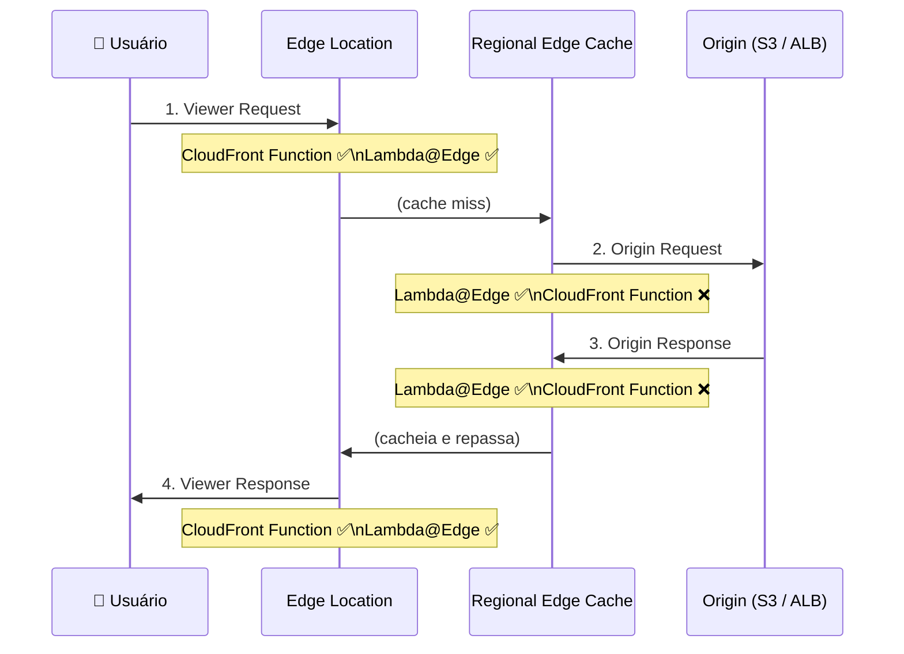
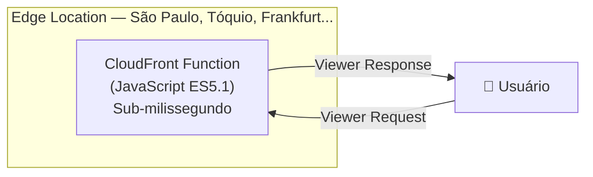
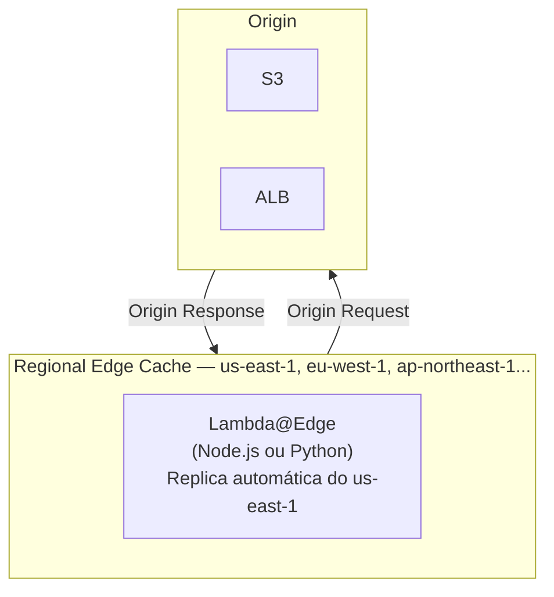
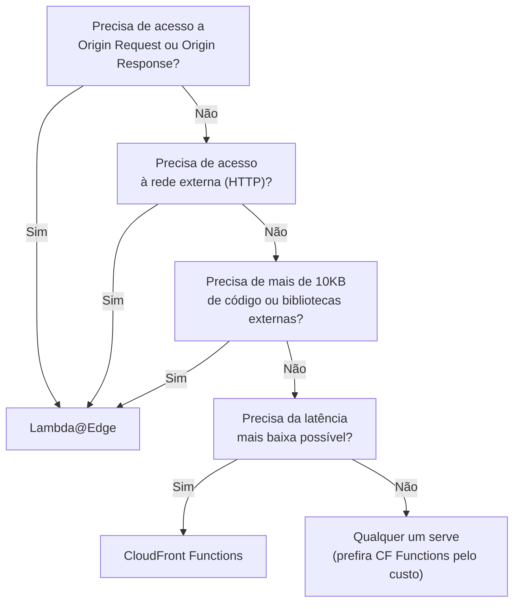
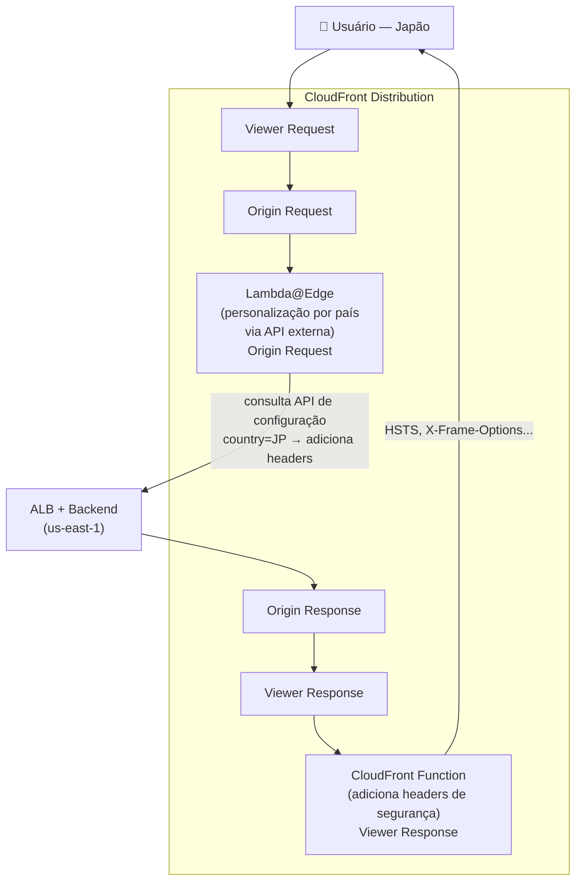

## 1. Explicação Técnica

Na nota do CloudFront, a gente viu que é possível executar código diretamente nos Edge Locations para personalizar como as requisições e respostas são tratadas. Mencionei brevemente CloudFront Functions e Lambda@Edge como os dois mecanismos disponíveis. Chegou a hora de abrir esse capô e entender como cada um funciona, onde cada um roda, e principalmente: qual usar em cada situação.

Pensa assim: você tem uma rodovia (a rede do CloudFront) com pedágios estratégicos pelo caminho. A cada pedágio, você pode inspecionar o carro, verificar documentos, alterar o destino, devolver o carro de volta ou deixar passar. O CloudFront tem quatro pedágios possíveis no trajeto de uma requisição: quando o usuário chega, antes de ir buscar na origin, quando a origin responde, e antes de entregar ao usuário. Você pode colocar código em qualquer um desses pedágios.

A diferença entre os dois serviços é onde esse código roda. **CloudFront Functions** roda no próprio Edge Location, ou seja, no ponto de presença mais próximo do usuário. **Lambda@Edge** roda nos Regional Edge Caches, que são nós intermediários maiores. Ambos ficam na borda da rede, mas em pontos diferentes com capacidades bem distintas.

---

## 2. Os Quatro Hooks de Execução

Toda requisição que passa pelo CloudFront percorre um caminho com quatro pontos onde você pode interceptar e executar código. Entender exatamente quando cada um dispara é fundamental para a prova.

| Hook | Quando dispara | CF Functions | Lambda@Edge |
|------|----------------|:------------:|:-----------:|
| **Viewer Request** | Depois que o Edge recebe a requisição do usuário, antes de verificar o cache | ✅ | ✅ |
| **Origin Request** | Quando há cache miss, antes de encaminhar para a origin | ❌ | ✅ |
| **Origin Response** | Depois que a origin responde, antes de cachear | ❌ | ✅ |
| **Viewer Response** | Antes de devolver a resposta ao usuário | ✅ | ✅ |

Fica ligado nessa tabela: o CloudFront Functions **não tem acesso aos hooks de origin**. Se você precisa interceptar o tráfego antes de ir para a origin ou logo depois da resposta dela, só Lambda@Edge resolve.

---

## 3. CloudFront Functions — Execução no Edge

O CloudFront Functions foi projetado para um cenário bem específico: **código leve, ultra-rápido, de alta escala, executado no próprio Edge Location**.

### Características Técnicas

| Característica | Valor |
|----------------|-------|
| Runtime | JavaScript (ES5.1 apenas) |
| Latência de execução | Submilissegundo |
| Memória máxima | 2 MB |
| Tamanho máximo do código | 10 KB |
| Acesso à rede (HTTP externo) | Não |
| Acesso ao filesystem | Não |
| Variáveis de ambiente | Não |
| Hooks disponíveis | Viewer Request e Viewer Response |
| Escala | Milhões de requisições por segundo |
| Implantação | Direto na Distribution do CloudFront |

### Casos de Uso Ideais

- **Cache Key Normalization**: remover parâmetros de query string irrelevantes antes de verificar o cache, para aumentar a taxa de acerto
- **Header Manipulation**: adicionar, remover ou modificar headers de requisição e resposta (HSTS, X-Frame-Options, CORS headers)
- **URL Redirects/Rewrites**: redirecionar `www.seusite.com` para `seusite.com`, reescrever paths antes de ir ao cache
- **Autenticação simples**: validar um token JWT básico no Viewer Request, recusando imediatamente sem chegar na origin
- **A/B Testing**: redirecionar percentuais do tráfego baseado em cookie ou header

---

## 4. Lambda@Edge — Execução no Regional Edge Cache

O Lambda@Edge é uma Lambda convencional implantada em `us-east-1` que a AWS replica automaticamente para os Regional Edge Caches ao redor do mundo. Ela tem mais poder: acesso à rede, memória configurável e suporte a bibliotecas externas. Em troca, tem latência um pouco maior que o CloudFront Functions e restrições específicas de deployment.

### Características Técnicas

| Característica | Valor |
|----------------|-------|
| Runtime | Node.js ou Python |
| Latência de execução | Milissegundos (com possível cold start) |
| Memória máxima | 128 MB (Viewer) a 10 GB (Origin) |
| Timeout máximo | 5s (Viewer Request/Response) e 30s (Origin Request/Response) |
| Acesso à rede (HTTP externo) | Sim |
| Acesso ao filesystem | `/tmp` (ephemeral, 512 MB) |
| Variáveis de ambiente | Não (limitação específica do Lambda@Edge) |
| Hooks disponíveis | Todos os quatro |
| Implantação | Sempre em `us-east-1`, replicação automática global |
| VPC | Não suportado |

### Casos de Uso Ideais

- **Autenticação e autorização complexas**: verificar tokens OAuth, consultar um identity provider externo via HTTPS, validar JWTs com chave pública buscada de um endpoint
- **Personalização de conteúdo por geolocalização**: entregar conteúdo diferente baseado no país do usuário (CloudFront injeta o header `CloudFront-Viewer-Country` automaticamente)
- **Manipulação de Origin Request**: modificar o path, os headers ou o corpo antes de ir para a origin; rotear para origens diferentes baseado em alguma lógica de negócio
- **Processar e cachear respostas da origin**: modificar a resposta antes de cachear, por exemplo adicionar headers de segurança
- **Integração com bibliotecas externas**: usar um SDK de terceiros, uma biblioteca de criptografia, qualquer npm package

---

## 5. Comparação Lado a Lado

| Dimensão | CloudFront Functions | Lambda@Edge |
|----------|---------------------|-------------|
| Onde roda | Edge Location | Regional Edge Cache |
| Latência | Submilissegundo | Milissegundos |
| Runtime | JavaScript (ES5.1) | Node.js ou Python |
| Memória | 2 MB (código) | Até 10 GB |
| Timeout | Submilissegundo | 5s ou 30s (por hook) |
| Acesso à rede | Não | Sim (HTTPS) |
| Variáveis de ambiente | Não | Não |
| Hooks | Viewer Request e Viewer Response | Todos os quatro |
| Escala | Milhões/s (altíssima) | Alta, mas com cold starts |
| Custo | Muito baixo | Mais alto |
| Implantação | Direto na Distribution | us-east-1, replica automática |
| VPC | Não | Não |

![[CleanShot 2026-05-18 at 07.09.03.png]]

---

## 6. Fluxo de Decisão — Qual Usar?

---

## 7. Custo

| Serviço | Cobrança |
|---------|----------|
| CloudFront Functions | Por número de invocações (muito barato) |
| Lambda@Edge | Por número de requisições + por duração de execução (GB-segundos) |

O Lambda@Edge é cobrado como uma Lambda normal, mas com preço ligeiramente diferente por ser executado fora da região principal. Para workloads de alta escala com código leve (header manipulation, URL rewrite), o CloudFront Functions é ordens de magnitude mais barato.

---

## 8. Cenário Real Enterprise

Um e-commerce global usa o CloudFront para distribuir conteúdo. Dois problemas distintos precisam ser resolvidos no edge:

**Problema 1:** O time de segurança quer garantir que todas as respostas tenham os headers de segurança corretos (HSTS, X-Content-Type-Options, X-Frame-Options). Isso é lógica simples, sem acesso externo, aplicável a todas as respostas.

**Problema 2:** O time de produto quer personalizar a experiência de compra baseado no país do usuário: moeda local, idioma e promoções regionais. Para isso, a função precisa consultar uma API de configuração externa que retorna as preferências por país.

Dois problemas, duas ferramentas certas: CloudFront Function para a manipulação simples de headers na saída, Lambda@Edge para a personalização que exige chamada de rede externa.

---

## 9. Quando Usar / Quando NÃO Usar

**Use CloudFront Functions quando:**

- A lógica é simples, sem acesso à rede ou ao filesystem
- Precisa da latência mais baixa possível (submilissegundo)
- O volume de requisições é altíssimo e o custo é uma preocupação
- Os hooks de Viewer Request e Viewer Response são suficientes

**Use Lambda@Edge quando:**

- Precisa acessar Origin Request ou Origin Response
- A lógica exige chamadas HTTP externas (OAuth, APIs de terceiros)
- Precisa de bibliotecas npm ou módulos Python externos
- A lógica é mais complexa e exige mais memória ou tempo de execução

**Não use nenhum dos dois quando:**

- A lógica de negócio é muito complexa e não pertence ao edge (use a própria origin)
- Você precisa de acesso a banco de dados com estado persistente (use DynamoDB ou RDS na origin)
- O processamento é muito demorado (mais de 30 segundos)

---

## 10. Trade-offs

| Dimensão | CloudFront Functions | Lambda@Edge |
|----------|---------------------|-------------|
| Velocidade de execução | Submilissegundo (melhor possível) | Milissegundos (possível cold start) |
| Poder de processamento | Baixo (sem rede, sem fs) | Alto (rede, memória configurável) |
| Custo | Muito baixo | Mais alto |
| Cobertura de hooks | Apenas Viewer (Request e Response) | Todos os quatro hooks |
| Complexidade de código | Limitada (JS ES5.1, 10KB) | Alta (Node.js ou Python, qualquer lib) |
| Facilidade de debug | Mais difícil (sem logs locais fáceis) | CloudWatch Logs por região |
| Implantação | Direto na Distribution | Sempre em us-east-1 |

---

## 11. Pegadinhas Comuns da Prova

> **[PEGADINHA #1]** - *"CloudFront Functions pode interceptar o Origin Request?"*
> Não. CloudFront Functions só tem acesso a Viewer Request e Viewer Response. Para Origin Request e Origin Response, apenas Lambda@Edge.

> **[PEGADINHA #2]** - *"Em qual região o Lambda@Edge deve ser implantado?"*
> Sempre em `us-east-1`. A AWS replica automaticamente para os Regional Edge Caches globais. Implantar em outra região e tentar associar ao CloudFront vai falhar.

> **[PEGADINHA #3]** - *"Lambda@Edge suporta variáveis de ambiente?"*
> Não. Essa é uma limitação específica do Lambda@Edge que não existe na Lambda convencional. Se precisar de configuração externa, a função precisa buscá-la via chamada de rede.

> **[PEGADINHA #4]** - *"Lambda@Edge pode ser configurada para rodar dentro de uma VPC?"*
> Não. Lambda@Edge não suporta VPC. Se a função precisar acessar recursos em VPC, uma alternativa é usar endpoints públicos com autenticação ou acessar via API pública.

> **[PEGADINHA #5]** - *"Para adicionar headers de segurança em todas as respostas com o menor custo e latência possíveis, qual usar?"*
> CloudFront Functions no hook de Viewer Response. É submilissegundo, muito barato e o caso de uso é exatamente manipulação simples de headers de saída.

> **[PEGADINHA #6]** - *"A função precisa chamar uma API externa para decidir o roteamento. CloudFront Functions resolve?"*
> Não. CloudFront Functions não tem acesso à rede. Precisa de Lambda@Edge, que suporta chamadas HTTP externas.

> **[PEGADINHA #7]** - *"Qual é o timeout máximo do Lambda@Edge para hooks de Origin?"*
> 30 segundos para Origin Request e Origin Response. Para Viewer Request e Viewer Response, o limite é 5 segundos.

> **[PEGADINHA #8]** - *"CloudFront Functions e Lambda@Edge podem ser usados simultaneamente na mesma Distribution?"*
> Sim. Você pode ter um CloudFront Function no Viewer Request e um Lambda@Edge no Origin Request, por exemplo. Cada hook é independente.

---

## 12. Resumo Final

CloudFront Functions e Lambda@Edge são os dois mecanismos para executar código na borda da rede do CloudFront. A diferença fundamental está em onde rodam, quais hooks cobrem e o que são capazes de fazer.

**CloudFront Functions** rodam no Edge Location (o mais próximo do usuário), têm latência submilissegundo, são escritas em JavaScript ES5.1, não têm acesso à rede nem ao filesystem, e cobrem apenas Viewer Request e Viewer Response. Ideais para lógica leve: normalização de cache keys, manipulação de headers, redirects, validação de tokens simples.

**Lambda@Edge** roda nos Regional Edge Caches, tem acesso à rede e a bibliotecas externas, suporta Node.js e Python, e cobre todos os quatro hooks. Indispensável quando a lógica exige chamadas HTTP externas, bibliotecas de terceiros, ou quando você precisa interceptar o tráfego nos hooks de origin.

O ponto de implantação é uma pegadinha clássica: **Lambda@Edge sempre em `us-east-1`**, sem suporte a variáveis de ambiente e sem suporte a VPC.

---

## 13. Flashcards Rápidos

**Q: Quais são os quatro hooks do CloudFront onde código pode ser executado?**
A: Viewer Request, Origin Request, Origin Response e Viewer Response.

**Q: O CloudFront Functions cobre quais hooks?**
A: Apenas Viewer Request e Viewer Response.

**Q: O Lambda@Edge cobre quais hooks?**
A: Todos os quatro: Viewer Request, Origin Request, Origin Response e Viewer Response.

**Q: Em qual região o Lambda@Edge deve ser implantado?**
A: Sempre em us-east-1. A AWS replica automaticamente para os Regional Edge Caches globais.

**Q: CloudFront Functions tem acesso à rede (HTTP externo)?**
A: Não. Sem acesso à rede, sem filesystem. Apenas manipulação de request/response em memória.

**Q: Lambda@Edge suporta variáveis de ambiente?**
A: Não. É uma limitação específica do Lambda@Edge.

**Q: Qual o timeout máximo de Lambda@Edge para Origin Request/Response?**
A: 30 segundos. Para Viewer Request/Response é 5 segundos.

**Q: Para manipular headers de segurança em todas as respostas com menor custo, qual usar?**
A: CloudFront Functions no hook Viewer Response.

**Q: Uma função que precisa chamar uma API OAuth externa antes de servir o conteúdo. Qual usar?**
A: Lambda@Edge, pois precisa de acesso à rede (HTTP externo), que o CloudFront Functions não suporta.

**Q: CloudFront Functions e Lambda@Edge podem coexistir na mesma Distribution?**
A: Sim. Cada hook é independente e pode ter seu próprio mecanismo.
