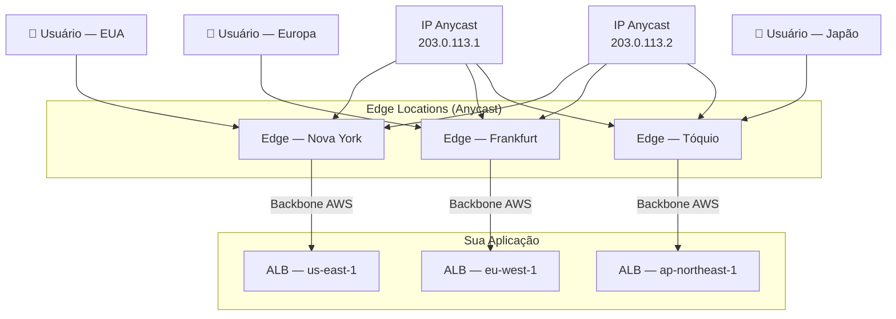
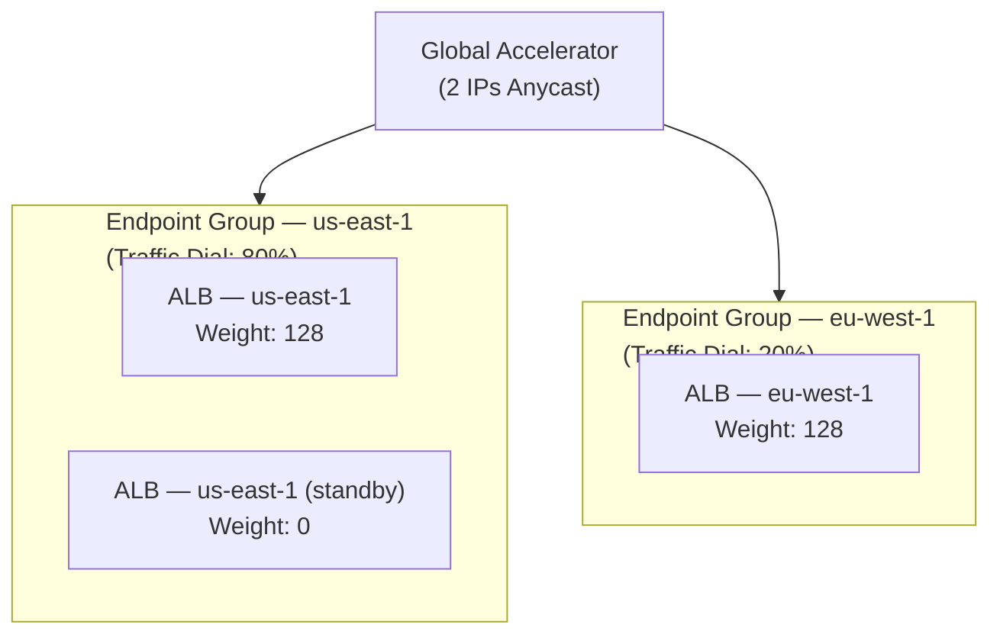
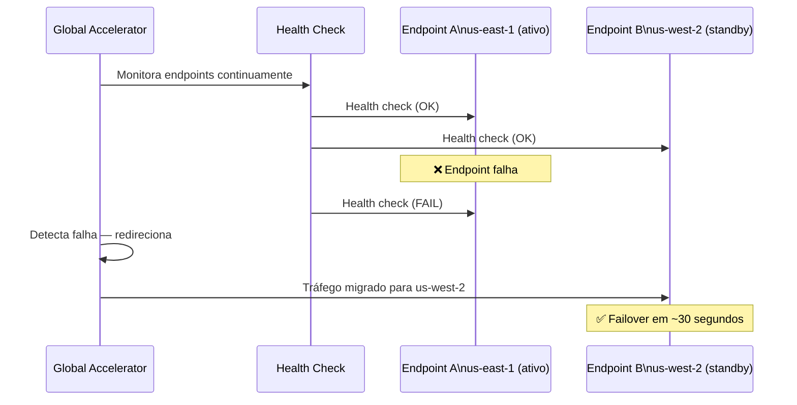
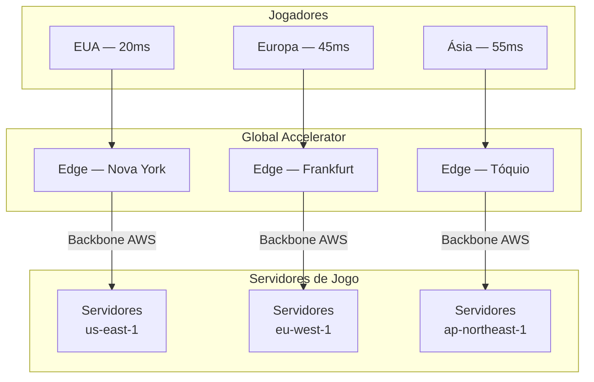

# 18 - AWS Global Accelerator

## 1. Explicação Técnica

Na nota do CloudFront, a gente viu que os Edge Locations da AWS são usados para fazer cache de conteúdo próximo ao usuário. O Global Accelerator também usa Edge Locations, mas com um objetivo completamente diferente: não é sobre cache, é sobre **rota**.

Pensa assim: você mora em Tóquio e precisa fazer uma ligação para alguém em São Paulo. Você pode ligar pela rede pública de telefonia, que vai passar por dezenas de operadoras, roteadores, cabos de diferentes qualidades, até chegar lá. Ou você pode ligar por um sistema de comunicação corporativo dedicado que usa um cabo de fibra óptica exclusivo, sem concorrência, sem desvios desnecessários. A qualidade é ordens de magnitude melhor. Isso é o **AWS Global Accelerator**: quando o seu pacote chega no Edge Location mais próximo de você, ele entra no **backbone privado da AWS** e vai até a sua aplicação sem sair da rede da AWS.

Tecnicamente, o Global Accelerator fornece **dois endereços IP Anycast estáticos** que servem como ponto de entrada global para a sua aplicação. Qualquer usuário no mundo que conectar nesses IPs é automaticamente direcionado para o Edge Location mais próximo, de onde o tráfego segue pelo backbone dedicado da AWS até os seus endpoints.

---

## 2. Os Dois IPs Anycast Estáticos

Esse é o diferencial técnico mais importante do Global Accelerator e o que mais aparece na prova.

O serviço fornece **dois endereços IPv4 estáticos** usando tecnologia **Anycast**. No Anycast, o mesmo IP é anunciado por múltiplos pontos de presença ao mesmo tempo. Quando um usuário conecta naquele IP, a rede de internet automaticamente roteia o pacote para o ponto de presença Anycast mais próximo geograficamente, sem que o usuário precise saber qual é.

O fato de serem IPs fixos tem implicações práticas importantes: clientes que precisam colocar endereços IP em allowlists de firewall podem usar esses dois IPs. Com CloudFront (e DNS em geral), o IP pode mudar. Com Global Accelerator, os dois IPs nunca mudam.

---

## 3. Endpoints e Endpoint Groups

O Global Accelerator não aponta diretamente para instâncias. Ele usa uma hierarquia de dois níveis:

### Endpoint Groups

Um **Endpoint Group** é associado a uma região AWS. Ele representa um grupo de recursos em uma região específica que o Global Accelerator pode enviar tráfego. Você pode ter múltiplos Endpoint Groups, um por região onde sua aplicação está deployada.

Cada Endpoint Group tem um **Traffic Dial**: uma porcentagem (0–100%) que controla quanto do tráfego total o Global Accelerator envia para aquele grupo. Um Endpoint Group com Traffic Dial em 0% recebe zero tráfego. Com 100%, recebe proporcionalmente ao peso dos outros grupos. Isso é muito útil para deploys canary multi-região ou para simular failover sem remover a região.

### Endpoints

Dentro de cada Endpoint Group, você define os **Endpoints**: os recursos que efetivamente recebem o tráfego. Os tipos suportados são Application Load Balancer, Network Load Balancer, instâncias EC2 e Elastic IPs.

Cada endpoint tem um **Weight** (peso de 0 a 255) que define a proporção de tráfego dentro daquele grupo. Um endpoint com weight 128 recebe o dobro de tráfego de um com weight 64.

---

## 4. Health Checks e Failover Automático

O Global Accelerator monitora continuamente a saúde dos endpoints. Se um endpoint começa a falhar (retornando erros ou não respondendo), o GA automaticamente redireciona o tráfego para endpoints saudáveis, seja dentro do mesmo Endpoint Group ou em outro grupo de outra região.

O failover acontece em aproximadamente 30 segundos, sem necessidade de alteração de DNS ou propagação de TTL. Esse é um ponto importante em relação ao Route 53 com TTL: com DNS você depende de propagação (TTL pode ser de minutos a horas), com Global Accelerator o redirecionamento é quase imediato porque o IP nunca muda.

---

## 5. Protocolos Suportados — Onde o GA Brilha

O CloudFront é HTTP/HTTPS. O Global Accelerator opera na **camada 4** e suporta qualquer protocolo TCP e UDP. Isso abre casos de uso completamente diferentes:

| Protocolo | Caso de uso |
|-----------|-------------|
| TCP | Aplicações web, APIs, bancos de dados |
| UDP | Jogos online (baixíssima latência), VoIP, streaming ao vivo |
| TCP + UDP | IoT, aplicações de tempo real |

Para jogos online, a diferença entre rota pela internet pública e rota pelo backbone da AWS pode significar a diferença entre uma experiência jogável e uma experiência frustrante. Latência consistente é crítica, e o backbone da AWS entrega exatamente isso.

---

## 6. Custo

| Componente | Detalhe |
|------------|---------|
| Taxa fixa por acelerador | Por hora de existência do acelerador (independente de uso) |
| Taxa por GB transferido | Por GB de dados transferidos pela rede acelerada |
| Data Transfer Premium | Diferença entre o custo de egress normal e o custo de usar o backbone AWS |

---

## 7. Cenário Real Enterprise

Uma empresa de jogos tem jogadores espalhados pela América, Europa e Ásia conectando em servidores de jogo em tempo real. O protocolo usado é UDP (baixa latência, tolerante a pacotes perdidos). Com roteamento pela internet pública, jogadores asiáticos experimentavam latências variáveis de 150-300ms para servidores na América do Norte.

Cada jogador conecta ao Edge Location mais próximo, e de lá o tráfego segue pelo backbone da AWS até o servidor mais próximo. Latência cai para 20–55ms. Jogadores asiáticos deixam de reclamar.

---

## 8. Quando Usar / Quando NÃO Usar

**Use Global Accelerator quando:**

- A aplicação usa protocolos não-HTTP como UDP ou TCP puro (jogos, VoIP, IoT)
- Você precisa de IPs fixos e estáticos para allowlists de firewall de clientes
- O failover precisa ser em segundos, sem depender de propagação de DNS
- Usuários globais reclamam de latência variável ou alta para acessar sua aplicação
- Você quer reduzir o número de hops pela internet pública

**Não use Global Accelerator quando:**

- O conteúdo é estático e pode ser cacheado: CloudFront é mais barato e mais eficiente
- A aplicação é puramente HTTP/HTTPS sem requisito de IP fixo: CloudFront ou um bom DNS com latency routing resolve
- O custo de Data Transfer Premium é proibitivo para o volume de dados

---

## 9. Trade-offs

| Dimensão | Global Accelerator | CloudFront |
|----------|--------------------|------------|
| Propósito | Acelerar roteamento, reduzir hops | Cache de conteúdo no edge |
| Protocolos | TCP e UDP (L4) | HTTP/HTTPS apenas (L7) |
| Cache | Não | Sim |
| IPs estáticos | Sim (2 Anycast fixos) | Não (DNS dinâmico) |
| Failover | ~30 segundos (sem DNS TTL) | Depende de TTL do DNS |
| Latência de failover | Baixa | Depende do TTL configurado |
| Custo | Por hora + por GB (premium) | Por GB + por requisição |
| Uso ideal | Aplicações TCP/UDP, jogos, VoIP | Sites, APIs, conteúdo estático/dinâmico |

---

## 10. Pegadinhas Comuns da Prova

> **[PEGADINHA #1]** - *"Global Accelerator e CloudFront fazem a mesma coisa?"*
> Não. O CloudFront faz cache de conteúdo no Edge Location. O Global Accelerator usa o Edge Location apenas como ponto de entrada para rotear o tráfego pelo backbone da AWS até a origin, sem cache.

> **[PEGADINHA #2]** - *"O Global Accelerator fornece IPs que podem mudar ao longo do tempo?"*
> Não. São dois IPs Anycast estáticos que nunca mudam enquanto o acelerador existir. Isso é um diferencial importante em relação a Load Balancers e CloudFront, que têm DNS dinâmico.

> **[PEGADINHA #3]** - *"O failover do Global Accelerator depende de propagação de DNS?"*
> Não. Como os IPs são fixos, o redirecionamento acontece na camada de roteamento do backbone AWS, sem alterar DNS. O failover ocorre em ~30 segundos independente de TTL.

> **[PEGADINHA #4]** - *"O Global Accelerator suporta UDP?"*
> Sim. Ao contrário do CloudFront (somente HTTP/HTTPS), o Global Accelerator opera na camada 4 e suporta TCP e UDP.

> **[PEGADINHA #5]** - *"O que é um Traffic Dial no Global Accelerator?"*
> Uma porcentagem (0–100%) configurada por Endpoint Group que controla quanto do tráfego total aquele grupo recebe. Útil para deploys canary e simulação de failover progressivo.

> **[PEGADINHA #6]** - *"Para um cliente que precisa colocar o IP do Load Balancer em allowlist de firewall, qual serviço usar?"*
> Global Accelerator. Ele fornece dois IPs Anycast estáticos. Um NLB também tem IP estático (Elastic IP por AZ), mas o GA adiciona a aceleração global e o failover automático.

---

## 11. Resumo Final

O AWS Global Accelerator melhora a performance de aplicações globais reduzindo a quantidade de hops pela internet pública. Dois IPs Anycast estáticos direcionam qualquer usuário ao Edge Location mais próximo, de onde o tráfego segue pelo backbone privado da AWS até os endpoints.

A arquitetura usa Endpoint Groups por região com Traffic Dials para controle de distribuição de tráfego, e endpoints com pesos dentro de cada grupo. Health checks contínuos garantem failover automático em ~30 segundos sem necessidade de propagação de DNS.

Diferente do CloudFront, o Global Accelerator não faz cache e suporta TCP e UDP, tornando-o ideal para jogos, VoIP, IoT e qualquer aplicação que precise de IPs fixos, failover rápido ou protocolos não-HTTP.

---

## 12. Flashcards Rápidos

**Q: Quantos IPs o Global Accelerator fornece?**
A: Dois IPs Anycast estáticos e fixos.

**Q: Qual é a diferença fundamental entre Global Accelerator e CloudFront?**
A: CloudFront faz cache de conteúdo no Edge Location. Global Accelerator usa o Edge como ponto de entrada para rotear pelo backbone AWS até a origin, sem cache.

**Q: O Global Accelerator suporta UDP?**
A: Sim. Ele opera na camada 4 e suporta TCP e UDP.

**Q: O failover do Global Accelerator depende de TTL de DNS?**
A: Não. Os IPs são fixos e o redirecionamento é feito na camada de roteamento. Failover em ~30 segundos.

**Q: O que é Traffic Dial?**
A: Percentual (0–100%) configurado por Endpoint Group que define quanto do tráfego total aquele grupo recebe.

**Q: Quais tipos de endpoint o Global Accelerator suporta?**
A: ALB, NLB, instâncias EC2 e Elastic IPs.

**Q: Por que usar Global Accelerator em vez de CloudFront para um jogo online?**
A: Jogos usam UDP (não suportado pelo CloudFront), precisam de latência consistente e se beneficiam do roteamento pelo backbone sem cache.
