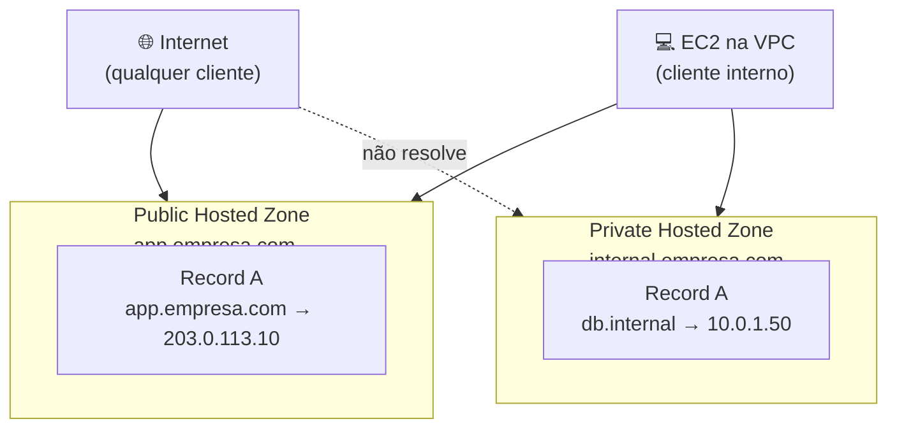
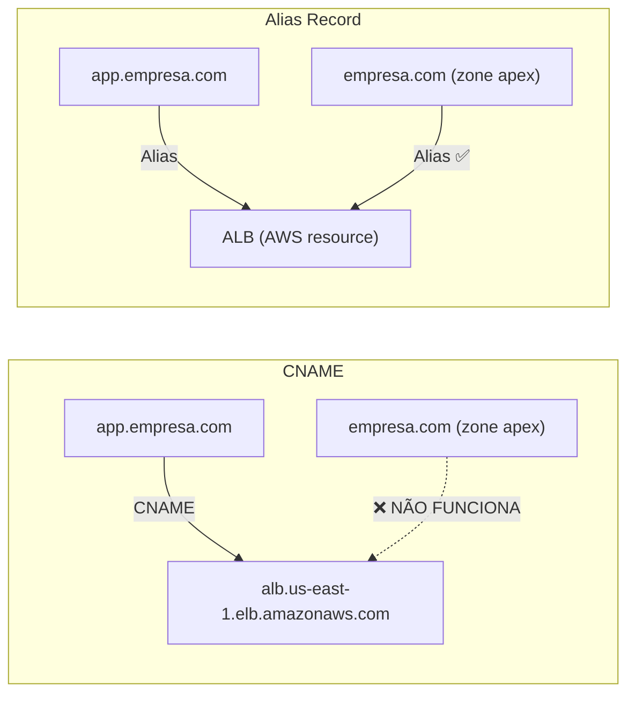
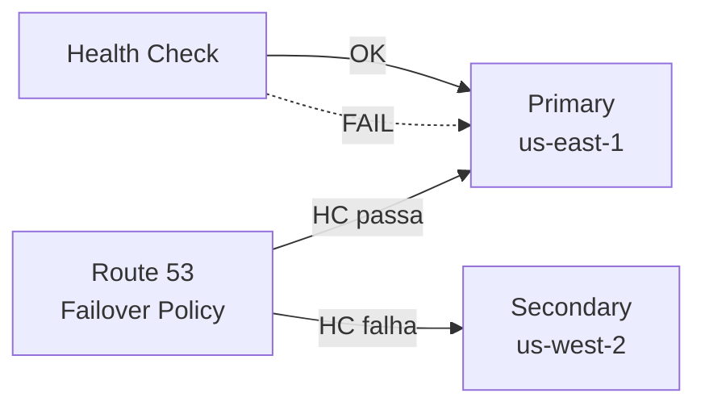
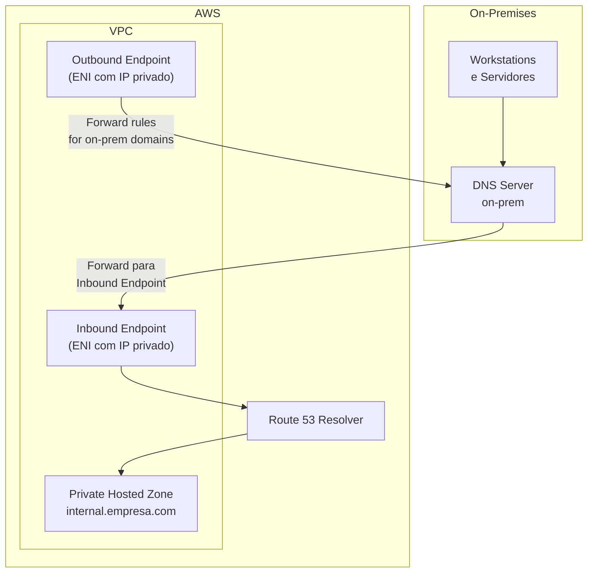
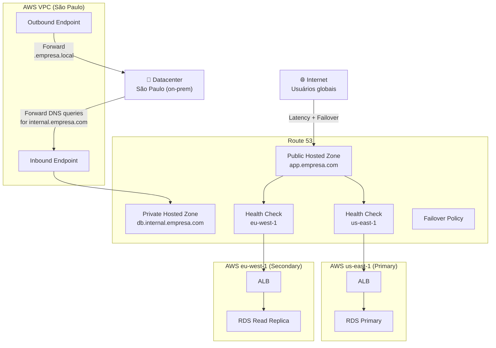

# 19 - Route 53

## 1. Explicação Técnica

Na nota do Global Accelerator, a gente viu como dois IPs Anycast estáticos direcionam usuários globais pelo backbone da AWS até os endpoints. Mas o Global Accelerator é uma exceção: a maioria das aplicações ainda depende de **DNS** para resolver nomes de domínio em endereços IP. E o DNS da AWS é o **Route 53**.

Pensa no Route 53 como uma agenda telefônica global. Quando alguém digita `app.empresa.com` no navegador, a primeira coisa que acontece antes de qualquer byte de aplicação trafegar é uma consulta DNS: "qual é o endereço de `app.empresa.com`?" O Route 53 responde com um IP, e o cliente abre a conexão. Sem essa resolução, a internet inteira para de funcionar.

O Route 53 é o **serviço DNS gerenciado da AWS**. Diferente de quase todos os outros serviços, ele é **global**, não pertence a nenhuma região específica. Você paga por hosted zone, por consultas, e por health checks, mas não escolhe region ao criar.

Além de resolução de DNS, o Route 53 também permite:
- Registro e gerenciamento de domínios
- Health checks de endpoints
- Roteamento inteligente de tráfego com políticas de roteamento

---

## 2. Hosted Zones

Antes de criar qualquer record DNS no Route 53, você precisa de uma **Hosted Zone**. Ela é exatamente o que o nome diz: o container que hospeda os seus registros DNS para um domínio.

Existem dois tipos de Hosted Zone e essa distinção é muito cobrada na prova.

### Public Hosted Zone

Resolve DNS para a internet pública. Se alguém no mundo digitar `app.empresa.com`, o Route 53 resolve via Public Hosted Zone.

### Private Hosted Zone

Resolve DNS apenas dentro de uma ou mais VPCs específicas. Ideal para nomes internos como `database.internal.empresa.com` que não devem ser visíveis fora da rede privada.



Quando você cria uma Hosted Zone, a AWS aloca automaticamente **4 name servers** exclusivos para ela. Você não escolhe os nameservers, a AWS sorteia 4 do pool global dela para distribuir resiliência.

---

## 3. Tipos de Record

O Route 53 suporta os tipos de record padrão da RFC mais alguns específicos da AWS. Os mais importantes para a prova:

| Tipo | O que faz |
|------|-----------|
| A | Mapeia nome para IPv4 |
| AAAA | Mapeia nome para IPv6 |
| CNAME | Mapeia nome para outro nome (nunca para zone apex) |
| MX | Define servidores de email para o domínio |
| TXT | Texto livre, usado para verificação e SPF |
| NS | Nameservers da Hosted Zone |
| SOA | Start of Authority, metadados da zona |
| **Alias** | Extensão AWS: mapeia nome para recurso AWS (pode ser zone apex) |

### Alias vs CNAME: a distinção mais importante

O **Alias record** é uma invenção da AWS que resolve uma limitação histórica do DNS. Pelo padrão RFC, você não pode criar um CNAME para o zone apex (o domínio raiz, ex: `empresa.com` sem subdomínio). Se você quiser que `empresa.com` (sem `www`) aponte para um ALB, CNAME não funciona.

O Alias resolve isso e vai além:



| Dimensão | CNAME | Alias |
|----------|-------|-------|
| Zone apex | Não suporta | Suporta |
| Custo por consulta | Cobrado | **Gratuito** para recursos AWS |
| Alvos | Qualquer hostname | Somente recursos AWS (ALB, CloudFront, S3, etc.) |
| TTL | Configurável | AWS gerencia automaticamente |
| Health check | Não nativo | Pode integrar com health check da AWS |

Na prova, sempre que a pergunta mencionar "zone apex", "domínio raiz" ou "custo zero de resolução DNS para recurso AWS", a resposta é **Alias**.

---

## 4. Políticas de Roteamento

Aqui é onde o Route 53 vai muito além de um DNS simples. Ele tem **8 políticas de roteamento** que determinam como responder às consultas. Cada uma tem um caso de uso diferente.

### Simple

O básico. Um record com um ou mais valores. Se houver múltiplos valores, o Route 53 retorna todos e o cliente escolhe aleatoriamente. Não tem health check associado.

### Weighted (Ponderado)

Distribui tráfego proporcionalmente aos pesos configurados. Muito usado para **blue/green deployments** e testes A/B.

```
Peso 80 → versão estável
Peso 20 → nova versão (canary)
```

### Latency-Based

Direciona o usuário para a região AWS que oferece **menor latência de rede** para ele. A AWS mantém uma tabela interna de latência entre regiões e IPs de origem do mundo inteiro.

Atenção: latência menor não é o mesmo que proximidade geográfica. Às vezes uma região mais distante tem melhor latência por causa de peering e rotas de rede.

### Failover

Padrão ativo/passivo. Define um record primário e um secundário. Se o health check no primário falhar, o Route 53 responde com o secundário.



### Geolocation

Roteia com base na **localização geográfica do cliente** (país, continente ou padrão). Diferente de latency-based, aqui você define explicitamente: "usuários do Brasil vão para o endpoint X".

Útil para compliance (dados europeus ficam na Europa), localização de conteúdo ou restrições geográficas.

### Geoproximity

Similar ao Geolocation, mas com um diferencial: você pode usar um **bias** para expandir ou contrair a "área de influência" de uma região. Um bias positivo (+50) faz a região atrair mais usuários do que sua área geográfica natural justificaria.

Requer uso do **Traffic Flow** (editor visual do Route 53).

### Multivalue Answer

Retorna até 8 records saudáveis para uma consulta. Diferente do Simple, cada valor pode ter um health check associado, então o Route 53 só retorna endpoints saudáveis.

Não é um substituto para Load Balancer (opera na camada DNS, sem balanceamento real de carga), mas distribui tráfego entre múltiplos endpoints com remoção automática de instâncias unhealthy.

### IP-Based

Roteia com base no **CIDR de origem** do cliente. Você mapeia: "clientes vindo de 192.0.2.0/24 vão para o endpoint Y".

Útil quando você sabe os ranges de IP de clientes específicos (como ISPs parceiros ou redes corporativas) e quer direcioná-los para um endpoint dedicado.

---

## 5. Health Checks

O Route 53 pode monitorar a saúde dos endpoints e usar essa informação nas políticas de roteamento. Existem três tipos de health check:

| Tipo | O que monitora |
|------|----------------|
| Endpoint | HTTP, HTTPS ou TCP em IP ou hostname |
| Calculated | Combina múltiplos health checks (AND/OR lógico) |
| CloudWatch Alarm | Estado de um alarme CloudWatch (permite monitorar coisas não-HTTP) |

Os health checkers da AWS ficam em múltiplas regiões. Para um endpoint ser considerado saudável, mais de 18% dos checkers precisam reportar sucesso.

Atenção: health checks de **endpoints privados** (dentro de VPC) não funcionam diretamente porque os health checkers são na internet pública. A solução é usar um health check de CloudWatch Alarm que monitora a saúde via métricas internas.

---

## 6. Route 53 Resolver

Por padrão, EC2 dentro de uma VPC usam o **Amazon DNS server** (VPC+2 address) para resolução. Mas em arquiteturas híbridas (VPC + on-premises via Direct Connect ou VPN), você precisa que:

1. Queries de DNS dentro da VPC possam resolver nomes on-premises
2. Queries de DNS on-premises possam resolver Private Hosted Zones da AWS

O **Route 53 Resolver** resolve isso com dois componentes:



**Inbound Endpoint:** recebe queries DNS de fora da VPC (on-premises) e as resolve via Route 53. On-premises pode resolver Private Hosted Zones da AWS.

**Outbound Endpoint:** permite que recursos dentro da VPC encaminhem queries para resolvers externos. Você cria **Resolver Rules** que definem: "para domínios `.empresa.local`, encaminhe para o DNS on-premises".

---

## 7. Cenário Real Enterprise

Uma empresa tem presença global, datacenter on-premises em São Paulo e aplicações em múltiplas regiões AWS. Precisa de:
- Domínio público com failover automático entre regiões
- Resolução de nomes internos (banco de dados, serviços internos)
- Integração de DNS entre AWS e datacenter on-premises



---

## 8. Quando Usar / Quando NÃO Usar

**Use Route 53 quando:**

- Você precisa registrar ou gerenciar domínios na AWS
- Quer roteamento inteligente de tráfego com health checks (failover, weighted, latency, geolocation)
- Precisa de Private Hosted Zones para resolução de DNS interna à VPC
- Tem arquitetura híbrida e quer integrar DNS on-premises com AWS via Resolver
- Precisa de roteamento no zone apex (raiz do domínio)

**Não use Route 53 quando:**

- O requisito é IP estático e sem propagação de TTL para failover. Nesse caso, Global Accelerator é mais adequado: o IP nunca muda e o redirecionamento não depende de TTL de DNS
- A latência de propagação de TTL é inaceitável para o caso de failover. Route 53 depende que os clientes respeitem o TTL; Global Accelerator não tem essa limitação
- Você só precisa de cache de conteúdo global. CloudFront é a ferramenta certa

---

## 9. Trade-offs

| Dimensão | Route 53 | Global Accelerator |
|----------|----------|--------------------|
| Camada de operação | DNS (aplicação) | IP/Anycast (rede) |
| Velocidade de failover | Depende de TTL (segundos a minutos) | ~30 segundos sem TTL |
| IPs estáticos | Não (DNS dinâmico) | Sim (2 IPs Anycast fixos) |
| Protocolos | Independente (resolve nome, não transporta) | TCP e UDP (L4) |
| Políticas de roteamento | 8 políticas avançadas | Só geographic routing pelo edge |
| Integração on-premises | Route 53 Resolver | Não nativo |
| Custo | Por hosted zone + por consulta | Por hora + por GB (premium) |

---

## 10. Pegadinhas Comuns da Prova

> **[PEGADINHA #1]** - *"Posso criar um CNAME para o apex do domínio (empresa.com) no Route 53?"*
> Não. CNAME no zone apex viola o padrão RFC. Use um **Alias record**, que é uma extensão da AWS, suporta zone apex e é gratuito para recursos AWS.

> **[PEGADINHA #2]** - *"Qual a diferença entre Geolocation e Latency-Based routing?"*
> Geolocation roteia com base em onde o usuário está geograficamente (país/continente), independente da latência. Latency-Based roteia para a região com menor latência de rede medida, que pode não ser a mais próxima geograficamente.

> **[PEGADINHA #3]** - *"O Multivalue Answer routing é equivalente a um Load Balancer?"*
> Não. Multivalue retorna múltiplos IPs no DNS e o cliente escolhe um. Não há balanceamento real de carga, afinidade de sessão nem roteamento por health da aplicação. Load Balancer opera na camada de transporte/aplicação, muito mais inteligente.

> **[PEGADINHA #4]** - *"Como fazer health check no Route 53 para um endpoint privado dentro de uma VPC?"*
> Health checkers do Route 53 ficam na internet pública e não alcançam endpoints privados diretamente. A solução é criar um health check do tipo **CloudWatch Alarm**, onde o alarme monitora métricas do endpoint privado via CloudWatch e o Route 53 lê o estado do alarme.

> **[PEGADINHA #5]** - *"Qual a diferença entre TTL baixo e Global Accelerator para failover rápido?"*
> TTL baixo acelera a propagação, mas ainda depende que todos os clientes respeitem o TTL (muitos não respeitam, têm caches próprios). Global Accelerator não usa DNS para failover: o IP é fixo e o redirecionamento ocorre no backbone da AWS em ~30 segundos, independente de TTL ou caches de clientes.

> **[PEGADINHA #6]** - *"O Route 53 é regional ou global?"*
> Global. Não é associado a nenhuma região AWS. Isso significa que Hosted Zones e records ficam acessíveis de qualquer lugar, e não há SLA de region específica.

> **[PEGADINHA #7]** - *"O que é necessário para que recursos on-premises resolvam nomes de Private Hosted Zones da AWS?"*
> É necessário criar um **Inbound Endpoint** no Route 53 Resolver dentro da VPC, e configurar o DNS on-premises para fazer forward das queries dos domínios internos para o IP do Inbound Endpoint.

---

## 11. Resumo Final

O Route 53 é o DNS gerenciado da AWS, um serviço global que vai muito além da resolução simples de nomes. Com Hosted Zones públicas e privadas, ele controla resolução DNS tanto para a internet quanto para o interior das VPCs.

O Alias record estende o DNS padrão para suportar zone apex apontando para recursos AWS, sem custo de consulta. As 8 políticas de roteamento transformam o Route 53 em uma ferramenta de orquestração de tráfego: weighted para canary deploys, latency-based para performance global, failover para alta disponibilidade ativa/passiva, geolocation para compliance e localização.

O Route 53 Resolver completa o quadro em arquiteturas híbridas, permitindo que DNS on-premises e AWS coexistam com resolução bidirecional via Inbound e Outbound Endpoints.

A principal limitação é a dependência de TTL para propagação de mudanças. Quando o failover precisa ser independente de TTL, Global Accelerator é a ferramenta certa.

---

## 12. Flashcards Rápidos

**Q: O que é uma Hosted Zone no Route 53?**
A: Container de records DNS para um domínio. Public Hosted Zone resolve para a internet. Private Hosted Zone resolve apenas dentro de VPCs específicas.

**Q: Por que usar Alias em vez de CNAME para apontar para um ALB?**
A: Alias suporta zone apex (domínio raiz), é gratuito para recursos AWS e a AWS gerencia o TTL automaticamente. CNAME não suporta zone apex.

**Q: Qual política de roteamento usar para blue/green deployment no DNS?**
A: Weighted routing. Configure pesos proporcionais ao tráfego desejado para cada versão.

**Q: Qual a diferença entre Geolocation e Latency-Based routing?**
A: Geolocation roteia pelo país/continente do usuário (compliance, localização). Latency-Based roteia pela menor latência de rede medida, que pode ser em região geograficamente mais distante.

**Q: Como o Route 53 faz health check de endpoints privados?**
A: Via health check do tipo CloudWatch Alarm. Os health checkers do Route 53 são públicos e não alcançam IPs privados diretamente.

**Q: O que faz o Inbound Endpoint do Route 53 Resolver?**
A: Permite que sistemas on-premises encaminhem queries DNS para resolver nomes de Private Hosted Zones da AWS.

**Q: O Multivalue Answer substitui um Load Balancer?**
A: Não. Ele retorna múltiplos IPs saudáveis no DNS e o cliente escolhe. Não há balanceamento real, afinidade de sessão ou roteamento inteligente por saúde da aplicação.

**Q: O Route 53 é um serviço regional ou global?**
A: Global. Não pertence a nenhuma região específica AWS.
