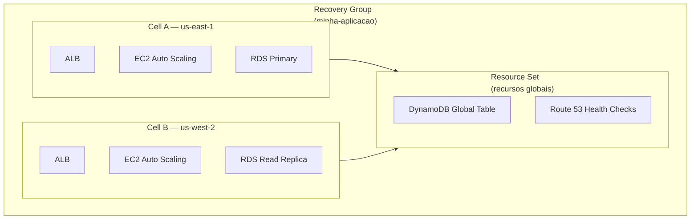
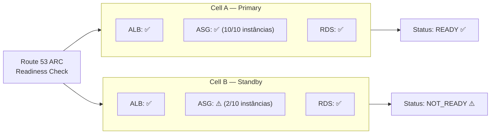
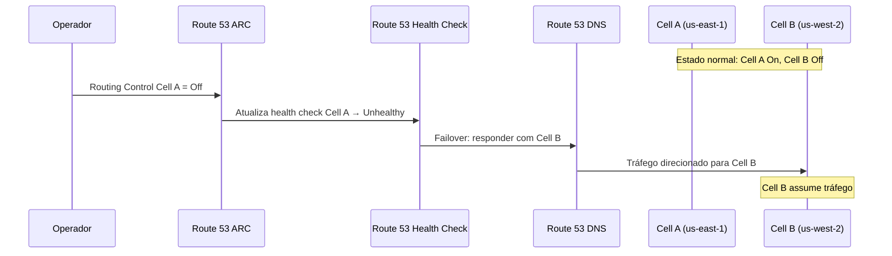
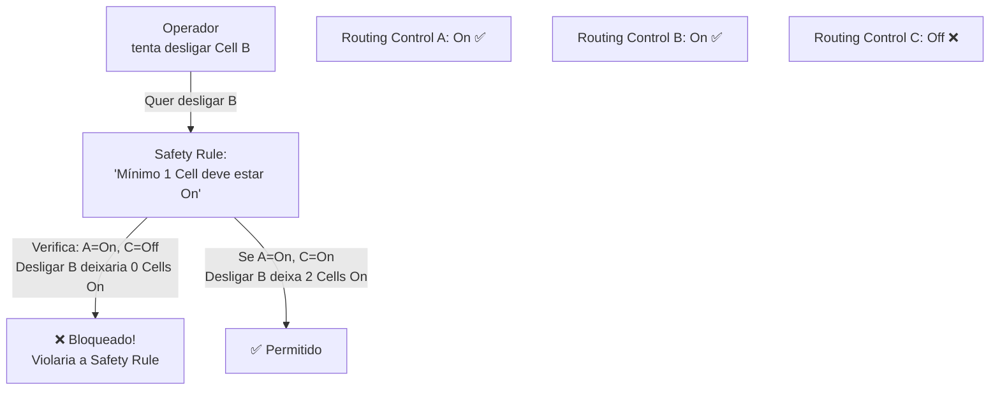
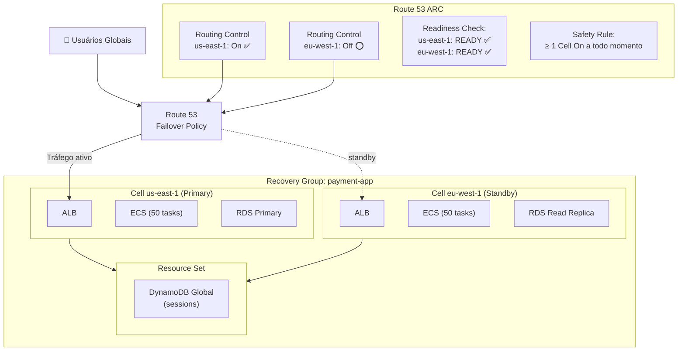

# 20 - Route 53 Application Recovery Controller

## 1. Explicação Técnica

Na nota do Route 53, a gente viu que a política Failover roteia tráfego de um endpoint primário para um secundário quando o health check falha. Parece suficiente para alta disponibilidade, certo? Nem sempre. O problema é que o Route 53 Failover simples monitora se um endpoint está respondendo, mas não verifica se todos os **recursos necessários** para a aplicação funcionar estão prontos. Você pode ter o ALB respondendo, mas o banco de dados ainda não terminou o failover, as capacidades de auto scaling ainda não estão provisionadas, e a réplica de DNS ainda não propagou.

Pensa assim: você tem um avião e quer trocar de piloto durante o voo. Não basta checar se o copiloto está sentado na cadeira, você precisa verificar se ele está com cinto apertado, com os sistemas de controle liberados, com comunicação com a torre funcionando e sem qualquer alerta de instrumentos. Só então você pode transferir o controle. O **Route 53 Application Recovery Controller (ARC)** é exatamente esse sistema de checklist pré-failover, garantindo que antes de redirecionar tráfego, a célula de destino está 100% operacional.

O Route 53 ARC resolve dois problemas distintos:

1. **Readiness**: "Minha aplicação está realmente pronta para receber tráfego?" Verificação contínua de capacidade antes de precisar do failover.
2. **Routing Controls**: "Quero controlar manualmente quando e como redirecionar tráfego." Switches granulares que permitem failover controlado, não apenas automático.

---

## 2. Conceitos Fundamentais

Existem três termos que você precisa dominar para entender o ARC. Eles se encaixam em uma hierarquia.

### Cell (Célula)

Uma **Cell** é o bloco básico do ARC. É um conjunto completo de recursos necessários para a aplicação operar de forma totalmente independente. A regra de ouro é: se uma Cell falhar, ela não pode afetar nenhuma outra Cell.

No contexto prático, uma Cell representa uma "fatia" da sua aplicação em uma região ou AZ, contendo todos os seus componentes: Load Balancer, instâncias de computação, banco de dados, filas, e qualquer outro recurso que a aplicação precise para funcionar.

### Recovery Group (Grupo de Recuperação)

Um **Recovery Group** é uma coleção de Cells que juntas representam uma aplicação completa que você quer monitorar para readiness de failover. Pensa nele como o "envelope" que agrupa todas as réplicas da sua aplicação. Se você tem a aplicação rodando em us-east-1 (Cell A) e us-west-2 (Cell B), o Recovery Group é o objeto que representa "minha aplicação" e contém Cell A e Cell B.

### Resource Set (Conjunto de Recursos)

Um **Resource Set** é um conjunto de recursos AWS que pode abranger múltiplas Cells. Ele existe para representar recursos compartilhados ou globais que todas as Cells usam. O exemplo clássico é uma tabela DynamoDB Global, que é um recurso único usado por todas as regiões: ela não pertence a uma Cell específica, pertence ao Resource Set.

---

## 3. Readiness Check

O **Readiness Check** é o componente que monitora continuamente se cada Cell está com capacidade suficiente para assumir o tráfego de produção. Ele verifica métricas como:

- Número de instâncias saudáveis no Auto Scaling Group
- Capacidade provisionada do banco de dados
- Limites de serviços (service quotas) que podem impedir scale-out
- Configuração de replicação de dados

O resultado de cada Readiness Check é um status simples: `READY` ou `NOT_READY`. O ARC apresenta esse status no console e via API, permitindo que você saiba, antes de qualquer desastre, se sua célula de failover está realmente pronta.

No exemplo acima, a Cell B está `NOT_READY` porque o Auto Scaling Group só tem 2 das 10 instâncias que seriam necessárias para suportar o tráfego de produção. Se um failover acontecesse agora, a aplicação ficaria degradada. O Readiness Check alerta isso proativamente.

---

## 4. Routing Controls

O **Routing Control** é o segundo pilar do ARC, e resolve um problema diferente do Readiness Check. Enquanto Readiness é sobre "estamos prontos?", Routing Controls são sobre "quero controlar exatamente como o tráfego é roteado".

Um Routing Control é basicamente um **switch de on/off** para o tráfego de uma célula. Cada Routing Control tem dois estados: `On` (Cell recebe tráfego) e `Off` (Cell não recebe tráfego). Esses estados são sincronizados com health checks do Route 53, que por sua vez afetam as respostas DNS das políticas de roteamento.

A grande vantagem sobre o Route 53 Failover simples é o **controle manual explícito**. Você decide quando e como fazer failover, não apenas reage a health checks automáticos. Isso é especialmente útil para:

- Manutenção planejada (mover tráfego antes de atualizar uma região)
- Testes de DR (exercitar o failover sem um incidente real)
- Failover gradual (mover uma porcentagem do tráfego, verificar, depois mover o restante)

---

## 5. Safety Rules

O poder dos Routing Controls vem com um risco: um operador pode acidentalmente desligar todas as Cells ao mesmo tempo, derrubando a aplicação inteira. As **Safety Rules** são guardrails que previnem configurações inválidas de routing.

Existem dois tipos de Safety Rule:

| Tipo | Como funciona |
|------|---------------|
| **Assertion Rule** | Define uma condição que deve ser verdadeira após qualquer mudança. Ex: "pelo menos 1 routing control deve estar On". Impede que todos sejam desligados. |
| **Gating Rule** | Define uma condição que deve ser verdadeira antes de permitir uma mudança. Ex: "Cell B só pode ser ligada se Cell A estiver On". |

---

## 6. Cluster de Control Plane

O ARC tem uma característica arquitetural crítica: os Routing Controls ficam em um **cluster com 5 endpoints regionais**. Para que uma mudança de Routing Control tenha efeito, ela precisa ser aplicada em pelo menos 3 dos 5 endpoints (quórum).

Isso garante que mesmo durante uma falha de região AWS, os Routing Controls ainda podem ser alterados usando os outros endpoints do cluster. O ARC foi projetado para funcionar durante os piores cenários de falha, exatamente quando você mais precisa dele.

---

## 7. Cenário Real Enterprise

Uma empresa financeira tem uma aplicação de pagamentos crítica que não pode ter mais de 30 segundos de indisponibilidade não planejada e precisa de um processo de failover controlado e auditável para compliance.

Quando ocorre um incidente em us-east-1, o time de operações:
1. Verifica o Readiness Check de eu-west-1: `READY`
2. Acessa o ARC e seta `Routing Control us-east-1 = Off`
3. A Safety Rule verifica: eu-west-1 ainda estará On. Permitido.
4. Route 53 recebe o health check atualizado e redireciona tráfego para eu-west-1
5. Toda ação fica auditada no CloudTrail com timestamp e operador

---

## 8. Quando Usar / Quando NÃO Usar

**Use Route 53 ARC quando:**

- A aplicação é crítica e failover precisa ser controlado, auditável e com verificação de readiness prévia
- Você quer garantir que a célula de failover tem capacidade suficiente antes do incidente acontecer
- Precisa de guardrails para prevenir erro humano durante failover (Safety Rules)
- O processo de DR precisa ser executado regularmente como exercício e documentado para compliance
- Quer separar o controle de roteamento (Routing Controls) da detecção de falha (health checks)

**Não use Route 53 ARC quando:**

- Um Route 53 Failover policy simples com health check já atende: aplicações não-críticas onde o failover automático sem verificação de readiness é suficiente
- A aplicação não tem arquitetura multi-região: ARC só faz sentido quando existem pelo menos duas Cells independentes
- A equipe não tem processo de DR definido: ARC é uma ferramenta poderosa, mas exige processo e treinamento para operar corretamente

---

## 9. Trade-offs

| Dimensão | Route 53 ARC | Route 53 Failover Simples |
|----------|--------------|--------------------------|
| Verificação de prontidão | Sim, Readiness Check contínuo | Não, apenas health check do endpoint |
| Controle de failover | Manual via Routing Controls | Automático via health check |
| Prevenção de erro humano | Sim, Safety Rules | Não |
| Complexidade de setup | Alta (Cells, Recovery Groups, Resource Sets, Routing Controls, Safety Rules) | Baixa (record DNS + health check) |
| Custo | Por Recovery Group + por Routing Control | Apenas custo do health check |
| Auditoria de mudanças | Via CloudTrail (ARC API calls) | Via CloudTrail (Route 53 API calls) |
| Resiliência do control plane | Alta (cluster com 5 endpoints regionais) | Dependente do Route 53 global |
| Uso ideal | Aplicações tier-1 com RTO crítico e compliance | Aplicações com failover automático simples |

---

## 10. Pegadinhas Comuns da Prova

> **[PEGADINHA #1]** - *"O Route 53 ARC substitui o Route 53 Failover?"*
> Não. O ARC usa o Route 53 por baixo dos panos. Os Routing Controls do ARC atualizam health checks do Route 53, que por sua vez influenciam as respostas DNS das políticas de roteamento. ARC é uma camada de controle sobre o Route 53, não um substituto.

> **[PEGADINHA #2]** - *"O Readiness Check do ARC monitora se a aplicação está respondendo?"*
> Não exatamente. O Readiness Check monitora se a Cell tem **capacidade** para suportar o tráfego de produção: instâncias suficientes no ASG, capacidade do banco, quotas de serviço. É uma verificação de prontidão operacional, diferente de um health check que verifica se o endpoint responde.

> **[PEGADINHA #3]** - *"O que acontece se um operador tentar desligar todos os Routing Controls ao mesmo tempo?"*
> Uma Assertion Rule (Safety Rule) pode impedir isso. Se configurada com "mínimo de 1 Routing Control On", a mudança é bloqueada antes de ser aplicada. Sem Safety Rules, não há proteção automática.

> **[PEGADINHA #4]** - *"Por que o ARC tem um cluster com 5 endpoints para Routing Controls?"*
> Para garantir alta disponibilidade do próprio control plane. Mudanças de Routing Control requerem quórum (3 de 5 endpoints). Mesmo durante falhas de região, o operador pode acessar os outros endpoints e executar o failover.

> **[PEGADINHA #5]** - *"Qual a diferença entre Cell e Recovery Group no ARC?"*
> Cell é a unidade independente de recursos de uma aplicação em uma região/AZ. Recovery Group é a coleção de Cells que representa a aplicação inteira. Você cria um Recovery Group por aplicação, e dentro dele define as Cells de cada região.

---

## 11. Resumo Final

O Route 53 Application Recovery Controller é a resposta da AWS para aplicações onde um failover automático simples não é suficiente. Ele adiciona três capacidades críticas sobre o Route 53 básico: verificação contínua de prontidão (Readiness Check), controle manual e explícito de roteamento (Routing Controls) e proteção contra erros humanos (Safety Rules).

A arquitetura se organiza em Cells (recursos independentes por região), Recovery Groups (coleção de Cells por aplicação) e Resource Sets (recursos globais compartilhados entre Cells). O control plane dos Routing Controls é distribuído em 5 endpoints regionais com quórum de 3, garantindo que você consegue executar failover mesmo durante as piores falhas.

O ARC não substitui o Route 53, ele o complementa: os Routing Controls atualizam health checks do Route 53, que continuam sendo o mecanismo de DNS failover subjacente. A camada adicionada pelo ARC é o controle, a observabilidade de prontidão e os guardrails de segurança que aplicações tier-1 exigem.

---

## 12. Flashcards Rápidos

**Q: O que é uma Cell no Route 53 ARC?**
A: Um conjunto completo de recursos necessários para a aplicação operar de forma independente. Se uma Cell falhar, não pode afetar as outras.

**Q: O que é um Recovery Group no Route 53 ARC?**
A: Uma coleção de Cells que representa uma aplicação completa. Contém todas as réplicas da aplicação em diferentes regiões ou AZs.

**Q: O que é um Resource Set no Route 53 ARC?**
A: Um conjunto de recursos AWS que abrange múltiplas Cells, como uma tabela DynamoDB Global. Representa recursos compartilhados que não pertencem a uma única Cell.

**Q: O que faz o Readiness Check no ARC?**
A: Monitora continuamente se cada Cell tem capacidade (instâncias, banco, quotas) para assumir tráfego de produção. Retorna READY ou NOT_READY.

**Q: O que é um Routing Control no ARC?**
A: Um switch On/Off que controla se uma Cell recebe tráfego. Quando alterado, atualiza um health check do Route 53 que influencia o roteamento DNS.

**Q: O que é uma Safety Rule no ARC?**
A: Um guardrail que previne configurações inválidas de Routing Controls. Assertion Rules definem condições que devem ser verdadeiras após mudanças. Gating Rules definem condições que devem ser verdadeiras antes de permitir mudanças.

**Q: Por que o control plane do ARC tem 5 endpoints regionais?**
A: Para garantir disponibilidade durante falhas de região. Mudanças requerem quórum de 3/5 endpoints, então o failover pode ser executado mesmo com até 2 regiões do cluster indisponíveis.

**Q: O Route 53 ARC substitui o Route 53 Failover?**
A: Não. O ARC usa o Route 53 por baixo: Routing Controls atualizam health checks do Route 53, que continuam sendo o mecanismo de roteamento DNS. ARC é uma camada de controle sobre o Route 53.
