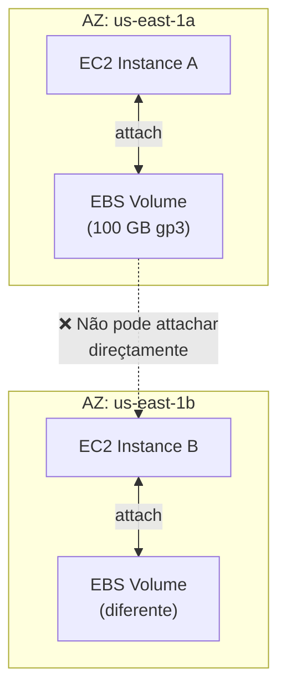
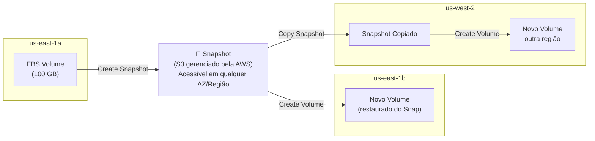
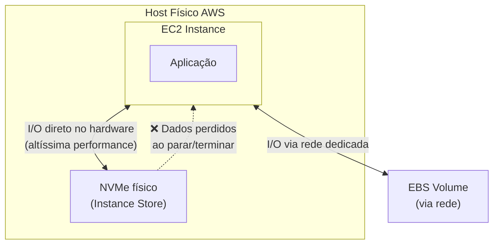
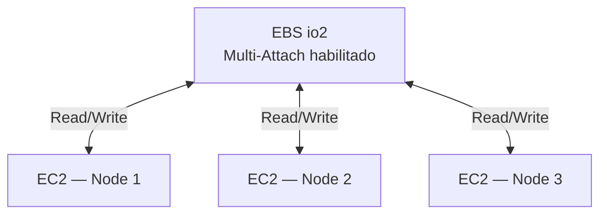
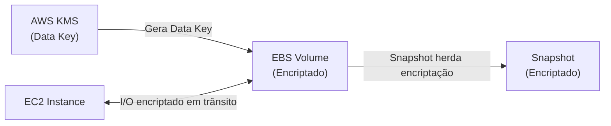
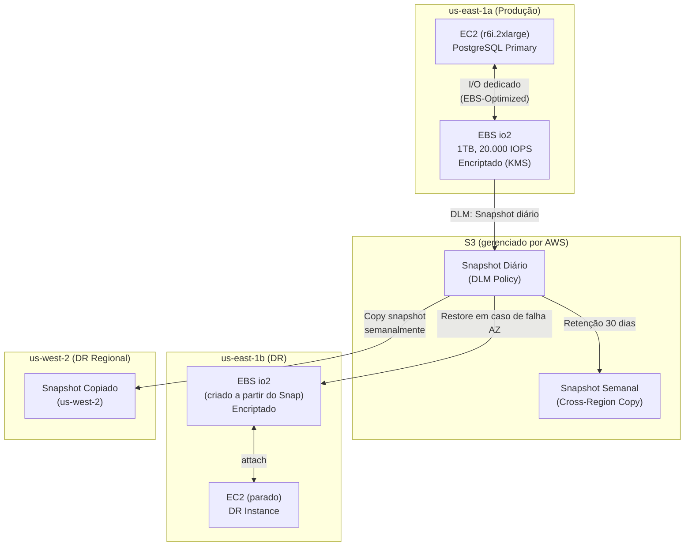

# 01 - EBS (Elastic Block Store)

## 1. Explicação Técnica

No módulo anterior, a gente passou por toda a camada de networking: VPCs, roteamento, conectividade híbrida, DNS e como o tráfego chega até as aplicações. Mas toda aplicação que processa dados precisa, em algum momento, armazená-los em algum lugar. Esse módulo começa exatamente aí: **storage**.

O primeiro serviço de armazenamento que você precisa conhecer é o **Amazon EBS (Elastic Block Store)**. Ele é o "disco rígido" das instâncias EC2. Quando você sobe um servidor na AWS e precisa de um disco para instalar o sistema operacional, guardar dados da aplicação ou hospedar um banco de dados, o EBS é quem fornece esse disco.

Pensa em um HD externo USB: você compra o HD, conecta no computador, e ele aparece como uma unidade de disco que você pode formatar com o filesystem que quiser (XFS, ext4, NTFS). Se você quiser levar esse disco para outro computador, você desconecta e reconecta no outro. O EBS funciona exatamente assim, só que em rede, de forma persistente e gerenciada pela AWS. A instância EC2 enxerga o EBS como um device de bloco padrão `/dev/xvda`, `/dev/sdf`, e você monta o filesystem em cima.

A característica mais importante do EBS é que ele é **persistente**: ao contrário da memória RAM ou do armazenamento temporário local da instância, o EBS sobrevive a paradas e reinicializações do EC2. Você pode parar a instância, a AWS move ela para outro host, e quando volta, o EBS ainda está lá com todos os dados intactos.

---

## 2. Escopo e Vínculo com AZ

Essa é uma das regras mais importantes do EBS e que mais cai na prova: **um volume EBS existe dentro de uma AZ específica**.

Quando você cria um EBS em `us-east-1a`, ele só pode ser attachado em instâncias EC2 que também estão em `us-east-1a`. Não dá para attachar esse volume em uma instância de `us-east-1b` diretamente. Eles estão em infraestrutura física diferente.

Isso tem uma consequência direta: **se a AZ cair, você perde acesso ao EBS** enquanto a AZ estiver indisponível. Os dados continuam lá e voltam quando a AZ se recupera, mas durante a indisponibilidade não há acesso. Para alta disponibilidade real, a estratégia é ter dados replicados em múltiplas AZs, o que geralmente se faz com Multi-AZ de banco de dados (RDS, por exemplo, que vamos ver mais à frente) em vez de tentar replicar EBS manualmente.

---

## 3. Snapshots: Mobilidade e Backup

Para mover dados entre AZs ou regiões, ou para fazer backup, o mecanismo é o **Snapshot**. Um Snapshot é uma cópia point-in-time do volume EBS armazenada no S3 (gerenciado pela AWS, você não vê o bucket diretamente).

A grande sacada dos Snapshots é que eles são **incrementais**: o primeiro Snapshot copia o volume inteiro, os subsequentes copiam apenas os blocos que mudaram desde o último. Isso reduz drasticamente o custo e o tempo de backup.

**Boas práticas para Snapshots:**

- Para garantir consistência, o ideal é tirar o Snapshot com I/O quiesced (aplicação pausada ou volume desmontado). Mas Snapshots de volumes em uso são possíveis com ressalvas de consistência.
- Use o **Amazon Data Lifecycle Manager (DLM)** para automatizar a criação, retenção e deleção de Snapshots com políticas baseadas em schedule.
- Snapshots podem ser compartilhados entre contas AWS ou tornados públicos.
- Snapshots de volumes encriptados são automaticamente encriptados com a mesma chave KMS.

---

## 4. Tipos de Volume EBS

Esse é um dos tópicos mais cobrados no SAP. Você precisa saber escolher o tipo certo para cada workload. Os volumes se dividem em três famílias: SSD de propósito geral, SSD provisionado e HDD.

### SSD de Propósito Geral: gp2 e gp3

São o padrão para a maioria dos workloads. Balanceiam preço e performance.

| Característica | gp2 | gp3 |
|----------------|-----|-----|
| Baseline IOPS | 3 IOPS/GB (mín. 100, máx. 16.000) | 3.000 IOPS fixos independente do tamanho |
| Burst IOPS | Até 3.000 (créditos acumulados) | Até 16.000 IOPS (provisionável) |
| Throughput máx | 250 MB/s | 1.000 MB/s |
| IOPS e throughput | Acoplados ao tamanho do volume | Independentes do tamanho |
| Custo | Referência | ~20% mais barato que gp2 |

O **gp3 é o tipo preferido hoje**. A independência entre IOPS/throughput e tamanho permite dimensionar o que você precisa sem precisar aumentar o disco para ganhar performance. No gp2, para ter 16.000 IOPS você precisaria de um volume de pelo menos 5.334 GB (16.000 / 3). No gp3, você tem 16.000 IOPS num volume de 1 GB se quiser.

### SSD Provisionado: io1 e io2

Para workloads que exigem IOPS muito alto e consistente, como bancos de dados Oracle, SQL Server ou aplicações de missão crítica com SLA rígido.

| Característica | io1 | io2 / io2 Block Express |
|----------------|-----|------------------------|
| Máximo IOPS | 64.000 IOPS | 64.000 (io2) / 256.000 (Block Express) |
| Proporção IOPS:GB | 50:1 | 500:1 |
| Throughput máx | 1.000 MB/s | 4.000 MB/s (Block Express) |
| Durabilidade | 99,8–99,9% | 99,999% |
| Multi-Attach | Sim | Sim |

**io2 é sempre preferível ao io1** pela durabilidade muito superior (99,999%) ao mesmo preço. io2 Block Express é para os workloads mais exigentes do mercado: bancos de dados SAP HANA, Oracle RAC, workloads de alta performance que precisam de centenas de milhares de IOPS.

### HDD: st1 e sc1

Volumes HDD para workloads que precisam de throughput alto (streaming de dados em blocos grandes) mas não de baixa latência ou alto IOPS.

| Característica | st1 (Throughput Optimized) | sc1 (Cold HDD) |
|----------------|--------------------------|----------------|
| Uso ideal | Big Data, log processing, data warehouses | Dados acessados raramente |
| Throughput máx | 500 MB/s | 250 MB/s |
| IOPS máx | 500 | 250 |
| Custo | Baixo | Mais baixo de todos |
| Boot volume | ❌ Não | ❌ Não |

Volumes HDD **não podem ser usados como boot volume** (o disco raiz do sistema operacional deve ser SSD).

---

## 5. Instance Store vs EBS

Antes de continuar, é fundamental entender a diferença entre EBS e o **Instance Store**, que também é um tipo de armazenamento disponível para EC2 mas com características completamente diferentes.

| Dimensão | EBS | Instance Store |
|----------|-----|----------------|
| Persistência | Persiste além do ciclo de vida da instância | **Efêmero**: dados perdidos ao parar ou terminar |
| Performance | Alta (até 256.000 IOPS com io2 BE) | **Extremamente alta** (NVMe local, milhões de IOPS) |
| Custo | Cobrado por GB provisionado | Incluído no preço da instância |
| Backup | Snapshot possível | **Não há mecanismo de snapshot nativo** |
| Resize | Pode ser aumentado online | Tamanho fixo ao lançar |
| Uso ideal | Dados persistentes, banco de dados, boot | Cache, buffers temporários, processamento intermediário |

A regra de ouro: **nunca armazene dados que você não pode perder no Instance Store**. Use-o apenas para dados temporários como cache de aplicação, buffers de processamento ou dados que você pode regenerar facilmente.

---

## 6. Multi-Attach

Por padrão, um volume EBS só pode ser attachado a **uma instância EC2 por vez**. O **Multi-Attach** é uma feature que permite attachar um único volume io1 ou io2 em até **16 instâncias EC2 simultâneas**, desde que todas estejam na mesma AZ.

A restrição crítica: **a aplicação precisa gerenciar o acesso concorrente**. O EBS com Multi-Attach não faz locking nem coordenação de escrita. Se dois nodes escreverem no mesmo bloco simultaneamente sem coordenação, os dados serão corrompidos. Use Multi-Attach apenas com aplicações construídas para isso, como:

- Cluster-aware filesystems (OCFS2, GFS2)
- Oracle RAC
- Aplicações com coordenação própria de acesso concorrente

Não é um substituto para um filesystem compartilhado como Amazon EFS.

---

## 7. Encriptação

O EBS suporta encriptação em repouso e em trânsito (entre a instância EC2 e o volume EBS) usando o **AWS KMS**.

Quando você cria um volume EBS encriptado:
- Os dados em repouso no volume são encriptados
- Os dados em trânsito entre a instância e o volume são encriptados
- Todos os Snapshots criados a partir desse volume são automaticamente encriptados
- Volumes criados a partir de Snapshots encriptados são automaticamente encriptados

Para encriptar um volume existente não encriptado, o processo é: Snapshot do volume → Copiar o Snapshot com encriptação habilitada → Criar novo volume a partir do Snapshot encriptado → Substituir o volume original.

A AWS permite habilitar **encriptação por padrão** na conta: qualquer novo volume EBS criado na região é automaticamente encriptado com a default KMS key. Isso é uma boa prática de segurança recomendada para ambientes enterprise.

---

## 8. EBS-Optimized Instances

Por padrão, instâncias EC2 compartilham a mesma largura de banda de rede para tráfego de dados e para tráfego de EBS. As **EBS-Optimized instances** dedicam um canal separado para I/O do EBS, evitando contenção de rede.

A maioria das instâncias modernas é EBS-Optimized por padrão sem custo adicional. Para instâncias mais antigas, pode ser necessário habilitar manualmente com custo adicional por hora.

---

## 9. Cenário Real Enterprise

Uma empresa de e-commerce tem um banco de dados PostgreSQL de missão crítica em `us-east-1a` e precisa de:
- Alta performance de I/O para transações em pico de vendas
- Backup automático com retenção de 30 dias
- Plano de DR para migração para outra AZ em caso de falha
- Encriptação de todos os dados em repouso

Com esse design:
- Backup automático via DLM sem intervenção manual
- RTO de ~15 minutos: criar volume do último Snapshot e attachar na instância DR da AZ2
- RPO definido pela frequência dos Snapshots (até 1 hora com DLM em mode frequente)
- DR regional possível via cópia de Snapshot para us-west-2

---

## 10. Quando Usar / Quando NÃO Usar

**Use EBS quando:**

- A aplicação precisa de armazenamento persistente de bloco que sobreviva ao ciclo de vida da instância
- Está rodando um banco de dados (PostgreSQL, MySQL, Oracle, SQL Server) que precisa de I/O consistente e baixa latência
- Precisa de backup e recuperação via Snapshots com encriptação
- A workload requer filesystem formatável pelo SO (XFS, ext4) com acesso randômico a blocos

**Não use EBS quando:**

- Os dados são temporários e podem ser perdidos: use Instance Store para máxima performance sem custo extra
- Precisa de armazenamento compartilhado entre múltiplas instâncias com filesystem comum: use Amazon EFS (que vamos ver mais à frente)
- Os dados são objetos (imagens, vídeos, arquivos estáticos): use Amazon S3, que é muito mais barato e escalável para esse caso
- A workload é Big Data com sequential reads massivos sem necessidade de baixa latência: st1 pode atender mas avalie também S3 + EMR

---

## 11. Trade-offs

| Dimensão | gp3 | io2 | st1 | Instance Store |
|----------|-----|-----|-----|----------------|
| Latência | Baixa | Muito baixa | Média (HDD) | Extremamente baixa |
| IOPS máx | 16.000 | 256.000 (Block Express) | 500 | Milhões (NVMe) |
| Throughput máx | 1.000 MB/s | 4.000 MB/s | 500 MB/s | Muito alto |
| Persistência | Sim | Sim | Sim | **Não** |
| Boot volume | Sim | Sim | Não | Não (na maioria) |
| Multi-Attach | Não | Sim | Não | N/A |
| Custo relativo | Médio | Alto | Baixo | Incluso na instância |
| Uso ideal | Propósito geral, boot, dev | Bancos de dados críticos | Big Data, logs | Cache, buffers |

---

## 12. Pegadinhas Comuns da Prova

> **[PEGADINHA #1]** - *"Um volume EBS pode ser attachado em instâncias em AZs diferentes?"*
> Não. Um volume EBS existe em uma AZ específica e só pode ser attachado em instâncias EC2 da mesma AZ. Para mover dados entre AZs, use Snapshot.

> **[PEGADINHA #2]** - *"O gp2 e o gp3 têm o mesmo máximo de 16.000 IOPS, então são equivalentes?"*
> Não. No gp2, para chegar a 16.000 IOPS você precisa de um volume de 5.334 GB (3 IOPS/GB). No gp3, você configura 16.000 IOPS independente do tamanho, inclusive em volumes de 1 GB. O gp3 é mais flexível e ~20% mais barato.

> **[PEGADINHA #3]** - *"O Instance Store pode ser usado como disco principal se você fizer Snapshot antes de desligar?"*
> Não existe Snapshot de Instance Store. Quando a instância é parada ou terminada, os dados do Instance Store são perdidos permanentemente, sem exceção. Para backups, use EBS.

> **[PEGADINHA #4]** - *"Com Multi-Attach habilitado, múltiplos EC2 podem escrever no mesmo EBS sem preocupação?"*
> Não. O EBS com Multi-Attach não faz coordenação nem locking. A aplicação é responsável por gerenciar o acesso concorrente. Sem coordenação, há risco de corrupção de dados. Multi-Attach é para aplicações cluster-aware, não para uso genérico.

> **[PEGADINHA #5]** - *"Snapshots EBS são armazenados no S3 da minha conta?"*
> Não exatamente. Snapshots são armazenados no S3 gerenciado pela AWS internamente. Você não vê um bucket S3 com os Snapshots na sua conta. Você os gerencia via console EBS ou API de EBS, não via S3.

> **[PEGADINHA #6]** - *"Para encriptar um volume EBS existente não encriptado, posso ativar encriptação diretamente no volume?"*
> Não é possível encriptar um volume em uso diretamente. O processo é: Snapshot → Copiar Snapshot com encriptação → Criar volume a partir do Snapshot encriptado.

> **[PEGADINHA #7]** - *"Volumes HDD st1 e sc1 podem ser usados como boot volume?"*
> Não. Boot volumes precisam ser SSD (gp2, gp3, io1, io2). st1 e sc1 não suportam boot.

---

## 13. Resumo Final

O Amazon EBS é o serviço de block storage para instâncias EC2, fornecendo discos persistentes que sobrevivem a paradas e reinicializações. O escopo de AZ é a limitação mais importante: um volume só pode ser attachado em instâncias da mesma AZ, e Snapshots são o mecanismo para mover dados entre AZs e regiões.

A escolha do tipo de volume é crítica para performance e custo. gp3 é o padrão moderno com IOPS independente do tamanho. io2 é para workloads críticos com exigência de IOPS muito alta e durabilidade 99,999%. st1 e sc1 são para throughput com HDD. Instance Store oferece performance extrema mas é efêmero.

Multi-Attach permite compartilhar io1/io2 entre até 16 instâncias na mesma AZ, mas exige que a aplicação gerencie o acesso concorrente. Encriptação com KMS cobre dados em repouso e em trânsito, e os Snapshots herdam a encriptação do volume original.

---

## 14. Flashcards Rápidos

**Q: Um volume EBS pode ser attachado em instâncias de AZs diferentes?**
A: Não. EBS é scoped por AZ. Para mover entre AZs, use Snapshot.

**Q: Qual a diferença principal entre gp2 e gp3?**
A: No gp2, IOPS é acoplado ao tamanho (3 IOPS/GB). No gp3, IOPS é configurável independente do tamanho. gp3 é ~20% mais barato e mais flexível.

**Q: O que acontece com dados no Instance Store quando a instância EC2 é parada?**
A: São perdidos permanentemente. Instance Store é efêmero e não tem mecanismo de Snapshot.

**Q: Para qual tipo de volume o Multi-Attach está disponível?**
A: io1 e io2 apenas. Máximo de 16 instâncias, todas na mesma AZ.

**Q: Como encriptar um volume EBS que já existe e está em uso?**
A: Snapshot do volume → Copiar Snapshot habilitando encriptação → Criar novo volume a partir do Snapshot encriptado → Substituir o volume original.

**Q: Qual tipo de volume EBS tem maior durabilidade?**
A: io2 com 99,999% de durabilidade anual. io1 tem 99,8–99,9%.

**Q: Snapshots EBS são incrementais ou completos?**
A: Incrementais. O primeiro Snapshot copia o volume inteiro. Os seguintes copiam apenas os blocos modificados desde o último Snapshot.

**Q: st1 e sc1 podem ser boot volumes?**
A: Não. Boot volumes precisam ser SSD (gp2, gp3, io1, io2).
