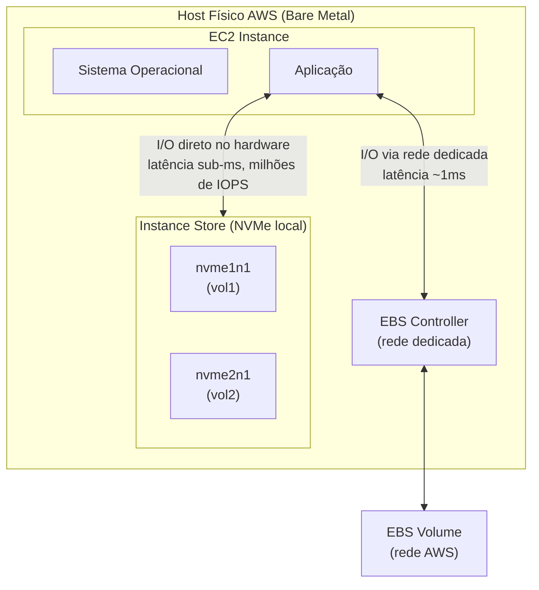
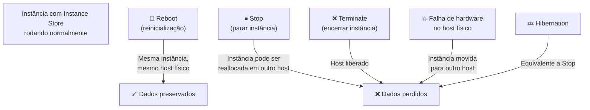
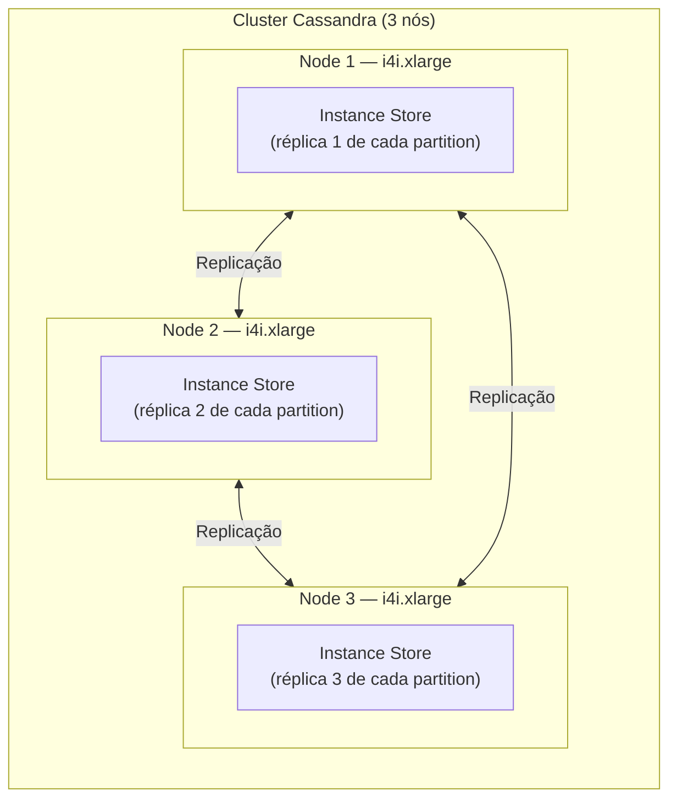
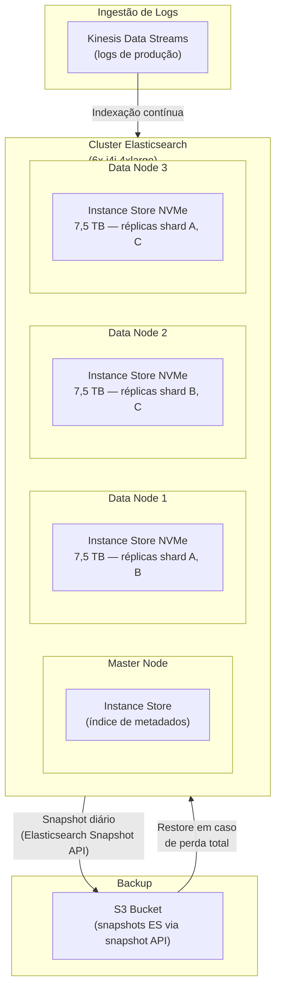

# 02 - Instance Store

## 1. Explicação Técnica

Na nota anterior sobre EBS, a gente viu que os volumes são conectados via rede ao host onde a instância roda, o que garante persistência mas adiciona uma camada de latência de rede. O **Instance Store** é o oposto disso: é armazenamento físico que fica **soldado no mesmo servidor** que hospeda sua instância EC2.

A analogia que o original trouxe é perfeita: pensa em um hipervisor VMware como o ESXi. Você pode ter um datastore SAN que é acessado via iSCSI pela rede (isso seria o EBS), e pode ter os discos locais do próprio servidor físico sendo expostos como discos para as VMs (isso seria o Instance Store). A VM que usa disco local tem acesso extremamente rápido porque não há rede no caminho. A VM que usa SAN tem acesso mais lento mas pode ser movida entre hosts porque o dado fica no storage.

O Instance Store na AWS funciona exatamente assim. Os discos são **NVMe SSDs físicos** instalados no servidor bare metal da AWS onde sua instância está rodando. Nenhuma rede. Nenhum overhead de virtualização de I/O. É o acesso mais rápido que você pode ter na AWS para storage.

A consequência direta dessa arquitetura é a **efemeridade**: se sua instância for movida para outro host físico (o que acontece quando você para e inicia de novo), o servidor anterior não vai junto. Os dados somem. Esse é o trade-off fundamental do Instance Store: **velocidade máxima com persistência zero**.

---

## 2. Como o Instance Store Funciona na Prática

Os volumes de Instance Store são disponibilizados automaticamente quando você lança uma instância que suporta esse tipo de armazenamento. Você não cria, não configura, não paga separado: eles aparecem como block devices mapeados na instância (`/dev/nvme1n1`, `/dev/sdb`, etc.) e você formata e monta como qualquer disco.

O número de volumes e a capacidade total de Instance Store é determinado pelo **tipo de instância**. Você não escolhe o tamanho depois: é fixo para cada family e size.

---

## 3. Quando os Dados São Perdidos (e Quando Não São)

Essa distinção é crítica e sempre cai na prova. Nem toda "interrupção" da instância apaga os dados do Instance Store.

| Evento | Dados do Instance Store |
|--------|------------------------|
| Reboot (OS restart) | Preservados |
| Stop + Start | **Perdidos** |
| Terminate | **Perdidos** |
| Falha de hardware no host | **Perdidos** |
| Hibernation | **Perdidos** |

A lógica é simples: sempre que a instância pode ser colocada em um host físico diferente, os dados do Instance Store estão em risco. O reboot reinicia o SO mas mantém a instância no mesmo host, por isso preserva os dados.

---

## 4. Instâncias com Instance Store

Nem todos os tipos de instância têm Instance Store. As famílias que incluem são especificamente otimizadas para workloads que se beneficiam de alta performance local de I/O:

| Família | Foco | Capacidade de Instance Store |
|---------|------|------------------------------|
| **i4i** | Storage-intensive, OLTP | NVMe SSD, até 30 TB |
| **i3 / i3en** | Storage-optimized, alta densidade | NVMe SSD, até 60 TB (i3en) |
| **d2 / d3** | Dense storage, HDD | HDD, até 336 TB (d3) |
| **h1** | High throughput HDD | HDD, até 16 TB |
| **c5d / c6id** | Compute + local NVMe | NVMe SSD, tamanhos variados |
| **m5d / m6id** | General purpose + local NVMe | NVMe SSD, tamanhos variados |
| **r5d / r6id** | Memory + local NVMe | NVMe SSD, tamanhos variados |

A família `i` é a mais poderosa para I/O: instâncias `i4i.32xlarge` chegam a **4 milhões de IOPS** de leitura e **1,4 milhões de IOPS** de gravação com latência abaixo de 100 microsegundos.

---

## 5. Casos de Uso: Onde o Instance Store Brilha

O Instance Store é mal aproveitado quando usado como substituto simples do EBS. Ele brilha em casos onde:

**Cache de aplicação de alta velocidade**

Redis, Memcached ou caches customizados que podem ser reconstruídos a partir de dados persistentes em outro lugar. A aplicação carrega dados do banco de dados para o cache no Instance Store, serve requisições com latência sub-ms, e se a instância morrer, o cache é reconstruído.

**Nó de dados em clusters com replicação nativa**

Cassandra, Elasticsearch, Kafka e HDFS (Hadoop) são projetados para replicar dados entre múltiplos nós. Cada nó usa Instance Store para máxima performance, e a perda de um nó não resulta em perda de dados porque as réplicas estão nos outros nós.

Se o Node 1 falhar e perder o Instance Store, o cluster continua funcionando e os dados do Node 1 podem ser reconstruídos a partir dos Nodes 2 e 3.

**Processamento intermediário de Big Data**

Jobs do Spark ou Hadoop que leem de S3, processam na memória e no disco local, e escrevem resultados de volta no S3. O Instance Store serve como área de trabalho temporária de altíssima velocidade.

**Scratch space para transcodificação ou rendering**

Pipelines de vídeo que precisam de espaço temporário para processar frames ou segmentos antes de jogar o output final no S3 ou EBS.

---

## 6. Limitações Importantes

Fica ligado nessas restrições que diferenciam Instance Store de EBS:

| Limitação | Detalhe |
|-----------|---------|
| Sem redimensionamento | Tamanho e número fixos pelo tipo de instância. Não dá para aumentar. |
| Sem detach/reattach | Não é possível desconectar e reconectar em outra instância como EBS |
| Sem Snapshot nativo | Não existe API de Snapshot para Instance Store. Backup manual é responsabilidade da aplicação. |
| Sem encriptação KMS nativa | Alguns hardware têm encriptação em nível de hardware, mas não há integração com KMS como no EBS |
| Sem Multi-Attach | O volume pertence ao host e só é acessível pela instância naquele host |
| Sem boot root em geral | Geralmente não pode ser usado como volume raiz do sistema operacional |

---

## 7. Cenário Real Enterprise

Um time de dados opera um cluster de Elasticsearch para indexar e buscar logs de aplicação (bilhões de documentos). O volume de dados é muito grande e as queries precisam ser sub-segundo. Usar EBS seria possível mas o custo de io2 para a performance necessária seria proibitivo.

Cada nó tem Instance Store NVMe local para os shards que hospeda. A replicação nativa do Elasticsearch garante que a perda de qualquer nó não resulta em perda de dados. Backups periódicos via Elasticsearch Snapshot API (que copia para S3) cobrem o cenário de perda total do cluster.

Resultado: performance de busca sub-200ms com custo muito abaixo de io2 equivalente.

---

## 8. Quando Usar / Quando NÃO Usar

**Use Instance Store quando:**

- A aplicação tem replicação nativa (Cassandra, Elasticsearch, Kafka, HDFS) e pode sobreviver à perda de um nó sem perda de dados
- Precisa da maior performance possível de I/O local (latência sub-ms, milhões de IOPS) e o custo de io2 equivalente é proibitivo
- Os dados são temporários por natureza: cache, buffers, scratch space, dados de processamento intermediário
- O workload é Big Data com leitura sequencial massiva de dados temporários (processamento Spark com dados vindos de S3)

**Não use Instance Store quando:**

- Os dados precisam sobreviver à parada ou término da instância
- A aplicação não tem mecanismo de replicação ou backup automático dos dados locais
- Você precisa redimensionar o storage de forma independente da instância
- O requisito é migrar dados entre instâncias sem downtime
- É o único local onde um dado crítico existe: Instance Store nunca deve ser a única cópia de um dado importante

---

## 9. Trade-offs

| Dimensão | Instance Store | EBS gp3 | EBS io2 |
|----------|---------------|---------|---------|
| Latência | Sub-milissegundo (hardware local) | ~1ms (rede) | ~1ms (rede) |
| IOPS máx | Milhões (i4i.32xlarge) | 16.000 | 256.000 |
| Throughput máx | Muito alto | 1.000 MB/s | 4.000 MB/s |
| Persistência | **Efêmero** (perde ao stop/terminate) | Persistente | Persistente |
| Custo | Incluso na instância | Por GB provisionado | Por GB + IOPS provisionado |
| Resize | **Impossível** | Possível online | Possível online |
| Snapshot/Backup | **Manual/Externo** | Via AWS Snapshot API | Via AWS Snapshot API |
| Detach/Reattach | **Não** | Sim | Sim |
| Encriptação KMS | Não nativa | Sim | Sim |
| Uso ideal | Cache, clusters com replicação, scratch | Propósito geral | Bancos críticos com SLA |

---

## 10. Pegadinhas Comuns da Prova

> **[PEGADINHA #1]** - *"Os dados do Instance Store são perdidos quando a instância EC2 é reiniciada (reboot)?"*
> Não. Um reboot mantém a instância no mesmo host físico, então os dados do Instance Store são preservados. O que apaga os dados é **Stop + Start** (que pode mover a instância para outro host) ou **Terminate**.

> **[PEGADINHA #2]** - *"É possível fazer Snapshot de um volume Instance Store pela console AWS?"*
> Não. Não existe API de Snapshot nativa para Instance Store. O backup precisa ser implementado pela aplicação (ex: Elasticsearch Snapshot API, scripts de cópia para S3, etc.).

> **[PEGADINHA #3]** - *"Uma instância com Instance Store pode ser parada e depois iniciada sem perda de dados?"*
> Não. Stop + Start move a instância potencialmente para outro host. Os dados no Instance Store do host original são perdidos. Instâncias com Instance Store podem ser reinicializadas (reboot), mas não paradas e iniciadas preservando os dados.

> **[PEGADINHA #4]** - *"Para uma aplicação que precisa da maior performance de I/O possível, Instance Store é sempre a melhor escolha?"*
> Depende. Se os dados precisam ser persistentes e a aplicação não tem replicação nativa, Instance Store não é adequado mesmo sendo mais rápido. A performance máxima com persistência vem de EBS io2 Block Express. Instance Store é a escolha certa quando: performance máxima + dados temporários ou replicados.

> **[PEGADINHA #5]** - *"O Instance Store tem custo adicional separado do EC2?"*
> Não. O Instance Store está incluído no preço da instância. Você não paga por GB de Instance Store separadamente como paga pelo EBS.

---

## 11. Resumo Final

O Instance Store é o armazenamento físico diretamente soldado ao servidor que hospeda a instância EC2. Sua vantagem é a performance extrema: latência sub-milissegundo e IOPS na casa dos milhões em instâncias da família `i`, sem overhead de rede. Seu custo é zero adicional: está incluído no preço da instância.

A contrapartida é a efemeridade total. Stop, Terminate ou falha de hardware apagam os dados permanentemente. O reboot é o único evento que preserva os dados, pois mantém a instância no mesmo host.

O caso de uso ideal é aplicações com replicação nativa (Cassandra, Elasticsearch, Kafka, HDFS) onde a perda de um nó é tolerada pelo design, e dados temporários como caches, buffers e scratch space de processamento. Qualquer dado crítico que não tem réplica em outro lugar nunca deve residir apenas no Instance Store.

---

## 12. Flashcards Rápidos

**Q: O Instance Store perde dados em quais eventos?**
A: Stop + Start, Terminate, falha de hardware no host. O Reboot preserva os dados.

**Q: Qual a vantagem de performance do Instance Store sobre o EBS?**
A: Instance Store é hardware local (NVMe), sem rede no caminho. Latência sub-milissegundo e IOPS na casa dos milhões. EBS tem latência de ~1ms por ser acessado via rede.

**Q: É possível fazer Snapshot de Instance Store via console ou API da AWS?**
A: Não. Não existe API nativa de Snapshot para Instance Store. Backup é responsabilidade da aplicação.

**Q: Por que Cassandra, Elasticsearch e Kafka são bons candidatos para usar Instance Store?**
A: Porque têm replicação nativa entre nós. A perda do Instance Store de um nó não representa perda de dados, pois réplicas existem nos outros nós do cluster.

**Q: Qual o custo adicional do Instance Store?**
A: Zero. Está incluído no preço da instância EC2. Não há cobrança por GB.

**Q: É possível desconectar um volume Instance Store e reconectar em outra instância?**
A: Não. Ao contrário do EBS, o Instance Store não pode ser detached e reattached. Ele é fixo ao host físico.
