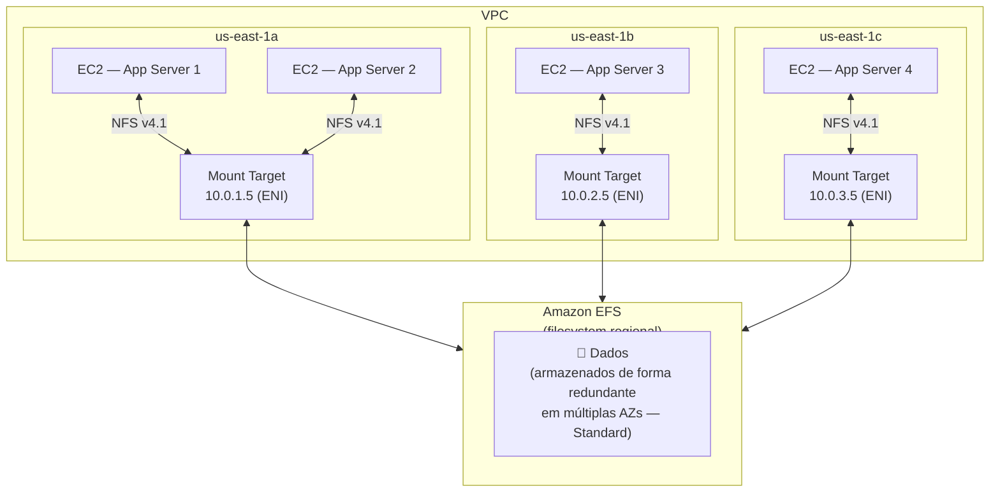
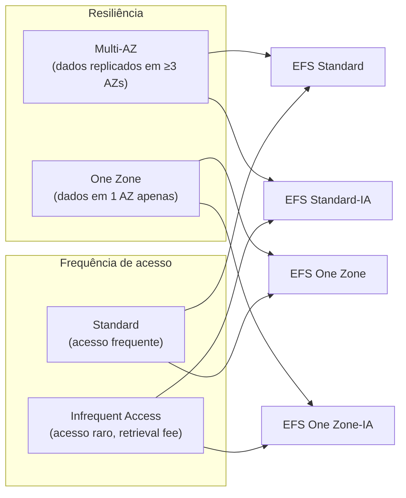
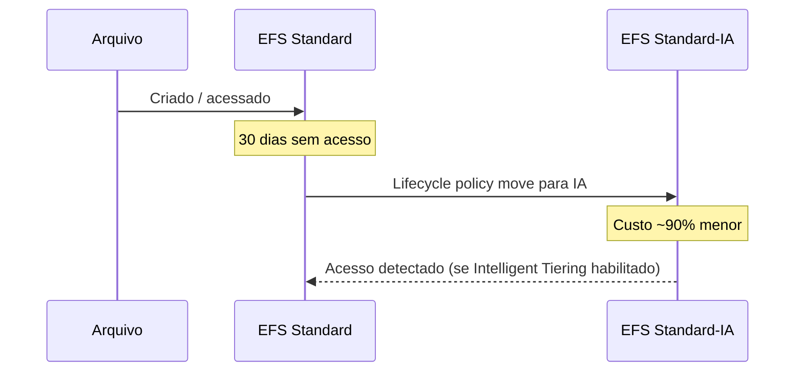
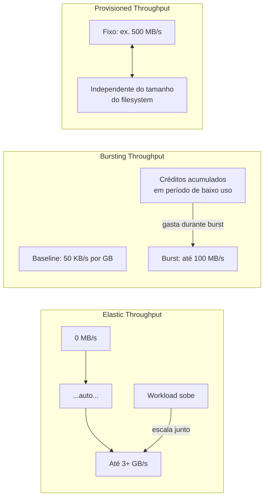
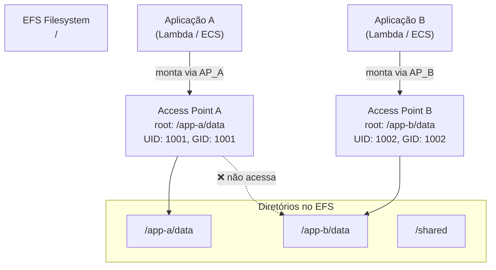
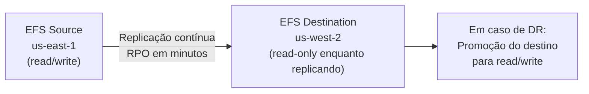
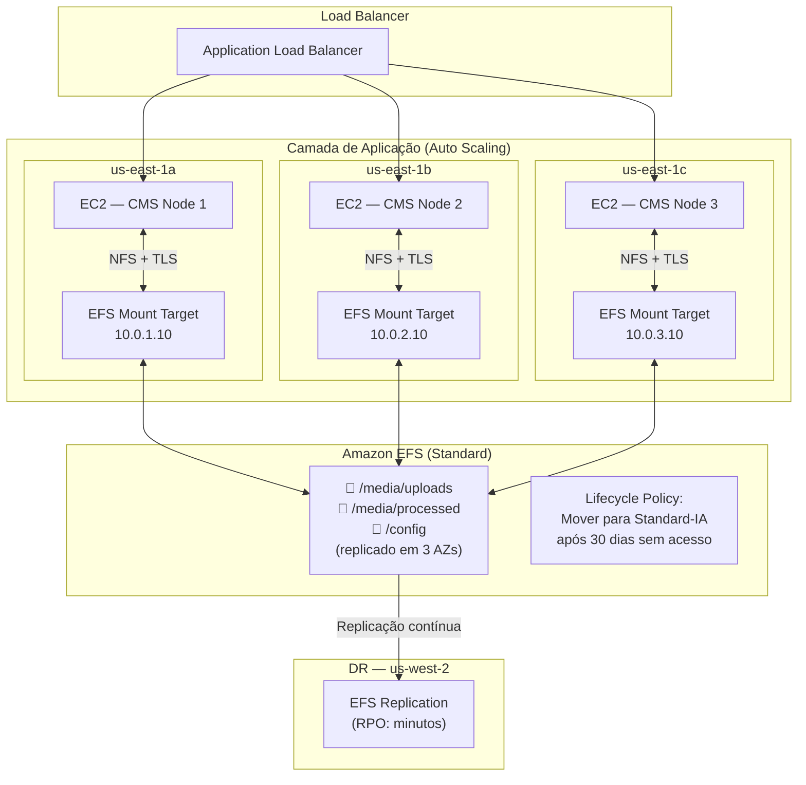

# 03 - EFS (Elastic File System)

## 1. Explicação Técnica

Nas notas anteriores, a gente viu dois tipos de armazenamento para EC2: o **EBS**, que é como um HD externo via rede que você conecta em uma instância por vez, e o **Instance Store**, que é o disco físico soldado no host. Ambos têm uma limitação em comum: são exclusivos de uma instância (ou de um conjunto restrito com Multi-Attach). E se você precisar que **dezenas ou centenas de instâncias acessem o mesmo conjunto de arquivos ao mesmo tempo?**

O original trouxe a analogia certa: pensa nas pastas compartilhadas de rede do Windows corporativo, aquele `\\servidor\departamento\financeiro` que todo mundo da empresa acessava simultaneamente. Você salvava um arquivo lá e qualquer colega via na hora. O **Amazon EFS (Elastic File System)** é exatamente esse conceito, só que gerenciado, elástico, multi-AZ e para Linux.

O EFS é um **filesystem de rede totalmente gerenciado** baseado no protocolo **NFS v4.1**. Você cria um EFS, configura os mount targets em cada AZ da sua VPC, e qualquer instância EC2 Linux (ou container, ou função Lambda) monta esse filesystem como se fosse um diretório local. Múltiplas instâncias acessam o mesmo filesystem simultaneamente, com consistência forte: quando o Node 1 escreve um arquivo, o Node 2 vê imediatamente.

A palavra "Elastic" no nome é literal: o EFS cresce e diminui **automaticamente** conforme você adiciona ou remove arquivos. Não há capacidade pré-provisionada, não há limite para declarar. Você paga exatamente pelo que usa.

---

## 2. Arquitetura: Mount Targets e Acesso Multi-AZ

O EFS não existe em uma AZ específica como o EBS. Ele é um recurso de **região**, mas o acesso a ele é feito por AZ via **Mount Targets**.

Um **Mount Target** é um endpoint de rede (com IP privado em uma subnet) que você cria em cada AZ onde suas instâncias precisam acessar o EFS. Cada Mount Target recebe um endereço IP da subnet e um DNS name. As instâncias montam o EFS usando esse DNS, e o tráfego flui pela rede privada da VPC.



O controle de acesso ao Mount Target é feito por **Security Groups**: o Security Group associado ao Mount Target precisa permitir tráfego NFS (porta 2049) vindo das instâncias.

Para montar o EFS, você usa o helper `amazon-efs-utils`:

```bash
# Instalar o helper
sudo yum install -y amazon-efs-utils

# Montar via mount target DNS (recomendado — redireciona para AZ local automaticamente)
sudo mount -t efs fs-0abc1234:/ /mnt/efs

# Montar com TLS (encriptação em trânsito)
sudo mount -t efs -o tls fs-0abc1234:/ /mnt/efs
```

O DNS do EFS resolve automaticamente para o Mount Target da AZ mais próxima da instância, minimizando latência e custo de transferência inter-AZ.

---

## 3. Storage Classes e Lifecycle Management

O EFS tem quatro storage classes organizadas em duas dimensões: resiliência (multi-AZ vs one-zone) e frequência de acesso (standard vs infrequent access).



| Storage Class | Resiliência | Custo relativo | Uso ideal |
|---------------|-------------|----------------|-----------|
| EFS Standard | Multi-AZ (≥3 AZs) | Mais alto | Dados acessados frequentemente, missão crítica |
| EFS Standard-IA | Multi-AZ (≥3 AZs) | ~90% mais barato no storage | Dados raramente acessados, alta durabilidade necessária |
| EFS One Zone | 1 AZ | ~47% mais barato que Standard | Dev/test, backups, dados que podem ser recriados |
| EFS One Zone-IA | 1 AZ | Mais barato de todos | Dev/test com acesso raro |

### Lifecycle Management

O EFS tem políticas de lifecycle que movem arquivos automaticamente entre classes com base no tempo de último acesso. Você configura regras como:

- "Mover para Standard-IA arquivos não acessados há 30 dias"
- "Mover de volta para Standard quando acessar novamente" (Intelligent Tiering)



---

## 4. Performance Modes

O EFS tem dois **Performance Modes** que determinam o modelo de I/O do filesystem. Você escolhe na criação e não pode alterar depois.

| Performance Mode | Latência | Throughput | Quando usar |
|-----------------|----------|------------|-------------|
| **General Purpose** (padrão) | Menor latência | Até 500.000+ IOPS | Maioria dos workloads: web servers, CMS, home directories, microsserviços |
| **Max I/O** | Latência maior | Throughput agregado mais alto | Processamento paralelo massivo: big data, media processing, análise genômica |

**General Purpose é a escolha certa na grande maioria dos casos.** O Max I/O sacrifica latência por throughput agregado e só faz sentido quando você tem dezenas de instâncias escrevendo simultaneamente e o bottleneck é throughput total, não latência por operação.

---

## 5. Throughput Modes

Separado dos Performance Modes, o **Throughput Mode** define como o throughput disponível é calculado e cobrado. Esse é um ponto mais cobrado na prova que o Performance Mode.

### Elastic Throughput (recomendado)

Throughput **escala automaticamente** para cima e para baixo com as necessidades do workload. Você não configura nada, não gerencia créditos. Ideal para workloads com padrão de acesso imprevisível. Cobrado por GB transferido.

### Bursting Throughput

Throughput **acoplado ao tamanho do filesystem** com um sistema de créditos (igual ao gp2 do EBS). Baseline de 50 KB/s por GB armazenado. Acumula créditos quando abaixo do baseline e pode usar até 100 MB/s (ou 100 MB/s por TB, o que for maior) durante bursts. Problemático para filesystems pequenos com alta demanda de throughput.

### Provisioned Throughput

Você **pré-configura um valor fixo de throughput** independente do tamanho do filesystem. Ideal quando sabe exatamente a demanda e ela é consistente. Cobra por MB/s provisionado além do incluído no storage.



---

## 6. EFS Access Points

O **EFS Access Point** é uma feature avançada que permite criar **pontos de entrada específicos para aplicações** dentro de um mesmo filesystem EFS. Cada Access Point pode:

- Forçar um **diretório raiz** específico dentro do EFS (a aplicação só enxerga aquela subárvore)
- Forçar uma **identidade POSIX** (UID/GID) para todas as operações, independente do usuário que montou



Access Points são especialmente úteis com **AWS Lambda** (que precisa de um Access Point para montar EFS) e **Amazon ECS/EKS** (onde containers diferentes precisam de isolamento de diretório no mesmo filesystem compartilhado).

---

## 7. Encriptação

O EFS suporta encriptação em dois momentos:

**Em repouso:** usando **AWS KMS**. Habilitada na criação do filesystem. Todos os dados armazenados, metadados e backups são encriptados com a chave KMS escolhida.

**Em trânsito:** usando **TLS** (Transport Layer Security). Habilitado na opção `-o tls` do comando de mount. O EFS mount helper gerencia a sessão TLS automaticamente.

Boa prática enterprise: habilitar ambos. A AWS permite forçar encriptação em trânsito via IAM Policy no recurso EFS, bloqueando montagens sem TLS.

---

## 8. EFS Replication

O EFS oferece **replicação contínua** para outro filesystem EFS em outra região ou AZ como estratégia de DR. A replicação é gerenciada pela AWS com RPO de minutos.



O filesystem de destino é somente leitura enquanto a replicação está ativa. Em caso de failover, você "promove" o destino para read/write e reconfigura os clientes.

---

## 9. EFS vs EBS vs Instance Store

Esse quadro comparativo é o que você precisa ter na cabeça para escolher rapidamente no exame:

| Dimensão | EBS | EFS | Instance Store |
|----------|-----|-----|----------------|
| Protocolo | Block (device) | NFS v4.1 (filesystem) | Block (device local) |
| Acesso simultâneo | 1 instância (Multi-Attach: até 16 em io1/io2) | **Milhares de instâncias** | 1 instância |
| Escopo | **AZ** | **Região** (via mount targets) | Host físico |
| SO compatível | Linux e Windows | **Linux apenas** | Linux e Windows |
| Persistência | Sim | Sim | **Não** (efêmero) |
| Capacidade | Pré-provisionada (GB) | **Elástica** (paga pelo uso) | Fixa pelo tipo de instância |
| Latência | ~1ms | Maior (~alguns ms NFS) | Sub-ms (hardware local) |
| Custo por GB | Médio (~$0,08/GB gp3) | Alto (~$0,30/GB Standard) | Incluso na instância |
| Backup | Snapshot AWS | AWS Backup | Manual/externo |
| Uso ideal | Banco de dados, boot volume | **Conteúdo compartilhado**, home dirs, CMS | Cache, clusters com replicação |

---

## 10. Cenário Real Enterprise

Uma empresa de mídia tem um sistema de gerenciamento de conteúdo onde múltiplos servidores de aplicação processam e servem vídeos e imagens. Os servidores precisam acessar o mesmo repositório de arquivos simultaneamente, e o storage precisa ser durável e disponível em múltiplas AZs.



Qualquer node de aplicação vê imediatamente os arquivos criados por outro node. O Auto Scaling pode adicionar nodes em qualquer AZ sem nenhuma configuração adicional de storage: o novo node monta o EFS e já tem acesso a todos os arquivos. O Lifecycle Management move automaticamente conteúdo antigo para Standard-IA, reduzindo custo.

---

## 11. Quando Usar / Quando NÃO Usar

**Use EFS quando:**

- Múltiplas instâncias EC2, containers ou funções Lambda precisam acessar o mesmo filesystem simultaneamente
- A aplicação é Linux e usa operações de filesystem POSIX (permissões, symlinks, rename atômico)
- O tamanho do storage é imprevisível e você não quer pré-provisionar capacidade
- O conteúdo é compartilhado: uploads de usuários, conteúdo de CMS, home directories, configurações
- Precisa de armazenamento compartilhado para containers ECS ou EKS sem gerenciar volumes manualmente

**Não use EFS quando:**

- A workload é Windows: EFS só suporta NFS/Linux. Para Windows, use Amazon FSx for Windows File Server
- Precisa da menor latência possível para banco de dados: EBS io2 tem latência menor e I/O mais consistente para bancos de dados transacionais
- O acesso é de uma única instância e não precisa ser compartilhado: EBS é mais barato e tem latência menor
- O conteúdo são objetos grandes sem necessidade de filesystem POSIX (imagens, vídeos estáticos): S3 é muito mais barato por GB

---

## 12. Trade-offs

| Dimensão | EFS Standard | EFS One Zone | EBS gp3 |
|----------|-------------|-------------|---------|
| Durabilidade | 99,999999999% (11 noves, multi-AZ) | 99,999999999% (1 AZ) | 99,8–99,9% por volume |
| Disponibilidade | 99,99% | 99,9% | Depende da AZ |
| Acesso simultâneo | Milhares de clientes | Milhares de clientes | 1 (ou 16 com Multi-Attach io) |
| Custo storage | ~$0,30/GB/mês | ~$0,16/GB/mês | ~$0,08/GB/mês |
| Latência | Alguns ms (NFS) | Alguns ms (NFS) | ~1ms |
| Compatibilidade | Linux apenas | Linux apenas | Linux e Windows |
| Capacidade | Elástica (auto) | Elástica (auto) | Pré-provisionada |
| Uso ideal | Dados compartilhados críticos | Dev/test, backups | Banco de dados, boot |

---

## 13. Pegadinhas Comuns da Prova

> **[PEGADINHA #1]** - *"O EFS pode ser montado em instâncias Windows EC2?"*
> Não. EFS usa NFS v4.1 e é compatível apenas com Linux. Para filesystems compartilhados em Windows, use Amazon FSx for Windows File Server.

> **[PEGADINHA #2]** - *"EFS Standard e EFS One Zone têm a mesma durabilidade de 11 noves (99,999999999%)?"*
> Sim, ambos têm durabilidade de 11 noves. A diferença está na **disponibilidade**: Standard está em múltiplas AZs e sobrevive à falha de uma AZ. One Zone fica em uma única AZ e pode ficar indisponível se a AZ cair.

> **[PEGADINHA #3]** - *"O Performance Mode pode ser alterado após a criação do filesystem?"*
> Não. O Performance Mode (General Purpose ou Max I/O) é definido na criação e não pode ser modificado. O Throughput Mode (Elastic, Bursting, Provisioned) pode ser alterado.

> **[PEGADINHA #4]** - *"Para um filesystem EFS com poucos GBs que precisa de alto throughput, qual Throughput Mode escolher?"*
> Elastic ou Provisioned. O Bursting Throughput escala com o tamanho do filesystem (50 KB/s por GB), então um filesystem pequeno tem throughput de burst muito limitado. Elastic é recomendado pois escala automaticamente sem depender do tamanho.

> **[PEGADINHA #5]** - *"Uma função Lambda pode montar um EFS diretamente?"*
> Sim, mas precisa de um **Access Point**. Lambda não pode montar o filesystem EFS diretamente pela raiz. Ela monta via um EFS Access Point que define o diretório raiz e as permissões POSIX para a função.

> **[PEGADINHA #6]** - *"EFS é mais barato que EBS por GB?"*
> Não. EFS Standard custa ~$0,30/GB/mês enquanto EBS gp3 custa ~$0,08/GB/mês. EFS é mais caro por GB, mas você paga apenas pelo que usa (sem pré-provisionar). Para workloads com storage compartilhado entre muitas instâncias, o custo total pode ser menor do que ter EBS por instância.

---

## 14. Resumo Final

O Amazon EFS é o filesystem de rede gerenciado da AWS, baseado em NFS v4.1, exclusivo para Linux. Sua característica principal é permitir que **milhares de instâncias EC2, containers e funções Lambda** acessem o mesmo filesystem simultaneamente, com consistência forte e sem gerenciamento de capacidade.

A elasticidade automática elimina o pré-provisionamento: o EFS cresce e diminui conforme você usa. As quatro storage classes (Standard, Standard-IA, One Zone, One Zone-IA) com Lifecycle Management permitem otimizar custos movendo dados frios automaticamente para tiers mais baratos.

Os dois eixos de performance (Performance Mode: General Purpose vs Max I/O; Throughput Mode: Elastic, Bursting, Provisioned) cobrem desde workloads simples de home directories até processamento paralelo massivo de big data. Access Points adicionam isolamento por aplicação dentro do mesmo filesystem, habilitando casos de uso com Lambda e ECS.

Comparado ao EBS, o EFS é mais caro por GB mas única opção quando múltiplas instâncias precisam de filesystem compartilhado no Linux. Para Windows, a alternativa é FSx for Windows File Server, que vamos ver mais à frente.

---

## 15. Flashcards Rápidos

**Q: Qual protocolo o EFS usa e quais sistemas operacionais suporta?**
A: NFS v4.1. Apenas Linux. Windows não é suportado.

**Q: O que é um Mount Target no EFS?**
A: Um endpoint de rede (ENI com IP privado em uma subnet) criado por AZ para que as instâncias montem o filesystem EFS naquela AZ.

**Q: Qual a diferença entre EFS Standard e EFS One Zone?**
A: Standard replica dados em múltiplas AZs (99,99% de disponibilidade). One Zone mantém dados em uma única AZ (99,9% de disponibilidade, mais barato). Durabilidade de 11 noves em ambos.

**Q: Qual Throughput Mode é recomendado para workloads com padrão de acesso imprevisível?**
A: Elastic Throughput. Escala automaticamente sem gerenciamento de créditos ou configuração prévia.

**Q: Uma função Lambda pode montar EFS? O que precisa?**
A: Sim. Lambda precisa de um **EFS Access Point** para montar o filesystem, pois não pode montar pela raiz diretamente.

**Q: EFS é mais barato ou mais caro que EBS por GB?**
A: Mais caro (~$0,30/GB EFS Standard vs ~$0,08/GB EBS gp3). A vantagem do EFS é que você paga só pelo que usa (sem pré-provisionar) e o acesso é simultâneo por múltiplas instâncias.

**Q: O Performance Mode pode ser alterado após a criação do EFS?**
A: Não. É definido na criação e é permanente. O Throughput Mode pode ser alterado posteriormente.

**Q: O que faz um EFS Access Point?**
A: Define um ponto de entrada com diretório raiz específico e identidade POSIX (UID/GID) forçada, isolando aplicações diferentes no mesmo filesystem EFS.
