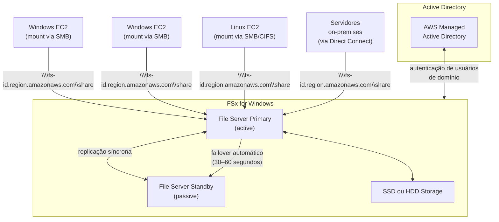
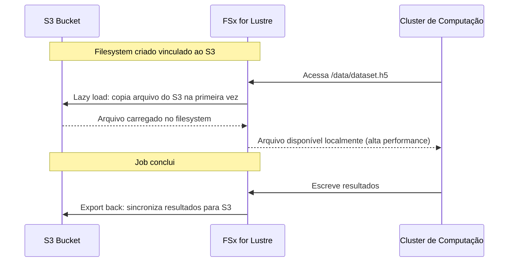
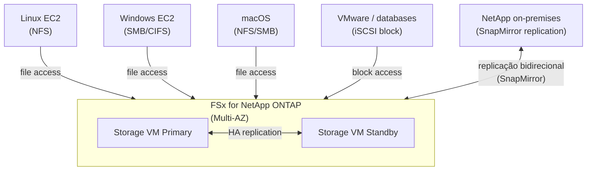
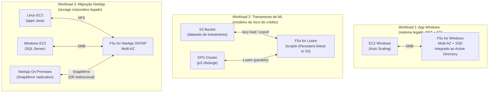

# 04 - Amazon FSx

## 1. Explicação Técnica

Na nota anterior sobre EFS, a gente viu que ele é um filesystem de rede gerenciado baseado em NFS v4.1 e funciona exclusivamente em Linux. Mas e as aplicações Windows? E os clusters de HPC que usam Lustre? E as empresas com toda a infraestrutura de storage rodando NetApp ONTAP?

O **Amazon FSx** é a família de filesystems totalmente gerenciados da AWS para casos onde o EFS não atende. Pensa assim: o EFS é o filesystem genérico para Linux. O FSx é um conjunto de filesystems especializados, cada um construído sobre tecnologia específica para atender um tipo de workload diferente. Você tem quatro sabores:

- **FSx for Windows File Server**: para aplicações Windows que precisam de SMB e integração com Active Directory
- **FSx for Lustre**: para workloads de alta performance como HPC, machine learning e análise científica
- **FSx for NetApp ONTAP**: para empresas que já usam NetApp on-premises e querem migrar para a AWS
- **FSx for OpenZFS**: para workloads que precisam de recursos avançados do ZFS como snapshots instantâneos e clones

Em todos os casos, a AWS gerencia o hardware, as atualizações, os backups e a replicação. Você não precisa administrar file servers, trocar discos ou aplicar patches.

---

## 2. FSx for Windows File Server

O FSx for Windows File Server é um filesystem gerenciado construído sobre o **Windows Server** real da Microsoft. Não é uma emulação nem uma camada de compatibilidade: é literalmente um Windows Server File System administrado pela AWS por baixo dos panos.

Por ser Windows Server real, ele suporta nativamente tudo que aplicações Windows esperam de um file server corporativo:

- **Protocolo SMB** (versões 2.0, 2.1, 3.0, 3.1.1) para acesso de clientes Windows, Linux e macOS
- **NTFS** como sistema de arquivos subjacente, com ACLs, permissões granulares e auditoria
- **DFS Namespaces** para organizar múltiplos file shares em uma hierarquia unificada
- **Integração com Active Directory** (AWS Managed AD ou AD on-premises) para autenticação e autorização com usuários de domínio
- **Data deduplication** para reduzir o espaço consumido por arquivos duplicados
- **User quotas** para limitar o espaço por usuário
- **Shadow Copies** (versões anteriores de arquivos via VSS)

### Deployment: Single-AZ vs Multi-AZ

O FSx for Windows suporta dois modos de deployment:

| Modo | Descrição | RTO | Custo |
|------|-----------|-----|-------|
| Single-AZ | File server ativo em uma AZ, dados replicados dentro da AZ | N/A (sem AZ failover) | Menor |
| Multi-AZ | File server ativo + standby em AZs diferentes, failover automático | 30–60 segundos | Maior |

Multi-AZ é recomendado para workloads de produção que precisam de alta disponibilidade contra falha de AZ.

### Storage: SSD vs HDD

O FSx for Windows permite escolher o tipo de storage:

- **SSD**: para workloads com requisitos de latência baixa e IOPS alto (bancos de dados de arquivo, home directories de alta performance)
- **HDD**: para workloads com acesso sequencial e necessidade de grande capacidade a menor custo (backup, arquivamento, conteúdo acessado com pouca frequência)

---

## 3. FSx for Lustre

O **Lustre** é um filesystem paralelo de alta performance open-source amplamente usado em supercomputadores e clusters HPC. O FSx for Lustre traz essa tecnologia como serviço gerenciado na AWS, sem a complexidade de operar Lustre manualmente.

A característica que torna o Lustre único é a capacidade de **distribuir I/O em paralelo** por múltiplos servidores de storage simultaneamente, entregando throughput agregado que um único filesystem convencional não consegue. Workloads de ML treinando modelos com terabytes de dados, simulações financeiras e sequenciamento genômico se beneficiam diretamente disso.

### Integração Nativa com S3

O FSx for Lustre tem uma feature crítica para a prova: ele pode ser **vinculado a um bucket S3** como repositório de dados. O comportamento é:

O **lazy loading** significa que os dados são trazidos do S3 para o filesystem Lustre apenas quando requisitados pela primeira vez, sem precisar copiar tudo antecipadamente. Depois de carregado, o acesso subsequente é pela velocidade total do Lustre.

### Deployment Types: Scratch vs Persistent

| Tipo | Replicação | Uso ideal | Custo |
|------|-----------|-----------|-------|
| **Scratch** | Nenhuma (sem redundância) | Jobs temporários, dados podem ser recriados do S3 | Menor |
| **Persistent** | Replica dados dentro da AZ | Armazenamento de longo prazo, dados que não podem ser perdidos | Maior |

O Scratch é para jobs de curta duração onde os dados de entrada existem no S3 e qualquer perda pode ser resolvida relançando o job. O Persistent é para dados que precisam de durabilidade.

O FSx for Lustre só suporta **Single-AZ** (ao contrário dos outros FSx que têm opção Multi-AZ).

---

## 4. FSx for NetApp ONTAP

O **NetApp ONTAP** é uma das plataformas de storage empresarial mais usadas no mundo. Empresas com infraestrutura on-premises construída sobre NetApp podem agora rodar a mesma tecnologia na AWS via FSx for NetApp ONTAP, sem reescrever aplicações ou mudar workflows.

O diferencial do ONTAP é ser um filesystem **multi-protocolo**: o mesmo filesystem é acessível simultaneamente por Linux via NFS, Windows via SMB e sistemas que precisam de block storage via iSCSI. Nenhum outro FSx oferece essa flexibilidade.

### Recursos Avançados do ONTAP

| Feature | Descrição |
|---------|-----------|
| **Snapshots** | Point-in-time instantâneos, sem overhead de performance |
| **Clones** | Cópia instantânea (zero-copy) de volumes ou arquivos, sem consumir espaço adicional imediatamente |
| **SnapMirror** | Replicação assíncrona para outro FSx ONTAP ou NetApp on-premises |
| **Deduplication** | Elimina blocos duplicados automaticamente |
| **Compression** | Reduz o espaço consumido em disco |
| **Tiering automático** | Move dados frios automaticamente para S3 (storage tier mais barato) |
| **iSCSI** | Block storage para workloads que precisam de acesso de bloco (bancos de dados, VMware) |

O FSx for ONTAP suporta **Single-AZ e Multi-AZ**.

---

## 5. FSx for OpenZFS

O **OpenZFS** é um sistema de arquivos open-source derivado do ZFS original da Sun Microsystems, conhecido por integridade de dados, snapshots instantâneos e clones sem overhead. O FSx for OpenZFS é a opção para empresas que rodam ZFS on-premises e querem migrar para AWS sem mudar a stack.

Ao contrário do FSx for Windows (SMB) e do FSx for ONTAP (multi-protocolo), o OpenZFS usa exclusivamente **NFS** (v3, v4, v4.1, v4.2), então é compatível com Linux, macOS e, com cliente NFS instalado, Windows também.

### Recursos Principais

- **Snapshots instantâneos** sem impacto de performance (copy-on-write)
- **Clones** de volumes a custo zero de espaço no momento da criação
- **Compression** nativa (LZ4, ZSTD) para reduzir footprint de storage
- **Copy-on-Write** garante integridade de dados mesmo em falhas de energia durante escrita
- Latência sub-milissegundo com storage NVMe

O FSx for OpenZFS suporta **Single-AZ e Multi-AZ**.

---

## 6. Comparação Entre os Quatro FSx

Esse é o quadro que você precisa ter na ponta da língua para o SAP:

| Dimensão | FSx for Windows | FSx for Lustre | FSx for ONTAP | FSx for OpenZFS |
|----------|----------------|----------------|---------------|-----------------|
| Tecnologia base | Windows Server | Lustre (HPC) | NetApp ONTAP | OpenZFS |
| Protocolos | SMB (NFS experimental) | Lustre, POSIX | NFS, SMB, iSCSI | NFS |
| SO compatível | Windows (principal), Linux | Linux | Linux, Windows, macOS | Linux, macOS, Windows (NFS) |
| Multi-AZ | Sim | **Não (Single-AZ apenas)** | Sim | Sim |
| Integração S3 | Não | **Sim (lazy load / export)** | Via tiering | Não |
| Snapshots | Sim (VSS) | Não nativo | Sim (ONTAP Snapshots) | Sim (ZFS Snapshots) |
| Clones | Não | Não | Sim (zero-copy) | Sim (zero-copy) |
| iSCSI | Não | Não | **Sim** | Não |
| Active Directory | Sim (nativo) | Não | Sim | Não |
| Deduplication | Sim | Não | Sim | Sim |
| Throughput máx | ~2 GB/s | Centenas de GB/s | ~4 GB/s | ~12,5 GB/s (NVMe) |
| Latência | Baixa (ms) | Sub-ms (HPC) | Sub-ms | Sub-ms (NVMe) |
| Uso ideal | Windows/AD enterprise | HPC, ML, Big Data | Migração NetApp, multi-protocolo | Migração ZFS, NFS avançado |

---

## 7. FSx vs EFS

Quando usar FSx e quando usar EFS é uma decisão frequente no SAP:

| Dimensão | Amazon EFS | FSx for Windows | FSx for Lustre | FSx for ONTAP |
|----------|-----------|-----------------|----------------|---------------|
| SO | Linux apenas | Windows (principal) | Linux | Linux, Windows, macOS |
| Protocolo | NFS v4.1 | SMB | Lustre | NFS, SMB, iSCSI |
| Capacidade | Elástica (auto) | Pré-provisionada | Pré-provisionada | Pré-provisionada |
| Active Directory | Não | Sim (nativo) | Não | Sim |
| Custo por GB | ~$0,30 | ~$0,13–0,23 | ~$0,14 (persistent) | ~$0,13 |
| Uso principal | Shared Linux filesystem | Windows enterprise | HPC/ML | NetApp migration |

A regra geral: **Linux genérico → EFS. Windows → FSx for Windows. HPC/ML → FSx for Lustre. NetApp on-premises → FSx for ONTAP.**

---

## 8. Cenário Real Enterprise

Uma empresa financeira tem três workloads distintos que precisam de filesystems gerenciados:

Cada workload usa o FSx correto para sua necessidade, sem tentar encaixar tudo em uma solução única inadequada.

---

## 9. Quando Usar / Quando NÃO Usar

**Use FSx for Windows quando:**

- A aplicação é Windows-native e precisa de SMB, ACLs NTFS ou integração com Active Directory
- Está migrando (lift and shift) file servers Windows corporativos para a AWS
- Precisa de DFS Namespaces para centralizar múltiplos shares em um namespace único

**Use FSx for Lustre quando:**

- O workload é HPC, machine learning, análise de big data ou qualquer workload com necessidade de throughput agregado muito alto
- Os dados de entrada existem no S3 e você quer processá-los com alta performance sem copiar tudo manualmente
- O job é temporário e os dados podem ser perdidos e recriados (use Scratch para menor custo)

**Use FSx for ONTAP quando:**

- A empresa já usa NetApp on-premises e quer estender para AWS com a mesma ferramenta
- Precisa de acesso multi-protocolo (NFS + SMB + iSCSI) no mesmo filesystem
- Quer replicação bidirecional com storage on-premises via SnapMirror

**Use FSx for OpenZFS quando:**

- Está migrando workloads de servidores ZFS on-premises para AWS
- Precisa de snapshots e clones com as semânticas ZFS familiares
- A workload é Linux/macOS com NFS e exige integridade de dados e compressão nativas do ZFS

**Não use FSx quando:**

- A workload é Linux genérica sem requisito específico de tecnologia: EFS é mais simples, elástico e geralmente mais adequado
- Precisa de acesso de objeto (não filesystem): S3 é a escolha certa

---

## 10. Trade-offs

| Dimensão | FSx for Windows | FSx for Lustre | FSx for ONTAP | FSx for OpenZFS |
|----------|----------------|----------------|---------------|-----------------|
| Complexidade de setup | Média | Baixa | Alta | Média |
| Flexibilidade de protocolo | Média (SMB) | Baixa (Lustre) | **Alta (NFS+SMB+iSCSI)** | Média (NFS) |
| Performance HPC | Baixa | **Extrema** | Alta | Alta |
| Integração Windows/AD | **Nativa** | Não | Sim | Não |
| Migração on-premises | Windows File Server | Não direta | **NetApp SnapMirror** | ZFS on-premises |
| Multi-AZ | Sim | **Não** | Sim | Sim |
| Recursos avançados storage | Médios | Baixos | **Muitos (clones, snap, dedup)** | Bons (ZFS) |
| Custo relativo | Médio | Médio-alto | Alto | Médio |

---

## 11. Pegadinhas Comuns da Prova

> **[PEGADINHA #1]** - *"O FSx for Lustre suporta deployments Multi-AZ?"*
> Não. O FSx for Lustre só suporta Single-AZ. Se o dado precisa de resiliência multi-AZ, o dado fonte deve estar no S3 (que é multi-AZ nativo), e o Lustre é usado como filesystem de alta performance temporário vinculado ao S3.

> **[PEGADINHA #2]** - *"Para uma aplicação Windows que precisa de SMB e Active Directory, o EFS pode ser usado?"*
> Não. EFS usa NFS v4.1 e não suporta SMB nem integração com Active Directory. A resposta certa é FSx for Windows File Server.

> **[PEGADINHA #3]** - *"O FSx for Lustre pode ser vinculado ao S3. O que é lazy loading nesse contexto?"*
> Quando o filesystem Lustre é vinculado a um bucket S3, os arquivos não são copiados antecipadamente. Eles são carregados no Lustre apenas quando acessados pela primeira vez (lazy). Acessos subsequentes usam a cache local do Lustre em alta velocidade.

> **[PEGADINHA #4]** - *"Qual FSx usar para uma empresa que tem NetApp on-premises e quer um DR na AWS com replicação contínua?"*
> FSx for NetApp ONTAP. Ele suporta SnapMirror para replicação bidirecional entre ONTAP on-premises e FSx ONTAP na AWS, com as mesmas ferramentas e operações que a equipe já conhece.

> **[PEGADINHA #5]** - *"O FSx for Windows File Server pode ser acessado por instâncias Linux?"*
> Sim. O protocolo SMB pode ser montado em Linux usando o cliente CIFS/Samba. O FSx for Windows não é exclusivo de Windows, mas é otimizado para ele, com integração nativa a AD e NTFS.

> **[PEGADINHA #6]** - *"O FSx for OpenZFS e o EFS usam NFS. Quando escolher um ou o outro?"*
> EFS é elástico (sem pré-provisionar capacidade), totalmente gerenciado e simples. OpenZFS tem recursos avançados de storage como snapshots ZFS, clones copy-on-write e compressão nativa, latência sub-ms com NVMe, mas é pré-provisionado. Escolha EFS para simplicidade e elasticidade. Escolha OpenZFS se precisa dos recursos ZFS ou está migrando de infraestrutura ZFS on-premises.

---

## 12. Resumo Final

O Amazon FSx é a família de filesystems gerenciados especializados da AWS para casos onde o EFS genérico não atende. São quatro tecnologias distintas para quatro categorias de problema diferentes.

O **FSx for Windows File Server** é para aplicações Windows corporativas que precisam de SMB, ACLs NTFS e Active Directory. Suporta Single-AZ e Multi-AZ, com storage SSD ou HDD.

O **FSx for Lustre** é para workloads de alta performance como HPC, ML e Big Data. Sua integração nativa com S3 (lazy load e export) é seu diferencial: dados ficam no S3 e são processados em velocidade Lustre quando necessário. Só suporta Single-AZ.

O **FSx for NetApp ONTAP** é para empresas NetApp que querem migrar para AWS sem trocar de plataforma. Multi-protocolo (NFS + SMB + iSCSI), recursos avançados como SnapMirror para DR e replicação bidirecional com ONTAP on-premises.

O **FSx for OpenZFS** é para workloads que precisam de semânticas ZFS (snapshots, clones, integridade copy-on-write) via NFS, com latência sub-ms em NVMe.

---

## 13. Flashcards Rápidos

**Q: Qual FSx usar para aplicação Windows com Active Directory e SMB?**
A: FSx for Windows File Server. Suporta SMB nativo, NTFS, integração com AD, DFS Namespaces e data deduplication.

**Q: O FSx for Lustre suporta Multi-AZ?**
A: Não. Apenas Single-AZ. Para resiliência, use o S3 como repositório fonte e o Lustre como filesystem de alta performance temporário vinculado ao S3.

**Q: Qual a diferença entre FSx for Lustre Scratch e Persistent?**
A: Scratch não replica os dados (sem redundância), é mais barato e para jobs temporários onde dados podem ser recriados. Persistent replica os dados dentro da AZ e é para armazenamento de longo prazo.

**Q: Qual FSx suporta NFS + SMB + iSCSI simultaneamente no mesmo filesystem?**
A: FSx for NetApp ONTAP. É o único multi-protocolo, permitindo acesso de Linux (NFS), Windows (SMB) e storage de bloco (iSCSI) no mesmo filesystem.

**Q: Como o FSx for Lustre se integra com S3?**
A: O filesystem pode ser vinculado a um bucket S3. Os dados são carregados lazily (só quando acessados pela primeira vez). Resultados podem ser exportados de volta para o S3 após o processamento.

**Q: Qual FSx usar para migrar storage NetApp on-premises para AWS com replicação contínua?**
A: FSx for NetApp ONTAP com SnapMirror para replicação bidirecional entre o ONTAP on-premises e o FSx ONTAP na AWS.

**Q: FSx for Windows pode ser acessado por instâncias Linux?**
A: Sim, via cliente SMB/CIFS. Não é exclusivo de Windows, mas é otimizado e mais frequentemente usado com Windows.
