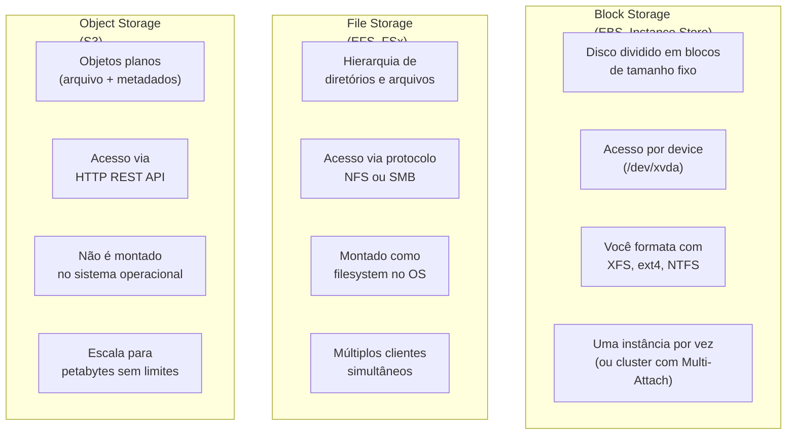
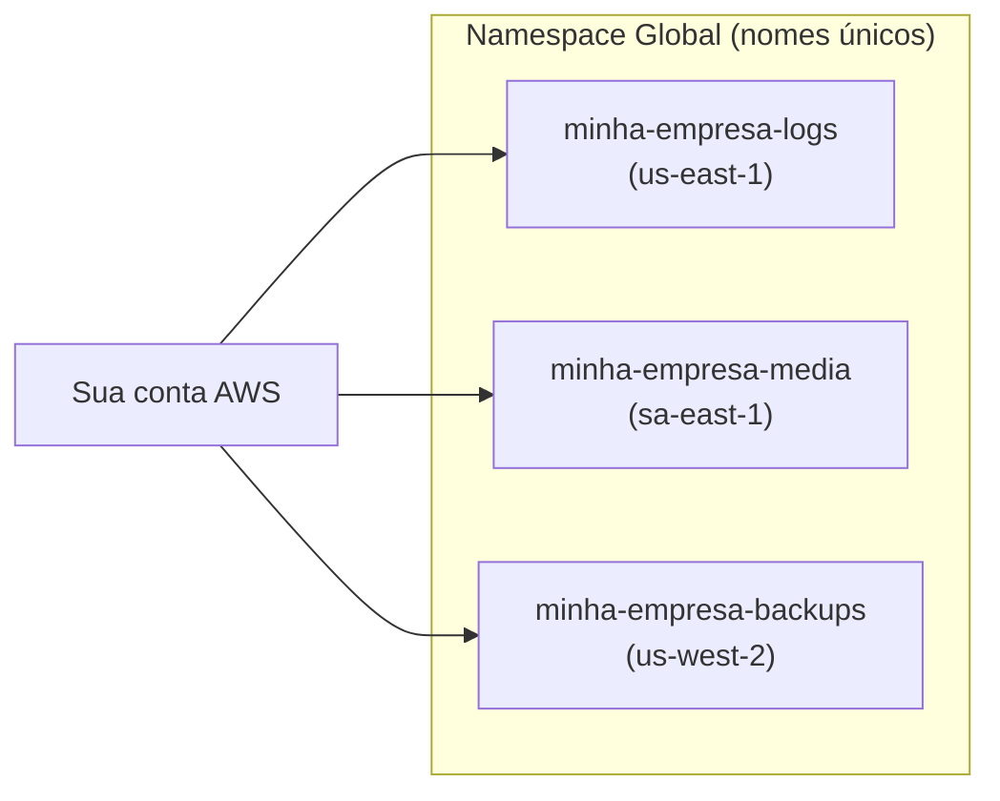
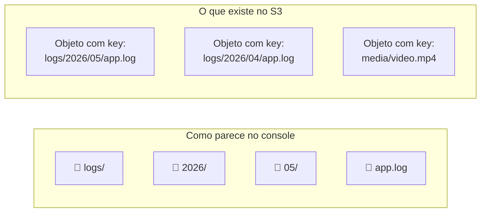
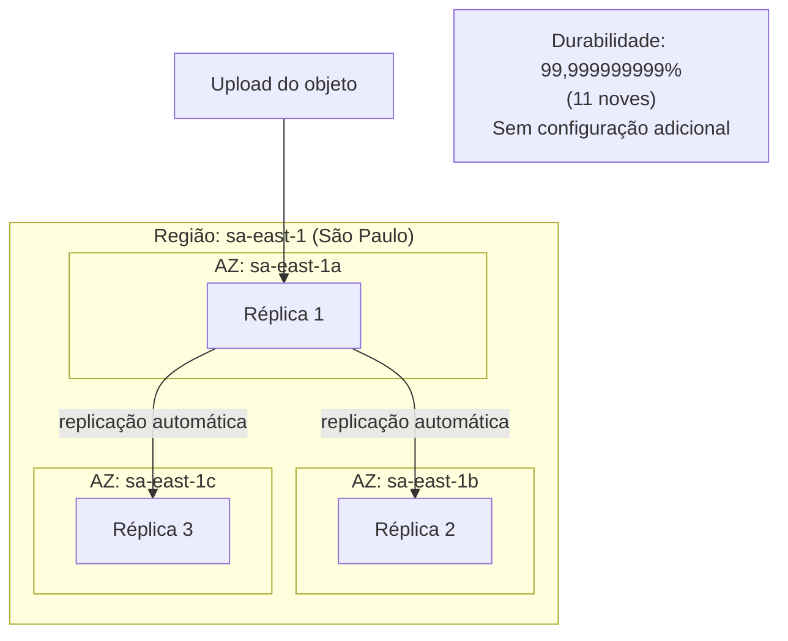
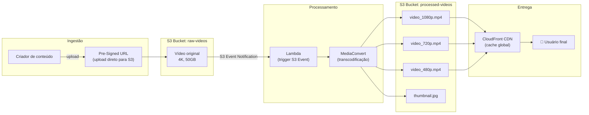

# 05 - S3 Overview

## 1. Explicação Técnica

Nas notas anteriores, a gente cobriu os três tipos de storage que você já conhece bem: **block storage** com EBS e Instance Store, e **file storage** com EFS e FSx. Agora chegamos no terceiro tipo fundamental de armazenamento: o **object storage**.

O **Amazon S3** (Simple Storage Service, daí os três "S") é o serviço de object storage da AWS, e é provavelmente o serviço mais conhecido e amplamente usado de toda a plataforma. A analogia do original é boa: pensa no S3 como um Dropbox ou Google Drive corporativo, mas com integração nativa com todos os outros serviços da AWS e capacidade virtualmente ilimitada.

Mas o mais importante é entender o que diferencia object storage de block e file storage, porque essa distinção sempre cai na prova:

A diferença fundamental: você **não monta** o S3 como um disco ou filesystem. Você acessa os objetos via HTTP (PUT, GET, DELETE) pela API REST, CLI, SDK ou console. Isso tem uma implicação prática direta: aplicações precisam ser escritas ou adaptadas para trabalhar com S3, você não simplesmente aponta um `fopen()` para um path do S3.

---

## 2. Buckets

O **Bucket** é o container principal do S3. Pensa nele como uma pasta de nível superior onde você agrupa objetos relacionados. Cada bucket tem algumas características importantes:

### Naming e Escopo Global

O nome do bucket S3 precisa ser **único globalmente** em toda a AWS, não só na sua conta. Se alguém em qualquer outra conta no mundo já criou um bucket chamado `my-app-logs`, você não consegue criar outro com esse mesmo nome.

Apesar do namespace global para nomes, o bucket é **criado em uma região específica** e os dados físicos ficam armazenados nessa região. A escolha da região impacta latência para os clientes e custo de transferência de dados.

### Limites de Buckets

| Limite | Valor |
|--------|-------|
| Buckets por conta (padrão) | 100 |
| Buckets por conta (após aumento de limite) | 1.000 |
| Objetos por bucket | Ilimitado |
| Tamanho máximo de um único objeto | 5 TB |

---

## 3. Objetos

O **Object** é a unidade de armazenamento do S3. Cada objeto tem três componentes principais:

**Key:** o identificador único do objeto dentro do bucket. Funciona como o "nome do arquivo" incluindo o "caminho". Ex: `logs/2026/05/app.log`

**Value:** os dados em si (bytes do arquivo). Qualquer tipo de conteúdo: imagens, vídeos, PDFs, JSON, binários, arquivos comprimidos, o que for.

**Metadata:** conjunto de pares chave-valor associados ao objeto. Há dois tipos:
- **System metadata**: gerenciado pela AWS (Content-Type, Content-Length, Last-Modified, ETag)
- **User metadata**: definido por você no momento do upload, prefixados com `x-amz-meta-`

Além do metadata, cada objeto pode ter até **10 tags** (chave-valor), úteis para controle de acesso granular, lifecycle policies e organização.

### Tamanho e Multipart Upload

Para objetos grandes, o S3 suporta **Multipart Upload**: dividir o arquivo em partes e fazer upload em paralelo, depois o S3 remonta o objeto.

| Tamanho do objeto | Recomendação |
|-------------------|-------------|
| Até 100 MB | Upload simples (single PUT) |
| Entre 100 MB e 5 GB | Multipart Upload recomendado |
| Acima de 5 GB | Multipart Upload **obrigatório** |
| Máximo total | 5 TB |

O Multipart Upload traz duas vantagens além de superar o limite de 5 GB: se uma parte falhar, você reenvía só aquela parte, e as partes sobem em paralelo, acelerando significativamente o upload de arquivos grandes.

---

## 4. Estrutura Flat e Simulação de Pastas

Uma característica do S3 que confunde quem vem de filesystems tradicionais: o S3 tem **estrutura flat**. Não existe hierarquia real de diretórios. Existe apenas um espaço plano de keys dentro do bucket.

O que parece uma pasta no console é apenas uma **convenção de nomenclatura com barra**: quando você vê `logs/2026/05/app.log`, isso é um único objeto cuja key é literalmente a string `logs/2026/05/app.log`. A barra `/` é apenas um caractere no nome.

O console usa o caractere `/` como **delimiter** para simular a navegação em pastas, mas internamente são apenas strings de key em um espaço plano. Isso tem uma implicação importante: listar "dentro de uma pasta" é na verdade uma operação de listagem com filtro de prefixo, não uma leitura de diretório.

---

## 5. Consistência

Desde dezembro de 2020, o S3 oferece **strong read-after-write consistency** para todas as operações. Isso significa:

- Após um PUT bem-sucedido, qualquer GET subsequente retorna o objeto mais recente
- Após um DELETE bem-sucedido, qualquer GET retorna 404
- Listagens (LIST) refletem imediatamente as últimas mudanças

Antes de 2020 havia consistência eventual em alguns cenários. Isso mudou e hoje o S3 é fortemente consistente. Fica atento se encontrar questões antigas ou materiais desatualizados que ainda mencionam consistência eventual no S3.

---

## 6. Formas de Acesso

O S3 pode ser acessado de múltiplas formas:

| Método | Como usar |
|--------|-----------|
| AWS Console | Interface web, boa para exploração e operações manuais |
| AWS CLI | `aws s3 cp`, `aws s3 sync`, `aws s3 ls` |
| AWS SDKs | Boto3 (Python), AWS SDK for Java, JavaScript, Go, etc. |
| HTTP REST API | PUT/GET/DELETE direto via HTTP, sem SDK |
| Pre-Signed URL | URL temporária com permissão embutida para download ou upload por qualquer cliente, mesmo sem credenciais AWS |
| S3 Transfer Acceleration | Upload acelerado via Edge Locations da AWS (vamos ver mais à frente) |

As **Pre-Signed URLs** merecem destaque: são URLs geradas por um usuário com permissão que delegam acesso temporário a um objeto específico. Um usuário sem credenciais AWS pode fazer download ou upload de um objeto se tiver a Pre-Signed URL. São válidas por um tempo configurável (segundos a dias).

---

## 7. Segurança Padrão

Por padrão, **todo bucket e todo objeto no S3 é privado**. Nada é público a menos que você explicitamente configure. Há também um **Block Public Access** habilitado por padrão nas contas que bloqueia qualquer configuração que tornaria objetos públicos, mesmo que alguém tente configurar isso acidentalmente.

O controle de acesso ao S3 é feito em múltiplas camadas que vamos explorar em detalhes nas notas específicas de segurança do S3. O essencial por agora: padrão é privado e você precisa agir ativamente para tornar algo público.

---

## 8. S3 como Serviço Global Resiliente

O S3 é frequentemente descrito como "global", mas é mais preciso dizer que ele é **regional com namespace global**:

- O **bucket** é criado em uma região específica
- Os dados são armazenados e replicados **dentro daquela região** em múltiplas AZs automaticamente (exceto a classe One Zone-IA, que vamos ver mais à frente)
- O **nome do bucket** é único globalmente, mas o dado fica na região

Isso significa que ao criar um bucket em `sa-east-1` (São Paulo), seus dados ficam replicados entre as AZs de São Paulo com durabilidade de **99,999999999% (11 noves)**. A AWS gerencia toda essa replicação internamente sem nenhuma configuração sua.

---

## 9. Casos de Uso

O S3 é um dos serviços mais versáteis da AWS. Os principais casos de uso:

**Armazenamento de objetos e arquivos estáticos**
Imagens, vídeos, documentos, PDFs, arquivos de áudio. O webserver da aplicação serve apenas o HTML/CSS/JS e referencia os arquivos de mídia diretamente no S3, sem precisar hospedar arquivos grandes em instâncias EC2.

**Log Files e dados de observabilidade**
Logs de aplicação, VPC Flow Logs, CloudTrail, logs de ALB. O S3 é o destino de quase todo pipeline de log na AWS.

**Artefatos de CI/CD e deployments**
Binários compilados, pacotes de deployment do CodeDeploy, artefatos do CodePipeline, modelos do CloudFormation, AMIs via VM Import.

**Data Lake e Analytics**
O S3 é o storage base de praticamente todo data lake na AWS. Serviços como Athena, EMR, Redshift Spectrum, Glue e Lake Formation usam o S3 como repositório de dados primário.

**Backup e Disaster Recovery**
Snapshots de EBS exportados, backups do RDS, dumps de banco de dados, backups de sistemas on-premises via AWS Backup ou Storage Gateway.

**Hospedagem de site estático**
HTML, CSS, JavaScript e outros arquivos estáticos servidos diretamente do S3, com opção de configurar domínio próprio e HTTPS via CloudFront. Vamos ver isso em detalhes na nota de S3 Website.

---

## 10. O Que Vem nas Próximas Notas de S3

O S3 é um serviço com muita profundidade. Este overview cobre os fundamentos. As próximas notas vão explorar:

- **Storage Classes**: Standard, Intelligent-Tiering, Standard-IA, One Zone-IA, Glacier Instant Retrieval, Glacier Flexible Retrieval, Glacier Deep Archive
- **Versioning**: múltiplas versões do mesmo objeto, proteção contra sobrescrita acidental
- **Lifecycle Policies**: mover objetos automaticamente entre Storage Classes ou expirar objetos
- **ACLs e Bucket Policies**: controle granular de acesso
- **Website Hosting**: servir conteúdo estático com index e error documents
- **Replication**: Cross-Region e Same-Region Replication

---

## 11. Cenário Real Enterprise

Uma empresa de streaming de conteúdo usa S3 como espinha dorsal do seu pipeline de mídia:

O criador faz upload direto para o S3 via Pre-Signed URL, sem passar pelo servidor da aplicação. O S3 dispara um evento que aciona o pipeline de transcodificação. Os vídeos processados ficam no S3 e são servidos globalmente via CloudFront.

---

## 12. Quando Usar / Quando NÃO Usar

**Use S3 quando:**

- O dado é um arquivo ou objeto completo (imagem, vídeo, documento, JSON, binário)
- A aplicação acessa os dados via HTTP REST, SDK ou CLI, não como filesystem montado
- Precisa de armazenamento com durabilidade de 11 noves sem se preocupar com replicação
- O volume de dados cresce de forma imprevisível e você não quer pré-provisionar capacidade
- Quer armazenamento barato para logs, backups ou dados raramente acessados (Storage Classes)

**Não use S3 quando:**

- A aplicação precisa montar um filesystem e acessar arquivos por path POSIX: use EFS ou FSx
- Precisa de block storage para banco de dados ou boot volume: use EBS
- O workload é Windows com SMB e Active Directory: use FSx for Windows
- Precisa de acesso de altíssima performance com latência sub-ms: use EBS io2 ou Instance Store
- Os dados são acessados com operações de leitura/escrita randômicas em partes de um arquivo (seek): S3 não suporta modificação parcial de objetos, você reescreve o objeto inteiro

---

## 13. Trade-offs

| Dimensão | S3 | EBS gp3 | EFS Standard |
|----------|----|---------|-------------|
| Tipo | Object storage | Block storage | File storage |
| Acesso | HTTP REST API | Device de bloco (OS) | NFS v4.1 (OS) |
| Montagem no OS | Não | Sim | Sim |
| Capacidade | Ilimitada (elástica) | Pré-provisionada | Elástica |
| Custo por GB | ~$0,023/GB (Standard) | ~$0,08/GB | ~$0,30/GB |
| Durabilidade | 99,999999999% | 99,8–99,9% | 99,999999999% |
| Latência | Dezenas de ms (HTTP) | ~1ms | Alguns ms (NFS) |
| Protocolos | HTTP/HTTPS | iSCSI (transparente via EBS) | NFS v4.1 |
| Modificação parcial | Não (reescreve o objeto) | Sim (bloco a bloco) | Sim (por byte) |
| Uso ideal | Objetos, backups, data lake | Banco de dados, boot | Filesystem compartilhado Linux |

---

## 14. Pegadinhas Comuns da Prova

> **[PEGADINHA #1]** - *"O nome de um bucket S3 precisa ser único apenas dentro da minha conta AWS?"*
> Não. Nomes de bucket S3 são únicos globalmente em toda a AWS. Se outro cliente da AWS já tem um bucket com o nome que você quer, você não consegue criar com esse nome.

> **[PEGADINHA #2]** - *"O S3 tem estrutura de diretórios aninhados como um filesystem?"*
> Não. O S3 tem estrutura plana. As "pastas" que aparecem no console são apenas uma convenção: o caractere `/` na key é tratado como delimiter para simular hierarquia, mas internamente é uma string plana de key.

> **[PEGADINHA #3]** - *"O S3 oferece consistência eventual após PUT e DELETE?"*
> Não, desde dezembro de 2020. O S3 oferece strong read-after-write consistency para todas as operações. Imediatamente após um PUT ou DELETE bem-sucedido, qualquer GET verá o estado mais recente.

> **[PEGADINHA #4]** - *"Para fazer upload de um arquivo de 10 GB no S3, qual o método correto?"*
> Multipart Upload. O upload simples (single PUT) é limitado a 5 GB. Para objetos acima de 5 GB, o Multipart Upload é obrigatório. Para objetos acima de 100 MB, é recomendado mesmo não sendo obrigatório.

> **[PEGADINHA #5]** - *"O S3 é um serviço global, então os dados ficam distribuídos pelo mundo automaticamente?"*
> Não. O bucket é criado em uma região específica e os dados ficam nessa região, replicados entre as AZs da região. Para distribuir globalmente, você usa CloudFront (cache) ou S3 Cross-Region Replication (cópia ativa). Vamos ver essas features nas próximas notas.

---

## 15. Resumo Final

O Amazon S3 é o serviço de object storage da AWS, projetado para armazenar e recuperar qualquer quantidade de dados via HTTP REST. Não é block storage (não monta como disco), não é file storage (não monta como filesystem): é acesso por objeto completo via API.

Os conceitos fundamentais são simples: **buckets** (containers com nomes globalmente únicos, criados em uma região) e **objects** (dados + key + metadata). A estrutura é flat, com simulação de pastas via convenção de `/` nas keys.

O S3 oferece durabilidade de 11 noves com replicação automática entre AZs dentro da região, strong consistency desde 2020, e segurança privada por padrão. É o repositório base de quase todo pipeline na AWS: data lake, backup, logs, CDN de conteúdo estático e artefatos de deployment.

As próximas notas vão mergulhar nos detalhes de Storage Classes, Versioning, Lifecycle Policies, controle de acesso e Website Hosting.

---

## 16. Flashcards Rápidos

**Q: Qual a diferença entre object storage (S3), block storage (EBS) e file storage (EFS)?**
A: Object storage acessa dados completos via HTTP API, sem montar no OS. Block storage acessa o disco como device de bloco, montado pelo OS. File storage acessa via protocolo de rede (NFS/SMB), montado como filesystem.

**Q: O nome de um bucket S3 precisa ser único em qual escopo?**
A: Globalmente, em toda a AWS, em todas as contas. Não apenas na sua conta.

**Q: O S3 é um serviço regional ou global?**
A: Namespace global (nomes únicos globalmente), mas cada bucket é criado em uma região e os dados ficam naquela região.

**Q: Qual o tamanho máximo de um objeto no S3 e quando usar Multipart Upload?**
A: Máximo 5 TB. Multipart Upload é recomendado acima de 100 MB e obrigatório acima de 5 GB.

**Q: O S3 tem consistência forte ou eventual após escrita?**
A: Forte (strong read-after-write consistency) desde dezembro de 2020 para todas as operações.

**Q: O que é uma Pre-Signed URL no S3?**
A: Uma URL temporária que embute permissão de acesso (download ou upload) a um objeto específico, permitindo que qualquer cliente acesse o objeto sem precisar de credenciais AWS.

**Q: Qual a durabilidade padrão do S3?**
A: 99,999999999% (11 noves), com replicação automática entre múltiplas AZs dentro da região.
