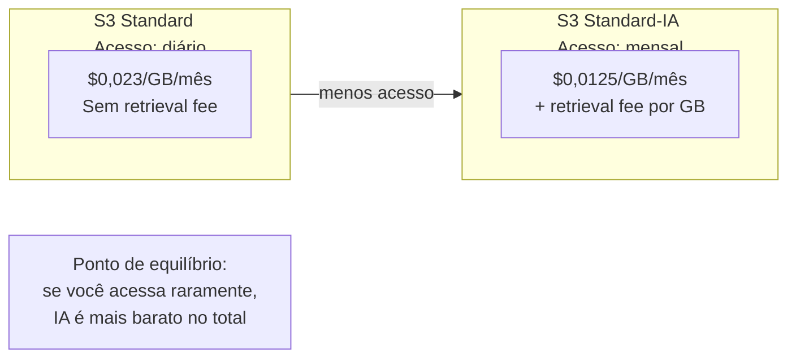
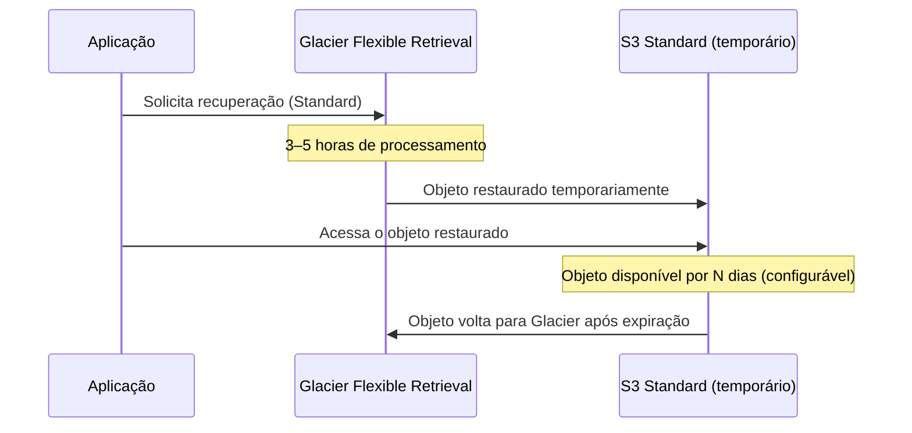
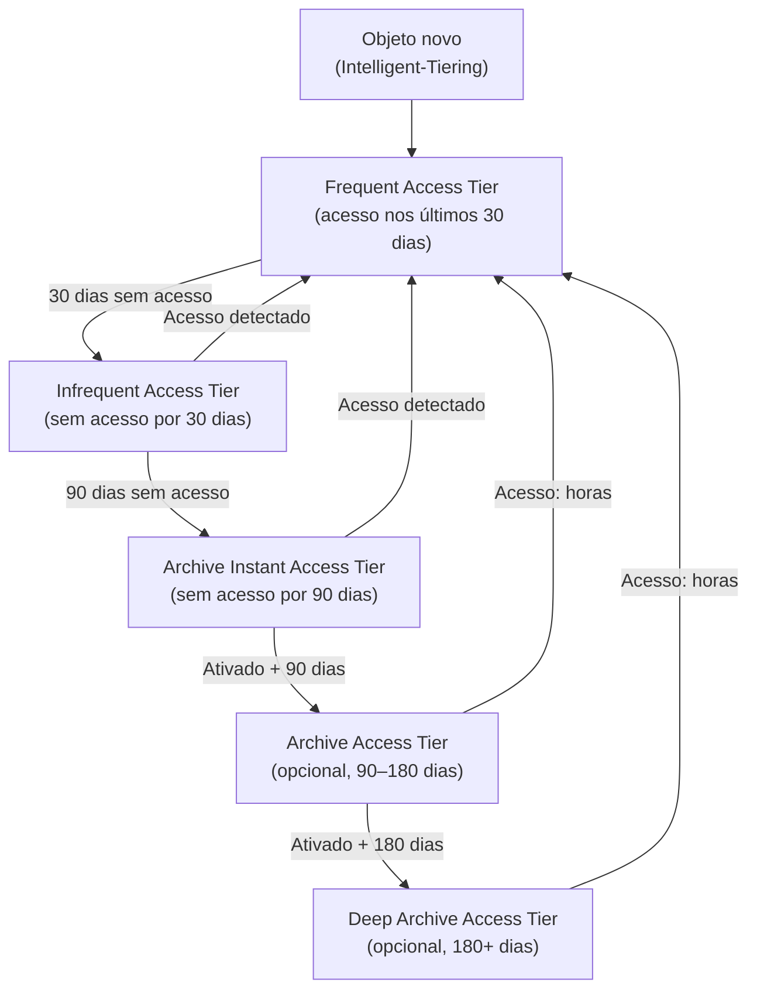
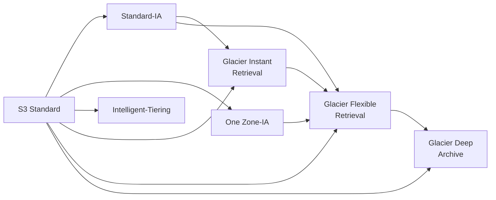
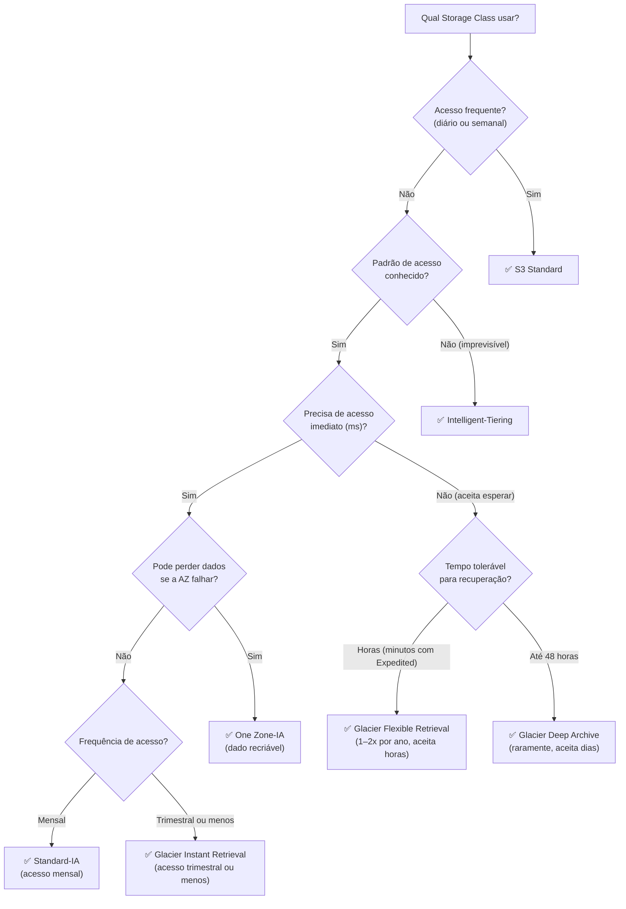
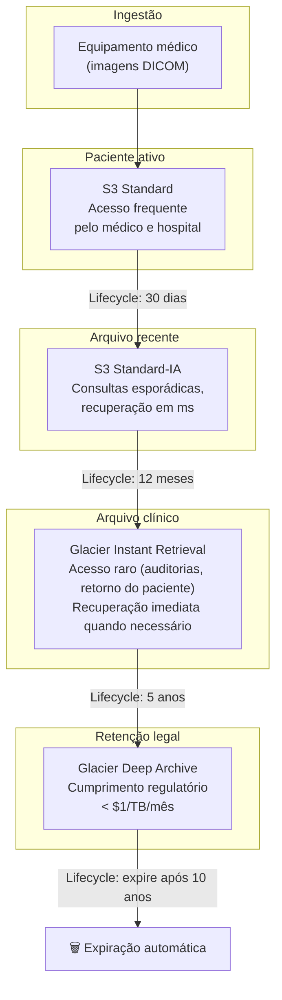

# 06 - S3 Storage Classes

## 1. Explicação Técnica

Na nota anterior de S3 Overview, a gente viu que o S3 tem durabilidade de 11 noves e cobra por GB armazenado por mês. Mas a AWS percebeu que nem todo dado tem o mesmo padrão de acesso: um log de hoje é acessado constantemente, mas um log de 3 anos atrás quase nunca. Faz sentido pagar o mesmo preço por ambos?

As **Storage Classes** são exatamente a resposta para isso. Cada classe representa um trade-off diferente entre **custo de armazenamento**, **custo de recuperação** e **velocidade de acesso**. A ideia central é simples: quanto menos você acessa um dado, mais barato você pode armazená-lo, mas você paga mais quando precisar recuperá-lo.

Pensa numa biblioteca: os livros mais procurados ficam na prateleira mais acessível na entrada (S3 Standard). Livros raros ficam num arquivo no subsolo, você precisa pedir ao bibliotecário e esperar um pouco (Glacier). Livros que nunca ninguém pede ficam num depósito externo, leva um dia inteiro para trazer (Glacier Deep Archive). O livro é o mesmo, o que muda é onde fica guardado e o esforço para acessá-lo.

---

## 2. Visão Geral das Storage Classes

Antes de entrar nos detalhes de cada uma, o mapa completo com os números que você precisa decorar para a prova:

| Storage Class | AZs | Durabilidade | Disponibilidade | Min. Duração | Min. Tamanho | Retrieval Fee | Latência de acesso |
|---------------|-----|-------------|-----------------|-------------|-------------|--------------|-------------------|
| S3 Standard | ≥3 | 99,999999999% | 99,99% | Nenhuma | Nenhum | Não | Milissegundos |
| S3 Standard-IA | ≥3 | 99,999999999% | 99,9% | 30 dias | 128 KB | Sim | Milissegundos |
| S3 One Zone-IA | 1 | 99,999999999%* | 99,5% | 30 dias | 128 KB | Sim | Milissegundos |
| S3 Glacier Instant Retrieval | ≥3 | 99,999999999% | 99,9% | 90 dias | 128 KB | Sim | Milissegundos |
| S3 Glacier Flexible Retrieval | ≥3 | 99,999999999% | 99,99% | 90 dias | Nenhum | Sim | Min a horas |
| S3 Glacier Deep Archive | ≥3 | 99,999999999% | 99,99% | 180 dias | Nenhum | Sim | Horas |
| S3 Intelligent-Tiering | ≥3 | 99,999999999% | 99,9–99,99% | Nenhuma | Nenhum | Não** | Varia por tier |

*One Zone-IA: 11 noves dentro da AZ. Se a AZ falhar permanentemente, os dados são perdidos.
**Intelligent-Tiering: sem retrieval fee, mas cobra uma taxa mensal de monitoramento por objeto.

---

## 3. S3 Standard

O **S3 Standard** é a classe padrão. Quando você faz upload sem especificar nada, é aqui que o objeto vai parar. É otimizado para dados acessados com frequência: alta disponibilidade, baixa latência e sem penalidades de recuperação.

**Características principais:**
- Replicado em pelo menos 3 AZs da região automaticamente
- Durabilidade de 11 noves (99,999999999%)
- Disponibilidade de 99,99%
- Latência de milissegundos para qualquer GET
- Sem mínimo de duração de armazenamento (pode deletar a qualquer momento sem custo extra)
- Sem mínimo de tamanho de objeto
- Sem retrieval fee (você paga apenas pelo armazenamento e pelo egress)

**Custo:** ~$0,023/GB/mês (referência, varia por região)

**Quando usar:** dados acessados com frequência, conteúdo ativo de aplicações, imagens e vídeos servidos para usuários, dados que alimentam pipelines em tempo real.

---

## 4. S3 Standard-IA (Infrequent Access)

O **Standard-IA** é para dados que você precisa manter disponíveis imediatamente quando acessados, mas que raramente você acessa. A latência continua sendo milissegundos, igual ao Standard, mas o custo de armazenamento é menor. A contrapartida: existe um **retrieval fee** por GB recuperado.

**Características principais:**
- Mesma replicação multi-AZ e durabilidade de 11 noves do Standard
- Disponibilidade de 99,9% (ligeiramente menor que Standard)
- Latência de milissegundos
- **Retrieval fee:** cobrado por GB recuperado (GET e SELECT)
- **Mínimo de 30 dias:** mesmo que você delete o objeto em 5 dias, paga por 30 dias
- **Mínimo de 128 KB:** objetos menores são faturados como se tivessem 128 KB

**Custo:** ~$0,0125/GB/mês de armazenamento + retrieval fee (mais barato para armazenar, mais caro para acessar)

**Quando usar:** backups que precisam de recuperação rápida mas raramente são acessados, arquivos de DR (disaster recovery), dados históricos consultados esporadicamente, replicações de dados on-premises na AWS como segunda cópia.

**Quando NÃO usar:** objetos pequenos (abaixo de 128 KB) ou de vida curta (menos de 30 dias), pois você paga o mínimo independente.

---

## 5. S3 One Zone-IA

O **One Zone-IA** tem a mesma proposta do Standard-IA (acesso infrequente, recuperação em milissegundos) com uma diferença fundamental: os dados ficam em **uma única AZ**, sem replicação multi-AZ. Isso reduz o custo em cerca de 20% em relação ao Standard-IA, mas introduz um risco: se a AZ falhar de forma permanente, os dados são perdidos.

**Características principais:**
- Armazenado em uma única AZ (sem replicação inter-AZ)
- Durabilidade de 11 noves dentro da AZ
- Disponibilidade de 99,5% (menor que as outras classes porque depende de uma única AZ)
- Mesmos retrieval fee, mínimo de 30 dias e mínimo de 128 KB do Standard-IA
- ~20% mais barato que Standard-IA

**Custo:** ~$0,01/GB/mês

**Quando usar:** dados que podem ser recriados facilmente se a AZ falhar, segunda cópia de backups (onde a cópia primária existe em outro lugar), dados de staging ou desenvolvimento, thumbnails e imagens derivadas que podem ser regeneradas a partir do original.

**Quando NÃO usar:** dados que não podem ser perdidos, única cópia de qualquer informação importante.

---

## 6. S3 Glacier Instant Retrieval

O **Glacier Instant Retrieval** é onde as coisas ficam interessantes. Esse tier tem custo de armazenamento muito mais baixo que o Standard-IA, mas ainda oferece recuperação em **milissegundos**. O nome "Glacier" assusta, mas a latência de acesso é igual ao Standard.

A diferença do Standard-IA está no mínimo de duração (90 dias, não 30) e no custo de armazenamento bem menor. O retrieval fee existe e é mais alto que o Standard-IA, então a classe só faz sentido quando o dado é acessado raramente: poucas vezes por trimestre.

**Características principais:**
- Multi-AZ, 11 noves de durabilidade
- Latência de milissegundos para recuperação (igual ao Standard)
- **Mínimo de 90 dias** de armazenamento (cobrado por 90 dias mesmo que delete antes)
- Mínimo de 128 KB por objeto
- Retrieval fee por GB recuperado

**Custo:** ~$0,004/GB/mês de armazenamento (muito mais barato que Standard-IA)

**Quando usar:** dados de arquivo acessados uma vez por trimestre ou menos, mas que quando precisam ser acessados exigem resposta imediata (milissegundos). Ex: imagens médicas, dados de compliance acessados em auditorias, arquivos de mídia históricos.

---

## 7. S3 Glacier Flexible Retrieval

O **Glacier Flexible Retrieval** (antigamente chamado apenas de "S3 Glacier") é para arquivos que raramente precisam ser acessados e quando precisam, você pode esperar. O diferencial é o custo extremamente baixo de armazenamento. A recuperação não é instantânea: você escolhe uma opção de recuperação com diferentes trade-offs de velocidade e custo.

**Opções de recuperação:**

| Tipo | Tempo de recuperação | Custo de retrieval |
|------|---------------------|-------------------|
| **Expedited** | 1–5 minutos | Alto |
| **Standard** | 3–5 horas | Médio |
| **Bulk** | 5–12 horas | **Gratuito** |

Um ponto importante: ao recuperar do Glacier Flexible Retrieval, o objeto não é entregue diretamente para você. Ele é **restaurado temporariamente** para um bucket S3 Standard pelo período que você configurar (dias ou semanas). Você acessa de lá durante esse período e o objeto volta ao Glacier quando o prazo expira.

**Características principais:**
- Multi-AZ, 11 noves de durabilidade
- **Mínimo de 90 dias** de armazenamento
- Sem mínimo de tamanho de objeto
- Recuperação não instantânea (minutos a horas)

**Custo:** ~$0,0036/GB/mês

**Quando usar:** arquivos de compliance e auditoria que precisam ser retidos por anos, backups de longo prazo, dados históricos acessados 1–2 vezes por ano, arquivos que não precisam de acesso imediato.

---

## 8. S3 Glacier Deep Archive

O **Glacier Deep Archive** é a classe mais barata do S3 e de toda a AWS para armazenamento. É projetado para dados que raramente ou nunca precisam ser acessados, com exigências de retenção de longo prazo (7, 10, 12 anos).

**Opções de recuperação:**

| Tipo | Tempo de recuperação | Custo |
|------|---------------------|-------|
| **Standard** | Até 12 horas | Baixo |
| **Bulk** | Até 48 horas | Muito baixo |

Igualmente ao Glacier Flexible, a recuperação cria uma cópia temporária no S3 Standard.

**Características principais:**
- Multi-AZ, 11 noves de durabilidade
- **Mínimo de 180 dias** de armazenamento (6 meses)
- Recuperação: horas a dias
- Custo de armazenamento mínimo de toda a AWS

**Custo:** ~$0,00099/GB/mês (menos de $0,001 por GB, ou seja, 1 TB custa menos de $1/mês)

**Quando usar:** compliance e regulação que exigem retenção de longo prazo (setor financeiro, saúde, governo), backups de cold data que nunca precisam de acesso rápido, arquivamento de fitas magnéticas legacy migradas para a AWS.

---

## 9. S3 Intelligent-Tiering

O **Intelligent-Tiering** é a classe "mãos livres" do S3. Você coloca o objeto nela e a AWS monitora o padrão de acesso, movendo o objeto automaticamente entre tiers conforme necessário. Não há retrieval fee nas transições automáticas.

A classe tem cinco tiers internos:

| Tier | Equivalente a | Latência |
|------|--------------|----------|
| Frequent Access | S3 Standard | Milissegundos |
| Infrequent Access | S3 Standard-IA | Milissegundos |
| Archive Instant Access | Glacier Instant Retrieval | Milissegundos |
| Archive Access (opt-in) | Glacier Flexible Retrieval | Minutos a horas |
| Deep Archive Access (opt-in) | Glacier Deep Archive | Horas |

Os dois últimos tiers (Archive Access e Deep Archive Access) são **opcionais** e precisam ser habilitados explicitamente. Quando habilitados, a recuperação para esses tiers pode levar horas, ao contrário dos três primeiros que são sempre em milissegundos.

**Características principais:**
- Sem retrieval fee nas movimentações automáticas entre tiers
- Taxa mensal de monitoramento por objeto (~$0,0025 por 1.000 objetos)
- Sem mínimo de tamanho nem de duração
- Ideal para padrões de acesso desconhecidos ou variáveis

**Custo:** varia conforme o tier em que o objeto está + taxa de monitoramento

**Quando usar:** dados com padrão de acesso imprevisível ou que muda ao longo do tempo, conjuntos de dados novos onde você ainda não sabe o padrão de acesso, ambientes onde você quer otimização automática sem gerenciar Lifecycle Policies manualmente.

**Quando NÃO usar:** objetos muito pequenos (a taxa de monitoramento pode superar a economia) ou com duração muito curta.

---

## 10. Transições Entre Classes e Lifecycle Policies

Você pode mudar a Storage Class de um objeto manualmente ou automaticamente via **Lifecycle Policies** (que vamos explorar em detalhes em uma nota futura). A AWS tem uma ordem válida de transições: você só pode mover um objeto para uma classe de menor custo de armazenamento, nunca de volta para uma mais cara diretamente.

Importante: transições de Glacier Flexible Retrieval ou Deep Archive de volta para Standard requerem primeiro uma **restore** temporária, não uma simples mudança de classe.

---

## 11. Decisão de Qual Classe Usar

---

## 12. Cenário Real Enterprise

Uma empresa de saúde precisa gerenciar imagens médicas (RX, tomografias) com diferentes padrões de acesso ao longo do tempo e obrigação legal de reter dados por 10 anos:

Todo o pipeline é gerenciado por **Lifecycle Policies** sem intervenção manual. O custo por TB cai dramaticamente ao longo do tempo conforme os dados migram para classes mais baratas.

---

## 13. Quando Usar / Quando NÃO Usar

**Use Standard quando:** dados acessados frequentemente, conteúdo ativo de aplicação, qualquer dado onde latência importa e você não quer se preocupar com retrieval fees.

**Use Standard-IA quando:** dados raramente acessados mas que precisam de recuperação imediata, backups acessados em emergências, dados históricos consultados mensalmente ou menos.

**Use One Zone-IA quando:** dados que podem ser recriados ou que são cópias secundárias. Nunca como única cópia de dados críticos.

**Use Glacier Instant Retrieval quando:** dados de arquivo acessados algumas vezes por trimestre, mas que quando acessados precisam de resposta imediata. Melhor custo que Standard-IA para dados com acesso muito raro.

**Use Glacier Flexible Retrieval quando:** dados acessados 1-2 vezes por ano onde esperar horas é aceitável. Backups de longo prazo, compliance, dados que você espera nunca precisar mas guarda por segurança.

**Use Glacier Deep Archive quando:** retenção de dados por anos ou décadas exigida por regulação, onde custo mínimo é mais importante que velocidade de acesso.

**Use Intelligent-Tiering quando:** padrão de acesso imprevisível ou que muda ao longo do tempo, conjuntos de dados novos, ambientes onde você prefere pagar pela otimização automática a gerenciar Lifecycle Policies manualmente.

---

## 14. Trade-offs

| Dimensão | Standard | Standard-IA | One Zone-IA | Glacier Instant | Glacier Flexible | Glacier Deep Archive |
|----------|----------|------------|------------|----------------|-----------------|---------------------|
| Custo armazenamento | Alto | Médio | Baixo-médio | Baixo | Muito baixo | Mínimo |
| Retrieval fee | Não | Sim | Sim | Sim (alto) | Sim | Sim |
| Latência acesso | ms | ms | ms | ms | Min–horas | Horas |
| Min. duração | Nenhuma | 30 dias | 30 dias | 90 dias | 90 dias | 180 dias |
| Min. tamanho | Nenhum | 128 KB | 128 KB | 128 KB | Nenhum | Nenhum |
| Resiliência | Multi-AZ | Multi-AZ | **1 AZ** | Multi-AZ | Multi-AZ | Multi-AZ |

---

## 15. Pegadinhas Comuns da Prova

> **[PEGADINHA #1]** - *"O Glacier Instant Retrieval tem latência de horas para recuperar arquivos?"*
> Não. Apesar do nome "Glacier", o Instant Retrieval entrega em milissegundos, igual ao S3 Standard. O nome "Glacier" refere-se à categoria de preço, não à velocidade. Quem tem latência de horas é o Glacier **Flexible** Retrieval.

> **[PEGADINHA #2]** - *"Se eu deletar um objeto da Standard-IA após 10 dias, pago apenas pelos 10 dias armazenado?"*
> Não. Standard-IA tem mínimo de **30 dias** de cobrança. Se deletar com 10 dias, você paga os 30 dias completos. O mesmo vale para One Zone-IA (30 dias) e Glacier Instant/Flexible (90 dias) e Deep Archive (180 dias).

> **[PEGADINHA #3]** - *"O S3 One Zone-IA tem durabilidade de 11 noves igual ao Standard?"*
> Sim e não. Ele tem 11 noves de durabilidade **dentro da AZ**. Mas se a própria AZ falhar de forma permanente, os dados são perdidos, pois não há replicação para outras AZs. A durabilidade de 11 noves assume que a AZ não falha catastroficamente.

> **[PEGADINHA #4]** - *"O Intelligent-Tiering nunca cobra retrieval fee?"*
> Quase. Não há retrieval fee para os três primeiros tiers (Frequent Access, Infrequent Access, Archive Instant). Mas se você habilitar os tiers opcionais de Archive Access e Deep Archive Access, eles têm retrieval fee e latência de horas, como o Glacier Flexible e Deep Archive.

> **[PEGADINHA #5]** - *"Para uma empresa que precisa guardar logs por exigência regulatória de 7 anos e nunca vai acessar, qual a classe mais econômica?"*
> S3 Glacier Deep Archive. Com ~$0,00099/GB/mês é a mais barata de toda a AWS. Para 1 TB de logs, o custo é menos de $1 por mês.

> **[PEGADINHA #6]** - *"Para fazer download de um arquivo do Glacier Flexible Retrieval, os bytes chegam diretamente?"*
> Não. O Glacier Flexible Retrieval primeiro **restaura** uma cópia temporária para o S3 Standard. Você acessa essa cópia pelo período configurado (dias ou semanas). Após a expiração, o objeto volta para o Glacier e a cópia temporária é removida.

---

## 16. Resumo Final

As Storage Classes do S3 são o mecanismo de otimização de custo mais importante do serviço. O princípio central é simples: pague mais barato para armazenar dados que você raramente acessa, com a contrapartida de pagar retrieval fees quando precisar e, em alguns casos, esperar para ter acesso.

As sete classes formam um espectro: **Standard** para acesso frequente sem retrieval fee, **Standard-IA** e **One Zone-IA** para acesso mensal com recuperação imediata, **Glacier Instant Retrieval** para acesso trimestral com recuperação imediata, **Glacier Flexible Retrieval** para acesso anual aceitando esperar horas, e **Glacier Deep Archive** para retenção de longo prazo com custo mínimo aceitando esperar dias. O **Intelligent-Tiering** gerencia essas transições automaticamente para quem não quer tomar essas decisões manualmente.

Os pontos de atenção mais cobrados na prova: mínimos de duração de armazenamento (30/90/180 dias), a diferença de velocidade entre Glacier Instant (ms) e Glacier Flexible (horas), e o risco de perda de dados no One Zone-IA em caso de falha da AZ.

---

## 17. Flashcards Rápidos

**Q: Qual Storage Class tem o menor custo de armazenamento na AWS?**
A: S3 Glacier Deep Archive, com ~$0,00099/GB/mês. Menos de $1 por TB por mês.

**Q: Qual a diferença de latência entre Glacier Instant Retrieval e Glacier Flexible Retrieval?**
A: Glacier Instant: milissegundos (igual ao Standard). Glacier Flexible: minutos (Expedited), horas (Standard) ou 5–12 horas (Bulk, gratuito).

**Q: Qual Storage Class restringe armazenamento a uma única AZ?**
A: S3 One Zone-IA. Se a AZ falhar permanentemente, os dados são perdidos.

**Q: Quais são os mínimos de duração de armazenamento para cada classe que cobra minimum?**
A: Standard-IA e One Zone-IA: 30 dias. Glacier Instant e Glacier Flexible: 90 dias. Glacier Deep Archive: 180 dias.

**Q: Como o Intelligent-Tiering decide quando mover um objeto para Infrequent Access?**
A: Após 30 dias sem acesso, o objeto é movido para o tier de Infrequent Access automaticamente. Se for acessado, volta para Frequent Access sem custo adicional de retrieval.

**Q: O Glacier Flexible Retrieval entrega os bytes diretamente quando solicitado?**
A: Não. Ele primeiro restaura uma cópia temporária para o S3 Standard. Você acessa essa cópia pelo período configurado. Após expirar, o objeto volta ao Glacier.

**Q: Qual Storage Class usar para dados com padrão de acesso imprevisível?**
A: S3 Intelligent-Tiering. Monitora os acessos e move automaticamente entre tiers sem retrieval fee nas transições.
